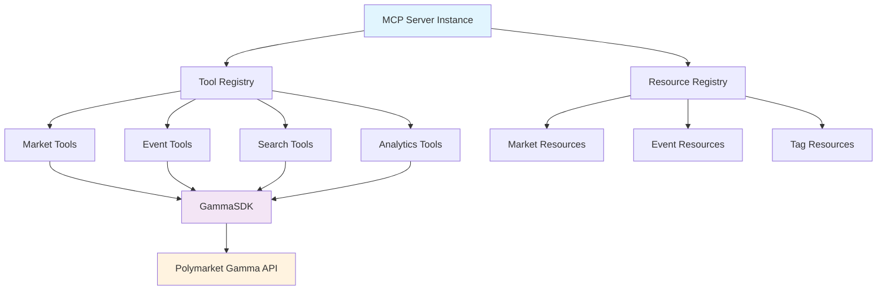
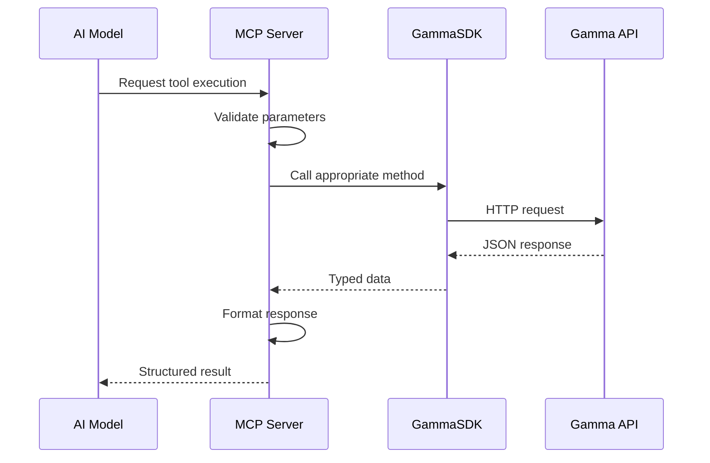
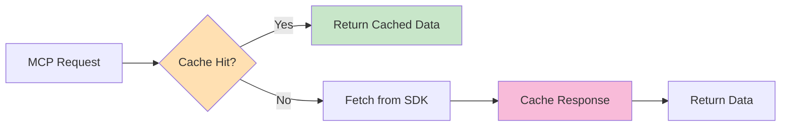

# MCP Server Implementation for Polymarket Gamma API

## Overview

This design outlines the implementation of a Model Context Protocol (MCP) server for Polymarket's Gamma API. The MCP server will expose Polymarket data and functionality as standardized tools and resources for AI models, enabling natural language interactions with prediction market data. The implementation leverages the existing type-safe GammaSDK and follows the established weather.ts MCP server pattern.

## Technology Stack & Dependencies

### Core Framework
- **@modelcontextprotocol/sdk**: MCP server framework for tool and resource definitions
- **zod**: Runtime type validation for MCP tool parameters
- **stdio transport**: Communication protocol for MCP server

### Integration Dependencies
- **GammaSDK**: Existing type-safe client for Polymarket Gamma API
- **TypeBox schemas**: Type definitions from elysia-schemas.ts
- **Markdown formatters**: Utility functions for data presentation

### Development Environment
- **Bun runtime**: Primary execution environment
- **TypeScript**: Type safety and development experience
- **ESM modules**: Modern module system compatibility

## Architecture

### MCP Server Structure



### Component Interaction Flow



### Data Flow Architecture

The MCP server acts as an intelligent proxy between AI models and Polymarket data:

1. **Request Layer**: Receives natural language requests via MCP protocol
2. **Validation Layer**: Uses Zod schemas to validate tool parameters
3. **SDK Layer**: Leverages GammaSDK for type-safe API interactions
4. **Transformation Layer**: Formats responses for optimal AI consumption
5. **Response Layer**: Returns structured data to requesting AI model

## MCP Tools Implementation

### Market Analysis Tools

#### get_markets
Retrieves market data with comprehensive filtering options.

**Parameters**:
- `limit` (number, optional): Maximum markets to return (1-100)
- `active` (boolean, optional): Filter for active markets only
- `closed` (boolean, optional): Filter for closed markets only
- `featured` (boolean, optional): Filter for featured markets only
- `tag_id` (number, optional): Filter by specific tag ID
- `tag_slug` (string, optional): Filter by tag slug

**Returns**: Array of market objects with pricing, metadata, and outcome information

#### get_market_by_id
Fetches detailed information for a specific market.

**Parameters**:
- `id` (number, required): Market ID to retrieve
- `include_tag` (boolean, optional): Include tag information

**Returns**: Complete market object or null if not found

#### get_market_by_slug
Retrieves market by human-readable slug identifier.

**Parameters**:
- `slug` (string, required): Market slug identifier
- `include_tag` (boolean, optional): Include tag information

**Returns**: Market object matching the slug

### Event Management Tools

#### get_events
Retrieves events with advanced filtering capabilities.

**Parameters**:
- `limit` (number, optional): Maximum events to return
- `active` (boolean, optional): Filter for active events
- `closed` (boolean, optional): Filter for closed events
- `featured` (boolean, optional): Filter for featured events
- `tag_id` (number, optional): Filter by tag ID
- `archived` (boolean, optional): Include archived events

**Returns**: Array of event objects with associated markets

#### get_event_by_id
Fetches comprehensive event details including markets.

**Parameters**:
- `id` (number, required): Event ID to retrieve
- `include_chat` (boolean, optional): Include chat/comment data
- `include_markets` (boolean, optional): Include associated markets

**Returns**: Complete event object with nested market data

#### get_event_markdown
Converts event data to markdown format optimized for AI analysis.

**Parameters**:
- `id` (number, required): Event ID to format
- `verbose` (0|1|2, optional): Detail level for formatting
- `include_markets` (boolean, optional): Include market details

**Returns**: Markdown-formatted event data for analysis

### Search and Discovery Tools

#### search_polymarket
Performs comprehensive search across markets, events, and profiles.

**Parameters**:
- `q` (string, required): Search query
- `limit_per_type` (number, optional): Results per category
- `events_status` (string, optional): Event status filter
- `markets_status` (string, optional): Market status filter

**Returns**: Structured search results across all categories

#### get_tags
Retrieves available tags for categorization and filtering.

**Parameters**:
- `limit` (number, optional): Maximum tags to return
- `offset` (number, optional): Pagination offset
- `is_carousel` (boolean, optional): Filter for carousel tags

**Returns**: Array of tag objects with metadata

### Analytics and Aggregation Tools

#### get_market_trends
Analyzes market trends and patterns.

**Parameters**:
- `timeframe` (string, optional): Analysis timeframe ('24h', '7d', '30d')
- `category` (string, optional): Market category filter
- `min_volume` (number, optional): Minimum volume threshold

**Returns**: Trend analysis data with insights

#### get_popular_markets
Identifies trending and popular markets.

**Parameters**:
- `period` (string, optional): Time period for popularity calculation
- `limit` (number, optional): Number of markets to return

**Returns**: Ranked list of popular markets with metrics

## MCP Resources Implementation

### Market Data Resources

#### markets://active
Live feed of active markets with real-time updates.

**URI Pattern**: `markets://active?limit={n}&tag={slug}`
**Content Type**: `application/json`
**Description**: Provides continuously updated market data for active prediction markets

#### markets://trending
Dynamically updated list of trending markets.

**URI Pattern**: `markets://trending?period={timeframe}`
**Content Type**: `application/json`
**Description**: Markets experiencing high activity or significant price movements

### Event Information Resources

#### events://featured
Curated list of featured events and tournaments.

**URI Pattern**: `events://featured?limit={n}`
**Content Type**: `application/json`
**Description**: Editorial selection of important upcoming events

#### events://live
Real-time feed of active events with market activity.

**URI Pattern**: `events://live`
**Content Type**: `application/json`
**Description**: Events currently accepting bets with live market data

### Category and Tag Resources

#### tags://categories
Hierarchical categorization system for markets and events.

**URI Pattern**: `tags://categories`
**Content Type**: `application/json`
**Description**: Complete taxonomy of available market categories and tags

## Error Handling Strategy

### API Error Management

```typescript
interface ErrorResponse {
  error: string;
  message: string;
  code?: string;
  details?: Record<string, any>;
}
```

### Error Categories

1. **Network Errors**: Handle API unavailability gracefully
2. **Validation Errors**: Clear parameter validation feedback
3. **Rate Limiting**: Implement backoff strategies
4. **Data Transformation Errors**: Robust parsing with fallbacks

### Graceful Degradation

- Cached responses for common queries during API outages
- Partial results when some data sources are unavailable
- Clear error messages for debugging and user feedback

## Performance Optimization

### Caching Strategy



### Optimization Techniques

1. **Response Caching**: Cache frequently requested market/event data
2. **Batch Operations**: Group related API calls for efficiency
3. **Lazy Loading**: Load detailed data only when specifically requested
4. **Compression**: Optimize large dataset transfers

## Testing Strategy

### Unit Test Coverage

#### Tool Validation Tests
```typescript
describe('MCP Tools', () => {
  describe('get_markets', () => {
    it('validates required parameters');
    it('handles optional filtering parameters');
    it('transforms SDK responses correctly');
  });
});
```

#### SDK Integration Tests
```typescript
describe('GammaSDK Integration', () => {
  it('handles API errors gracefully');
  it('transforms response data correctly');
  it('respects rate limiting');
});
```

### Integration Testing

#### End-to-End Scenarios
- Complete tool execution workflows
- Resource subscription and updates
- Error handling across the full stack
- Performance under various load conditions

#### Mock Scenarios
- API unavailability simulation
- Invalid parameter handling
- Large dataset processing
- Concurrent request handling

## Deployment Architecture

### Server Configuration

```typescript
interface MCPServerConfig {
  name: 'polymarket';
  version: '1.0.0';
  capabilities: {
    tools: ToolDefinition[];
    resources: ResourceDefinition[];
  };
}
```

### Transport Layer

The MCP server uses stdio transport for communication, following the established pattern from weather.ts implementation.

### Environment Setup

#### Required Environment Variables
- `POLYMARKET_API_KEY` (optional): For authenticated requests
- `MCP_LOG_LEVEL`: Logging verbosity control
- `CACHE_TTL`: Cache time-to-live configuration

#### Development Dependencies
```json
{
  "@modelcontextprotocol/sdk": "^1.0.0",
  "zod": "^3.22.0"
}
```

## Integration Points

### GammaSDK Integration

The MCP server leverages the existing GammaSDK for all Polymarket API interactions:

```typescript
import { GammaSDK } from '../sdk/index.js';

const gammaSDK = new GammaSDK({
  proxy: parseProxyConfig()
});
```

### Type Safety Integration

Utilizes existing TypeBox schemas for consistent type validation:

```typescript
import {
  MarketSchema,
  EventSchema,
  SearchQuerySchema
} from '../types/elysia-schemas.js';
```

### Markdown Formatting Integration

Reuses proven markdown formatting utilities:

```typescript
import { formatEventToMarkdown } from '../utils/markdown-formatters.js';
```

## Security Considerations

### Input Validation

All tool parameters undergo strict validation using Zod schemas before processing:

```typescript
const MarketQuerySchema = z.object({
  limit: z.number().min(1).max(100).optional(),
  active: z.boolean().optional(),
  tag_slug: z.string().optional()
});
```

### API Security

- No sensitive credentials exposed in MCP responses
- Rate limiting compliance with Polymarket API terms
- Secure handling of user-provided search queries

### Data Privacy

- No personal data storage or logging
- Minimal data retention for caching purposes
- Compliance with Polymarket's data usage policies

## Monitoring and Observability

### Logging Strategy

```typescript
interface LogEntry {
  timestamp: string;
  level: 'info' | 'warn' | 'error';
  tool?: string;
  duration?: number;
  error?: string;
}
```

### Performance Metrics

- Tool execution time tracking
- API response time monitoring
- Cache hit rate measurement
- Error rate tracking by tool type

### Health Monitoring

- Regular health check endpoints
- API connectivity validation
- Resource availability verification