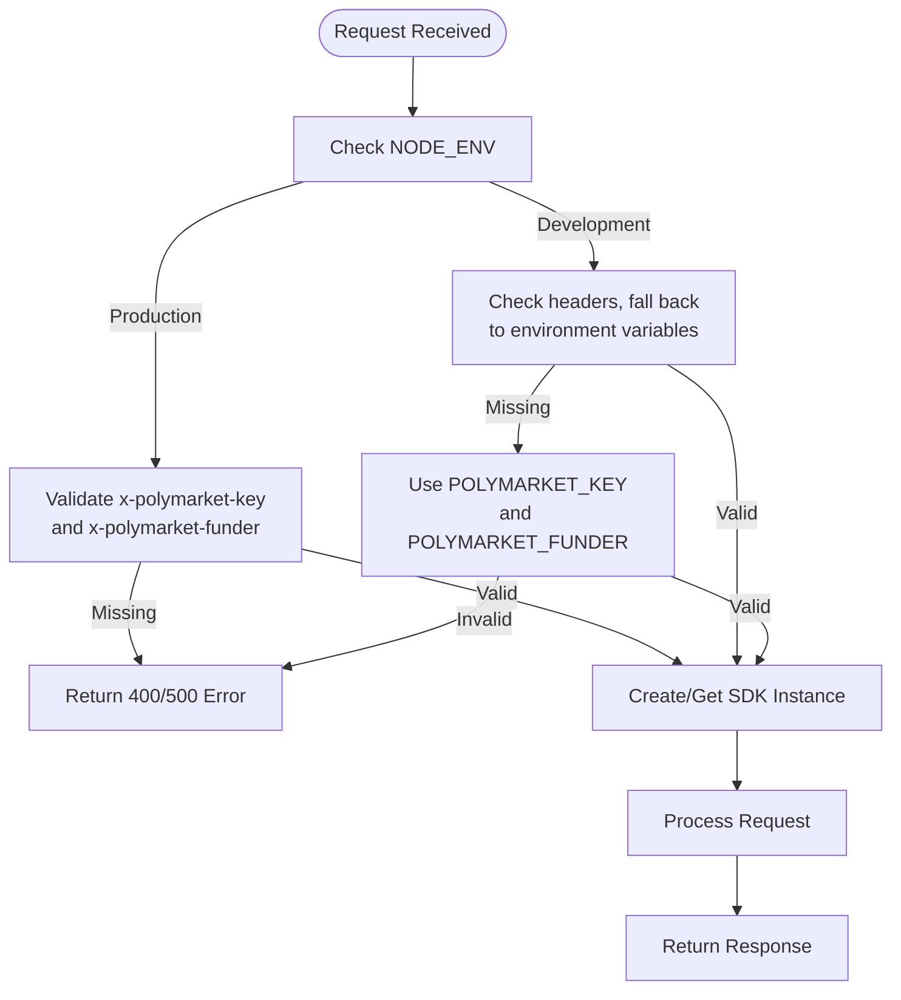
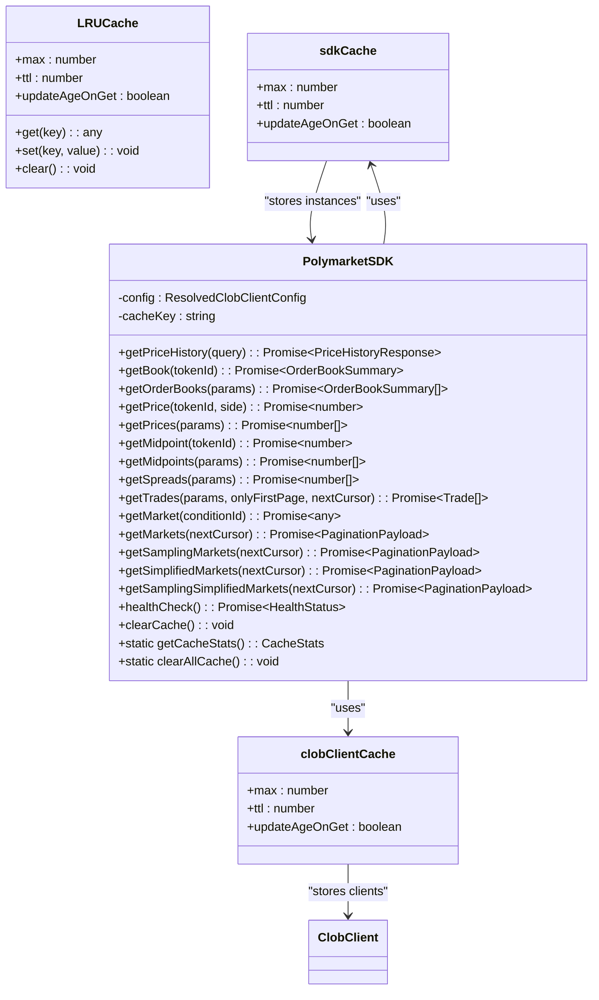

# CLOB API Endpoints

<cite>
**Referenced Files in This Document**   
- [clob.ts](file://src/routes/clob.ts)
- [client.ts](file://src/sdk/client.ts)
- [elysia-schemas.ts](file://src/types/elysia-schemas.ts)
</cite>

## Table of Contents
1. [Introduction](#introduction)
2. [Authentication and Environment Configuration](#authentication-and-environment-configuration)
3. [Caching Mechanism](#caching-mechanism)
4. [Price History Endpoints](#price-history-endpoints)
5. [Order Book Endpoints](#order-book-endpoints)
6. [Price Endpoints](#price-endpoints)
7. [Midpoint and Spread Endpoints](#midpoint-and-spread-endpoints)
8. [Trade Endpoints](#trade-endpoints)
9. [Market Information Endpoints](#market-information-endpoints)
10. [Health and Cache Management Endpoints](#health-and-cache-management-endpoints)
11. [Error Response Structures](#error-response-structures)
12. [Request Validation Rules](#request-validation-rules)

## Introduction

The CLOB API provides a comprehensive interface for interacting with Polymarket's order book and market data. This documentation details all available endpoints for price history, order books, prices, midpoints, spreads, trades, and market information. The API is built using Elysia framework with full type safety through the Polymarket SDK. All endpoints require authentication via headers or environment variables, with detailed request validation using Zod schemas.

**Section sources**
- [clob.ts](file://src/routes/clob.ts#L1-L50)

## Authentication and Environment Configuration

The CLOB API supports both development and production authentication modes with different requirements for the `x-polymarket-key` and `x-polymarket-funder` headers.

### Authentication Headers
- **x-polymarket-key**: Polymarket private key for CLOB authentication
- **x-polymarket-funder**: Polymarket funder address for CLOB operations

### Environment Modes
- **Production Mode**: Both headers are required
- **Development Mode**: Headers are optional; falls back to environment variables `POLYMARKET_KEY` and `POLYMARKET_FUNDER`

The authentication system resolves credentials in the following order:
1. Check for headers in the request
2. If in development mode, fall back to environment variables
3. Throw an error if required credentials are missing

All endpoints that require authentication include these headers in their schema definition, making them mandatory in production environments.



**Diagram sources**
- [clob.ts](file://src/routes/clob.ts#L50-L100)

**Section sources**
- [clob.ts](file://src/routes/clob.ts#L50-L150)

## Caching Mechanism

The CLOB API implements a two-level LRU caching system to optimize performance and reduce redundant operations.

### SDK Instance Cache
- **Purpose**: Cache PolymarketSDK instances to avoid recreating them on every request
- **Cache Key**: `"privateKey_funderAddress"`
- **Configuration**:
  - Maximum size: Configurable via `SDK_CACHE_MAX_SIZE` (default: 50)
  - TTL: Configurable via `SDK_CACHE_TTL_HOURS` (default: 1 hour)
  - Behavior: TTL resets when SDK is accessed (`updateAgeOnGet: true`)

### CLOB Client Cache
- **Purpose**: Cache initialized ClobClient instances within SDK
- **Cache Key**: `"privateKey_host_chainId_funderAddress"`
- **Configuration**:
  - Maximum size: Configurable via `CLOB_CLIENT_CACHE_MAX_SIZE` (default: 100)
  - TTL: Configurable via `CLOB_CLIENT_CACHE_TTL_MINUTES` (default: 30 minutes)
  - Behavior: TTL resets when client is accessed (`updateAgeOnGet: true`)

The caching mechanism significantly improves performance by reusing authenticated client instances across requests with the same credentials.



**Diagram sources**
- [client.ts](file://src/sdk/client.ts#L10-L50)
- [clob.ts](file://src/routes/clob.ts#L20-L30)

**Section sources**
- [client.ts](file://src/sdk/client.ts#L10-L100)
- [clob.ts](file://src/routes/clob.ts#L20-L40)

## Price History Endpoints

### GET /clob/prices-history

Retrieve price history for a specific token via market query parameter.

#### URL Pattern
```
GET /clob/prices-history
```

#### Query Parameters
| Parameter | Type | Required | Description |
|---------|------|----------|-------------|
| market | string | Yes | The CLOB token ID to fetch price history for |
| startTs | number | No | Unix timestamp in seconds (alternative to startDate) |
| endTs | number | No | Unix timestamp in seconds (alternative to endDate) |
| startDate | string | No | Human-readable start date (e.g., '2025-08-13') |
| endDate | string | No | Human-readable end date (e.g., '2025-08-13') |
| interval | enum | No | Time interval: 1m, 1h, 6h, 1d, 1w, max |
| fidelity | number | No | Data resolution in minutes |

**Note**: Time ranges (startTs/endTs or startDate/endDate) and interval are mutually exclusive.

#### Request Headers
- `x-polymarket-key`: Required in production, optional in development
- `x-polymarket-funder`: Required in production, optional in development

#### Response Format (200)
```json
{
  "history": [
    {
      "t": 1723526400,
      "p": 0.45
    }
  ],
  "timeRange": {
    "start": "2024-08-13T00:00:00.000Z",
    "end": "2024-08-14T00:00:00.000Z"
  }
}
```

#### Error Responses
- **400**: Invalid parameters
- **500**: Internal server error

#### Examples

**curl**
```bash
curl -X GET "http://localhost:3000/clob/prices-history?market=0x...&interval=1h" \
  -H "x-polymarket-key: YOUR_PRIVATE_KEY" \
  -H "x-polymarket-funder: YOUR_FUNDER_ADDRESS"
```

**TypeScript**
```typescript
const response = await fetch('/clob/prices-history?market=0x...&interval=1h', {
  headers: {
    'x-polymarket-key': 'YOUR_PRIVATE_KEY',
    'x-polymarket-funder': 'YOUR_FUNDER_ADDRESS'
  }
});
```

**SDK Method**: `PolymarketSDK.getPriceHistory()`

**Section sources**
- [clob.ts](file://src/routes/clob.ts#L150-L250)
- [client.ts](file://src/sdk/client.ts#L150-L200)
- [elysia-schemas.ts](file://src/types/elysia-schemas.ts#L400-L450)

## Order Book Endpoints

### GET /clob/book/:tokenId

Retrieve the current order book for a specific token ID.

#### URL Pattern
```
GET /clob/book/{tokenId}
```

#### Path Parameters
| Parameter | Type | Required | Description |
|---------|------|----------|-------------|
| tokenId | string | Yes | The CLOB token ID to get order book for |

#### Request Headers
- `x-polymarket-key`: Required in production, optional in development
- `x-polymarket-funder`: Required in production, optional in development

#### Response Format (200)
```json
{
  "market": "0x...",
  "asset_id": "123",
  "timestamp": "2024-08-13T12:00:00.000Z",
  "bids": [
    {
      "price": "0.45",
      "size": "100"
    }
  ],
  "asks": [
    {
      "price": "0.55",
      "size": "75"
    }
  ],
  "min_order_size": "1",
  "tick_size": "0.01",
  "neg_risk": false,
  "hash": "abc123"
}
```

#### Error Responses
- **400**: Invalid token ID
- **404**: No orderbook exists for the token
- **500**: Internal server error

#### Examples

**curl**
```bash
curl -X GET "http://localhost:3000/clob/book/0x..." \
  -H "x-polymarket-key: YOUR_PRIVATE_KEY" \
  -H "x-polymarket-funder: YOUR_FUNDER_ADDRESS"
```

**TypeScript**
```typescript
const response = await fetch('/clob/book/0x...', {
  headers: {
    'x-polymarket-key': 'YOUR_PRIVATE_KEY',
    'x-polymarket-funder': 'YOUR_FUNDER_ADDRESS'
  }
});
```

**SDK Method**: `PolymarketSDK.getBook()`

**Section sources**
- [clob.ts](file://src/routes/clob.ts#L250-L350)
- [client.ts](file://src/sdk/client.ts#L200-L220)

### POST /clob/orderbooks

Retrieve order books for multiple token IDs.

#### URL Pattern
```
POST /clob/orderbooks
```

#### Request Body
Array of objects with:
| Field | Type | Required | Description |
|------|------|----------|-------------|
| token_id | string | Yes | The CLOB token ID |
| side | enum | Yes | BUY or SELL |

#### Request Headers
- `x-polymarket-key`: Required in production, optional in development
- `x-polymarket-funder`: Required in production, optional in development

#### Response Format (200)
```json
[
  {
    "market": "0x...",
    "asset_id": "123",
    "timestamp": "2024-08-13T12:00:00.000Z",
    "bids": [
      {
        "price": "0.45",
        "size": "100"
      }
    ],
    "asks": [
      {
        "price": "0.55",
        "size": "75"
      }
    ],
    "min_order_size": "1",
    "tick_size": "0.01",
    "neg_risk": false,
    "hash": "abc123"
  }
]
```

#### Error Responses
- **400**: Invalid request body
- **500**: Internal server error

#### Examples

**curl**
```bash
curl -X POST "http://localhost:3000/clob/orderbooks" \
  -H "Content-Type: application/json" \
  -H "x-polymarket-key: YOUR_PRIVATE_KEY" \
  -H "x-polymarket-funder: YOUR_FUNDER_ADDRESS" \
  -d '[{"token_id": "0x...", "side": "BUY"}]'
```

**TypeScript**
```typescript
const response = await fetch('/clob/orderbooks', {
  method: 'POST',
  headers: {
    'Content-Type': 'application/json',
    'x-polymarket-key': 'YOUR_PRIVATE_KEY',
    'x-polymarket-funder': 'YOUR_FUNDER_ADDRESS'
  },
  body: JSON.stringify([{
    token_id: '0x...',
    side: 'BUY'
  }])
});
```

**SDK Method**: `PolymarketSDK.getOrderBooks()`

**Section sources**
- [clob.ts](file://src/routes/clob.ts#L350-L450)
- [client.ts](file://src/sdk/client.ts#L220-L240)

## Price Endpoints

### GET /clob/price/:tokenId/:side

Get the current price for a specific token ID and side (buy/sell).

#### URL Pattern
```
GET /clob/price/{tokenId}/{side}
```

#### Path Parameters
| Parameter | Type | Required | Description |
|---------|------|----------|-------------|
| tokenId | string | Yes | The CLOB token ID to get price for |
| side | enum | Yes | buy or sell |

#### Request Headers
- `x-polymarket-key`: Required in production, optional in development
- `x-polymarket-funder`: Required in production, optional in development

#### Response Format (200)
```json
{
  "price": 0.45
}
```

#### Error Responses
- **400**: Invalid parameters
- **500**: Internal server error

#### Examples

**curl**
```bash
curl -X GET "http://localhost:3000/clob/price/0x.../buy" \
  -H "x-polymarket-key: YOUR_PRIVATE_KEY" \
  -H "x-polymarket-funder: YOUR_FUNDER_ADDRESS"
```

**TypeScript**
```typescript
const response = await fetch('/clob/price/0x.../buy', {
  headers: {
    'x-polymarket-key': 'YOUR_PRIVATE_KEY',
    'x-polymarket-funder': 'YOUR_FUNDER_ADDRESS'
  }
});
```

**SDK Method**: `PolymarketSDK.getPrice()`

**Section sources**
- [clob.ts](file://src/routes/clob.ts#L450-L550)
- [client.ts](file://src/sdk/client.ts#L240-L260)

### POST /clob/prices

Get prices for multiple token IDs and sides.

#### URL Pattern
```
POST /clob/prices
```

#### Request Body
Array of objects with:
| Field | Type | Required | Description |
|------|------|----------|-------------|
| token_id | string | Yes | The CLOB token ID |
| side | enum | Yes | BUY or SELL |

#### Request Headers
- `x-polymarket-key`: Required in production, optional in development
- `x-polymarket-funder`: Required in production, optional in development

#### Response Format (200)
```json
{
  "prices": [0.45, 0.55]
}
```

#### Error Responses
- **400**: Invalid request body
- **500**: Internal server error

#### Examples

**curl**
```bash
curl -X POST "http://localhost:3000/clob/prices" \
  -H "Content-Type: application/json" \
  -H "x-polymarket-key: YOUR_PRIVATE_KEY" \
  -H "x-polymarket-funder: YOUR_FUNDER_ADDRESS" \
  -d '[{"token_id": "0x...", "side": "BUY"}]'
```

**TypeScript**
```typescript
const response = await fetch('/clob/prices', {
  method: 'POST',
  headers: {
    'Content-Type': 'application/json',
    'x-polymarket-key': 'YOUR_PRIVATE_KEY',
    'x-polymarket-funder': 'YOUR_FUNDER_ADDRESS'
  },
  body: JSON.stringify([{
    token_id: '0x...',
    side: 'BUY'
  }])
});
```

**SDK Method**: `PolymarketSDK.getPrices()`

**Section sources**
- [clob.ts](file://src/routes/clob.ts#L550-L650)
- [client.ts](file://src/sdk/client.ts#L260-L280)

## Midpoint and Spread Endpoints

### GET /clob/midpoint/:tokenId

Get the midpoint price for a specific token ID.

#### URL Pattern
```
GET /clob/midpoint/{tokenId}
```

#### Path Parameters
| Parameter | Type | Required | Description |
|---------|------|----------|-------------|
| tokenId | string | Yes | The CLOB token ID to get midpoint for |

#### Request Headers
- `x-polymarket-key`: Required in production, optional in development
- `x-polymarket-funder`: Required in production, optional in development

#### Response Format (200)
```json
{
  "midpoint": 0.5
}
```

#### Error Responses
- **400**: Invalid token ID
- **500**: Internal server error

#### Examples

**curl**
```bash
curl -X GET "http://localhost:3000/clob/midpoint/0x..." \
  -H "x-polymarket-key: YOUR_PRIVATE_KEY" \
  -H "x-polymarket-funder: YOUR_FUNDER_ADDRESS"
```

**TypeScript**
```typescript
const response = await fetch('/clob/midpoint/0x...', {
  headers: {
    'x-polymarket-key': 'YOUR_PRIVATE_KEY',
    'x-polymarket-funder': 'YOUR_FUNDER_ADDRESS'
  }
});
```

**SDK Method**: `PolymarketSDK.getMidpoint()`

**Section sources**
- [clob.ts](file://src/routes/clob.ts#L650-L750)
- [client.ts](file://src/sdk/client.ts#L280-L300)

### POST /clob/midpoints

Get midpoint prices for multiple token IDs.

#### URL Pattern
```
POST /clob/midpoints
```

#### Request Body
Array of objects with:
| Field | Type | Required | Description |
|------|------|----------|-------------|
| token_id | string | Yes | The CLOB token ID |

#### Request Headers
- `x-polymarket-key`: Required in production, optional in development
- `x-polymarket-funder`: Required in production, optional in development

#### Response Format (200)
```json
{
  "midpoints": [0.5, 0.6]
}
```

#### Error Responses
- **400**: Invalid request body
- **500**: Internal server error

#### Examples

**curl**
```bash
curl -X POST "http://localhost:3000/clob/midpoints" \
  -H "Content-Type: application/json" \
  -H "x-polymarket-key: YOUR_PRIVATE_KEY" \
  -H "x-polymarket-funder: YOUR_FUNDER_ADDRESS" \
  -d '[{"token_id": "0x..."}]'
```

**TypeScript**
```typescript
const response = await fetch('/clob/midpoints', {
  method: 'POST',
  headers: {
    'Content-Type': 'application/json',
    'x-polymarket-key': 'YOUR_PRIVATE_KEY',
    'x-polymarket-funder': 'YOUR_FUNDER_ADDRESS'
  },
  body: JSON.stringify([{
    token_id: '0x...'
  }])
});
```

**SDK Method**: `PolymarketSDK.getMidpoints()`

**Section sources**
- [clob.ts](file://src/routes/clob.ts#L750-L850)
- [client.ts](file://src/sdk/client.ts#L300-L320)

### POST /clob/spreads

Get bid-ask spreads for multiple token IDs.

#### URL Pattern
```
POST /clob/spreads
```

#### Request Body
Array of objects with:
| Field | Type | Required | Description |
|------|------|----------|-------------|
| token_id | string | Yes | The CLOB token ID |

#### Request Headers
- `x-polymarket-key`: Required in production, optional in development
- `x-polymarket-funder`: Required in production, optional in development

#### Response Format (200)
```json
{
  "spreads": [0.1, 0.15]
}
```

#### Error Responses
- **400**: Invalid request body
- **500**: Internal server error

#### Examples

**curl**
```bash
curl -X POST "http://localhost:3000/clob/spreads" \
  -H "Content-Type: application/json" \
  -H "x-polymarket-key: YOUR_PRIVATE_KEY" \
  -H "x-polymarket-funder: YOUR_FUNDER_ADDRESS" \
  -d '[{"token_id": "0x..."}]'
```

**TypeScript**
```typescript
const response = await fetch('/clob/spreads', {
  method: 'POST',
  headers: {
    'Content-Type': 'application/json',
    'x-polymarket-key': 'YOUR_PRIVATE_KEY',
    'x-polymarket-funder': 'YOUR_FUNDER_ADDRESS'
  },
  body: JSON.stringify([{
    token_id: '0x...'
  }])
});
```

**SDK Method**: `PolymarketSDK.getSpreads()`

**Section sources**
- [clob.ts](file://src/routes/clob.ts#L850-L950)
- [client.ts](file://src/sdk/client.ts#L320-L340)

## Trade Endpoints

### POST /clob/trades

Get trades with optional filtering.

#### URL Pattern
```
POST /clob/trades
```

#### Request Body
| Field | Type | Required | Description |
|------|------|----------|-------------|
| id | string | No | Trade ID |
| maker_address | string | No | Maker address |
| market | string | No | Market ID |
| asset_id | string | No | Asset ID |
| before | string | No | Timestamp before |
| after | string | No | Timestamp after |
| only_first_page | boolean | No | Return only first page |
| next_cursor | string | No | Pagination cursor |

#### Request Headers
- `x-polymarket-key`: Required in production, optional in development
- `x-polymarket-funder`: Required in production, optional in development

#### Response Format (200)
```json
{
  "trades": [
    {
      "id": "123",
      "taker_order_id": "456",
      "market": "0x...",
      "asset_id": "789",
      "side": "BUY",
      "size": "100",
      "fee_rate_bps": "10",
      "price": "0.45",
      "status": "filled",
      "match_time": "2024-08-13T12:00:00.000Z",
      "last_update": "2024-08-13T12:00:00.000Z",
      "outcome": "Yes",
      "bucket_index": 0,
      "owner": "0x...",
      "maker_address": "0x..."
    }
  ]
}
```

#### Error Responses
- **400**: Invalid request body
- **500**: Internal server error

#### Examples

**curl**
```bash
curl -X POST "http://localhost:3000/clob/trades" \
  -H "Content-Type: application/json" \
  -H "x-polymarket-key: YOUR_PRIVATE_KEY" \
  -H "x-polymarket-funder: YOUR_FUNDER_ADDRESS" \
  -d '{"market": "0x..."}'
```

**TypeScript**
```typescript
const response = await fetch('/clob/trades', {
  method: 'POST',
  headers: {
    'Content-Type': 'application/json',
    'x-polymarket-key': 'YOUR_PRIVATE_KEY',
    'x-polymarket-funder': 'YOUR_FUNDER_ADDRESS'
  },
  body: JSON.stringify({
    market: '0x...'
  })
});
```

**SDK Method**: `PolymarketSDK.getTrades()`

**Section sources**
- [clob.ts](file://src/routes/clob.ts#L950-L1050)
- [client.ts](file://src/sdk/client.ts#L340-L360)

## Market Information Endpoints

### GET /clob/market/:conditionId

Get market information for a specific condition ID.

#### URL Pattern
```
GET /clob/market/{conditionId}
```

#### Path Parameters
| Parameter | Type | Required | Description |
|---------|------|----------|-------------|
| conditionId | string | Yes | The condition ID to get market for |

#### Request Headers
- `x-polymarket-key`: Required in production, optional in development
- `x-polymarket-funder`: Required in production, optional in development

#### Response Format (200)
```json
{
  "id": "0x...",
  "question": "Will AI surpass human intelligence by 2030?",
  "conditionId": "0x...",
  "slug": "ai-surpass-human-intelligence-2030",
  "liquidity": "10000",
  "volume": "50000",
  "outcomes": ["Yes", "No"],
  "outcomePrices": ["0.6", "0.4"],
  "active": true,
  "closed": false,
  "clobTokenIds": ["0x...", "0x..."]
}
```

#### Error Responses
- **400**: Invalid condition ID
- **500**: Internal server error

#### Examples

**curl**
```bash
curl -X GET "http://localhost:3000/clob/market/0x..." \
  -H "x-polymarket-key: YOUR_PRIVATE_KEY" \
  -H "x-polymarket-funder: YOUR_FUNDER_ADDRESS"
```

**TypeScript**
```typescript
const response = await fetch('/clob/market/0x...', {
  headers: {
    'x-polymarket-key': 'YOUR_PRIVATE_KEY',
    'x-polymarket-funder': 'YOUR_FUNDER_ADDRESS'
  }
});
```

**SDK Method**: `PolymarketSDK.getMarket()`

**Section sources**
- [clob.ts](file://src/routes/clob.ts#L1050-L1150)
- [client.ts](file://src/sdk/client.ts#L360-L380)

### GET /clob/markets

Get paginated list of markets.

#### URL Pattern
```
GET /clob/markets
```

#### Query Parameters
| Parameter | Type | Required | Description |
|---------|------|----------|-------------|
| next_cursor | string | No | Pagination cursor for next page |

#### Request Headers
- `x-polymarket-key`: Required in production, optional in development
- `x-polymarket-funder`: Required in production, optional in development

#### Response Format (200)
```json
{
  "limit": 100,
  "count": 50,
  "next_cursor": "abc123",
  "data": [
    {
      "id": "0x...",
      "question": "Will AI surpass human intelligence by 2030?",
      "conditionId": "0x...",
      "slug": "ai-surpass-human-intelligence-2030",
      "liquidity": "10000",
      "volume": "50000",
      "outcomes": ["Yes", "No"],
      "outcomePrices": ["0.6", "0.4"],
      "active": true,
      "closed": false,
      "clobTokenIds": ["0x...", "0x..."]
    }
  ]
}
```

#### Error Responses
- **400**: Invalid parameters
- **500**: Internal server error

#### Examples

**curl**
```bash
curl -X GET "http://localhost:3000/clob/markets" \
  -H "x-polymarket-key: YOUR_PRIVATE_KEY" \
  -H "x-polymarket-funder: YOUR_FUNDER_ADDRESS"
```

**TypeScript**
```typescript
const response = await fetch('/clob/markets', {
  headers: {
    'x-polymarket-key': 'YOUR_PRIVATE_KEY',
    'x-polymarket-funder': 'YOUR_FUNDER_ADDRESS'
  }
});
```

**SDK Method**: `PolymarketSDK.getMarkets()`

**Section sources**
- [clob.ts](file://src/routes/clob.ts#L1150-L1250)
- [client.ts](file://src/sdk/client.ts#L380-L400)

### GET /clob/sampling-markets

Get paginated list of sampling markets.

#### URL Pattern
```
GET /clob/sampling-markets
```

#### Query Parameters
| Parameter | Type | Required | Description |
|---------|------|----------|-------------|
| next_cursor | string | No | Pagination cursor for next page |

#### Request Headers
- `x-polymarket-key`: Required in production, optional in development
- `x-polymarket-funder`: Required in production, optional in development

#### Response Format (200)
```json
{
  "limit": 100,
  "count": 50,
  "next_cursor": "abc123",
  "data": [
    {
      "id": "0x...",
      "question": "Will AI surpass human intelligence by 2030?",
      "conditionId": "0x...",
      "slug": "ai-surpass-human-intelligence-2030",
      "liquidity": "10000",
      "volume": "50000",
      "outcomes": ["Yes", "No"],
      "outcomePrices": ["0.6", "0.4"],
      "active": true,
      "closed": false,
      "clobTokenIds": ["0x...", "0x..."]
    }
  ]
}
```

#### Error Responses
- **400**: Invalid parameters
- **500**: Internal server error

#### Examples

**curl**
```bash
curl -X GET "http://localhost:3000/clob/sampling-markets" \
  -H "x-polymarket-key: YOUR_PRIVATE_KEY" \
  -H "x-polymarket-funder: YOUR_FUNDER_ADDRESS"
```

**TypeScript**
```typescript
const response = await fetch('/clob/sampling-markets', {
  headers: {
    'x-polymarket-key': 'YOUR_PRIVATE_KEY',
    'x-polymarket-funder': 'YOUR_FUNDER_ADDRESS'
  }
});
```

**SDK Method**: `PolymarketSDK.getSamplingMarkets()`

**Section sources**
- [clob.ts](file://src/routes/clob.ts#L1250-L1350)
- [client.ts](file://src/sdk/client.ts#L400-L420)

### GET /clob/simplified-markets

Get paginated list of simplified markets.

#### URL Pattern
```
GET /clob/simplified-markets
```

#### Query Parameters
| Parameter | Type | Required | Description |
|---------|------|----------|-------------|
| next_cursor | string | No | Pagination cursor for next page |

#### Request Headers
- `x-polymarket-key`: Required in production, optional in development
- `x-polymarket-funder`: Required in production, optional in development

#### Response Format (200)
```json
{
  "limit": 100,
  "count": 50,
  "next_cursor": "abc123",
  "data": [
    {
      "id": "0x...",
      "question": "Will AI surpass human intelligence by 2030?",
      "conditionId": "0x...",
      "slug": "ai-surpass-human-intelligence-2030",
      "liquidity": "10000",
      "volume": "50000",
      "outcomes": ["Yes", "No"],
      "outcomePrices": ["0.6", "0.4"],
      "active": true,
      "closed": false,
      "clobTokenIds": ["0x...", "0x..."]
    }
  ]
}
```

#### Error Responses
- **400**: Invalid parameters
- **500**: Internal server error

#### Examples

**curl**
```bash
curl -X GET "http://localhost:3000/clob/simplified-markets" \
  -H "x-polymarket-key: YOUR_PRIVATE_KEY" \
  -H "x-polymarket-funder: YOUR_FUNDER_ADDRESS"
```

**TypeScript**
```typescript
const response = await fetch('/clob/simplified-markets', {
  headers: {
    'x-polymarket-key': 'YOUR_PRIVATE_KEY',
    'x-polymarket-funder': 'YOUR_FUNDER_ADDRESS'
  }
});
```

**SDK Method**: `PolymarketSDK.getSimplifiedMarkets()`

**Section sources**
- [clob.ts](file://src/routes/clob.ts#L1350-L1450)
- [client.ts](file://src/sdk/client.ts#L420-L440)

### GET /clob/sampling-simplified-markets

Get paginated list of sampling simplified markets.

#### URL Pattern
```
GET /clob/sampling-simplified-markets
```

#### Query Parameters
| Parameter | Type | Required | Description |
|---------|------|----------|-------------|
| next_cursor | string | No | Pagination cursor for next page |

#### Request Headers
- `x-polymarket-key`: Required in production, optional in development
- `x-polymarket-funder`: Required in production, optional in development

#### Response Format (200)
```json
{
  "limit": 100,
  "count": 50,
  "next_cursor": "abc123",
  "data": [
    {
      "id": "0x...",
      "question": "Will AI surpass human intelligence by 2030?",
      "conditionId": "0x...",
      "slug": "ai-surpass-human-intelligence-2030",
      "liquidity": "10000",
      "volume": "50000",
      "outcomes": ["Yes", "No"],
      "outcomePrices": ["0.6", "0.4"],
      "active": true,
      "closed": false,
      "clobTokenIds": ["0x...", "0x..."]
    }
  ]
}
```

#### Error Responses
- **400**: Invalid parameters
- **500**: Internal server error

#### Examples

**curl**
```bash
curl -X GET "http://localhost:3000/clob/sampling-simplified-markets" \
  -H "x-polymarket-key: YOUR_PRIVATE_KEY" \
  -H "x-polymarket-funder: YOUR_FUNDER_ADDRESS"
```

**TypeScript**
```typescript
const response = await fetch('/clob/sampling-simplified-markets', {
  headers: {
    'x-polymarket-key': 'YOUR_PRIVATE_KEY',
    'x-polymarket-funder': 'YOUR_FUNDER_ADDRESS'
  }
});
```

**SDK Method**: `PolymarketSDK.getSamplingSimplifiedMarkets()`

**Section sources**
- [clob.ts](file://src/routes/clob.ts#L1450-L1550)
- [client.ts](file://src/sdk/client.ts#L440-L460)

## Health and Cache Management Endpoints

### GET /clob/health

Check the health status of CLOB client connection.

#### URL Pattern
```
GET /clob/health
```

#### Request Headers
- `x-polymarket-key`: Required in production, optional in development
- `x-polymarket-funder`: Required in production, optional in development

#### Response Format (200)
```json
{
  "status": "healthy",
  "timestamp": "2024-08-13T12:00:00.000Z",
  "clob": "connected",
  "cached": true
}
```

#### Response Format (503)
```json
{
  "status": "unhealthy",
  "timestamp": "2024-08-13T12:00:00.000Z",
  "clob": "disconnected",
  "error": "Connection failed"
}
```

#### Examples

**curl**
```bash
curl -X GET "http://localhost:3000/clob/health" \
  -H "x-polymarket-key: YOUR_PRIVATE_KEY" \
  -H "x-polymarket-funder: YOUR_FUNDER_ADDRESS"
```

**TypeScript**
```typescript
const response = await fetch('/clob/health', {
  headers: {
    'x-polymarket-key': 'YOUR_PRIVATE_KEY',
    'x-polymarket-funder': 'YOUR_FUNDER_ADDRESS'
  }
});
```

**SDK Method**: `PolymarketSDK.healthCheck()`

**Section sources**
- [clob.ts](file://src/routes/clob.ts#L1550-L1650)
- [client.ts](file://src/sdk/client.ts#L460-L480)

### GET /clob/cache/stats

Get cache statistics for SDK instances and CLOB clients.

#### URL Pattern
```
GET /clob/cache/stats
```

#### Response Format (200)
```json
{
  "sdkCache": {
    "size": 5,
    "maxSize": 50
  },
  "clobClientCache": {
    "size": 10,
    "maxSize": 100
  },
  "timestamp": "2024-08-13T12:00:00.000Z"
}
```

#### Examples

**curl**
```bash
curl -X GET "http://localhost:3000/clob/cache/stats"
```

**TypeScript**
```typescript
const response = await fetch('/clob/cache/stats');
```

**SDK Method**: `PolymarketSDK.getCacheStats()`

**Section sources**
- [clob.ts](file://src/routes/clob.ts#L1650-L1750)
- [client.ts](file://src/sdk/client.ts#L480-L500)

### DELETE /clob/cache

Clear all cached SDK instances and CLOB clients.

#### URL Pattern
```
DELETE /clob/cache
```

#### Response Format (200)
```json
{
  "message": "All caches cleared",
  "timestamp": "2024-08-13T12:00:00.000Z"
}
```

#### Examples

**curl**
```bash
curl -X DELETE "http://localhost:3000/clob/cache"
```

**TypeScript**
```typescript
const response = await fetch('/clob/cache', {
  method: 'DELETE'
});
```

**SDK Method**: `PolymarketSDK.clearAllCache()`

**Section sources**
- [clob.ts](file://src/routes/clob.ts#L1750-L1850)
- [client.ts](file://src/sdk/client.ts#L500-L520)

## Error Response Structures

The CLOB API returns standardized error responses for all endpoints.

### 4xx Client Errors
```json
{
  "error": "Bad Request",
  "message": "Validation failed",
  "details": "market parameter is required"
}
```

### 5xx Server Errors
```json
{
  "error": "Internal Server Error",
  "message": "Unknown error occurred"
}
```

### Specific Error Types
- **400 Bad Request**: Invalid parameters or missing required fields
- **404 Not Found**: Resource not found (e.g., no orderbook exists)
- **500 Internal Server Error**: Server-side processing error
- **503 Service Unavailable**: Health check failed

All error responses include an `error` field with the error type and a `message` field with a descriptive message. Some 4xx errors may include a `details` field with additional information about the validation failure.

**Section sources**
- [clob.ts](file://src/routes/clob.ts#L100-L200)
- [elysia-schemas.ts](file://src/types/elysia-schemas.ts#L300-L350)

## Request Validation Rules

The CLOB API enforces request validation using Zod schemas defined in `elysia-schemas.ts`.

### Price History Validation
- **market**: Required string (CLOB token ID)
- **startTs/endTs**: Optional numbers (Unix timestamps in seconds)
- **startDate/endDate**: Optional strings (ISO date format)
- **interval**: Optional enum (1m, 1h, 6h, 1d, 1w, max)
- **fidelity**: Optional number (resolution in minutes)

**Validation Rules**:
- Either time range (startTs/endTs or startDate/endDate) OR interval must be provided, not both
- startDate/endDate are converted to startTs/endTs internally
- fidelity must be a positive number

### Order Book Validation
- **token_id**: Required string
- **side**: Required enum (BUY/SELL)

### Trade Validation
- **id**: Optional string
- **maker_address**: Optional string
- **market**: Optional string
- **asset_id**: Optional string
- **before**: Optional string
- **after**: Optional string
- **only_first_page**: Optional boolean
- **next_cursor**: Optional string

### Market Validation
- **next_cursor**: Optional string

### Authentication Validation
- **x-polymarket-key**: Required in production, optional in development
- **x-polymarket-funder**: Required in production, optional in development

All validation is performed automatically by the Elysia framework using the defined schemas, ensuring consistent and reliable request processing.

**Section sources**
- [elysia-schemas.ts](file://src/types/elysia-schemas.ts#L400-L800)
- [clob.ts](file://src/routes/clob.ts#L100-L200)