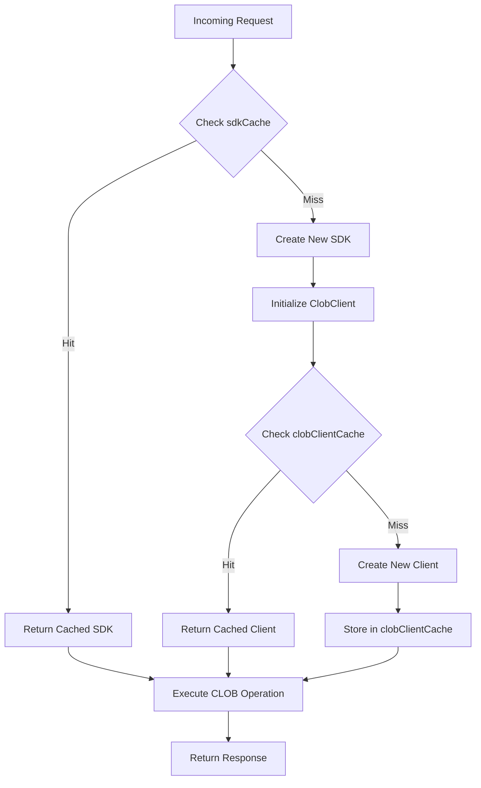

# Health and Cache

<cite>
**Referenced Files in This Document**   
- [clob.ts](file://src/routes/clob.ts)
- [elysia-schemas.ts](file://src/types/elysia-schemas.ts)
- [client.ts](file://src/sdk/client.ts)
- [env.ts](file://src/utils/env.ts)
</cite>

## Table of Contents
1. [Introduction](#introduction)
2. [Health Endpoint](#health-endpoint)
3. [Cache Stats Endpoint](#cache-stats-endpoint)
4. [Two-Level Caching System](#two-level-caching-system)
5. [Authentication Requirements](#authentication-requirements)
6. [Curl Examples](#curl-examples)
7. [Monitoring and Debugging Use Cases](#monitoring-and-debugging-use-cases)

## Introduction
This document provides comprehensive API documentation for the CLOB API's health and cache endpoints. These endpoints are essential for monitoring system status, debugging connection issues, and understanding cache behavior in the Polymarket CLOB API infrastructure. The health endpoint provides insight into the operational status of the CLOB client connection, while the cache statistics endpoint offers visibility into the two-level caching system that optimizes performance and reduces redundant client initialization.

**Section sources**
- [clob.ts](file://src/routes/clob.ts#L1-L50)

## Health Endpoint

The `GET /clob/health` endpoint performs a health check on the CLOB client connection and returns detailed status information about the service.

### Response Structure
The response follows the `HealthResponseSchema` and includes the following fields:

- **status**: `"healthy"` or `"unhealthy"` indicating the overall health of the service
- **timestamp**: ISO 8601 formatted timestamp of when the health check was performed
- **clob**: Connection status of the CLOB client (`"connected"` or `"disconnected"`)
- **cached**: Optional boolean indicating whether the SDK instance was retrieved from cache
- **error**: Optional error message if the status is `"unhealthy"`

When the health check fails, the endpoint returns a 503 Service Unavailable status code with an appropriate error message.

### Authentication
The health endpoint requires authentication via headers:
- `x-polymarket-key`: Polymarket private key for CLOB authentication
- `x-polymarket-funder`: Polymarket funder address for CLOB operations

In production, these headers are required. In development mode, the system falls back to environment variables (`POLYMARKET_KEY` and `POLYMARKET_FUNDER`) if headers are not provided.

**Section sources**
- [clob.ts](file://src/routes/clob.ts#L100-L150)
- [elysia-schemas.ts](file://src/types/elysia-schemas.ts#L436-L442)
- [client.ts](file://src/sdk/client.ts#L300-L330)

## Cache Stats Endpoint

The `GET /clob/cache/stats` endpoint returns statistics about the caching system used by the CLOB API.

### Response Structure
The response includes detailed statistics for both cache layers:

```json
{
  "sdkCache": {
    "size": 0,
    "maxSize": 50
  },
  "clobClientCache": {
    "size": 0,
    "maxSize": 100
  },
  "timestamp": "2025-01-01T00:00:00.000Z"
}
```

#### sdkCache
- **size**: Current number of SDK instances in the cache
- **maxSize**: Maximum number of SDK instances allowed in the cache
- This cache stores PolymarketSDK instances keyed by `"privateKey_funderAddress"`

#### clobClientCache
- **size**: Current number of CLOB client instances in the cache
- **maxSize**: Maximum number of CLOB client instances allowed in the cache
- This cache stores ClobClient instances keyed by configuration parameters

The endpoint also includes a timestamp of when the statistics were collected.

### Authentication
The cache statistics endpoint requires no authentication. It is publicly accessible to allow monitoring tools and administrators to check cache status without requiring credentials.

**Section sources**
- [clob.ts](file://src/routes/clob.ts#L152-L180)
- [client.ts](file://src/sdk/client.ts#L332-L350)

## Two-Level Caching System

The CLOB API implements a two-level caching system to optimize performance and reduce redundant operations when interacting with the Polymarket CLOB service.

### SDK Instance Cache (sdkCache)
The first level of caching stores PolymarketSDK instances. This cache:
- Key: `"privateKey_funderAddress"`
- Value: PolymarketSDK instance
- Configured via environment variables:
  - `SDK_CACHE_MAX_SIZE`: Maximum number of SDK instances (default: 50)
  - `SDK_CACHE_TTL_HOURS`: Time-to-live in hours (default: 1 hour)

The cache uses LRU (Least Recently Used) eviction policy and resets the TTL when an SDK is accessed (`updateAgeOnGet: true`).

### CLOB Client Cache (clobClientCache)
The second level of caching stores ClobClient instances within each PolymarketSDK. This cache:
- Key: `"privateKey_host_chainId_funderAddress"`
- Value: ClobClient instance
- Configured via environment variables:
  - `CLOB_CLIENT_CACHE_MAX_SIZE`: Maximum number of client instances (default: 100)
  - `CLOB_CLIENT_CACHE_TTL_MINUTES`: Time-to-live in minutes (default: 30 minutes)

This two-level approach ensures that both the SDK wrapper and the underlying CLOB client are efficiently reused across requests, significantly reducing initialization overhead and API connection latency.



**Diagram sources**
- [clob.ts](file://src/routes/clob.ts#L20-L40)
- [client.ts](file://src/sdk/client.ts#L10-L30)

**Section sources**
- [clob.ts](file://src/routes/clob.ts#L20-L80)
- [client.ts](file://src/sdk/client.ts#L10-L50)

## Authentication Requirements

### Health Endpoint Authentication
The health endpoint requires authentication through HTTP headers:
- `x-polymarket-key`: Contains the Polymarket private key
- `x-polymarket-funder`: Contains the funder address

The authentication behavior differs between environments:
- **Production**: Headers are required
- **Development**: Headers are optional; falls back to environment variables (`POLYMARKET_KEY`, `POLYMARKET_FUNDER`)

This dual-mode approach facilitates easier development and testing while maintaining security in production.

### Cache Stats Endpoint Authentication
The cache statistics endpoint has no authentication requirements. It is designed to be publicly accessible to enable:
- External monitoring systems
- Debugging tools
- Performance analysis
- Cache health checks

The lack of authentication allows operations teams to monitor cache performance without requiring access to sensitive credentials.

**Section sources**
- [clob.ts](file://src/routes/clob.ts#L50-L100)
- [env.ts](file://src/utils/env.ts#L1-L5)

## Curl Examples

### Health Check Example
```bash
# Production (headers required)
curl -X GET "http://localhost:3000/clob/health" \
  -H "x-polymarket-key: YOUR_PRIVATE_KEY" \
  -H "x-polymarket-funder: YOUR_FUNDER_ADDRESS"

# Development (headers optional, uses environment variables)
curl -X GET "http://localhost:3000/clob/health"
```

### Cache Statistics Example
```bash
# No authentication required
curl -X GET "http://localhost:3000/clob/cache/stats"
```

### Example Responses

Healthy response:
```json
{
  "status": "healthy",
  "timestamp": "2025-01-01T00:00:00.000Z",
  "clob": "connected",
  "cached": true
}
```

Unhealthy response:
```json
{
  "status": "unhealthy",
  "timestamp": "2025-01-01T00:00:00.000Z",
  "clob": "disconnected",
  "error": "Failed to initialize CLOB client: Invalid credentials",
  "cached": false
}
```

Cache stats response:
```json
{
  "sdkCache": {
    "size": 2,
    "maxSize": 50
  },
  "clobClientCache": {
    "size": 5,
    "maxSize": 100
  },
  "timestamp": "2025-01-01T00:00:00.000Z"
}
```

**Section sources**
- [clob.ts](file://src/routes/clob.ts#L100-L180)

## Monitoring and Debugging Use Cases

### Health Monitoring
The health endpoint serves as a critical component for system monitoring:
- **Service Availability**: Confirms the CLOB API is operational
- **Connection Status**: Verifies connectivity to the underlying CLOB service
- **Authentication Validation**: Tests whether provided credentials are valid
- **Integration Testing**: Validates end-to-end functionality during deployment

Monitoring systems should poll this endpoint regularly and alert on `"unhealthy"` status or 503 responses.

### Cache Performance Analysis
The cache statistics endpoint enables performance optimization:
- **Cache Hit Ratio**: Monitor `size` relative to `maxSize` to assess cache efficiency
- **Memory Usage**: Track cache growth to prevent memory leaks
- **Scaling Decisions**: Use statistics to determine appropriate cache size limits
- **Troubleshooting**: Identify cache-related performance issues

### Debugging Scenarios
#### Connection Issues
When the health check returns `"unhealthy"`, check:
1. Validity of `x-polymarket-key` and `x-polymarket-funder`
2. Network connectivity to the CLOB service
3. Correctness of private key and funder address pairing

#### Performance Problems
When experiencing slow responses:
1. Check cache statistics to see if cache hit rate is low
2. Consider increasing cache sizes if frequently hitting limits
3. Verify that `cached: true` appears in health responses for repeated requests

#### Development vs Production Differences
The fallback behavior in development can mask configuration issues. Always test with headers even in development to ensure production readiness.

**Section sources**
- [clob.ts](file://src/routes/clob.ts#L100-L180)
- [client.ts](file://src/sdk/client.ts#L300-L350)