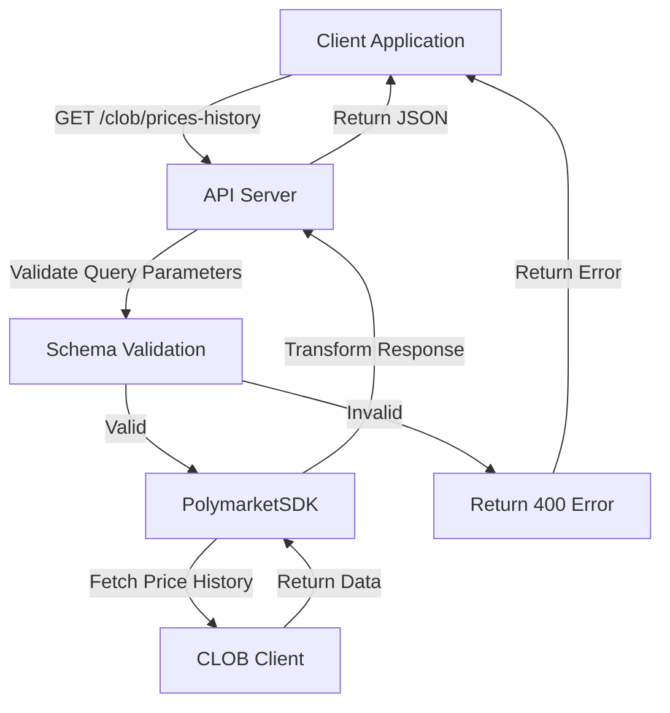
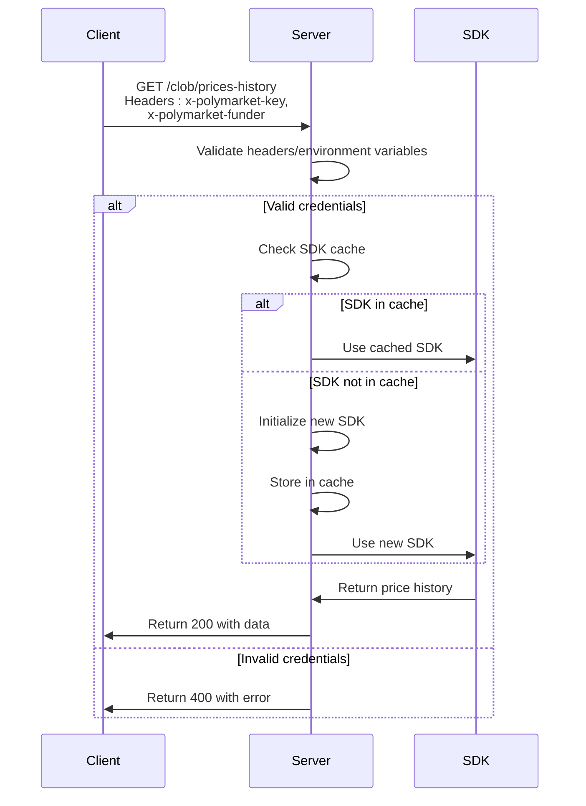

# Price History

<cite>
**Referenced Files in This Document**   
- [elysia-schemas.ts](file://src/types/elysia-schemas.ts)
- [clob.ts](file://src/routes/clob.ts)
- [client.ts](file://src/sdk/client.ts)
</cite>

## Table of Contents
1. [Introduction](#introduction)
2. [Endpoint Overview](#endpoint-overview)
3. [Query Parameters](#query-parameters)
4. [Response Structure](#response-structure)
5. [Authentication](#authentication)
6. [Examples](#examples)
7. [Error Handling](#error-handling)
8. [Client SDK Implementation](#client-sdk-implementation)

## Introduction

This document provides comprehensive documentation for the CLOB API's price history endpoint. The endpoint allows users to retrieve historical price data for specific market tokens, supporting flexible time range queries and various resolution options. The API is designed for both direct HTTP access and integration through the PolymarketSDK.

**Section sources**
- [clob.ts](file://src/routes/clob.ts#L0-L1013)

## Endpoint Overview

The price history endpoint provides access to historical price data for market tokens on the Polymarket CLOB. The endpoint supports two primary query patterns: interval-based queries and custom time range queries.

**Endpoint**: `GET /clob/prices-history`

The endpoint is part of the Elysia server framework and uses schema validation to ensure proper parameter formatting. It serves as a proxy to the underlying CLOB client, transforming and forwarding requests while handling authentication and caching.



**Diagram sources**
- [clob.ts](file://src/routes/clob.ts#L0-L1013)
- [client.ts](file://src/sdk/client.ts#L152-L222)

## Query Parameters

The price history endpoint accepts several query parameters to customize the data retrieval. These parameters are validated against the `PriceHistoryQuerySchema` defined in the elysia-schemas.

### Required Parameter

- **market**: The CLOB token ID for which to fetch price history (string, required)

### Time Range Parameters

The endpoint supports two mutually exclusive methods for specifying time ranges:

#### Interval-Based Query
- **interval**: Predefined time interval for data aggregation
  - Valid values: "1m", "1h", "6h", "1d", "1w", "max"
  - When using interval, time range parameters (startTs/endTs/startDate/endDate) are ignored

#### Custom Time Range Query
- **startTs**: Unix timestamp in seconds (number, optional)
- **endTs**: Unix timestamp in seconds (number, optional)
- **startDate**: ISO date string (e.g., "2025-08-13" or "2025-08-13T00:00:00.000Z") (string, optional)
- **endDate**: ISO date string (e.g., "2025-08-13" or "2025-08-13T00:00:00.000Z") (string, optional)

**Mutual Exclusivity Rule**: When both interval and any time range parameter are provided, the interval takes precedence and time range parameters are ignored.

### Resolution Parameter

- **fidelity**: Data resolution in minutes (number, optional)
  - Controls the granularity of the returned data
  - Higher fidelity values return fewer data points with greater time intervals between them

**Section sources**
- [elysia-schemas.ts](file://src/types/elysia-schemas.ts#L0-L1023)
- [clob.ts](file://src/routes/clob.ts#L0-L1013)

## Response Structure

The price history endpoint returns a standardized response structure that includes both the historical data and metadata about the time range.

### Response Schema

```typescript
{
  history: Array<{
    t: number; // timestamp in seconds
    p: number; // price value
  }>;
  timeRange: {
    start: string; // ISO date string
    end: string; // ISO date string
  } | null;
}
```

### Fields Description

- **history**: Array of timestamp-price pairs
  - Each object contains:
    - `t`: Unix timestamp in seconds
    - `p`: Price value at that timestamp
  - Data is ordered chronologically from oldest to newest
  - Empty array when no data is available for the requested period

- **timeRange**: Object containing the actual time range of the returned data
  - `start`: ISO string of the earliest timestamp in the response
  - `end`: ISO string of the latest timestamp in the response
  - `null` when no data is available

When no price history data is available for the requested parameters, the endpoint returns an empty history array and null timeRange.

**Section sources**
- [elysia-schemas.ts](file://src/types/elysia-schemas.ts#L0-L1023)
- [client.ts](file://src/sdk/client.ts#L152-L222)

## Authentication

The price history endpoint requires authentication for access, with different requirements based on the environment.

### Required Headers

- **x-polymarket-key**: Polymarket private key for CLOB authentication
- **x-polymarket-funder**: Polymarket funder address for CLOB operations

### Environment-Specific Behavior

- **Production**: Both headers are required
- **Development**: Headers are optional; if not provided, the system falls back to environment variables:
  - `POLYMARKET_KEY` for the private key
  - `POLYMARKET_FUNDER` for the funder address

The authentication system uses a caching mechanism to store initialized SDK instances, improving performance for repeated requests with the same credentials.



**Diagram sources**
- [clob.ts](file://src/routes/clob.ts#L0-L1013)
- [client.ts](file://src/sdk/client.ts#L0-L387)

## Examples

### cURL Examples

#### Interval-Based Query
```bash
curl -X GET "https://api.polymarket.com/clob/prices-history?market=0x123...&interval=1h" \
  -H "x-polymarket-key: YOUR_PRIVATE_KEY" \
  -H "x-polymarket-funder: YOUR_FUNDER_ADDRESS"
```

#### Unix Timestamp Range Query
```bash
curl -X GET "https://api.polymarket.com/clob/prices-history?market=0x123...&startTs=1704067200&endTs=1704153600" \
  -H "x-polymarket-key: YOUR_PRIVATE_KEY" \
  -H "x-polymarket-funder: YOUR_FUNDER_ADDRESS"
```

#### ISO Date Range Query
```bash
curl -X GET "https://api.polymarket.com/clob/prices-history?market=0x123...&startDate=2024-01-01&endDate=2024-01-02" \
  -H "x-polymarket-key: YOUR_PRIVATE_KEY" \
  -H "x-polymarket-funder: YOUR_FUNDER_ADDRESS"
```

#### High-Fidelity Query
```bash
curl -X GET "https://api.polymarket.com/clob/prices-history?market=0x123...&interval=1d&fidelity=30" \
  -H "x-polymarket-key: YOUR_PRIVATE_KEY" \
  -H "x-polymarket-funder: YOUR_FUNDER_ADDRESS"
```

### TypeScript Examples

#### Using PolymarketSDK
```typescript
import { PolymarketSDK } from "@polymarket/sdk";

const sdk = new PolymarketSDK({
  privateKey: "YOUR_PRIVATE_KEY",
  funderAddress: "YOUR_FUNDER_ADDRESS"
});

// Interval-based query
const history1 = await sdk.getPriceHistory({
  market: "0x123...",
  interval: "1h"
});

// Unix timestamp range query
const history2 = await sdk.getPriceHistory({
  market: "0x123...",
  startTs: 1704067200,
  endTs: 1704153600
});

// ISO date range query
const history3 = await sdk.getPriceHistory({
  market: "0x123...",
  startDate: "2024-01-01",
  endDate: "2024-01-02"
});

// High-fidelity query
const history4 = await sdk.getPriceHistory({
  market: "0x123...",
  interval: "1d",
  fidelity: 30
});
```

**Section sources**
- [clob.ts](file://src/routes/clob.ts#L0-L1013)
- [client.ts](file://src/sdk/client.ts#L152-L222)

## Error Handling

The price history endpoint implements comprehensive error handling for various failure scenarios.

### HTTP Status Codes

- **200 OK**: Successful request with price history data
- **400 Bad Request**: Invalid query parameters
- **500 Internal Server Error**: Server-side processing failure
- **404 Not Found**: Requested resource not found

### Error Response Structure

```typescript
{
  error: string; // Error type identifier
  message: string; // Human-readable error description
  details?: string; // Additional error details (optional)
}
```

### Common Error Scenarios

- **Missing market parameter**: Returns 400 with error message indicating the required parameter
- **Invalid interval value**: Returns 400 with error message listing valid interval options
- **Authentication failure**: Returns 400 if required headers are missing in production
- **CLOB client initialization failure**: Returns 500 with detailed error message
- **Empty result set**: Returns 200 with empty history array and null timeRange

The server-side implementation catches and transforms underlying CLOB client errors into standardized API responses, ensuring consistent error handling for clients.

**Section sources**
- [clob.ts](file://src/routes/clob.ts#L0-L1013)
- [client.ts](file://src/sdk/client.ts#L152-L222)

## Client SDK Implementation

The PolymarketSDK provides a high-level interface for accessing the price history endpoint, handling parameter transformation and response formatting.

### Parameter Transformation

The SDK automatically handles date conversion between different formats:

- Converts ISO date strings (startDate/endDate) to Unix timestamps (startTs/endTs)
- Validates and transforms interval values to match API requirements
- Maps SDK parameters to the underlying CLOB client's expected format

### Response Processing

The SDK transforms the raw CLOB client response into a standardized format:

- Maps timestamp from seconds to JavaScript Date objects for timeRange
- Ensures consistent field naming (t for timestamp, p for price)
- Handles empty result sets by returning empty history array and null timeRange
- Calculates timeRange from the first and last data points in the history

### Caching Mechanism

The SDK implements a caching system for CLOB client instances:

- Uses LRU cache with configurable size and TTL
- Keys cache entries by privateKey, host, chainId, and funderAddress
- Reduces initialization overhead for repeated requests
- Provides cache statistics and management methods

```mermaid
classDiagram
class PolymarketSDK {
+getPriceHistory(query : PriceHistoryQuery) : Promise~PriceHistoryResponse~
-initializeClobClient() : Promise~ClobClient~
-cacheKey : string
}
class PriceHistoryQuery {
+market : string
+interval? : PriceHistoryInterval
+startTs? : number
+endTs? : number
+startDate? : string
+endDate? : string
+fidelity? : number
}
class PriceHistoryResponse {
+history : {t : number, p : number}[]
+timeRange : {start : string, end : string} | null
}
class ClobClient {
+getPricesHistory(params : PriceHistoryFilterParams) : Promise~any~
}
PolymarketSDK --> PriceHistoryQuery : "accepts"
PolymarketSDK --> PriceHistoryResponse : "returns"
PolymarketSDK --> ClobClient : "uses"
PolymarketSDK --> "LRUCache<string, ClobClient>" : "caches"
```

**Diagram sources**
- [client.ts](file://src/sdk/client.ts#L0-L387)
- [elysia-schemas.ts](file://src/types/elysia-schemas.ts#L0-L1023)