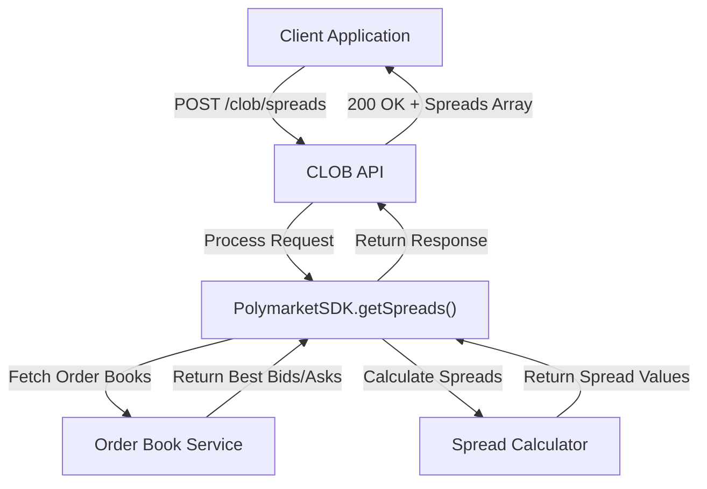
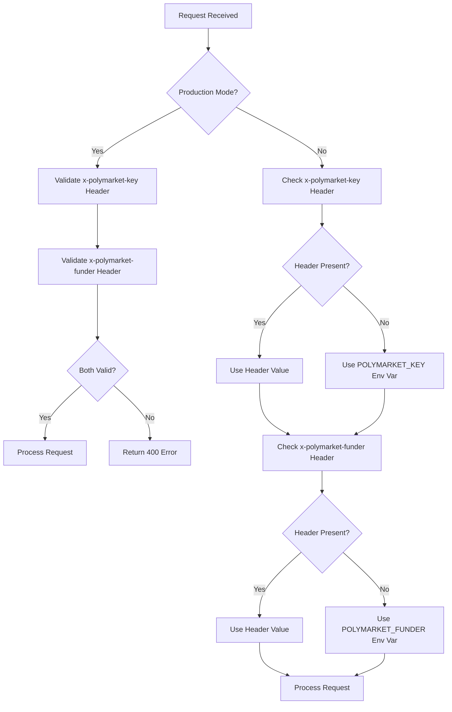
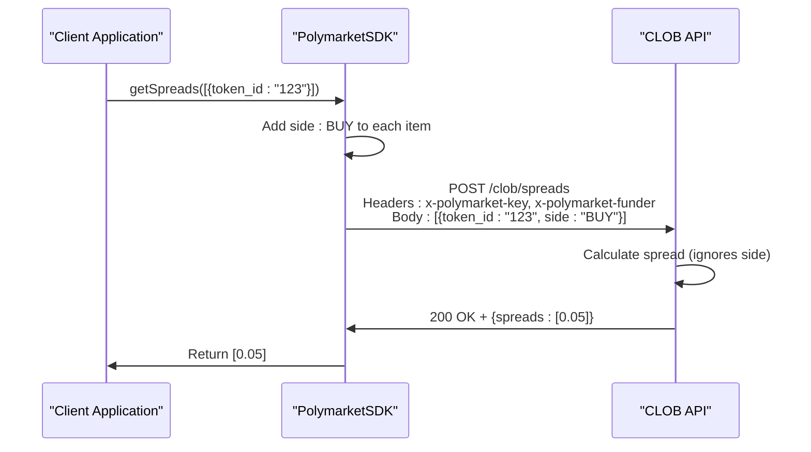

# Spreads

<cite>
**Referenced Files in This Document**   
- [elysia-schemas.ts](file://src/types/elysia-schemas.ts)
- [clob.ts](file://src/routes/clob.ts)
- [gamma-client.ts](file://src/sdk/gamma-client.ts)
</cite>

## Table of Contents
1. [Introduction](#introduction)
2. [Endpoint Overview](#endpoint-overview)
3. [Request Parameters](#request-parameters)
4. [Response Structure](#response-structure)
5. [Authentication Requirements](#authentication-requirements)
6. [Usage Examples](#usage-examples)
7. [Error Handling](#error-handling)
8. [SDK Implementation Details](#sdk-implementation-details)

## Introduction
This document provides comprehensive API documentation for the CLOB API's spread endpoints. The API offers a batch endpoint for retrieving bid-ask spreads for multiple tokens, which represents the difference between the best ask and best bid prices in the order book. This endpoint is designed for efficient retrieval of spread data across multiple tokens in a single request.

**Section sources**
- [clob.ts](file://src/routes/clob.ts#L0-L800)

## Endpoint Overview
The POST /clob/spreads endpoint retrieves bid-ask spreads for multiple tokens in a batch operation. This is the only available spread endpoint; there is no single spread endpoint for individual tokens. The endpoint processes an array of token parameters and returns an array of corresponding spreads.

The endpoint is implemented as a POST request to allow for the transmission of multiple token identifiers in the request body. This batch approach optimizes network usage and reduces latency when retrieving spread data for multiple tokens simultaneously.



**Diagram sources**
- [clob.ts](file://src/routes/clob.ts#L0-L800)

**Section sources**
- [clob.ts](file://src/routes/clob.ts#L0-L800)

## Request Parameters
The request body accepts an array of objects that follow the TokenParamsSchema structure. Each object in the array must contain a token_id parameter, which identifies the token for which to retrieve the spread.

The TokenParamsSchema is defined as:
```typescript
export const TokenParamsSchema = t.Object({
    token_id: t.String(),
});
```

Although the API requires the side parameter in the underlying implementation due to schema constraints, this parameter is ignored in the spread calculation. The spread is calculated purely based on the difference between the best ask and best bid prices, regardless of trade direction.

When making direct API calls, clients must include a side parameter in the request body despite it being unused. However, when using the PolymarketSDK, this requirement is handled automatically by the SDK.

**Section sources**
- [elysia-schemas.ts](file://src/types/elysia-schemas.ts#L497-L499)
- [clob.ts](file://src/routes/clob.ts#L0-L800)

## Response Structure
The response from the POST /clob/spreads endpoint contains a single property: spreads, which is an array of numbers. Each number in the array represents the bid-ask spread for the corresponding token in the request, calculated as the difference between the best ask price and the best bid price.

The spread value is returned as a positive number representing the absolute difference between the ask and bid prices. A spread of 0 indicates that the best ask and best bid prices are equal, while a higher spread value indicates greater market volatility or lower liquidity.

The response structure is:
```json
{
    "spreads": [number]
}
```

The order of spread values in the response array corresponds directly to the order of token parameters in the request body, allowing clients to easily map spread values back to their respective tokens.

**Section sources**
- [clob.ts](file://src/routes/clob.ts#L0-L800)
- [go-polymarket/client/clob/spreads_post_response.go](file://go-polymarket/client/clob/spreads_post_response.go#L0-L32)

## Authentication Requirements
The POST /clob/spreads endpoint requires authentication via two HTTP headers: x-polymarket-key and x-polymarket-funder. These headers provide the necessary credentials for accessing the CLOB API.

In production environments, both headers are required and must contain valid authentication credentials. The x-polymarket-key header should contain the Polymarket private key for CLOB authentication, while the x-polymarket-funder header should contain the funder address for CLOB operations.

For development purposes, the API provides a fallback mechanism. If the headers are not provided, the system will attempt to use environment variables (POLYMARKET_KEY and POLYMARKET_FUNDER) as fallback values. This development mode simplifies testing and local development without requiring header configuration.



**Diagram sources**
- [clob.ts](file://src/routes/clob.ts#L0-L800)

**Section sources**
- [clob.ts](file://src/routes/clob.ts#L0-L800)

## Usage Examples
### cURL Example
```bash
curl -X POST "https://api.polymarket.com/clob/spreads" \
  -H "Content-Type: application/json" \
  -H "x-polymarket-key: YOUR_PRIVATE_KEY" \
  -H "x-polymarket-funder: YOUR_FUNDER_ADDRESS" \
  -d '[
    {"token_id": "12345"},
    {"token_id": "67890"}
  ]'
```

### TypeScript Example using PolymarketSDK
```typescript
import { PolymarketSDK } from "@polymarket/sdk";

// Initialize the SDK with your credentials
const sdk = new PolymarketSDK({
  privateKey: "YOUR_PRIVATE_KEY",
  funderAddress: "YOUR_FUNDER_ADDRESS"
});

// Get spreads for multiple tokens
const spreads = await sdk.getSpreads([
  { token_id: "12345" },
  { token_id: "67890" }
]);

console.log(spreads); // [0.05, 0.03]
```

The PolymarketSDK abstracts away the complexity of the side parameter requirement, automatically including a default value (typically BUY) when making the underlying API call. This allows developers to focus on the token_id parameter without worrying about unused parameters.

**Section sources**
- [clob.ts](file://src/routes/clob.ts#L0-L800)
- [gamma-client.ts](file://src/sdk/gamma-client.ts#L0-L800)

## Error Handling
The POST /clob/spreads endpoint implements standard error handling with appropriate HTTP status codes and error responses.

Common error scenarios include:
- **400 Bad Request**: Invalid request parameters, missing token_id, or malformed JSON
- **401 Unauthorized**: Missing or invalid authentication credentials
- **500 Internal Server Error**: Server-side errors during processing

Error responses follow the standard ErrorResponseSchema format:
```json
{
    "error": "Error type",
    "message": "Error description",
    "details": "Additional error details (optional)"
}
```

When using the PolymarketSDK, these errors are propagated as JavaScript Error objects, making it easy to handle them in try-catch blocks. The SDK also performs client-side validation of input parameters before making the API call, providing early feedback on invalid inputs.

**Section sources**
- [clob.ts](file://src/routes/clob.ts#L0-L800)
- [elysia-schemas.ts](file://src/types/elysia-schemas.ts#L0-L100)

## SDK Implementation Details
The PolymarketSDK provides a convenient wrapper around the CLOB API's spread endpoint through the getSpreads method. This method abstracts the underlying API complexity and handles the side parameter requirement transparently.

When the getSpreads method is called, the SDK transforms the input array by adding a default side parameter (typically set to BUY) to each token parameter object. This transformation satisfies the API's schema requirements while ensuring that the spread calculation remains unaffected, as the side parameter is ignored in the actual spread computation.

The SDK also handles authentication by automatically including the x-polymarket-key and x-polymarket-funder headers in the request. It manages connection pooling and caching to optimize performance when making multiple requests.



**Diagram sources**
- [clob.ts](file://src/routes/clob.ts#L0-L800)
- [gamma-client.ts](file://src/sdk/gamma-client.ts#L0-L800)

**Section sources**
- [clob.ts](file://src/routes/clob.ts#L0-L800)
- [gamma-client.ts](file://src/sdk/gamma-client.ts#L0-L800)