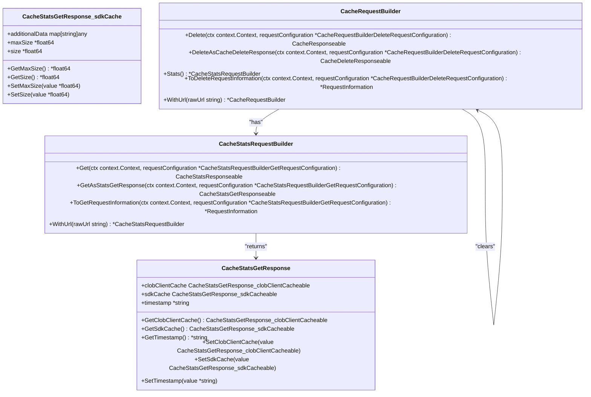
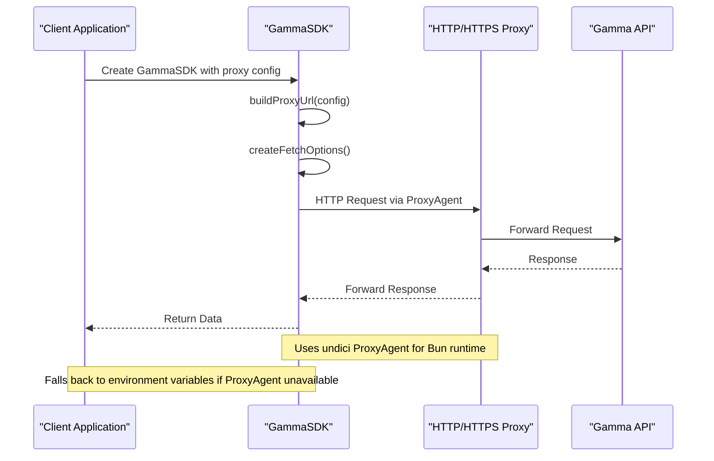
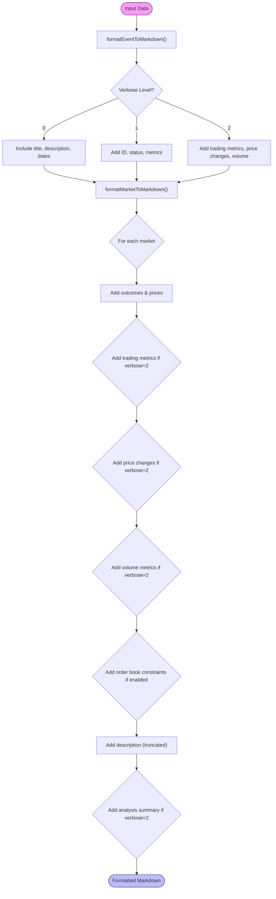

# Advanced Features

<cite>
**Referenced Files in This Document**   
- [gamma-client.ts](file://src/sdk/gamma-client.ts)
- [markdown-formatters.ts](file://src/utils/markdown-formatters.ts)
- [cache_stats_get_response_escaped_sdk_cache.go](file://go-polymarket/client/clob/cache_stats_get_response_escaped_sdk_cache.go)
- [cache_request_builder.go](file://go-polymarket/client/clob/cache_request_builder.go)
- [cache_stats_request_builder.go](file://go-polymarket/client/clob/cache_stats_request_builder.go)
- [polymarket_client.go](file://go-polymarket/client/polymarket_client.go)
- [elysia-schemas.ts](file://src/types/elysia-schemas.ts)
- [gamma.ts](file://src/routes/gamma.ts)
</cite>

## Table of Contents
1. [Introduction](#introduction)
2. [LRU Caching Mechanism](#lru-caching-mechanism)
3. [Proxy Support Features](#proxy-support-features)
4. [Markdown Transformation Utilities](#markdown-transformation-utilities)
5. [Error Handling and Retry Strategies](#error-handling-and-retry-strategies)
6. [Performance Optimization Techniques](#performance-optimization-techniques)
7. [Customization Options](#customization-options)
8. [Extending the System](#extending-the-system)
9. [Use Cases](#use-cases)
10. [Conclusion](#conclusion)

## Introduction
This document details the advanced features of the Polymarket SDK that enhance core functionality for improved performance, reliability, and usability. The system provides sophisticated capabilities including LRU caching, proxy support, markdown transformation, comprehensive error handling, and various performance optimizations. These features are designed to support demanding use cases such as algorithmic trading and real-time market monitoring while reducing API costs and improving response times.

## LRU Caching Mechanism
The SDK implements a sophisticated LRU (Least Recently Used) caching mechanism at both the SDK and CLOB client levels to improve performance and reduce API costs. The cache stores frequently accessed market data, order books, and other endpoint responses, serving subsequent requests from memory rather than making additional API calls.

**Diagram sources**
- [cache_stats_get_response_escaped_sdk_cache.go](file://go-polymarket/client/clob/cache_stats_get_response_escaped_sdk_cache.go#L15-L45)
- [cache_request_builder.go](file://go-polymarket/client/clob/cache_request_builder.go#L25-L45)
- [cache_stats_request_builder.go](file://go-polymarket/client/clob/cache_stats_request_builder.go#L25-L45)

The caching system exposes endpoints to retrieve cache statistics and clear the cache when needed. The `CacheStatsGetResponse` structure provides detailed information about both the SDK cache and CLOB client cache, including current size and maximum capacity. This allows developers to monitor cache utilization and performance. The cache can be cleared programmatically using the delete endpoint, which is useful for debugging or forcing a refresh of stale data.

**Section sources**
- [cache_stats_get_response_escaped_sdk_cache.go](file://go-polymarket/client/clob/cache_stats_get_response_escaped_sdk_cache.go#L15-L113)
- [cache_request_builder.go](file://go-polymarket/client/clob/cache_request_builder.go#L15-L89)
- [cache_stats_request_builder.go](file://go-polymarket/client/clob/cache_stats_request_builder.go#L15-L72)

## Proxy Support Features
The SDK provides robust proxy support to help bypass network restrictions and access the Polymarket API from restricted environments. Proxy configuration can be applied at both the client level and through HTTP headers in the proxy server implementation.

**Diagram sources**
- [gamma-client.ts](file://src/sdk/gamma-client.ts#L54-L100)
- [gamma.ts](file://src/routes/gamma.ts#L49-L103)
- [elysia-schemas.ts](file://src/types/elysia-schemas.ts#L15-L36)

The proxy functionality is implemented through the `GammaSDKConfig` interface, which accepts a `ProxyConfigType` with properties for host, port, username, password, and protocol. The SDK uses the undici library's `ProxyAgent` to route requests through the specified proxy server. If the `ProxyAgent` is not available, the SDK falls back to setting environment variables (`HTTP_PROXY` and `HTTPS_PROXY`). The proxy configuration is also supported at the server level through the `x-http-proxy` header, allowing clients to specify proxy settings on a per-request basis.

**Section sources**
- [gamma-client.ts](file://src/sdk/gamma-client.ts#L54-L100)
- [gamma.ts](file://src/routes/gamma.ts#L49-L103)
- [elysia-schemas.ts](file://src/types/elysia-schemas.ts#L15-L36)

## Markdown Transformation Utilities
The SDK includes comprehensive markdown transformation utilities that prepare market and event data for LLM analysis. These utilities convert complex trading data into structured markdown format optimized for identifying arbitrage opportunities and market patterns.

**Diagram sources**
- [markdown-formatters.ts](file://src/utils/markdown-formatters.ts#L15-L355)

The markdown formatters support three verbosity levels (0, 1, 2) that control the amount of detail included in the output. Level 0 provides basic information such as title, description, and dates. Level 1 adds key metrics like volume, status, and outcomes with prices. Level 2 includes full details such as spreads, price changes, order book information, and an analysis summary. The formatters handle complex data transformations, including parsing JSON string fields into arrays and calculating derived metrics for arbitrage analysis.

**Section sources**
- [markdown-formatters.ts](file://src/utils/markdown-formatters.ts#L15-L355)

## Error Handling and Retry Strategies
The SDK implements comprehensive error handling strategies to ensure reliable operation in the face of network issues and API errors. The error handling system includes proper type safety, descriptive error messages, and appropriate fallback mechanisms.

The Gamma SDK uses a consistent error handling pattern across all API methods, returning promises that reject with descriptive error messages when requests fail. Network errors are caught and wrapped in meaningful error messages that include the endpoint and original error. HTTP errors are handled by checking the response's `ok` property and returning a structured response with the error data. The SDK does not currently implement automatic retry logic, but provides sufficient information for callers to implement their own retry strategies based on the status code and error data.

**Section sources**
- [gamma-client.ts](file://src/sdk/gamma-client.ts#L102-L164)

## Performance Optimization Techniques
The SDK incorporates several performance optimization techniques to maximize efficiency and minimize latency. These include connection pooling, response compression, and batch request handling through the underlying HTTP client.

The SDK leverages Bun's built-in optimizations including efficient connection pooling through the undici HTTP client. When proxy support is enabled, the SDK uses undici's `ProxyAgent` which maintains persistent connections to both the proxy server and the target API. Response compression is handled automatically by the underlying fetch implementation, with appropriate headers set to accept compressed responses. While the SDK does not currently expose explicit batch request handling, the design allows for efficient sequential requests through the reuse of HTTP connections and the LRU cache.

**Section sources**
- [gamma-client.ts](file://src/sdk/gamma-client.ts#L54-L100)
- [gamma-client.ts](file://src/sdk/gamma-client.ts#L102-L164)

## Customization Options
The SDK provides several customization options to adapt its behavior to different use cases and environments. These include request interceptors through proxy configuration and response transformers through the markdown formatting utilities.

The primary customization mechanism is the `GammaSDKConfig` interface, which allows clients to configure proxy settings. This acts as a form of request interceptor, allowing requests to be routed through intermediate servers. The markdown transformation utilities serve as response transformers, converting raw API responses into formats optimized for specific analysis tasks. The SDK's modular design allows for easy extension with additional customization options as needed.

**Section sources**
- [gamma-client.ts](file://src/sdk/gamma-client.ts#L15-L50)
- [markdown-formatters.ts](file://src/utils/markdown-formatters.ts#L15-L355)

## Extending the System
The system can be extended with custom middleware and additional API endpoints through the Elysia server framework. The existing architecture provides a clear pattern for adding new functionality.

The server-side implementation uses Elysia's derive function to create a middleware that instantiates the GammaSDK with appropriate configuration based on request headers. This pattern can be extended to add custom middleware for logging, authentication, rate limiting, or other cross-cutting concerns. New API endpoints can be added by creating additional route handlers that leverage the existing SDK clients. The type-safe design of the system ensures that extensions maintain the same level of reliability and developer experience as the core functionality.

**Section sources**
- [gamma.ts](file://src/routes/gamma.ts#L49-L103)

## Use Cases
The advanced features of this SDK enable several sophisticated use cases, particularly in the domains of algorithmic trading and real-time market monitoring.

For algorithmic trading, the LRU caching mechanism reduces API costs and improves performance by minimizing redundant requests for market data. The markdown transformation utilities prepare market data for analysis by LLMs, enabling automated identification of arbitrage opportunities across multiple markets. The proxy support allows trading algorithms to operate from diverse network environments, including cloud infrastructure with restrictive outbound rules.

For real-time market monitoring, the combination of efficient caching and connection pooling enables high-frequency data collection with minimal latency. Monitoring systems can leverage the cache statistics endpoints to ensure optimal performance and detect potential issues. The structured markdown output can be integrated with alerting systems to notify traders of significant market movements or emerging opportunities.

**Section sources**
- [gamma-client.ts](file://src/sdk/gamma-client.ts#L15-L891)
- [markdown-formatters.ts](file://src/utils/markdown-formatters.ts#L15-L355)
- [cache_stats_get_response_escaped_sdk_cache.go](file://go-polymarket/client/clob/cache_stats_get_response_escaped_sdk_cache.go#L15-L113)

## Conclusion
The Polymarket SDK provides a comprehensive set of advanced features that significantly enhance its core functionality. The LRU caching mechanism improves performance and reduces API costs, while proxy support enables operation in restricted network environments. The markdown transformation utilities prepare data for sophisticated analysis by LLMs, particularly for identifying arbitrage opportunities. Together with robust error handling and performance optimizations, these features make the SDK well-suited for demanding applications in algorithmic trading and real-time market monitoring. The extensible architecture allows for further customization and integration with additional systems as needed.