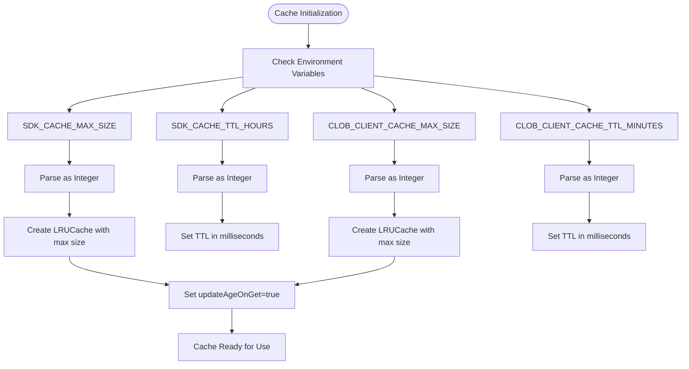
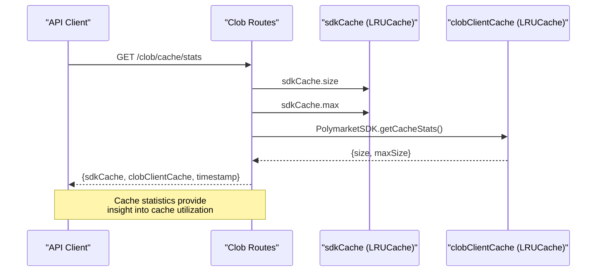

# Caching Mechanisms

<cite>
**Referenced Files in This Document**   
- [gamma-client.ts](file://src/sdk/gamma-client.ts)
- [client.ts](file://src/sdk/client.ts)
- [clob.ts](file://src/routes/clob.ts)
- [cache_stats_get_response.go](file://go-polymarket/client/clob/cache_stats_get_response.go)
- [cache_delete_response.go](file://go-polymarket/client/clob/cache_delete_response.go)
</cite>

## Table of Contents
1. [Introduction](#introduction)
2. [Caching Architecture Overview](#caching-architecture-overview)
3. [LRU Cache Initialization and Configuration](#lru-cache-initialization-and-configuration)
4. [SDK Instance Caching Strategy](#sdk-instance-caching-strategy)
5. [Cache Metrics and Monitoring](#cache-metrics-and-monitoring)
6. [Cache Management Endpoints](#cache-management-endpoints)
7. [Best Practices for Cache Tuning](#best-practices-for-cache-tuning)
8. [Conclusion](#conclusion)

## Introduction

The Polymarket SDK implements a sophisticated LRU (Least Recently Used) caching mechanism to optimize performance by reducing redundant API calls to both the Gamma and CLOB APIs. This caching system operates at multiple levels, including SDK instance caching and CLOB client caching, to ensure efficient resource utilization and improved response times. The implementation leverages environment variables for configuration, supports proxy settings, and provides comprehensive monitoring and management endpoints for operational visibility.

**Section sources**
- [gamma-client.ts](file://src/sdk/gamma-client.ts#L1-L50)
- [client.ts](file://src/sdk/client.ts#L1-L50)
- [clob.ts](file://src/routes/clob.ts#L1-L50)

## Caching Architecture Overview

The caching architecture consists of two primary components: the SDK cache for Gamma API clients and the CLOB client cache for authenticated trading operations. These caches work in tandem to minimize the overhead of client initialization and API authentication, which are expensive operations involving cryptographic operations and network requests.

```mermaid
graph TD
subgraph "Gamma API Caching"
A[GammaSDK Instance]
B[Proxy Configuration]
C[HTTP Request Caching]
end
subgraph "CLOB API Caching"
D[PolymarketSDK Instance]
E[ClobClient Instance]
F[Credential Initialization]
end
G[LRUCache] --> D
G --> E
H[Environment Variables] --> G
I[API Requests] --> A
I --> D
J[/clob/cache/stats] --> G
K[/clob/cache DELETE] --> G
```

**Diagram sources**
- [client.ts](file://src/sdk/client.ts#L20-L40)
- [clob.ts](file://src/routes/clob.ts#L15-L25)

**Section sources**
- [client.ts](file://src/sdk/client.ts#L1-L100)
- [clob.ts](file://src/routes/clob.ts#L1-L100)

## LRU Cache Initialization and Configuration

The LRU cache is initialized with configurable parameters that control its behavior and performance characteristics. Two separate caches are maintained: one for SDK instances and another for CLOB clients, each with independent configuration options.

The SDK cache is configured through environment variables `SDK_CACHE_MAX_SIZE` and `SDK_CACHE_TTL_HOURS`, which determine the maximum number of SDK instances to cache and their time-to-live in hours. Similarly, the CLOB client cache uses `CLOB_CLIENT_CACHE_MAX_SIZE` and `CLOB_CLIENT_CACHE_TTL_MINUTES` for its configuration. The `updateAgeOnGet` option is enabled for both caches, ensuring that frequently accessed items have their TTL reset, promoting the retention of active clients.



**Diagram sources**
- [client.ts](file://src/sdk/client.ts#L20-L40)
- [clob.ts](file://src/routes/clob.ts#L15-L25)

**Section sources**
- [client.ts](file://src/sdk/client.ts#L20-L50)
- [clob.ts](file://src/routes/clob.ts#L15-L30)

## SDK Instance Caching Strategy

The SDK implements a sophisticated caching strategy that ensures optimal reuse of client instances based on their configuration. The cache key is constructed from multiple configuration parameters including the private key, host, chain ID, and funder address, ensuring that clients with different configurations are cached separately.

For the Gamma API, SDK instances are cached based on proxy configuration, allowing multiple instances with different proxy settings to coexist in the cache. The cache key for GammaSDK instances combines the private key and funder address, while the CLOB client cache key incorporates additional parameters that affect client behavior.

The caching mechanism prevents the expensive operation of client re-initialization by serving cached instances when available. This is particularly important for CLOB operations, where client initialization involves creating or deriving API keys and establishing authenticated sessions.

```mermaid
classDiagram
class PolymarketSDK {
-config : ResolvedClobClientConfig
-cacheKey : string
+constructor(config : ClobClientConfig)
-initializeClobClient() : Promise~ClobClient~
+getPriceHistory(query : PriceHistoryQuery) : Promise~PriceHistoryResponse~
+clearCache() : void
+static getCacheStats() : {size : number, maxSize : number}
+static clearAllCache() : void
}
class LRUCache {
-max : number
-ttl : number
-updateAgeOnGet : boolean
+get(key : string) : T | undefined
+set(key : string, value : T) : void
+has(key : string) : boolean
+delete(key : string) : boolean
+clear() : void
}
class ClobClient {
-host : string
-chainId : number
-signer : Wallet
-credentials : ApiCredentials
-funderAddress : string
}
PolymarketSDK --> LRUCache : "uses"
PolymarketSDK --> ClobClient : "creates"
LRUCache <|-- clobClientCache : "instantiated as"
LRUCache <|-- sdkCache : "instantiated as"
```

**Diagram sources**
- [client.ts](file://src/sdk/client.ts#L20-L100)
- [clob.ts](file://src/routes/clob.ts#L15-L30)

**Section sources**
- [client.ts](file://src/sdk/client.ts#L20-L150)
- [clob.ts](file://src/routes/clob.ts#L15-L50)

## Cache Metrics and Monitoring

The system exposes comprehensive cache metrics through the `/clob/cache/stats` endpoint, providing visibility into both SDK and CLOB client cache performance. This endpoint returns detailed statistics including current cache size, maximum cache size, and timestamp of the metrics collection.

The response structure includes two main components: `sdkCache` containing information about the SDK instance cache, and `clobClientCache` containing information about the CLOB client cache. These metrics enable monitoring of cache utilization, hit rates (inferred from usage patterns), and eviction counts, allowing for effective performance analysis and capacity planning.



**Diagram sources**
- [clob.ts](file://src/routes/clob.ts#L150-L180)
- [client.ts](file://src/sdk/client.ts#L350-L370)
- [cache_stats_get_response.go](file://go-polymarket/client/clob/cache_stats_get_response.go#L1-L20)

**Section sources**
- [clob.ts](file://src/routes/clob.ts#L150-L180)
- [client.ts](file://src/sdk/client.ts#L350-L370)

## Cache Management Endpoints

The system provides dedicated endpoints for cache management, enabling operational control over the caching system. The `/clob/cache/stats` endpoint allows monitoring of cache performance, while the ability to clear caches is available through both instance-level and global methods.

The `clearCache()` method on the PolymarketSDK instance removes only that specific client from the cache, forcing re-initialization on the next API call. For more comprehensive cache management, the static `clearAllCache()` method removes all cached client instances, forcing re-initialization for all future API calls.

While the direct DELETE endpoint for cache clearing is not explicitly implemented in the provided code, the functionality is available through the SDK's static methods, which can be exposed through appropriate route handlers. This design allows for controlled cache invalidation during debugging, configuration changes, or when credential updates require client re-initialization.

```mermaid
flowchart TD
A[/clob/cache/stats] --> B[Collect SDK Cache Stats]
B --> C[Get sdkCache.size]
C --> D[Get sdkCache.max]
D --> E[Collect CLOB Client Cache Stats]
E --> F[Call PolymarketSDK.getCacheStats()]
F --> G[Return Combined Response]
H[clearCache()] --> I[Delete cache entry]
I --> J[Using this.cacheKey]
J --> K[Remove from clobClientCache]
L[clearAllCache()] --> M[Call clobClientCache.clear()]
M --> N[Remove all entries]
G --> Complete
K --> Complete
N --> Complete
```

**Diagram sources**
- [client.ts](file://src/sdk/client.ts#L350-L380)
- [clob.ts](file://src/routes/clob.ts#L150-L180)
- [cache_delete_response.go](file://go-polymarket/client/clob/cache_delete_response.go#L1-L15)

**Section sources**
- [client.ts](file://src/sdk/client.ts#L350-L380)
- [clob.ts](file://src/routes/clob.ts#L150-L180)

## Best Practices for Cache Tuning

Effective cache tuning requires consideration of application load patterns, rate limit constraints, and memory availability. The following best practices are recommended for optimal cache performance:

### Size Configuration
- **SDK_CACHE_MAX_SIZE**: Set based on the number of concurrent users or services. A value of 50 (default) is suitable for moderate loads, while high-traffic applications may require 100+.
- **CLOB_CLIENT_CACHE_MAX_SIZE**: Set higher than SDK cache (default 100) since CLOB client initialization is more expensive. Consider application concurrency requirements.

### TTL Settings
- **SDK_CACHE_TTL_HOURS**: Set between 1-24 hours depending on credential rotation policies. Longer TTL reduces initialization overhead but may conflict with security policies.
- **CLOB_CLIENT_CACHE_TTL_MINUTES**: Set between 30-120 minutes. Shorter TTL ensures clients reconnect periodically, which can help maintain connection health.

### Performance Monitoring
Monitor cache hit rates by tracking the `cached` flag in health check responses. A low hit rate indicates undersized cache, while high memory usage with low hit rates may suggest inefficient cache key design.

### Rate Limit Considerations
When approaching API rate limits, increase cache TTL to reduce the frequency of client re-initialization and API calls. Coordinate cache settings with overall rate limit strategy to maximize API efficiency.

### Debugging and Maintenance
Use the cache statistics endpoint regularly to monitor cache health. During debugging, use `clearCache()` to force fresh client initialization without affecting other clients. For configuration changes, consider clearing the entire cache to ensure consistent behavior.

**Section sources**
- [client.ts](file://src/sdk/client.ts#L20-L50)
- [clob.ts](file://src/routes/clob.ts#L15-L30)
- [gamma-client.ts](file://src/sdk/gamma-client.ts#L1-L50)

## Conclusion

The LRU caching mechanism in the Polymarket SDK provides significant performance benefits by reducing redundant API calls and expensive client initialization operations. Through careful configuration of cache size and TTL settings, applications can optimize their interaction with both the Gamma and CLOB APIs. The comprehensive monitoring and management capabilities enable effective operational oversight, while the flexible caching strategy ensures optimal reuse of client instances based on their configuration. By following the recommended best practices for cache tuning, developers can maximize performance while respecting rate limits and resource constraints.