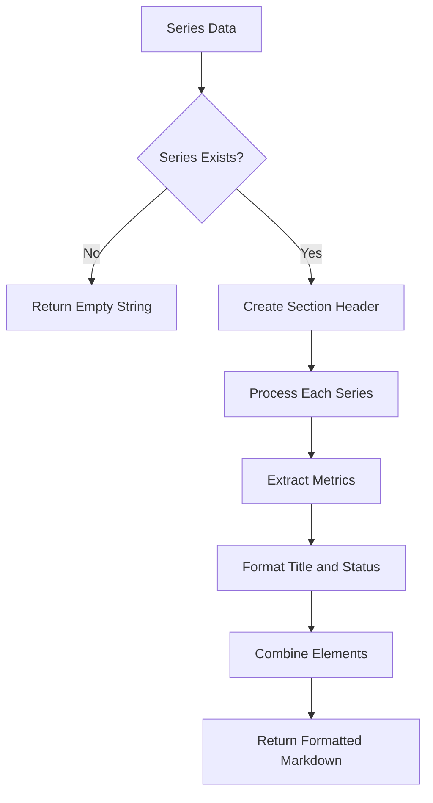
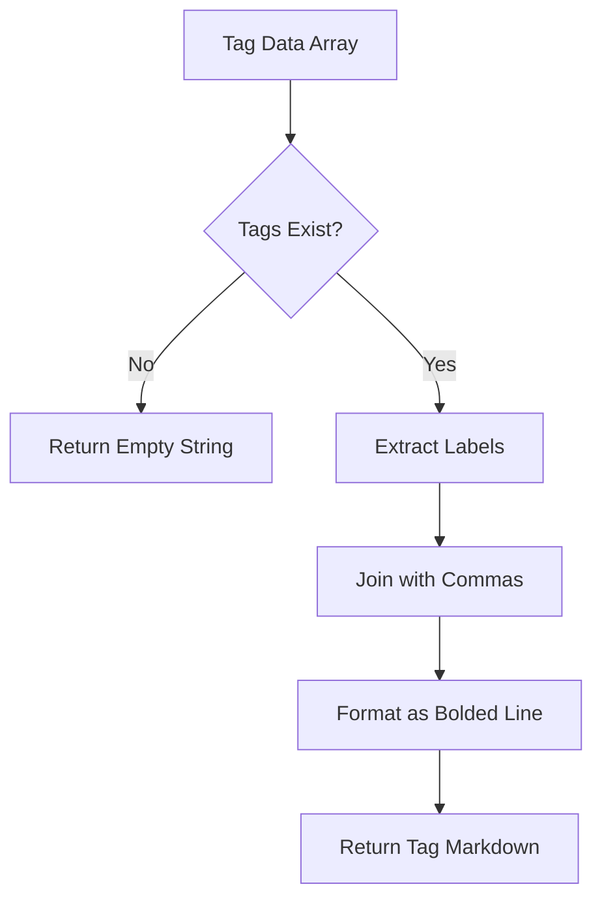
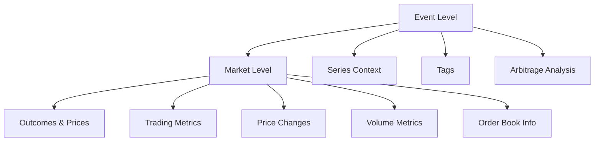
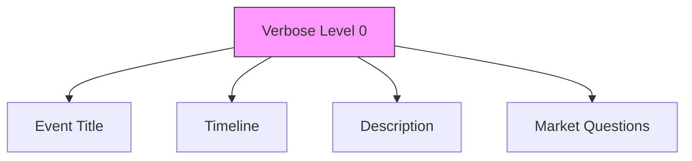
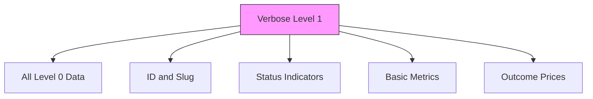
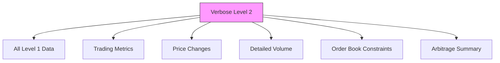
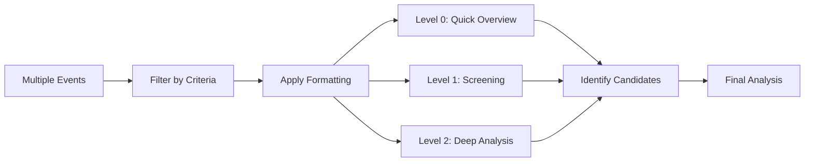

# LLM-Oriented Data Formatting

<cite>
**Referenced Files in This Document**   
- [markdown-formatters.ts](file://src/utils/markdown-formatters.ts)
- [markdown-formatters.test.ts](file://src/utils/__tests__/markdown-formatters.test.ts)
- [gamma-client.ts](file://src/sdk/gamma-client.ts)
</cite>

## Table of Contents
1. [Introduction](#introduction)
2. [Core Formatting Functions](#core-formatting-functions)
3. [Hierarchical Structure and Output Organization](#hierarchical-structure-and-output-organization)
4. [Verbose Levels and Detail Control](#verbose-levels-and-detail-control)
5. [Embedded Context and Related Entities](#embedded-context-and-related-entities)
6. [Integration with MCP Analysis System](#integration-with-mcp-analysis-system)
7. [Customization and Usage Patterns](#customization-and-usage-patterns)
8. [Example Input-Output Scenarios](#example-input-output-scenarios)
9. [Conclusion](#conclusion)

## Introduction
The markdown transformation utilities in the Polymarket toolkit serve as a critical bridge between structured API responses and natural language processing systems. These utilities convert complex market data into human-readable, context-rich markdown documents specifically optimized for Large Language Model (LLM) analysis. By transforming raw JSON data into well-structured markdown, these functions enable the MCP server to perform sophisticated analytical tasks such as arbitrage detection, trend identification, and sentiment analysis. The formatting system is designed to preserve essential trading metrics while presenting them in a format that enhances LLM comprehension and reasoning capabilities.

**Section sources**
- [markdown-formatters.ts](file://src/utils/markdown-formatters.ts#L1-L354)

## Core Formatting Functions

The markdown formatting system consists of four primary functions that work together to transform market data into LLM-friendly documents. Each function serves a specific purpose in the data transformation pipeline, creating a hierarchical structure that mirrors the relationships between different entities in the Polymarket ecosystem.

### formatEventToMarkdown Function
This function serves as the entry point for comprehensive event analysis, transforming an entire event object into a structured markdown document. It orchestrates the formatting process by calling other formatting functions to include related markets, series, and tags. The function creates a hierarchical document structure with the event as the root, followed by nested sections for markets and contextual information.

**Section sources**
- [markdown-formatters.ts](file://src/utils/markdown-formatters.ts#L198-L353)

### formatMarketToMarkdown Function
This function focuses on converting individual market data into detailed markdown sections. It extracts key trading metrics such as outcomes, prices, volume, and liquidity, presenting them in a format optimized for arbitrage analysis. The function handles various market properties including trading periods, status indicators, price changes, and order book constraints, ensuring that all relevant information is accessible to the LLM.

**Section sources**
- [markdown-formatters.ts](file://src/utils/markdown-formatters.ts#L37-L158)

### formatSeriesToMarkdown Function
This utility formats series information to provide contextual background for events and markets. It transforms series data into markdown sections that highlight volume, liquidity, and comment metrics, helping the LLM understand the broader context in which markets operate. The function preserves series attributes such as type, recurrence, and activity status, enabling temporal pattern recognition.

**Diagram sources**
- [markdown-formatters.ts](file://src/utils/markdown-formatters.ts#L163-L183)

### formatTagsToMarkdown Function
This function converts tag data into categorical metadata for events and markets. It creates a simple but effective tagging system that helps the LLM classify and group related content. By extracting tag labels and presenting them as comma-separated values, the function enables thematic analysis and cross-market comparisons based on shared categories.

**Diagram sources**
- [markdown-formatters.ts](file://src/utils/markdown-formatters.ts#L188-L192)

## Hierarchical Structure and Output Organization

The markdown formatting system creates a well-defined hierarchical structure that reflects the relationships between different market entities. This organization enhances LLM comprehension by presenting information in a logical, nested format that mirrors the actual data model.

### Document Hierarchy
The output follows a clear hierarchy with events at the top level, followed by markets, and then supporting contextual information. This structure enables the LLM to understand the relationship between different entities and perform cross-referential analysis.

**Diagram sources**
- [markdown-formatters.ts](file://src/utils/markdown-formatters.ts#L198-L353)

### Section Organization
Each section is clearly delineated with appropriate heading levels and formatting. The event section uses a single hash (#) for the main title, while markets use double hashes (##). Supporting information such as series context and tags are presented in dedicated sections with descriptive headings. This consistent organization helps the LLM parse and understand the document structure.

**Section sources**
- [markdown-formatters.ts](file://src/utils/markdown-formatters.ts#L198-L353)

## Verbose Levels and Detail Control

The formatting system implements a three-level verbosity system that allows users to control the depth of detail in the output. This feature enables tailored output for different analytical needs, from quick overviews to comprehensive analysis.

### Verbose Level 0: Basic Information
At the lowest verbosity level, the system outputs only essential information such as titles, descriptions, and basic timelines. This mode is optimized for quick scanning and high-level overview, providing minimal context without detailed metrics.

**Section sources**
- [markdown-formatters.ts](file://src/utils/markdown-formatters.ts#L207-L224)

### Verbose Level 1: Medium Detail
This intermediate level adds key metrics and status information while maintaining a relatively concise output. It includes ID, status indicators, basic volume metrics, and outcome prices, providing sufficient detail for initial screening and filtering of opportunities.

**Section sources**
- [markdown-formatters.ts](file://src/utils/markdown-formatters.ts#L226-L258)

### Verbose Level 2: Full Detail
The highest verbosity level provides comprehensive information for in-depth analysis. It includes all available metrics such as trading metrics, price changes, volume breakdowns, order book constraints, and an arbitrage analysis summary. This mode is designed for detailed evaluation and sophisticated pattern recognition.

**Section sources**
- [markdown-formatters.ts](file://src/utils/markdown-formatters.ts#L260-L353)

## Embedded Context and Related Entities

The formatting system enriches market data by embedding contextual information from related entities, creating a comprehensive view that supports sophisticated LLM analysis.

### Series Context Integration
The system incorporates series information to provide temporal and categorical context for events. By including series metrics such as volume, liquidity, and comment counts, the formatter enables the LLM to identify patterns across related markets and understand the broader market dynamics.

**Section sources**
- [markdown-formatters.ts](file://src/utils/markdown-formatters.ts#L330-L332)

### Tag Categorization
Tags are embedded as categorical metadata, allowing the LLM to classify and group markets based on shared themes. This categorization enables cross-market analysis and helps identify thematic trends across different event types.

**Section sources**
- [markdown-formatters.ts](file://src/utils/markdown-formatters.ts#L328-L329)

### Market Relationships
For events with multiple markets, the system highlights potential cross-market opportunities in the arbitrage analysis summary. This feature enables the LLM to identify complex trading strategies that span multiple related markets within the same event.

**Section sources**
- [markdown-formatters.ts](file://src/utils/markdown-formatters.ts#L340-L342)

## Integration with MCP Analysis System

The markdown formatting utilities are designed to work seamlessly with the MCP server's analytical capabilities, providing structured input that enhances various types of market analysis.

### Arbitrage Detection
The detailed trading metrics and price information formatted by these utilities enable sophisticated arbitrage detection. The system presents bid-ask spreads, price changes, and market inefficiencies in a format that allows the LLM to identify potential arbitrage opportunities across related markets.

**Section sources**
- [markdown-formatters.ts](file://src/utils/markdown-formatters.ts#L337-L348)

### Trend Identification
By organizing historical price data and volume metrics in a structured format, the utilities facilitate trend identification. The LLM can analyze price changes over different timeframes (1hr, 24hr) and correlate them with volume patterns to identify emerging market trends.

**Section sources**
- [markdown-formatters.ts](file://src/utils/markdown-formatters.ts#L124-L128)

### Sentiment Analysis
The inclusion of contextual information such as descriptions, comments, and tags enables sentiment analysis. The LLM can correlate market metrics with qualitative factors to assess market sentiment and predict potential price movements.

**Section sources**
- [markdown-formatters.ts](file://src/utils/markdown-formatters.ts#L149-L154)

## Customization and Usage Patterns

The formatting system offers several customization options to support different analytical workflows and integration requirements.

### Include Markets Option
Users can control whether market details are included in the event formatting through the includeMarkets parameter. This option allows for flexible output generation, enabling summaries without detailed market information when needed.

**Section sources**
- [markdown-formatters.ts](file://src/utils/markdown-formatters.ts#L201-L203)

### Input Format Flexibility
The system accepts both camelCase and snake_case parameter names for consumer convenience, making it easier to integrate with different codebases and reducing the need for parameter transformation.

**Section sources**
- [markdown-formatters.ts](file://src/utils/markdown-formatters.ts#L28-L29)

### Batch Processing Patterns
The utilities support batch processing of multiple events, enabling efficient analysis of large datasets. Users can apply different verbosity levels to different subsets of data, creating tiered analysis workflows.

**Section sources**
- [markdown-formatters.test.ts](file://src/utils/__tests__/markdown-formatters.test.ts#L348-L372)

## Example Input-Output Scenarios

The following examples demonstrate how the formatting utilities transform structured API responses into LLM-optimized markdown documents.

### Basic Event Formatting
When formatting an event with verbose level 0, the system produces a concise output containing only the essential information needed for quick identification and basic context.

**Section sources**
- [markdown-formatters.test.ts](file://src/utils/__tests__/markdown-formatters.test.ts#L270-L282)

### Comprehensive Market Analysis
With verbose level 2, the system generates detailed market sections that include all available trading metrics, price history, and order book constraints, creating a comprehensive view for in-depth analysis.

**Section sources**
- [markdown-formatters.test.ts](file://src/utils/__tests__/markdown-formatters.test.ts#L20-L48)

### Cross-Market Opportunity Identification
For events with multiple markets, the system highlights potential arbitrage opportunities in the analysis summary, drawing attention to markets that may benefit from comparative analysis.

**Section sources**
- [markdown-formatters.test.ts](file://src/utils/__tests__/markdown-formatters.test.ts#L317-L324)

## Conclusion
The markdown transformation utilities in the Polymarket toolkit provide a powerful mechanism for preparing market data for LLM analysis. By converting structured API responses into well-organized, context-rich markdown documents, these functions enable sophisticated analytical capabilities such as arbitrage detection, trend identification, and sentiment analysis. The hierarchical structure, verbosity controls, and embedded contextual information create an optimal format for LLM comprehension, while the customization options support flexible integration with the MCP tool system. This formatting layer serves as a critical enabler for advanced market analysis, transforming raw data into actionable insights.