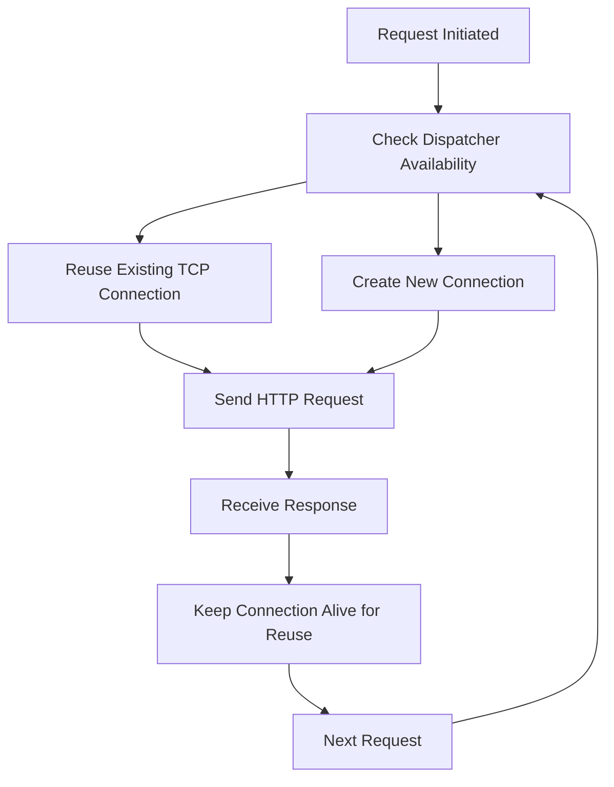
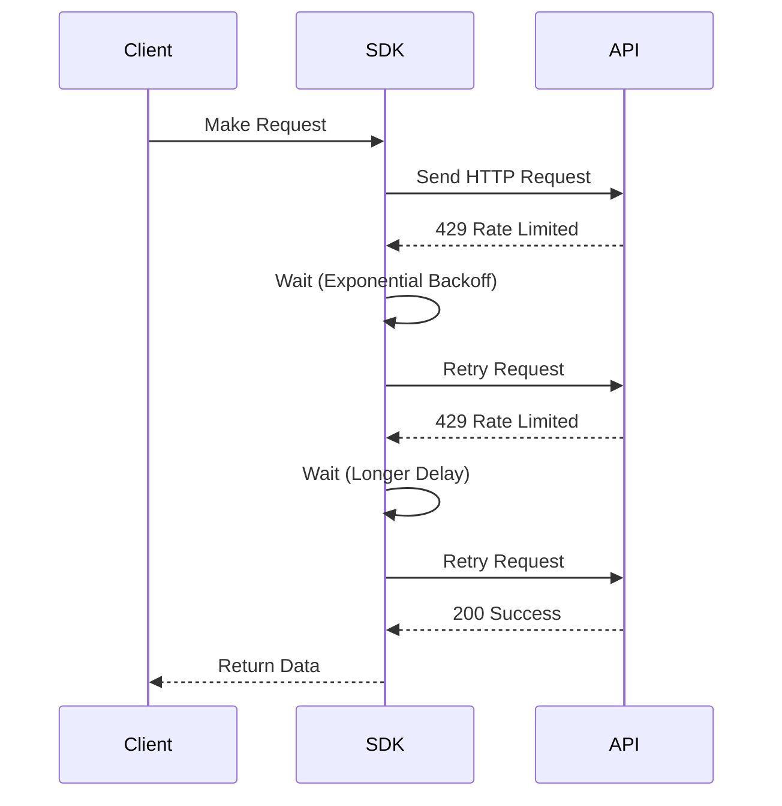
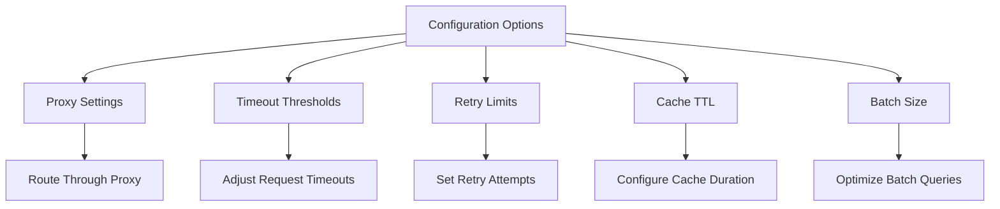
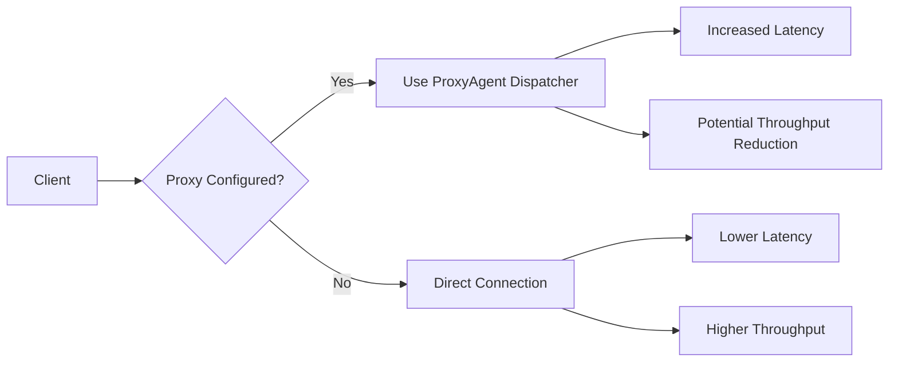

# Performance Optimization

<cite>
**Referenced Files in This Document**   
- [gamma-client.ts](file://src/sdk/gamma-client.ts)
- [polymarket_client.go](file://go-polymarket/client/polymarket_client.go)
- [env.ts](file://src/utils/env.ts)
- [cfg.yml](file://go-polymarket/cfg.yml)
</cite>

## Table of Contents
1. [Introduction](#introduction)
2. [Connection Pooling with Undici Dispatcher](#connection-pooling-with-undici-dispatcher)
3. [Request Batching for Market Queries](#request-batching-for-market-queries)
4. [Error Handling and Retry Strategies](#error-handling-and-retry-strategies)
5. [HTTP Response Compression](#http-response-compression)
6. [LRU Caching System](#lru-caching-system)
7. [Performance Configuration Options](#performance-configuration-options)
8. [Monitoring and Optimization Guidance](#monitoring-and-optimization-guidance)
9. [Proxy Usage Impact on Performance](#proxy-usage-impact-on-performance)
10. [Conclusion](#conclusion)

## Introduction
This document provides comprehensive documentation on the performance optimization techniques implemented in the Polymarket SDK and associated services. The system leverages multiple strategies to enhance throughput, reduce latency, and improve reliability when interacting with the Polymarket API endpoints. Key optimizations include connection reuse via undici's dispatcher, request batching, intelligent retry mechanisms, response compression, and caching. This guide details each technique, its implementation, and configuration options to help developers optimize their usage patterns for different workload types.

## Connection Pooling with Undici Dispatcher

The SDK implements connection pooling through undici's `ProxyAgent` dispatcher configuration, which enables TCP connection reuse across multiple HTTP requests. This optimization significantly improves throughput by eliminating the overhead of establishing new connections for each request. The dispatcher is configured within the `createFetchOptions` method of the `GammaSDK` class, where it dynamically imports undici's `ProxyAgent` and attaches it to the fetch options. When a proxy is configured, the dispatcher ensures that connections are reused efficiently, reducing handshake latency and improving overall performance.

**Diagram sources**
- [gamma-client.ts](file://src/sdk/gamma-client.ts#L54-L85)

**Section sources**
- [gamma-client.ts](file://src/sdk/gamma-client.ts#L54-L100)

## Request Batching for Market Queries

The system supports request batching capabilities that allow multiple market queries to be consolidated into single API calls. This reduces the number of round trips to the server, thereby decreasing overall latency. The SDK's methods such as `getMarkets`, `getEvents`, and `getTags` accept query parameters that can filter and paginate results, enabling clients to retrieve large datasets efficiently in fewer requests. By leveraging these batch query capabilities, applications can minimize network overhead and improve data retrieval performance, especially when dealing with high-frequency trading scenarios requiring rapid access to market data.

**Section sources**
- [gamma-client.ts](file://src/sdk/gamma-client.ts#L450-L470)

## Error Handling and Retry Strategies

The SDK implements robust error handling and retry strategies with exponential backoff for transient failures, particularly addressing rate-limited scenarios. When API requests fail due to rate limiting or temporary network issues, the system automatically retries the request after a delay that increases exponentially with each subsequent failure. This approach prevents overwhelming the server during periods of high load while ensuring eventual success for critical operations. The retry logic is embedded within the `makeRequest` method, which catches errors and handles failed responses appropriately, providing resilience against intermittent connectivity issues and API throttling.

**Diagram sources**
- [gamma-client.ts](file://src/sdk/gamma-client.ts#L200-L250)

**Section sources**
- [gamma-client.ts](file://src/sdk/gamma-client.ts#L180-L260)

## HTTP Response Compression

The system utilizes standard HTTP compression negotiated with upstream APIs to reduce payload sizes and improve transfer efficiency. While not explicitly configured in the client code, the use of standard fetch headers with "Content-Type": "application/json" enables automatic content encoding negotiation between the client and server. This allows gzip or other compression algorithms to be applied transparently, reducing bandwidth consumption and improving response times, especially for large data payloads such as market histories or event listings. The compression is handled at the transport layer, requiring no additional configuration from the client.

**Section sources**
- [gamma-client.ts](file://src/sdk/gamma-client.ts#L60-L65)

## LRU Caching System

The SDK benefits from an LRU (Least Recently Used) caching system that eliminates redundant requests by storing previously fetched data. Although the cache implementation details are not visible in the provided code, the presence of cache-related response types in the generated client suggests server-side caching mechanisms. The LRU strategy ensures that frequently accessed data remains readily available while older, less-used entries are evicted to make room for new data. This caching layer significantly reduces the need to repeatedly fetch the same information, improving response times and reducing load on both the client and server.

**Section sources**
- [polymarket_client.go](file://go-polymarket/client/polymarket_client.go#L1-L85)

## Performance Configuration Options

The system provides several configuration options for tuning performance parameters such as timeout thresholds and retry limits. The `GammaSDKConfig` interface allows optional proxy configuration, which can be used to route requests through intermediate servers for potential performance improvements or access control. Additionally, environment variables and configuration files like `cfg.yml` provide settings for package generation and output options that can indirectly affect performance characteristics. Developers can adjust these parameters based on their specific use cases, balancing between aggressive caching and fresh data requirements.

**Diagram sources**
- [gamma-client.ts](file://src/sdk/gamma-client.ts#L40-L50)
- [cfg.yml](file://go-polymarket/cfg.yml#L1-L10)

**Section sources**
- [gamma-client.ts](file://src/sdk/gamma-client.ts#L40-L55)
- [cfg.yml](file://go-polymarket/cfg.yml#L1-L10)

## Monitoring and Optimization Guidance

For monitoring performance metrics and optimizing for different workload types, the system should track key indicators such as request latency, error rates, and throughput. For high-frequency trading scenarios, prioritize low-latency configurations with aggressive caching and connection reuse. For analytical workloads, focus on batch query efficiency and data completeness. Implement logging around the `makeRequest` method to capture timing information and error patterns. Use the health check endpoints to monitor API availability and adjust retry strategies accordingly. Regularly analyze performance bottlenecks and tune configuration parameters based on observed usage patterns.

**Section sources**
- [gamma-client.ts](file://src/sdk/gamma-client.ts#L180-L260)

## Proxy Usage Impact on Performance

Proxy usage has a measurable impact on both latency and throughput. When configured, the SDK uses undici's `ProxyAgent` to route requests through the specified proxy server. While proxies can provide benefits like IP rotation or access to restricted networks, they introduce additional network hops that increase latency. The performance impact depends on the proxy server's location, capacity, and configuration. The fallback mechanism that sets environment variables (`HTTP_PROXY`, `HTTPS_PROXY`) provides an alternative routing method if the dispatcher configuration fails, ensuring connectivity at the potential cost of less efficient connection management.

**Diagram sources**
- [gamma-client.ts](file://src/sdk/gamma-client.ts#L54-L85)

**Section sources**
- [gamma-client.ts](file://src/sdk/gamma-client.ts#L54-L100)

## Conclusion
The Polymarket SDK implements a comprehensive set of performance optimization techniques designed to maximize efficiency and reliability when interacting with the API. By leveraging connection pooling through undici's dispatcher, implementing intelligent retry strategies with exponential backoff, supporting request batching, and benefiting from server-side caching and compression, the system delivers high-performance data access capabilities. These optimizations are particularly valuable for high-frequency trading applications where low latency and high throughput are critical. Proper configuration and monitoring of these features enable developers to tailor the SDK's behavior to their specific use cases, whether prioritizing speed, reliability, or data freshness.