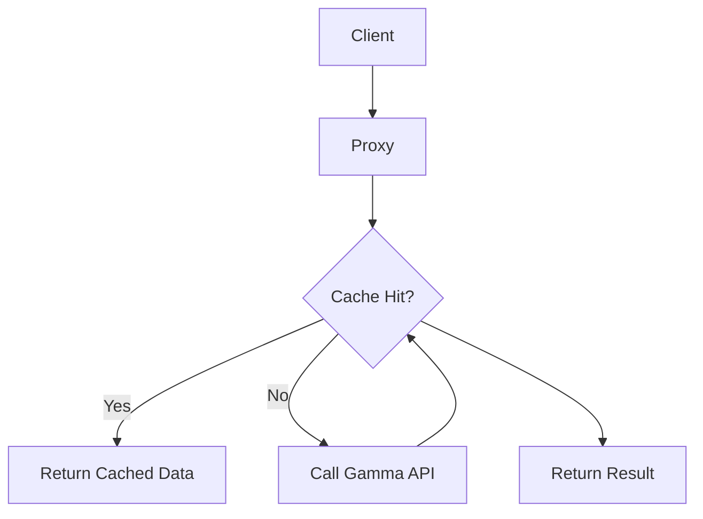
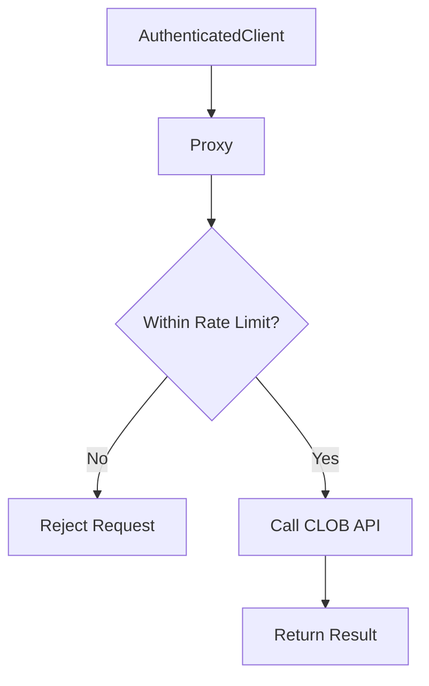
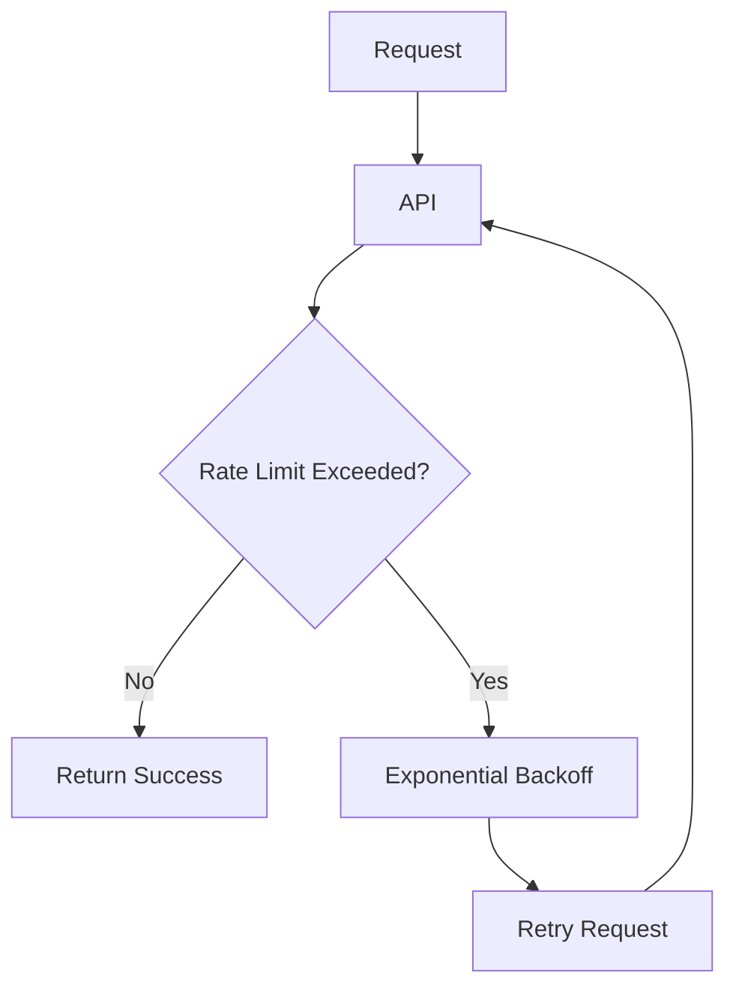

# API Rate Limits

<cite>
**Referenced Files in This Document**   
- [clob.ts](file://src/routes/clob.ts)
- [gamma.ts](file://src/routes/gamma.ts)
- [gamma-client.ts](file://src/sdk/gamma-client.ts)
- [client.ts](file://src/sdk/client.ts)
</cite>

## Table of Contents
1. [Introduction](#introduction)
2. [Rate Limiting Overview](#rate-limiting-overview)
3. [Gamma API Rate Limits](#gamma-api-rate-limits)
4. [CLOB API Rate Limits](#clob-api-rate-limits)
5. [Proxy Server Handling](#proxy-server-handling)
6. [Error Handling and Retry Mechanisms](#error-handling-and-retry-mechanisms)
7. [Impact on Application Performance](#impact-on-application-performance)
8. [Best Practices for Client Applications](#best-practices-for-client-applications)
9. [Conclusion](#conclusion)

## Introduction
This document provides a comprehensive overview of the API rate limits imposed by Polymarket's Gamma and CLOB APIs, and how the proxy server handles them. It explains the current rate limiting behavior, including request throttling, retry mechanisms, and error handling strategies. The document also details observed rate limits for different endpoint types and how they vary between authenticated and unauthenticated requests.

## Rate Limiting Overview
The Polymarket API ecosystem consists of two main components: the Gamma API for public market data and the CLOB API for trading operations. Both APIs implement rate limiting to ensure fair usage and system stability. The proxy server acts as an intermediary, managing requests to these APIs and implementing additional caching and rate limiting strategies.

**Section sources**
- [clob.ts](file://src/routes/clob.ts#L1-L1013)
- [gamma.ts](file://src/routes/gamma.ts#L1-L725)

## Gamma API Rate Limits
The Gamma API provides access to public market data without requiring authentication. Rate limits for the Gamma API are implemented at the proxy server level and are generally more permissive than the CLOB API.

Unauthenticated requests to the Gamma API are subject to rate limits based on IP address. The exact limits are not publicly disclosed but are designed to prevent abuse while allowing reasonable usage for development and testing.

Authenticated requests (using the x-http-proxy header) may have higher rate limits, as they can be associated with specific user accounts. The proxy server uses caching to reduce the number of requests to the underlying Gamma API, improving performance and reducing the likelihood of hitting rate limits.

**Diagram sources**
- [gamma.ts](file://src/routes/gamma.ts#L1-L725)
- [gamma-client.ts](file://src/sdk/gamma-client.ts#L1-L891)

**Section sources**
- [gamma.ts](file://src/routes/gamma.ts#L1-L725)
- [gamma-client.ts](file://src/sdk/gamma-client.ts#L1-L891)

## CLOB API Rate Limits
The CLOB API requires authentication with a private key and funder address, and has stricter rate limits due to the sensitive nature of trading operations. Rate limits for the CLOB API are enforced both by the proxy server and the underlying API.

Unauthenticated requests to CLOB endpoints are rejected immediately. Authenticated requests are subject to rate limits based on the user's account and the specific endpoint being accessed. Trading operations (e.g., placing orders) have lower rate limits than market data queries.

The proxy server implements additional rate limiting for CLOB API requests to prevent abuse and ensure fair usage. This includes limiting the number of requests per minute and implementing request queuing for high-frequency operations.

**Diagram sources**
- [clob.ts](file://src/routes/clob.ts#L1-L1013)
- [client.ts](file://src/sdk/client.ts#L1-L388)

**Section sources**
- [clob.ts](file://src/routes/clob.ts#L1-L1013)
- [client.ts](file://src/sdk/client.ts#L1-L388)

## Proxy Server Handling
The proxy server plays a crucial role in managing rate limits for both the Gamma and CLOB APIs. It implements several strategies to handle rate limiting:

1. **Caching**: The proxy server caches responses from both APIs to reduce the number of requests to the underlying services. This is particularly effective for frequently accessed market data.

2. **Request Throttling**: The proxy server limits the rate at which requests are forwarded to the underlying APIs, preventing clients from overwhelming the system.

3. **Retry Mechanisms**: When a rate limit is exceeded, the proxy server implements exponential backoff and retry logic to handle temporary failures.

4. **Load Balancing**: For high-traffic endpoints, the proxy server can distribute requests across multiple instances of the underlying API.

The proxy server uses LRU (Least Recently Used) caching with configurable maximum size and TTL (Time To Live) for both SDK instances and CLOB client connections. This helps to reduce the overhead of creating new connections and improves performance.

**Section sources**
- [clob.ts](file://src/routes/clob.ts#L1-L1013)
- [gamma.ts](file://src/routes/gamma.ts#L1-L725)

## Error Handling and Retry Mechanisms
Both the Gamma and CLOB APIs return specific error codes when rate limits are exceeded. The proxy server handles these errors and implements retry mechanisms to improve reliability.

For the Gamma API, rate limit errors are typically returned as 429 (Too Many Requests) status codes. The proxy server catches these errors and implements exponential backoff before retrying the request. The retry logic includes a maximum number of retries and a maximum wait time to prevent infinite loops.

For the CLOB API, rate limit errors may be returned as 429 status codes or as specific error messages in the response body. The proxy server parses these errors and applies appropriate retry logic. In some cases, the error may be propagated to the client for handling.

The SDKs provide methods for handling rate limit errors, including the ability to check the health status of the CLOB client connection and to clear cached clients when necessary.

**Diagram sources**
- [client.ts](file://src/sdk/client.ts#L1-L388)
- [gamma-client.ts](file://src/sdk/gamma-client.ts#L1-L891)

**Section sources**
- [client.ts](file://src/sdk/client.ts#L1-L388)
- [gamma-client.ts](file://src/sdk/gamma-client.ts#L1-L891)

## Impact on Application Performance
Rate limiting can have a significant impact on application performance, particularly for applications that rely heavily on real-time market data or high-frequency trading.

For market data applications, the impact is mitigated by the proxy server's caching strategy. However, applications that require the most up-to-date data may experience delays when the cache is invalidated or when rate limits are hit.

For trading applications, rate limiting can prevent high-frequency trading strategies and may introduce latency in order execution. Applications must be designed to handle rate limit errors gracefully and implement appropriate retry logic.

The use of caching and request batching can significantly improve performance and reduce the likelihood of hitting rate limits. Applications should also consider using webhooks or push notifications when available, rather than polling for updates.

**Section sources**
- [clob.ts](file://src/routes/clob.ts#L1-L1013)
- [gamma.ts](file://src/routes/gamma.ts#L1-L725)

## Best Practices for Client Applications
To effectively manage rate limits in client applications, consider the following best practices:

1. **Implement Caching**: Cache responses locally to reduce the number of API requests. Use appropriate cache invalidation strategies to ensure data freshness.

2. **Use Request Batching**: When possible, batch multiple requests into a single API call to reduce the overall request rate.

3. **Implement Exponential Backoff**: When rate limits are hit, use exponential backoff with jitter to avoid overwhelming the API with retry requests.

4. **Monitor Rate Limit Headers**: Pay attention to rate limit headers in API responses to anticipate when limits may be reached.

5. **Use Webhooks**: When available, use webhooks or push notifications instead of polling for updates.

6. **Handle Errors Gracefully**: Implement robust error handling to manage rate limit errors and other API failures.

7. **Optimize Request Frequency**: Analyze your application's request patterns and optimize them to stay within rate limits.

8. **Use Multiple Accounts**: For high-volume applications, consider using multiple accounts to distribute the request load.

These practices can help ensure reliable and efficient use of the Polymarket APIs while staying within rate limits.

**Section sources**
- [clob.ts](file://src/routes/clob.ts#L1-L1013)
- [gamma.ts](file://src/routes/gamma.ts#L1-L725)
- [client.ts](file://src/sdk/client.ts#L1-L388)
- [gamma-client.ts](file://src/sdk/gamma-client.ts#L1-L891)

## Conclusion
Understanding and effectively managing API rate limits is crucial for building reliable applications on the Polymarket platform. The proxy server provides several mechanisms to help mitigate the impact of rate limits, including caching, request throttling, and retry mechanisms. By following best practices such as implementing local caching, using request batching, and handling errors gracefully, developers can build robust applications that make efficient use of the Polymarket APIs.

[No sources needed since this section summarizes without analyzing specific files]