# Data Models and Schemas

<cite>
**Referenced Files in This Document**   
- [elysia-schemas.ts](file://src/types/elysia-schemas.ts)
- [gamma.ts](file://src/routes/gamma.ts)
- [clob.ts](file://src/routes/clob.ts)
- [gamma-client.ts](file://src/sdk/gamma-client.ts)
</cite>

## Table of Contents
1. [Introduction](#introduction)
2. [Core Data Models](#core-data-models)
3. [Schema Definitions and Relationships](#schema-definitions-and-relationships)
4. [API Usage and Endpoints](#api-usage-and-endpoints)
5. [Validation and Type Handling](#validation-and-type-handling)
6. [Request and Response Examples](#request-and-response-examples)
7. [Schema Customization and Extension](#schema-customization-and-extension)

## Introduction
This document provides comprehensive documentation for the core data models used in the Polymarket proxy server. It details the structure, relationships, and field definitions for Market, Event, Series, Tag, and Price History models as defined in the elysia-schemas.ts file. The documentation explains how these models are utilized across both Gamma and CLOB APIs, including validation rules, data types, and transformation logic. Special attention is given to the differences between similar schemas such as MarketSchema and EventMarketSchema, their respective use cases, and how nullability, optionality, and type unions are handled in the schema definitions. The document also provides guidance on extending or customizing these schemas for downstream applications.

## Core Data Models

The Polymarket proxy server utilizes a comprehensive set of data models to represent prediction markets and related entities. These models are defined using Elysia's type validation system and are used for request/response validation across the API endpoints. The core entities include Market, Event, Series, Tag, and Price History, each with specific fields and relationships that capture the essential information for prediction market operations.

The data models are designed to support both the Gamma API (for public market data) and the CLOB API (for order book and trading operations). The models include various fields for market metadata, pricing information, volume metrics, and temporal data. Special attention has been paid to handling data transformations, particularly for fields that are received as JSON strings from the underlying API but need to be represented as arrays in the TypeScript types.

**Section sources**
- [elysia-schemas.ts](file://src/types/elysia-schemas.ts#L100-L1022)

## Schema Definitions and Relationships

### Market Schema
The MarketSchema defines the structure for Polymarket prediction market data, including pricing, volume, liquidity, and associated metadata. It serves as the primary representation for individual markets in the system.

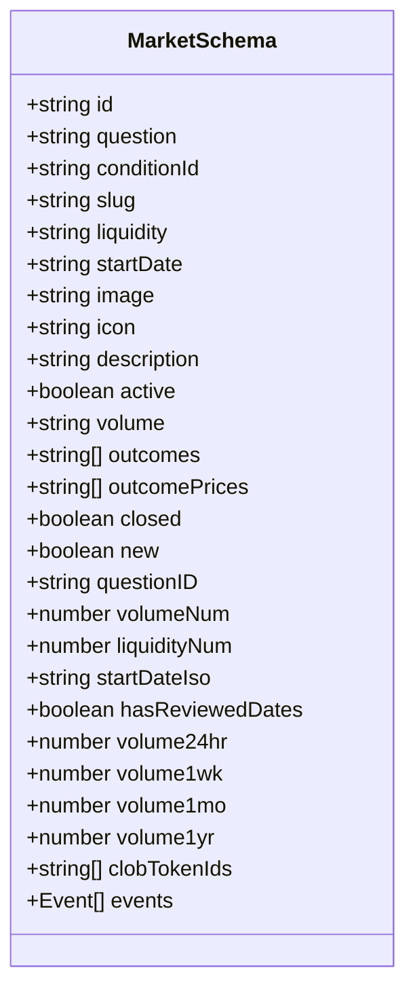

**Diagram sources**
- [elysia-schemas.ts](file://src/types/elysia-schemas.ts#L100-L139)

### Event Market Schema
The EventMarketSchema represents markets that are part of an event, containing similar market data but in the context of event groupings. This schema includes additional fields specific to event-based markets.

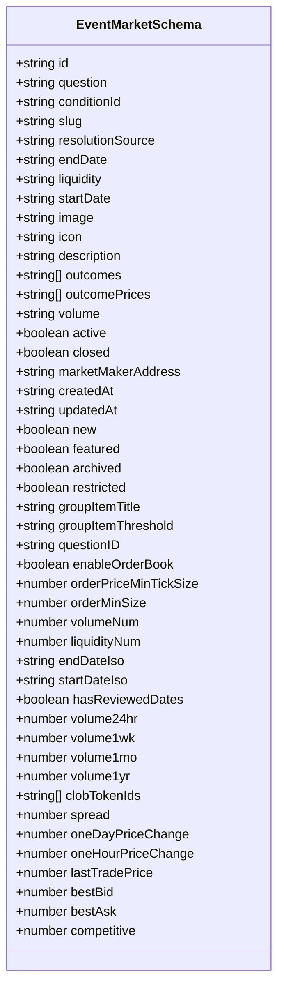

**Diagram sources**
- [elysia-schemas.ts](file://src/types/elysia-schemas.ts#L140-L188)

### Event Schema
The EventSchema represents collections of related markets that share a common theme, topic, or timeframe. Events serve as containers for multiple related markets and include metadata about the event itself.

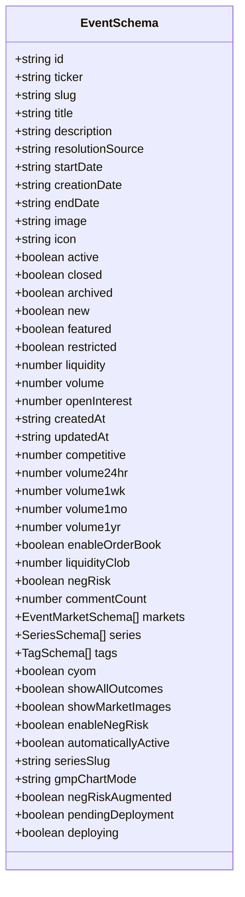

**Diagram sources**
- [elysia-schemas.ts](file://src/types/elysia-schemas.ts#L189-L241)

### Series Schema
The SeriesSchema defines the structure for market series data, which groups related markets together under a common theme or topic. Series provide a way to organize markets beyond individual events.

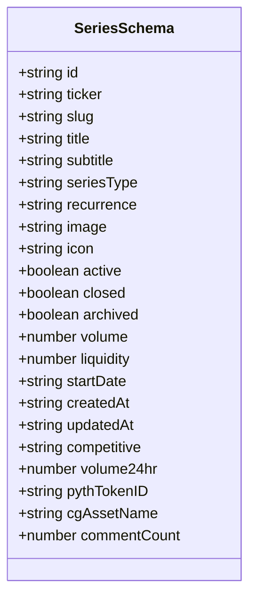

**Diagram sources**
- [elysia-schemas.ts](file://src/types/elysia-schemas.ts#L242-L279)

### Tag Schema
The TagSchema provides categorization and filtering capabilities for markets and events in the Polymarket ecosystem. Tags are used to classify content and enable discovery.

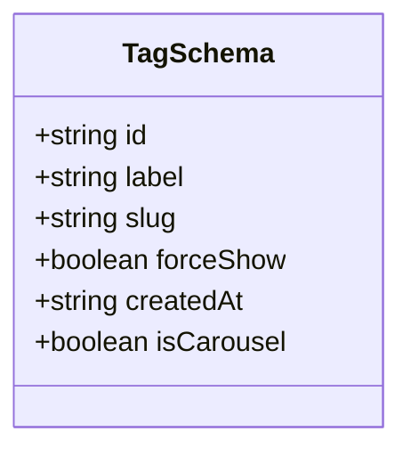

**Diagram sources**
- [elysia-schemas.ts](file://src/types/elysia-schemas.ts#L280-L294)

### Price History Schema
The PriceHistoryResponseSchema contains an array of price history points and optional time range metadata for the requested historical data. This schema is used for price history API responses.

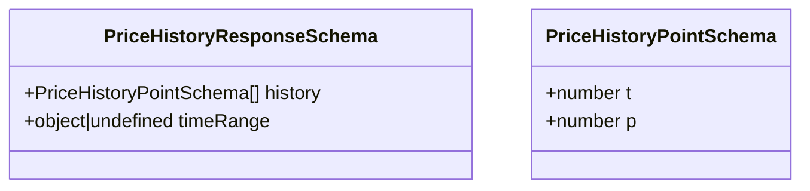

**Diagram sources**
- [elysia-schemas.ts](file://src/types/elysia-schemas.ts#L304-L318)

### Schema Relationships
The various schemas are interconnected through a hierarchical relationship structure, where Events contain Markets, and both Events and Markets can be associated with Tags and Series.

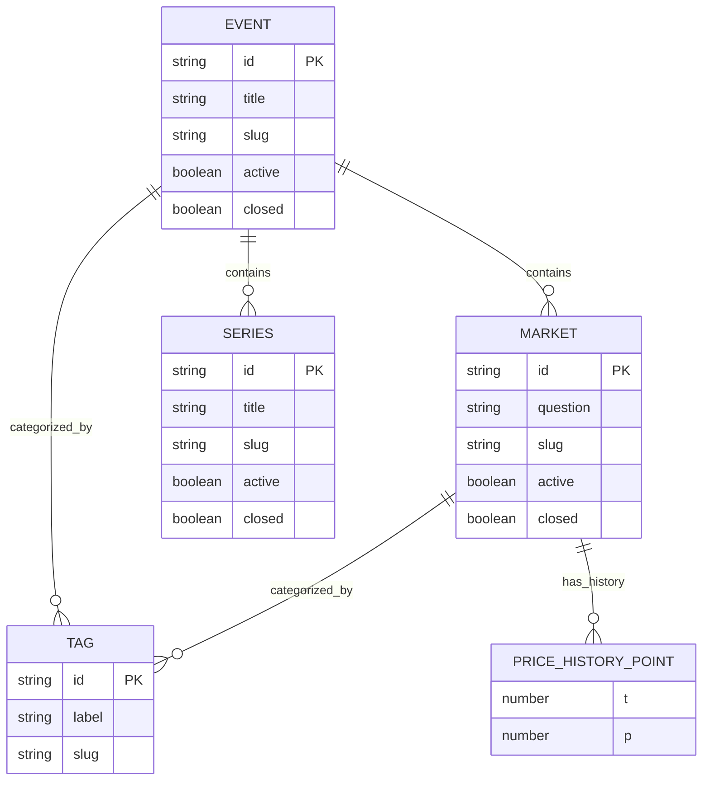

**Diagram sources**
- [elysia-schemas.ts](file://src/types/elysia-schemas.ts#L100-L1022)

## API Usage and Endpoints

### Gamma API Endpoints
The Gamma API provides access to public market data through a comprehensive set of endpoints. These endpoints use the data models described above to structure requests and responses.

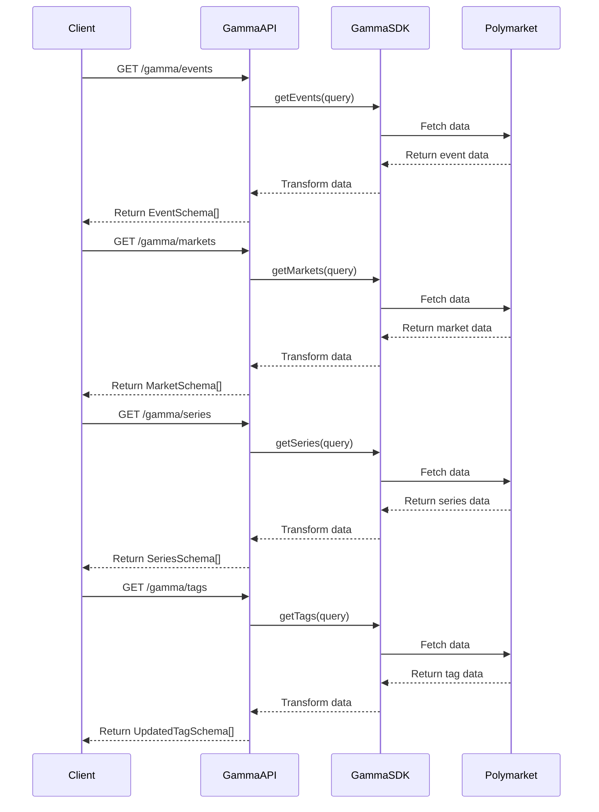

**Diagram sources**
- [gamma.ts](file://src/routes/gamma.ts#L100-L724)
- [gamma-client.ts](file://src/sdk/gamma-client.ts#L100-L891)

### CLOB API Endpoints
The CLOB API provides access to order book and trading data, with a focus on price history and market data for trading operations.

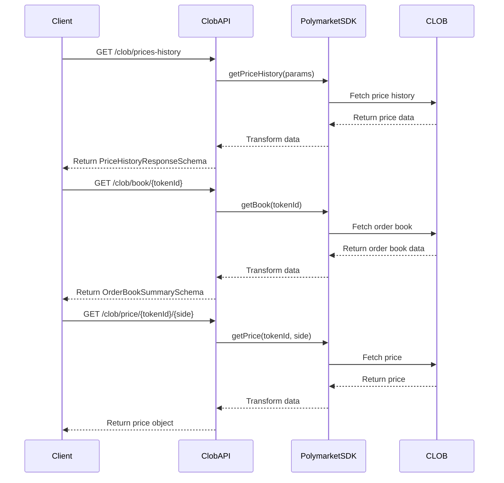

**Diagram sources**
- [clob.ts](file://src/routes/clob.ts#L100-L1013)

## Validation and Type Handling

### Nullability and Optionality
The schema definitions carefully handle nullability and optionality through the use of Elysia's Optional type modifier. Fields that may be absent in certain contexts are marked as optional, while required fields are defined without the Optional wrapper.

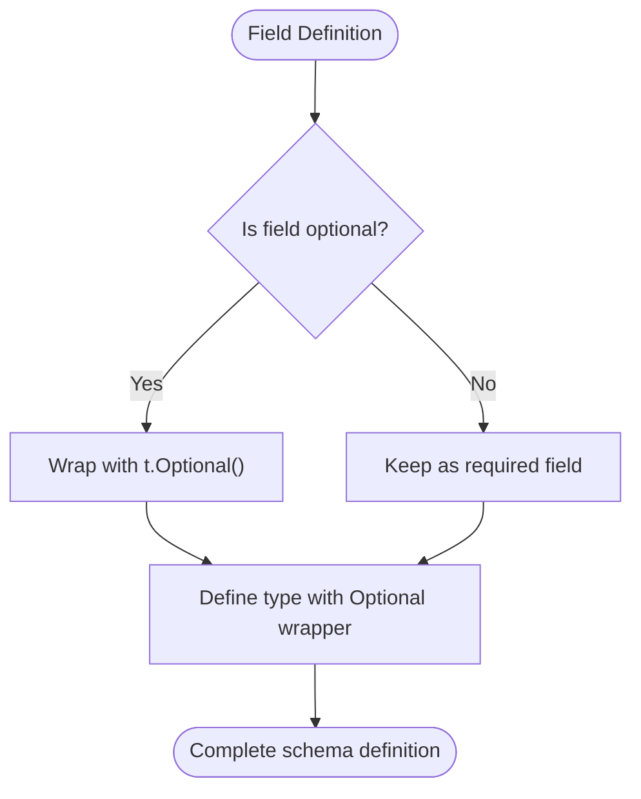

**Diagram sources**
- [elysia-schemas.ts](file://src/types/elysia-schemas.ts#L10-L50)

### Type Unions
Type unions are used in several schemas to represent fields that can have multiple possible values. The most notable example is the PriceHistoryIntervalEnum, which defines the available time intervals for fetching historical price data.

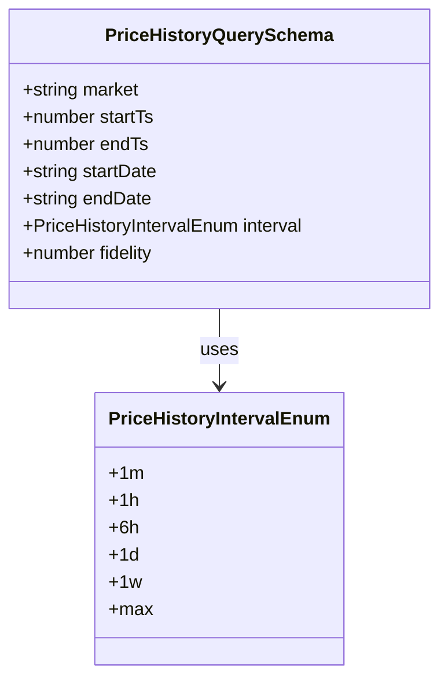

**Diagram sources**
- [elysia-schemas.ts](file://src/types/elysia-schemas.ts#L319-L333)

### Data Transformation
Data transformation is a critical aspect of the schema implementation, particularly for fields that are received as JSON strings from the underlying API but need to be represented as arrays in the TypeScript types. The GammaSDK includes transformation methods to handle this conversion.

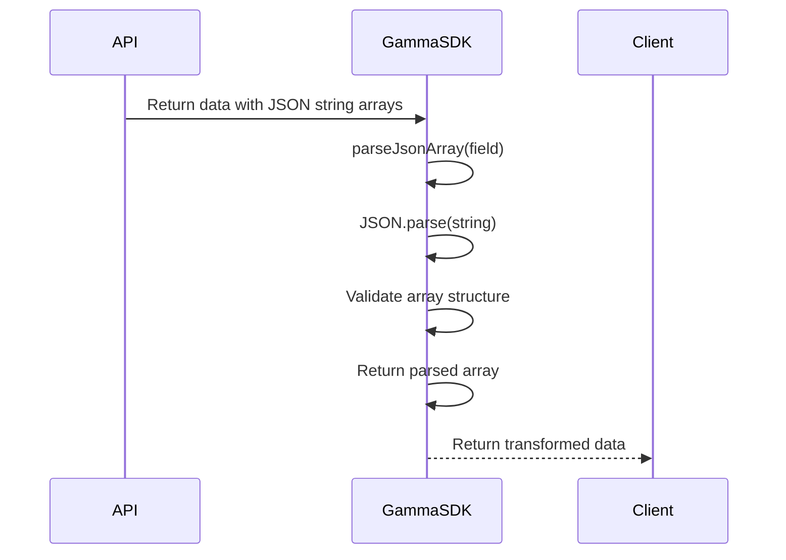

**Diagram sources**
- [gamma-client.ts](file://src/sdk/gamma-client.ts#L100-L891)

## Request and Response Examples

### Market Query Example
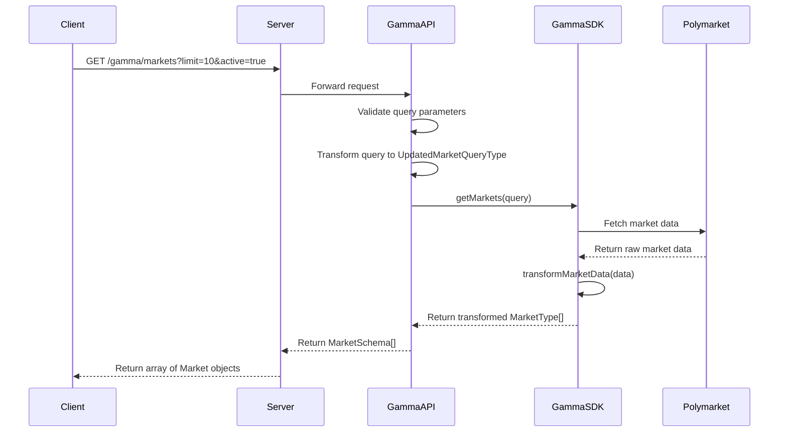

**Diagram sources**
- [gamma.ts](file://src/routes/gamma.ts#L500-L520)
- [gamma-client.ts](file://src/sdk/gamma-client.ts#L600-L620)

### Event with Markets Example
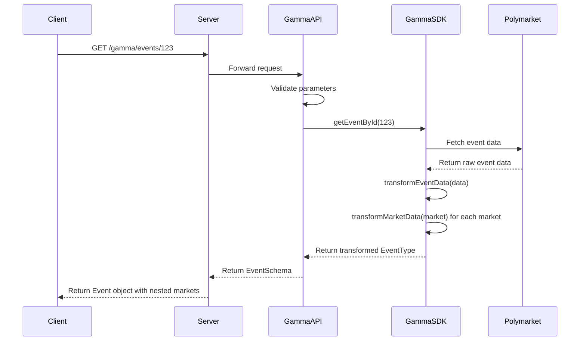

**Diagram sources**
- [gamma.ts](file://src/routes/gamma.ts#L300-L320)
- [gamma-client.ts](file://src/sdk/gamma-client.ts#L400-L420)

### Price History Query Example
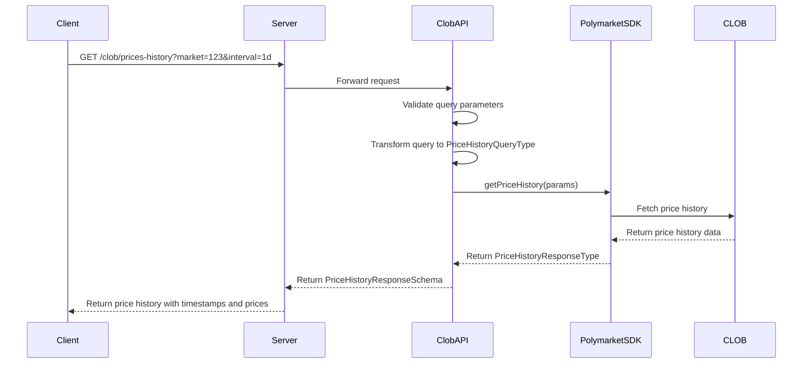

**Diagram sources**
- [clob.ts](file://src/routes/clob.ts#L100-L150)

## Schema Customization and Extension

### Extending Existing Schemas
The schema system is designed to be extensible, allowing for the addition of new fields or the creation of specialized variants of existing schemas.

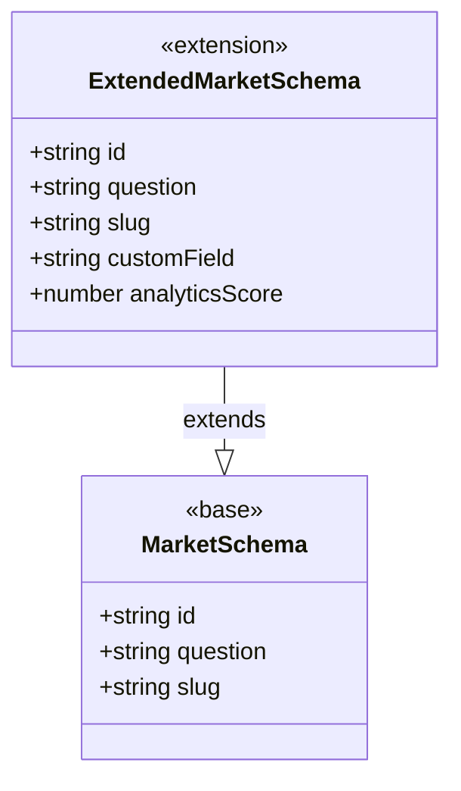

**Diagram sources**
- [elysia-schemas.ts](file://src/types/elysia-schemas.ts#L100-L139)

### Creating Custom Query Schemas
Custom query schemas can be created by combining existing schema components or adding new fields specific to particular use cases.

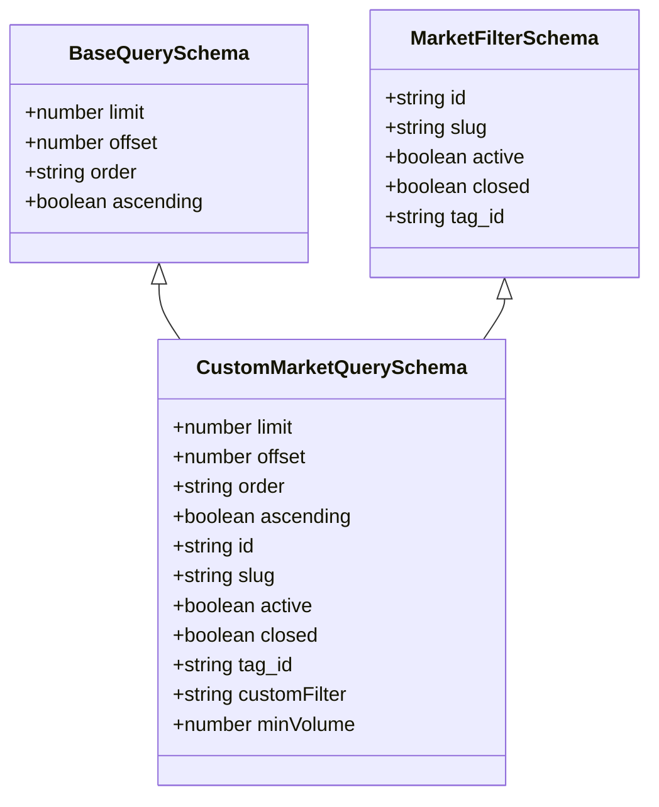

**Diagram sources**
- [elysia-schemas.ts](file://src/types/elysia-schemas.ts#L334-L400)

### Type Safety and Inference
The system provides strong type safety through TypeScript type inference, ensuring that schema definitions and their corresponding TypeScript types remain synchronized.

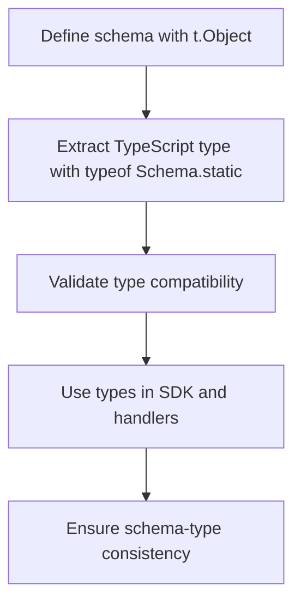

**Diagram sources**
- [elysia-schemas.ts](file://src/types/elysia-schemas.ts#L800-L1022)