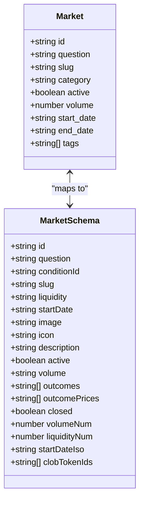
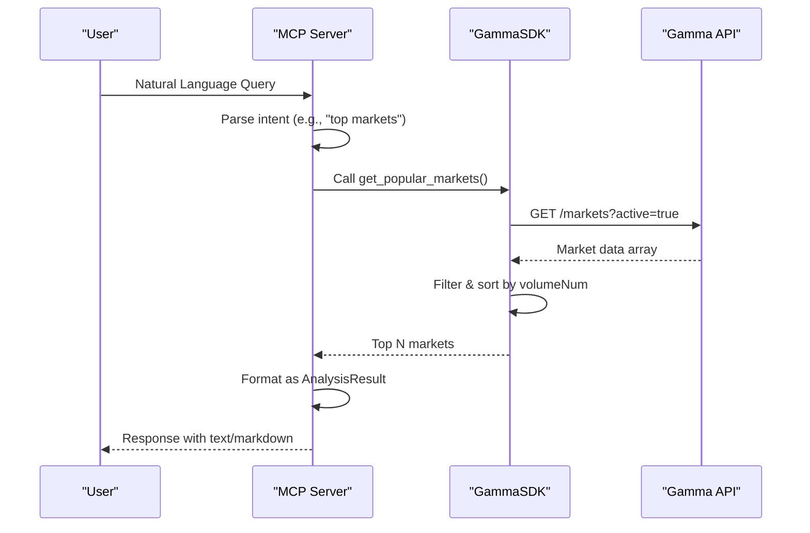
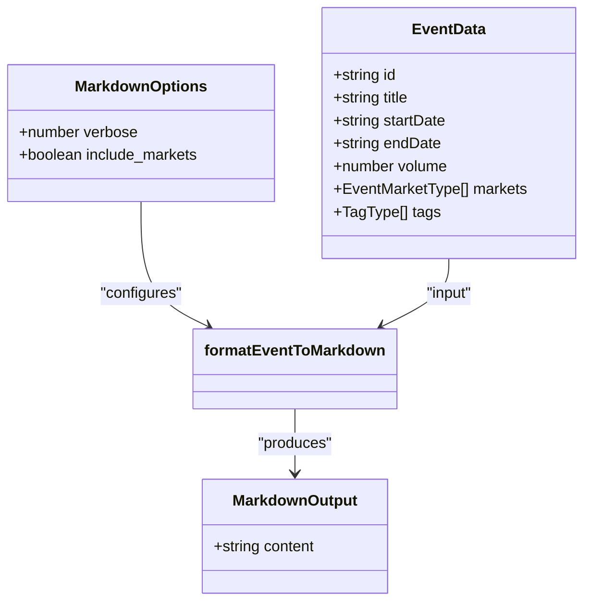

# MCP Data Model

<cite>
**Referenced Files in This Document**   
- [data-model.md](file://specs/001-write-a-mcp/data-model.md)
- [elysia-schemas.ts](file://src/types/elysia-schemas.ts)
- [polymarket.ts](file://src/mcp/polymarket.ts)
- [markdown-formatters.ts](file://src/utils/markdown-formatters.ts)
</cite>

## Table of Contents
1. [Introduction](#introduction)
2. [Core Entities](#core-entities)
3. [Entity Implementation Mapping](#entity-implementation-mapping)
4. [AnalysisResult Generation](#analysisresult-generation)
5. [User Query Processing](#user-query-processing)
6. [Response Formatting](#response-formatting)
7. [Markdown Transformation](#markdown-transformation)
8. [AI/LLM Integration](#ai-llm-integration)

## Introduction
The Model Context Protocol (MCP) data model enables natural language interactions with Polymarket's prediction market data through standardized entities and tooling. This documentation details the core data model components—UserQuery, Market, AnalysisResult, and Response—and their implementation in the Polymarket MCP server. The system bridges user intent with structured API data, transforming natural language queries into actionable insights using AI-driven tools. Each entity plays a specific role in processing, analyzing, and presenting market data in both human-readable and machine-optimized formats.

## Core Entities

### UserQuery
Represents a natural language input from a user seeking market information.

- `query`: string - The original text query submitted by the user.

This entity serves as the entry point for all interactions with the MCP server, initiating the chain of processing that leads to data retrieval and response generation.

### Market
Represents a prediction market on Polymarket, containing metadata and trading information.

- `id`: string - Unique identifier for the market.
- `question`: string - The market's central question.
- `slug`: string - URL-friendly identifier.
- `category`: string - Market classification.
- `active`: boolean - Whether the market is currently tradable.
- `volume`: number - Total trading volume.
- `start_date`: string - When the market opened.
- `end_date`: string - When the market closes.
- `tags`: string[] - Categorization labels.

The Market entity provides structured access to market details, enabling filtering, sorting, and analysis based on various attributes.

### AnalysisResult
Encapsulates the output of analytical operations performed on market data.

- `type`: string - The category of analysis (e.g., "top_markets", "market_volume").
- `data`: any - The actual result payload, which varies by analysis type.

This entity allows the system to return diverse analytical outputs under a unified interface, supporting extensible tooling.

### Response
The final output delivered to the user, combining natural language with optional structured data.

- `text`: string - Human-readable explanation or summary.
- `markdown`: string (optional) - Formatted representation suitable for rich display or further processing.

The Response object ensures compatibility with both conversational AI interfaces and applications requiring formatted content.

**Section sources**
- [data-model.md](file://specs/001-write-a-mcp/data-model.md#L6-L10)
- [data-model.md](file://specs/001-write-a-mcp/data-model.md#L12-L22)
- [data-model.md](file://specs/001-write-a-mcp/data-model.md#L24-L29)
- [data-model.md](file://specs/001-write-a-mcp/data-model.md#L31-L35)

## Entity Implementation Mapping

The conceptual entities defined in the MCP specification are implemented using TypeScript schemas and mapped to actual API response structures.

### Market to MarketSchema Mapping
The `Market` entity in the MCP context directly corresponds to the `MarketSchema` defined in `elysia-schemas.ts`. While the conceptual model includes simplified fields like `volume` as a number, the implementation uses both string (`volume`) and numeric (`volumeNum`) representations for flexibility across API consumers.

Key field mappings:
- `id` → `id`
- `question` → `question`
- `slug` → `slug`
- `active` → `active`
- `volume` → `volumeNum` (numeric), `volume` (string)
- `start_date` → `startDateIso`
- `end_date` → `endDateIso`
- `tags` → derived from associated `events` or `tags` arrays

This schema enables robust validation and type safety while maintaining alignment with the conceptual data model.



**Diagram sources**
- [data-model.md](file://specs/001-write-a-mcp/data-model.md#L12-L22)
- [elysia-schemas.ts](file://src/types/elysia-schemas.ts#L44-L84)

**Section sources**
- [data-model.md](file://specs/001-write-a-mcp/data-model.md#L12-L22)
- [elysia-schemas.ts](file://src/types/elysia-schemas.ts#L44-L84)

## AnalysisResult Generation

AnalysisResults are generated through specialized tools that process raw API data into meaningful insights. These tools operate on market and event datasets, applying filters, aggregations, and trend analysis.

### Supported Analysis Types

#### top_markets
Identifies markets with the highest trading volume within a specified timeframe. Implemented via the `get_popular_markets` tool, which retrieves active markets and sorts them by `volumeNum`.

#### market_volume
Provides volume-based analytics across different time horizons (24h, 7d, 30d). The `get_market_trends` tool calculates this by comparing `volume24hr`, `volume1wk`, and `volume1mo` fields against configurable thresholds.

### Implementation Flow
1. User invokes an analytical tool via natural language
2. MCP server routes to corresponding tool handler
3. GammaSDK fetches relevant data using appropriate endpoints
4. Results are processed and enriched with computed metrics
5. Final analysis is formatted as an AnalysisResult

These analyses support decision-making by highlighting trending topics and high-liquidity markets.



**Diagram sources**
- [polymarket.ts](file://src/mcp/polymarket.ts#L460-L550)
- [elysia-schemas.ts](file://src/types/elysia-schemas.ts#L44-L84)

**Section sources**
- [data-model.md](file://specs/001-write-a-mcp/data-model.md#L24-L29)
- [polymarket.ts](file://src/mcp/polymarket.ts#L460-L550)

## User Query Processing

User queries are processed through a tool-based routing system that translates natural language into structured API calls.

### Processing Pipeline
1. **Query Reception**: The `UserQuery` enters the system via the MCP interface.
2. **Intent Recognition**: The server identifies which tool best matches the query semantics.
3. **Parameter Extraction**: Relevant parameters (e.g., timeframes, filters) are parsed from the query.
4. **Tool Invocation**: The corresponding tool handler is executed with extracted parameters.
5. **Data Retrieval**: The GammaSDK makes HTTP requests to Polymarket's APIs.
6. **Result Formatting**: Raw data is transformed into human-readable text.

### Example Transformation
A query like *"Show me active markets with high volume"* would trigger the `get_markets` tool with parameters `{ active: true }`, retrieving markets where `active === true` and formatting them using `formatMarketDisplay()`.

This pipeline enables seamless interaction between unstructured user input and structured data systems.

```mermaid
flowchart TD
A[User Query] --> B{Intent Recognition}
B --> |"get_markets"| C[Call get_markets Tool]
B --> |"get_events"| D[Call get_events Tool]
B --> |"search"| E[Call search_polymarket Tool]
C --> F[GammaSDK.getMarkets()]
D --> G[GammaSDK.getEvents()]
E --> H[GammaSDK.search()]
F --> I[Format with formatMarketDisplay]
G --> J[Format with formatEventDisplay]
H --> K[Format with formatSearchDisplay]
I --> L[Response.text]
J --> L
K --> L
```

**Diagram sources**
- [polymarket.ts](file://src/mcp/polymarket.ts#L280-L360)
- [polymarket.ts](file://src/mcp/polymarket.ts#L362-L400)

**Section sources**
- [polymarket.ts](file://src/mcp/polymarket.ts#L280-L550)

## Response Formatting

The Response object is constructed with both `text` and optional `markdown` fields to support diverse client requirements.

### Text Field Generation
The `text` field is populated using formatting helpers like `formatMarketDisplay()` and `formatEventDisplay()`, which convert arrays of market or event objects into readable lists with key metrics.

These functions include:
- Market/event titles and IDs
- Status indicators (active, closed)
- Volume information
- Outcome prices
- Temporal data

### Markdown Field Inclusion
When enhanced presentation is needed, the `markdown` field provides rich formatting. This is particularly useful for AI agents that benefit from structured data layouts.

The presence of both fields ensures backward compatibility while enabling advanced use cases.

**Section sources**
- [polymarket.ts](file://src/mcp/polymarket.ts#L100-L150)
- [polymarket.ts](file://src/mcp/polymarket.ts#L280-L360)

## Markdown Transformation

Markdown formatting is handled by dedicated utilities that transform event and market data into AI-optimized layouts.

### MarkdownOptionsSchema
Controls the verbosity and content inclusion in markdown output:

- `verbose`: 0 (basic), 1 (medium), 2 (full details)
- `include_markets`: Whether to include individual market details

These options allow clients to request tailored representations based on their processing needs.

### formatEventToMarkdown Function
Converts `Event` data into structured markdown with:
- Event title and metadata
- Timeline and status
- Volume metrics
- Market outcomes and prices
- Arbitrage analysis summary (at verbose level 2)

The output is optimized for LLM consumption, emphasizing pricing data, spreads, and temporal constraints relevant to trading strategies.



**Diagram sources**
- [elysia-schemas.ts](file://src/types/elysia-schemas.ts#L450-L460)
- [markdown-formatters.ts](file://src/utils/markdown-formatters.ts#L100-L350)

**Section sources**
- [elysia-schemas.ts](file://src/types/elysia-schemas.ts#L450-L460)
- [markdown-formatters.ts](file://src/utils/markdown-formatters.ts#L100-L350)

## AI/LLM Integration

The MCP data model is designed specifically for integration with AI/LLM systems, providing structured access to market data through natural language interfaces.

### Purpose of Fields in AI Context
- `UserQuery`: Enables conversational interaction patterns
- `Market`: Provides structured data points for reasoning
- `AnalysisResult`: Supports analytical workflows and comparisons
- `Response`: Delivers consumable outputs with optional structured formatting

### Integration Benefits
- **Natural Language Access**: Users interact using everyday language rather than API syntax
- **Context Preservation**: Tools maintain state and relationships between entities
- **Rich Output Formats**: Markdown enables detailed, structured responses for agent processing
- **Extensible Tooling**: New analytical capabilities can be added without changing core interfaces

This integration allows AI agents to perform market research, identify trends, and support trading decisions using a standardized protocol.

**Section sources**
- [data-model.md](file://specs/001-write-a-mcp/data-model.md)
- [polymarket.ts](file://src/mcp/polymarket.ts)