# Market & Event Models

<cite>
**Referenced Files in This Document**  
- [elysia-schemas.ts](file://src/types/elysia-schemas.ts)
- [gamma.ts](file://src/routes/gamma.ts)
- [gamma-client.ts](file://src/sdk/gamma-client.ts)
</cite>

## Table of Contents
1. [Introduction](#introduction)
2. [Core Data Models](#core-data-models)
3. [Market and Event Relationships](#market-and-event-relationships)
4. [API Endpoints and Payloads](#api-endpoints-and-payloads)
5. [Query Parameters and Filtering](#query-parameters-and-filtering)
6. [Data Transformation and Validation](#data-transformation-and-validation)
7. [State Management and Pricing](#state-management-and-pricing)

## Introduction

This document provides comprehensive documentation for the Market and Event entities used across the Polymarket proxy server. The data models are defined in the Elysia type system within `elysia-schemas.ts` and are used throughout the Gamma API to represent prediction markets and their associated events. These models enable structured data exchange between the proxy server and the Polymarket Gamma API, ensuring type safety and consistent data validation.

The Market and Event models represent the core data structures for Polymarket's prediction market platform. Markets represent individual prediction questions with binary or multiple outcomes, while Events are collections of related markets that share a common theme or topic. The models are designed to support rich filtering, pagination, and sorting capabilities through comprehensive query schemas.

**Section sources**
- [elysia-schemas.ts](file://src/types/elysia-schemas.ts#L1-L50)

## Core Data Models

The Polymarket proxy server defines two primary data models for market data: `MarketSchema` and `EventSchema`. These schemas are built using Elysia's type validation system and provide comprehensive type safety for API requests and responses.

### MarketSchema

The `MarketSchema` represents an individual prediction market on Polymarket. It contains essential information about the market question, pricing data, and metadata.

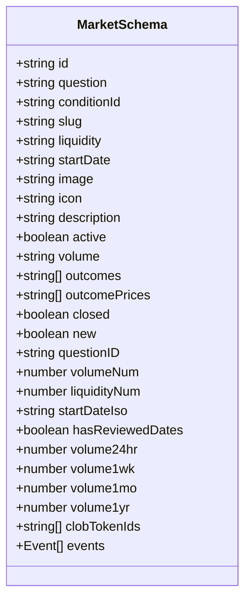

**Diagram sources**
- [elysia-schemas.ts](file://src/types/elysia-schemas.ts#L44-L84)

### EventSchema

The `EventSchema` represents a collection of related markets that share a common theme or topic. Events provide a higher-level organizational structure for markets.

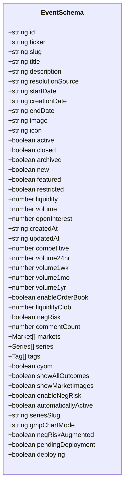

**Diagram sources**
- [elysia-schemas.ts](file://src/types/elysia-schemas.ts#L196-L241)

**Section sources**
- [elysia-schemas.ts](file://src/types/elysia-schemas.ts#L44-L241)

## Market and Event Relationships

The relationship between markets and events is a fundamental aspect of the Polymarket data model. Events contain collections of markets, and markets can be associated with events, creating a hierarchical structure for organizing prediction markets.

### Market-to-Event Relationship

The `MarketSchema` includes an optional `events` field that contains an array of event objects. This allows a market to be associated with one or more events.

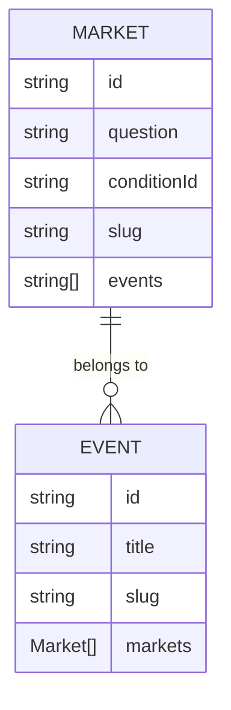

**Diagram sources**
- [elysia-schemas.ts](file://src/types/elysia-schemas.ts#L71-L84)

### Event-to-Market Relationship

The `EventSchema` contains a `markets` field that is an array of `EventMarketSchema` objects. This creates a direct relationship where events contain their associated markets.

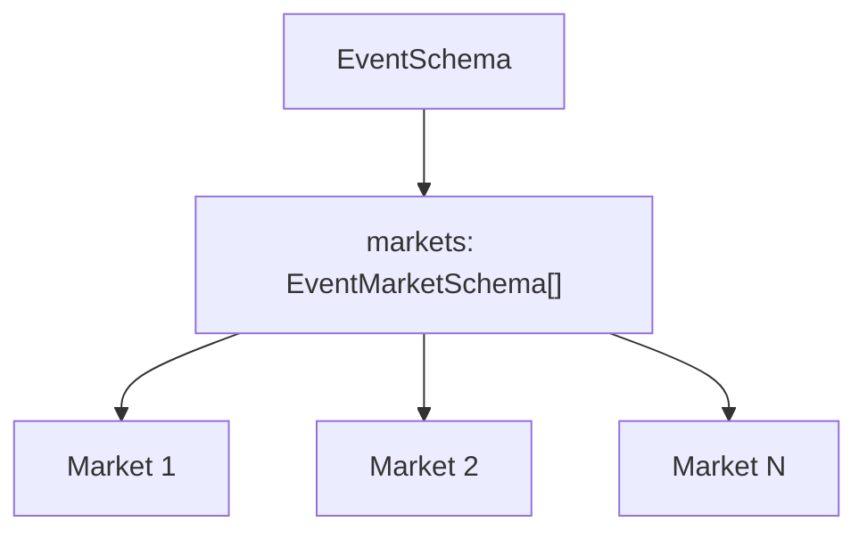

**Diagram sources**
- [elysia-schemas.ts](file://src/types/elysia-schemas.ts#L228)

### EventMarketSchema

The `EventMarketSchema` is a specialized version of market data used specifically within events. It contains additional fields relevant to markets in the context of events.

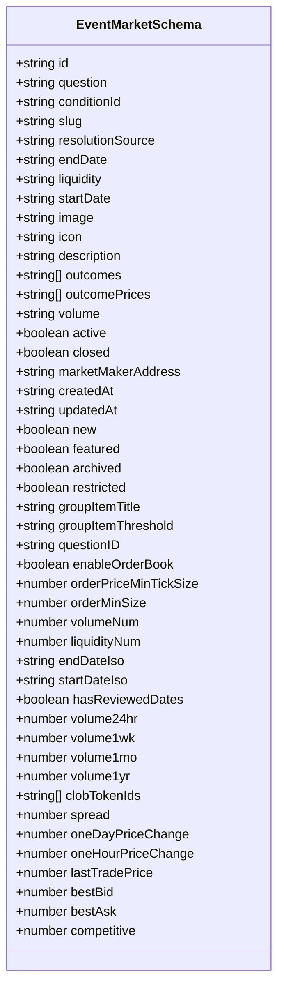

**Diagram sources**
- [elysia-schemas.ts](file://src/types/elysia-schemas.ts#L92-L139)

**Section sources**
- [elysia-schemas.ts](file://src/types/elysia-schemas.ts#L92-L139)

## API Endpoints and Payloads

The Gamma API provides endpoints for retrieving market and event data, with well-defined request and response payloads.

### /gamma/markets Endpoint

The `/gamma/markets` endpoint returns a collection of markets based on query parameters.

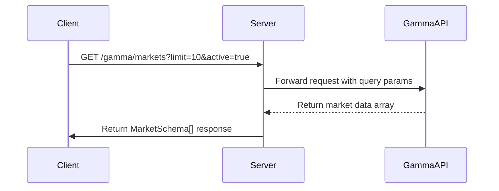

**Diagram sources**
- [gamma.ts](file://src/routes/gamma.ts#L285-L295)

### /gamma/events Endpoint

The `/gamma/events` endpoint returns a collection of events with their associated markets.

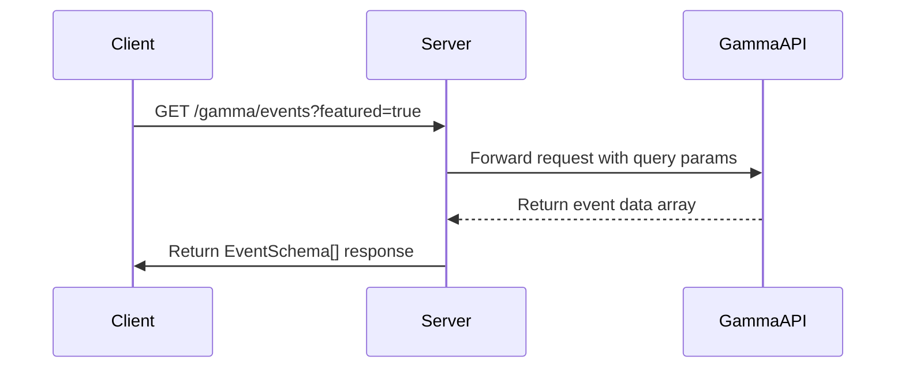

**Diagram sources**
- [gamma.ts](file://src/routes/gamma.ts#L189-L199)

### Request and Response Examples

#### Market Request Payload
```
GET /gamma/markets?limit=5&active=true&order=volumeNum&ascending=false
```

#### Market Response Payload
```json
[
  {
    "id": "123",
    "question": "Will Bitcoin reach $100K by 2025?",
    "conditionId": "cond-123",
    "slug": "bitcoin-100k-2025",
    "liquidity": "50000",
    "volume": "120000",
    "outcomes": ["Yes", "No"],
    "outcomePrices": ["0.65", "0.35"],
    "active": true,
    "closed": false,
    "volumeNum": 120000,
    "liquidityNum": 50000,
    "events": [
      {
        "id": "456",
        "ticker": "CRYPTO",
        "slug": "crypto-predictions",
        "title": "Cryptocurrency Predictions",
        "active": true,
        "closed": false,
        "archived": false
      }
    ]
  }
]
```

#### Event Request Payload
```
GET /gamma/events?limit=3&featured=true
```

#### Event Response Payload
```json
[
  {
    "id": "456",
    "ticker": "ELECTION2024",
    "slug": "us-election-2024",
    "title": "2024 US Presidential Election",
    "description": "Prediction markets for the 2024 US presidential election",
    "startDate": "2024-01-01",
    "endDate": "2024-11-05",
    "image": "https://example.com/election.jpg",
    "icon": "🗳️",
    "active": true,
    "closed": false,
    "archived": false,
    "volume": 2500000,
    "markets": [
      {
        "id": "789",
        "question": "Who will win the 2024 US presidential election?",
        "conditionId": "cond-789",
        "slug": "who-wins-2024-election",
        "outcomes": ["Candidate A", "Candidate B"],
        "outcomePrices": ["0.52", "0.48"],
        "active": true,
        "closed": false,
        "volumeNum": 850000,
        "liquidityNum": 200000
      }
    ],
    "tags": [
      {
        "id": "101",
        "label": "Politics",
        "slug": "politics"
      }
    ]
  }
]
```

**Section sources**
- [gamma.ts](file://src/routes/gamma.ts#L189-L295)

## Query Parameters and Filtering

The Gamma API supports comprehensive filtering, sorting, and pagination through query parameters defined in `MarketQuerySchema` and `EventQuerySchema`.

### MarketQuerySchema

The `MarketQuerySchema` defines all possible query parameters for filtering and sorting market data.

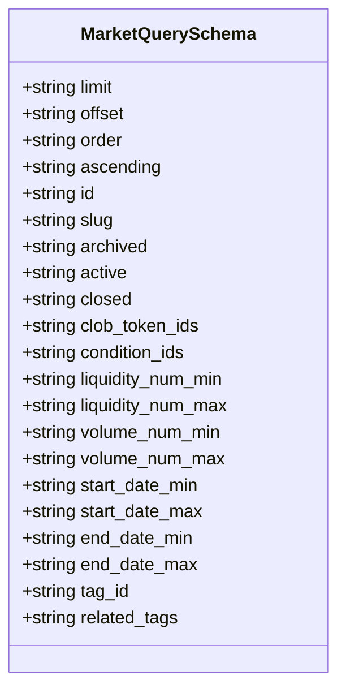

**Diagram sources**
- [elysia-schemas.ts](file://src/types/elysia-schemas.ts#L277-L310)

### EventQuerySchema

The `EventQuerySchema` defines all possible query parameters for filtering and sorting event data.

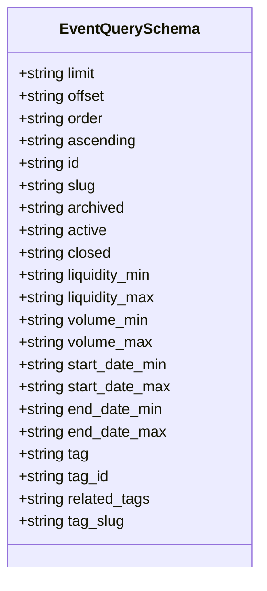

**Diagram sources**
- [elysia-schemas.ts](file://src/types/elysia-schemas.ts#L318-L351)

### Pagination and Sorting

Both market and event endpoints support pagination through `limit` and `offset` parameters, and sorting through `order` and `ascending` parameters.

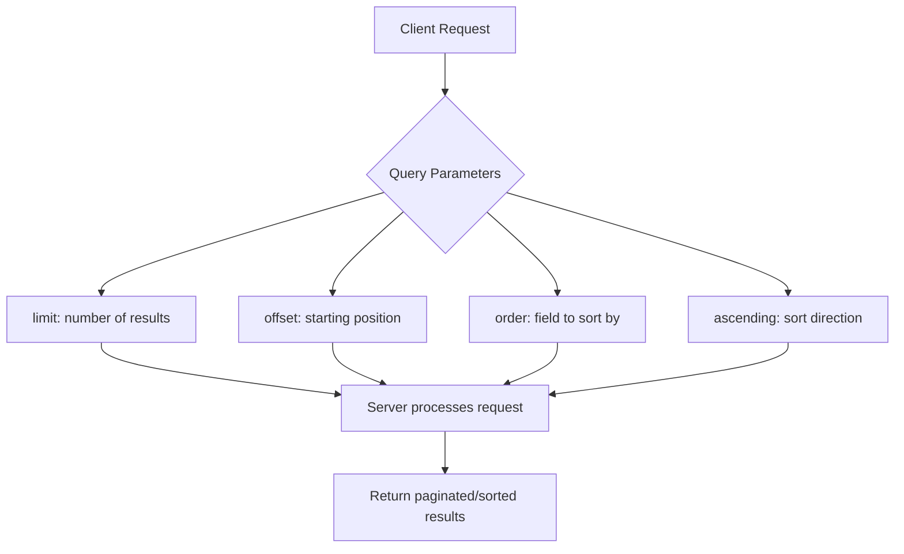

**Section sources**
- [elysia-schemas.ts](file://src/types/elysia-schemas.ts#L277-L351)

## Data Transformation and Validation

The proxy server performs data transformation and validation to ensure consistency between the Gamma API responses and the expected schemas.

### Data Transformation

The `gamma-client.ts` file contains transformation functions that process raw API data into the expected schema format.

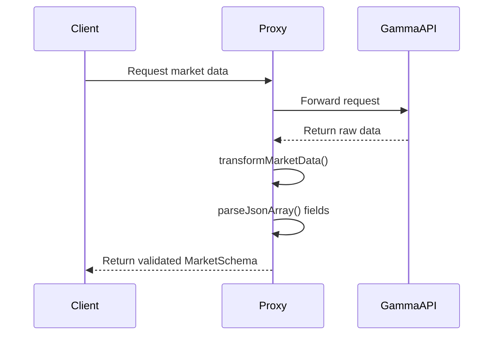

**Diagram sources**
- [gamma-client.ts](file://src/sdk/gamma-client.ts#L170-L183)

### JSON Array Parsing

Since the Gamma API returns some array fields as JSON strings, the proxy server parses these strings into actual arrays.

```mermaid
flowchart TD
A[Raw API Response] --> B{Field Type}
B --> |String| C[JSON.parse(field)]
B --> |Array| D[Use as-is]
C --> E[Validated Array]
D --> E
E --> F[Transformed Market Data]
```

**Section sources**
- [gamma-client.ts](file://src/sdk/gamma-client.ts#L170-L188)

## State Management and Pricing

The market and event models include comprehensive state management and pricing data to support trading and analysis.

### Market States

Markets can exist in several states that determine their trading availability:

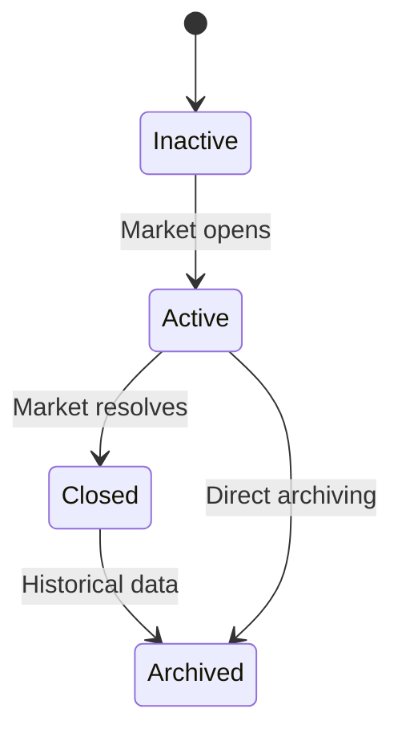

The state fields in the schemas are:
- `active`: Whether the market is currently active for trading
- `closed`: Whether the market has been closed/resolved
- `archived`: Whether the market is archived (historical)

**Section sources**
- [elysia-schemas.ts](file://src/types/elysia-schemas.ts#L44-L84)

### Pricing Data

The models include comprehensive pricing information for market analysis:

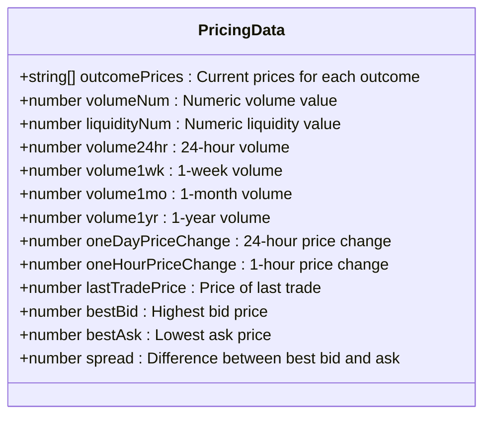

**Diagram sources**
- [elysia-schemas.ts](file://src/types/elysia-schemas.ts#L92-L139)

The pricing data is represented as both strings and numbers. String representations are used for precise decimal values in financial calculations, while numeric representations (e.g., `volumeNum`, `liquidityNum`) are provided for easier mathematical operations and sorting.

**Section sources**
- [elysia-schemas.ts](file://src/types/elysia-schemas.ts#L44-L139)