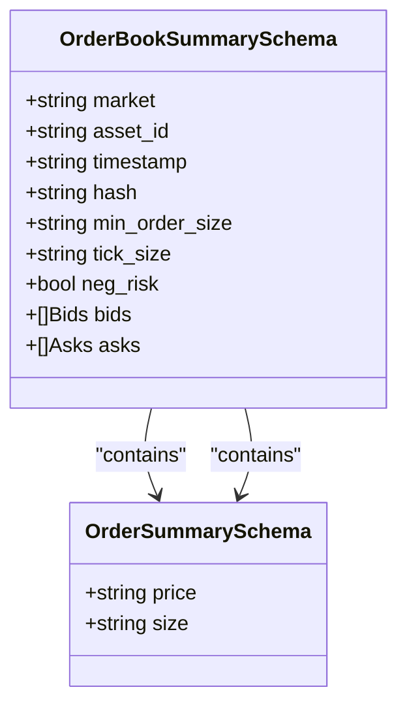
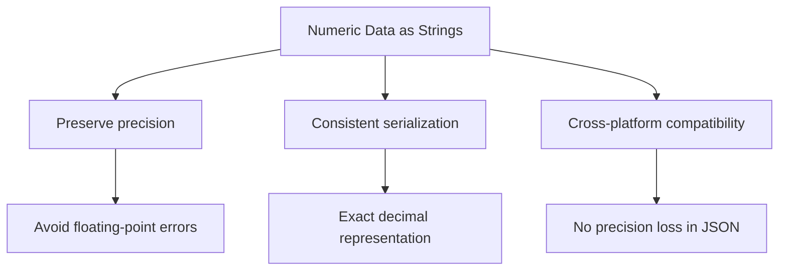
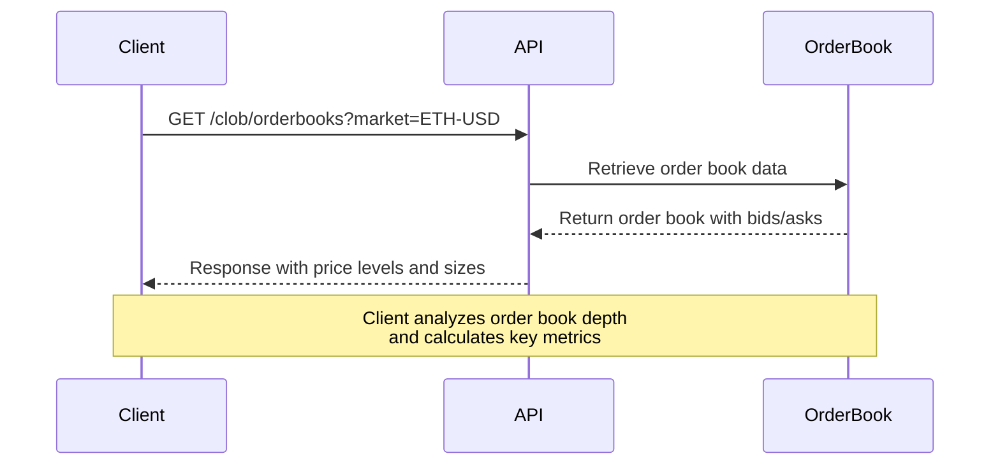

# Price & Order Book Models

<cite>
**Referenced Files in This Document**   
- [prices_history_get_response.go](file://go-polymarket/client/clob/prices_history_get_response.go)
- [prices_history_request_builder.go](file://go-polymarket/client/clob/prices_history_request_builder.go)
- [orderbooks.go](file://go-polymarket/client/clob/orderbooks.go)
- [orderbooks_escaped_bids.go](file://go-polymarket/client/clob/orderbooks_escaped_bids.go)
- [orderbooks_escaped_asks.go](file://go-polymarket/client/clob/orderbooks_escaped_asks.go)
- [prices.go](file://go-polymarket/client/clob/prices.go)
- [book_item_with_token_get_response.go](file://go-polymarket/client/clob/book_item_with_token_get_response.go)
</cite>

## Table of Contents
1. [Introduction](#introduction)
2. [Price History Models](#price-history-models)
3. [Order Book Models](#order-book-models)
4. [Query Parameters and Request Schemas](#query-parameters-and-request-schemas)
5. [Data Type Representations and Nullability](#data-type-representations-and-nullability)
6. [Time Range Handling](#time-range-handling)
7. [Interpreting Order Book Depth and Price Levels](#interpreting-order-book-depth-and-price-levels)
8. [Usage Examples](#usage-examples)
9. [Conclusion](#conclusion)

## Introduction
This document provides comprehensive documentation for the price history and order book data models used in CLOB API interactions. It details the structure of key schemas including PriceHistoryPointSchema, PriceHistoryResponseSchema, OrderBookSummarySchema, and associated components. The document also covers query parameters, data type representations, nullability, and practical guidance for interpreting market data in trading applications.

## Price History Models

The price history models are designed to represent historical price data for financial instruments over specified time intervals. The primary response schema includes a history array containing price points and metadata about the time range.

### PriceHistoryResponseSchema
The `prices_history_get_response.go` file defines the structure of the price history response, which includes:
- A collection of historical price points
- Metadata about the time range of the data
- Market identifier and interval information

Each price point in the history array contains timestamped price data, enabling clients to analyze price movements over time.

**Section sources**
- [prices_history_get_response.go](file://go-polymarket/client/clob/prices_history_get_response.go)

## Order Book Models

The order book models represent the current state of buy and sell orders for a given market. These models provide a snapshot of market depth and liquidity at various price levels.

### OrderBookSummarySchema
The `orderbooks.go` file defines the core order book structure with the following components:

- **market**: Market identifier
- **asset_id**: Associated asset identifier
- **timestamp**: Time of the order book snapshot
- **hash**: Unique identifier for the order book state
- **min_order_size**: Minimum allowable order size
- **tick_size**: Minimum price increment
- **neg_risk**: Risk flag indicator
- **bids**: Array of buy orders
- **asks**: Array of sell orders



**Diagram sources**
- [orderbooks.go](file://go-polymarket/client/clob/orderbooks.go)

### Bids and Asks Structure
The bid and ask arrays are defined in separate files:
- `orderbooks_escaped_bids.go` contains the structure for buy orders (bids)
- `orderbooks_escaped_asks.go` contains the structure for sell orders (asks)

Each order entry follows the OrderSummarySchema pattern with price and size fields represented as strings to maintain precision.

**Section sources**
- [orderbooks.go](file://go-polymarket/client/clob/orderbooks.go)
- [orderbooks_escaped_bids.go](file://go-polymarket/client/clob/orderbooks_escaped_bids.go)
- [orderbooks_escaped_asks.go](file://go-polymarket/client/clob/orderbooks_escaped_asks.go)

## Query Parameters and Request Schemas

### PriceHistoryQuerySchema
The `prices_history_request_builder.go` file defines the query parameters for price history requests:

- **market**: Market identifier to retrieve price history for
- **interval**: Time interval between data points (e.g., 1m, 5m, 1h)
- **startTs**: Starting timestamp for the historical data range
- **fidelity**: Data fidelity level (affects aggregation and smoothing)

These parameters allow clients to customize the granularity and scope of price history data retrieval.

### BookParamsSchema
For order book requests, the side parameter (BUY/SELL) can be used in batch operations to request specific sides of the order book, improving efficiency when only one side is needed.

**Section sources**
- [prices_history_request_builder.go](file://go-polymarket/client/clob/prices_history_request_builder.go)

## Data Type Representations and Nullability

All numeric values in the price and order book models are represented as strings rather than numbers. This design choice ensures precision is maintained for financial calculations and avoids floating-point representation issues.

Key fields and their types:
- **price**: string (in OrderSummarySchema)
- **size**: string (in OrderSummarySchema)
- **min_order_size**: string
- **tick_size**: string
- **timestamp**: string (ISO 8601 format)
- **neg_risk**: boolean

Most fields are nullable, indicated by pointer types (*string, *bool) in the Go implementation, allowing for optional data and proper handling of missing values.



**Diagram sources**
- [orderbooks.go](file://go-polymarket/client/clob/orderbooks.go)
- [prices.go](file://go-polymarket/client/clob/prices.go)

**Section sources**
- [orderbooks.go](file://go-polymarket/client/clob/orderbooks.go)
- [prices.go](file://go-polymarket/client/clob/prices.go)

## Time Range Handling

The price history response includes time range metadata that provides context for the returned data points. The time range is typically represented by:
- Start timestamp of the data series
- End timestamp of the data series
- Interval between consecutive points

This metadata enables clients to understand the temporal scope of the data and handle edge cases such as incomplete intervals at the boundaries of the requested range.

**Section sources**
- [prices_history_get_response.go](file://go-polymarket/client/clob/prices_history_get_response.go)

## Interpreting Order Book Depth and Price Levels

### Order Book Depth Analysis
The depth of the order book is determined by the number of price levels present in the bids and asks arrays. Each level represents aggregated orders at a specific price point.

Key considerations for trading applications:
- **Market liquidity**: Wider order books with multiple price levels indicate higher liquidity
- **Price discovery**: The spread between best bid and best ask indicates market efficiency
- **Support and resistance**: Clusters of orders at specific price levels can indicate psychological price points

### Price Level Interpretation
When analyzing order book data:
1. Bids are typically sorted in descending order by price (highest bid first)
2. Asks are typically sorted in ascending order by price (lowest ask first)
3. The midpoint price can be calculated as (best bid + best ask) / 2
4. Order size at each level indicates potential market impact of trades



**Diagram sources**
- [orderbooks.go](file://go-polymarket/client/clob/orderbooks.go)
- [book_item_with_token_get_response.go](file://go-polymarket/client/clob/book_item_with_token_get_response.go)

## Usage Examples

### Price History Endpoint
GET /clob/prices-history?market=ETH-USD&interval=1h&startTs=1672531200&fidelity=high

Response structure:
```json
{
  "history": [
    {"timestamp": "1672531200", "price": "1200.50"},
    {"timestamp": "1672534800", "price": "1205.75"}
  ],
  "time_range": {
    "start": "1672531200",
    "end": "1672538400"
  }
}
```

### Order Book Endpoint
GET /clob/orderbooks?market=ETH-USD

Response structure:
```json
{
  "market": "ETH-USD",
  "bids": [
    {"price": "1205.50", "size": "2.5"},
    {"price": "1205.00", "size": "3.2"}
  ],
  "asks": [
    {"price": "1206.00", "size": "1.8"},
    {"price": "1206.50", "size": "4.1"}
  ],
  "min_order_size": "0.01",
  "tick_size": "0.01",
  "timestamp": "1672534800"
}
```

**Section sources**
- [prices_history_get_response.go](file://go-polymarket/client/clob/prices_history_get_response.go)
- [orderbooks.go](file://go-polymarket/client/clob/orderbooks.go)

## Conclusion
The price history and order book models provide comprehensive market data for trading applications. The use of string representations for numeric values ensures precision, while the structured schema design enables efficient data retrieval and analysis. Understanding the relationship between price levels, order sizes, and time-based data is crucial for developing effective trading strategies. The documented endpoints and parameters allow for flexible querying of market data to support various analytical and trading use cases.