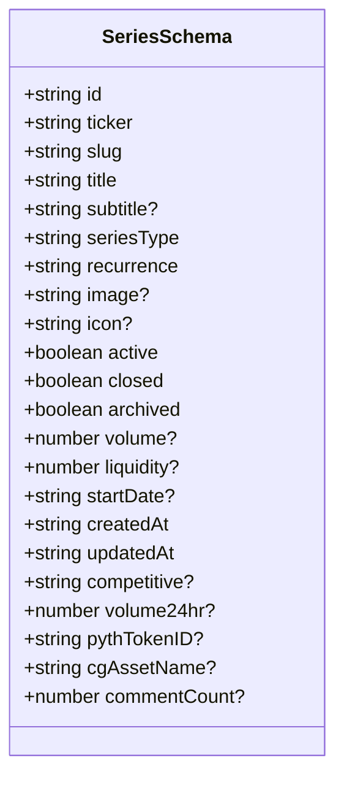
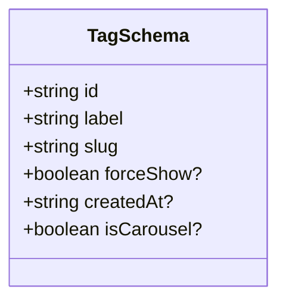
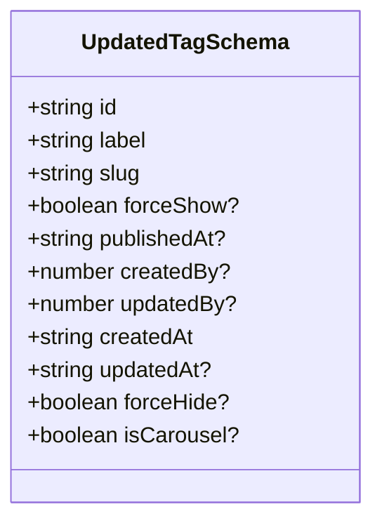
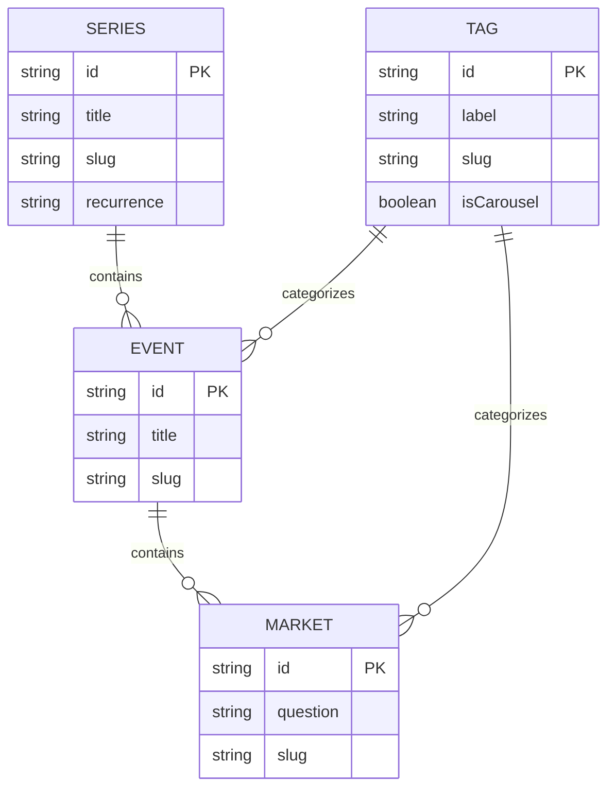
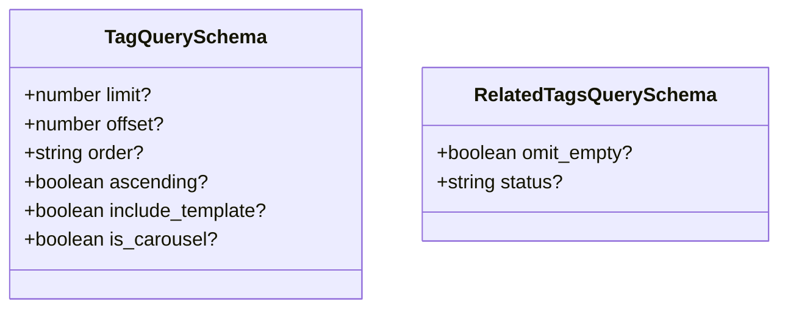
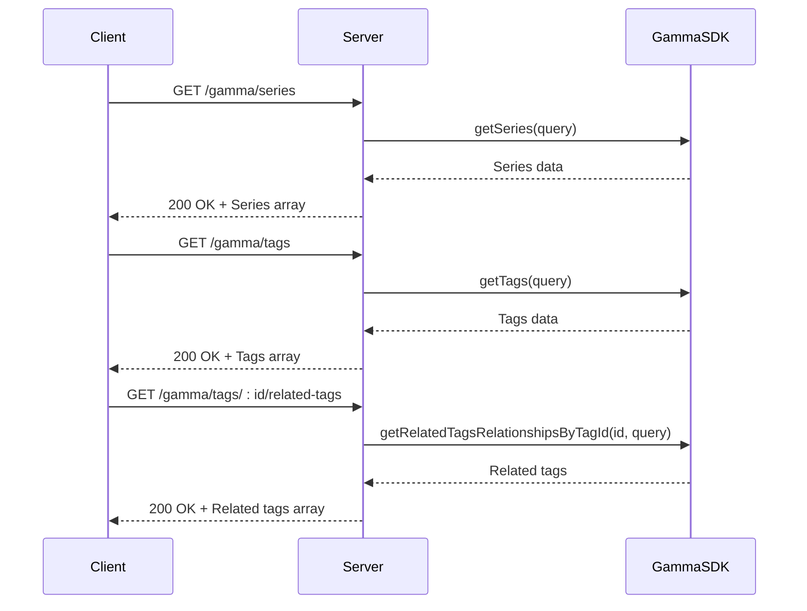
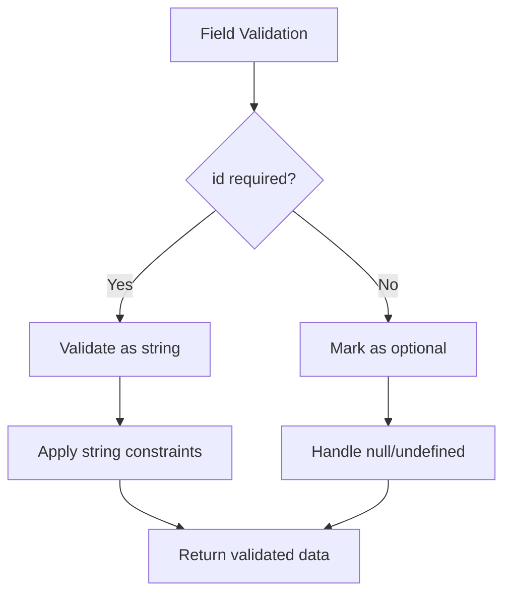

# Series & Tag Models

<cite>
**Referenced Files in This Document**   
- [elysia-schemas.ts](file://src/types/elysia-schemas.ts#L148-L171)
- [elysia-schemas.ts](file://src/types/elysia-schemas.ts#L180-L187)
- [elysia-schemas.ts](file://src/types/elysia-schemas.ts#L593-L605)
- [elysia-schemas.ts](file://src/types/elysia-schemas.ts#L196-L241)
- [elysia-schemas.ts](file://src/types/elysia-schemas.ts#L611-L623)
- [elysia-schemas.ts](file://src/types/elysia-schemas.ts#L625-L635)
- [gamma.ts](file://src/routes/gamma.ts#L234-L255)
- [gamma.ts](file://src/routes/gamma.ts#L163-L190)
- [series.go](file://go-polymarket/client/gamma/series.go#L1-L693)
- [tags.go](file://go-polymarket/client/gamma/tags.go#L1-L374)
</cite>

## Table of Contents
1. [Introduction](#introduction)
2. [Series Data Model](#series-data-model)
3. [Tag Data Model](#tag-data-model)
4. [Updated Tag Schema](#updated-tag-schema)
5. [Relationships Between Models](#relationships-between-models)
6. [Query Parameters and Filtering](#query-parameters-and-filtering)
7. [API Endpoints Usage](#api-endpoints-usage)
8. [Validation Rules and Optional Fields](#validation-rules-and-optional-fields)

## Introduction
This document provides comprehensive documentation for the Series and Tag data models used in the Polymarket platform for categorization and grouping of markets and events. The Series and Tag models serve as organizational structures that enable efficient grouping, filtering, and discovery of related prediction markets and events. These models are integral to the platform's content organization, allowing users to navigate through related markets and events based on thematic groupings (series) and categorical tags.

**Section sources**
- [elysia-schemas.ts](file://src/types/elysia-schemas.ts#L148-L171)
- [elysia-schemas.ts](file://src/types/elysia-schemas.ts#L180-L187)

## Series Data Model

The SeriesSchema defines the structure for market series data, which groups related markets together under a common theme or topic. Series are used to organize markets and events into coherent collections, such as "US Presidential Elections" or "Olympic Games," providing users with a way to explore related prediction markets.

**Diagram sources**
- [elysia-schemas.ts](file://src/types/elysia-schemas.ts#L148-L171)
- [series.go](file://go-polymarket/client/gamma/series.go#L1-L693)

**Section sources**
- [elysia-schemas.ts](file://src/types/elysia-schemas.ts#L148-L171)
- [series.go](file://go-polymarket/client/gamma/series.go#L1-L693)

## Tag Data Model

The TagSchema defines the structure for tag objects used to categorize markets and events. Tags provide categorization and filtering capabilities for markets and events in the Polymarket ecosystem, enabling users to discover content based on specific topics or themes.

**Diagram sources**
- [elysia-schemas.ts](file://src/types/elysia-schemas.ts#L180-L187)
- [tags.go](file://go-polymarket/client/gamma/tags.go#L1-L374)

**Section sources**
- [elysia-schemas.ts](file://src/types/elysia-schemas.ts#L180-L187)
- [tags.go](file://go-polymarket/client/gamma/tags.go#L1-L374)

## Updated Tag Schema

The UpdatedTagSchema extends the basic TagSchema with additional metadata fields that provide more detailed information about tag management and lifecycle. This enhanced schema is used in API responses to provide comprehensive tag information.

**Diagram sources**
- [elysia-schemas.ts](file://src/types/elysia-schemas.ts#L593-L605)
- [tags.go](file://go-polymarket/client/gamma/tags.go#L1-L374)

**Section sources**
- [elysia-schemas.ts](file://src/types/elysia-schemas.ts#L593-L605)
- [tags.go](file://go-polymarket/client/gamma/tags.go#L1-L374)

## Relationships Between Models

The Series and Tag models have specific relationships with markets and events, enabling content organization and discovery. Series organize related markets and events through the series field in EventSchema, while tags are used to categorize both markets and events.

**Diagram sources**
- [elysia-schemas.ts](file://src/types/elysia-schemas.ts#L148-L171)
- [elysia-schemas.ts](file://src/types/elysia-schemas.ts#L180-L187)
- [elysia-schemas.ts](file://src/types/elysia-schemas.ts#L196-L241)

**Section sources**
- [elysia-schemas.ts](file://src/types/elysia-schemas.ts#L148-L171)
- [elysia-schemas.ts](file://src/types/elysia-schemas.ts#L180-L187)
- [elysia-schemas.ts](file://src/types/elysia-schemas.ts#L196-L241)

## Query Parameters and Filtering

The TagQuerySchema and RelatedTagsQuerySchema define the parameters for filtering and retrieving tags. These schemas support various filtering options including pagination, sorting, and specific tag attributes.

**Diagram sources**
- [elysia-schemas.ts](file://src/types/elysia-schemas.ts#L611-L623)
- [elysia-schemas.ts](file://src/types/elysia-schemas.ts#L625-L635)

**Section sources**
- [elysia-schemas.ts](file://src/types/elysia-schemas.ts#L611-L623)
- [elysia-schemas.ts](file://src/types/elysia-schemas.ts#L625-L635)

## API Endpoints Usage

The /gamma/series and /gamma/tags endpoints provide access to series and tag data. These endpoints support various operations including retrieving all series/tags, retrieving by ID or slug, and retrieving related entities.

**Diagram sources**
- [gamma.ts](file://src/routes/gamma.ts#L234-L255)
- [gamma.ts](file://src/routes/gamma.ts#L163-L190)

**Section sources**
- [gamma.ts](file://src/routes/gamma.ts#L163-L255)

## Validation Rules and Optional Fields

The Series and Tag models include various validation rules and optional fields. Required fields are enforced by the schema definitions, while optional fields are marked with the Optional wrapper in the Elysia type system.

**Diagram sources**
- [elysia-schemas.ts](file://src/types/elysia-schemas.ts#L148-L171)
- [elysia-schemas.ts](file://src/types/elysia-schemas.ts#L180-L187)

**Section sources**
- [elysia-schemas.ts](file://src/types/elysia-schemas.ts#L148-L171)
- [elysia-schemas.ts](file://src/types/elysia-schemas.ts#L180-L187)