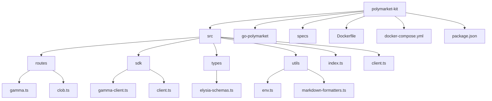
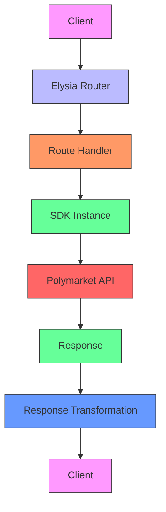
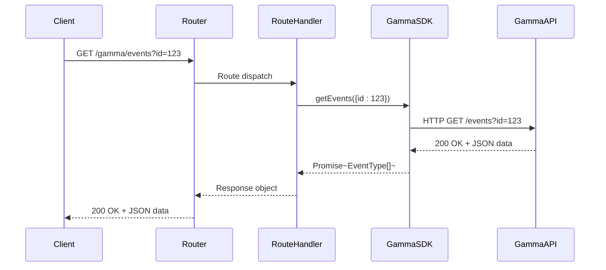

# Architecture Overview

<cite>
**Referenced Files in This Document**   
- [index.ts](file://src/index.ts)
- [gamma.ts](file://src/routes/gamma.ts)
- [gamma-client.ts](file://src/sdk/gamma-client.ts)
- [elysia-schemas.ts](file://src/types/elysia-schemas.ts)
- [env.ts](file://src/utils/env.ts)
- [clob.ts](file://src/routes/clob.ts)
- [client.ts](file://src/client.ts)
</cite>

## Table of Contents
1. [Introduction](#introduction)
2. [Project Structure](#project-structure)
3. [Core Components](#core-components)
4. [Architecture Overview](#architecture-overview)
5. [Detailed Component Analysis](#detailed-component-analysis)
6. [Dependency Analysis](#dependency-analysis)
7. [Performance Considerations](#performance-considerations)
8. [Troubleshooting Guide](#troubleshooting-guide)
9. [Conclusion](#conclusion)

## Introduction
The polymarket-kit application is a fully typed API translation layer and proxy server built on Elysia.js, designed to provide a robust, type-safe interface to Polymarket's Gamma and CLOB APIs. This architectural documentation details the system's design patterns, component interactions, and technical decisions that enable seamless integration with Polymarket's ecosystem. The server acts as an intermediary layer that standardizes API access, enhances type safety, and provides additional functionality such as proxy support and markdown formatting for LLM analysis. The architecture follows an MVC-like pattern with routes serving as controllers, SDKs as services, and Elysia schemas as models, creating a clean separation of concerns that enhances maintainability and scalability.

## Project Structure
The polymarket-kit application follows a well-organized directory structure that separates concerns and promotes maintainability. The core source code resides in the `src` directory, which contains distinct subdirectories for routes, SDKs, types, and utilities. The `routes` directory contains route modules that define API endpoints, while the `sdk` directory houses the service layer implementations that interact with external APIs. Type definitions and validation schemas are centralized in the `types` directory, ensuring a single source of truth for data structures. Utility functions and helpers are organized in the `utils` directory, promoting code reuse across the application. Configuration files and documentation are located at the root level, providing clear guidance for development and deployment. This structure supports the MVC-like pattern by physically separating the controller (routes), service (SDKs), and model (types) components.



**Diagram sources**
- [src/index.ts](file://src/index.ts#L1-L165)
- [src/routes/gamma.ts](file://src/routes/gamma.ts#L1-L725)

**Section sources**
- [src/index.ts](file://src/index.ts#L1-L165)
- [src/routes/gamma.ts](file://src/routes/gamma.ts#L1-L725)

## Core Components
The polymarket-kit application consists of several core components that work together to provide a comprehensive API proxy solution. The Elysia.js server serves as the foundation, providing a high-performance framework for building type-safe APIs. The GammaSDK and ClobSDK components act as service layers that encapsulate the logic for interacting with Polymarket's external APIs. Route modules define the API endpoints and serve as controllers that coordinate between the HTTP interface and the service layer. Type schemas defined using Elysia's type system ensure runtime validation and type safety throughout the application. The middleware system enables cross-cutting concerns like authentication, validation, and proxy configuration to be handled consistently across all endpoints. These components work together to create a robust, maintainable architecture that abstracts the complexities of the underlying APIs while providing a clean, type-safe interface to clients.

**Section sources**
- [src/index.ts](file://src/index.ts#L1-L165)
- [src/sdk/gamma-client.ts](file://src/sdk/gamma-client.ts#L1-L891)
- [src/types/elysia-schemas.ts](file://src/types/elysia-schemas.ts#L1-L1023)

## Architecture Overview
The polymarket-kit application follows a layered architecture built on Elysia.js, implementing an MVC-like pattern where routes act as controllers, SDKs serve as services, and Elysia schemas function as models. The architecture is designed as a typed API translation layer and proxy server that intercepts client requests, validates them against defined schemas, forwards them to the appropriate Polymarket API, and returns transformed responses. This design pattern provides several benefits, including type safety, maintainability, and extensibility. The server leverages Elysia's built-in type validation system to ensure that all incoming requests and outgoing responses conform to defined schemas, reducing the risk of runtime errors and improving developer experience. The proxy functionality allows clients to route their requests through the server, which can handle authentication, rate limiting, and other cross-cutting concerns.



**Diagram sources**
- [src/index.ts](file://src/index.ts#L1-L165)
- [src/routes/gamma.ts](file://src/routes/gamma.ts#L1-L725)
- [src/sdk/gamma-client.ts](file://src/sdk/gamma-client.ts#L1-L891)

## Detailed Component Analysis

### Gamma API Component Analysis
The Gamma API component provides a comprehensive interface to Polymarket's Gamma API, exposing endpoints for markets, events, series, tags, comments, and search functionality. The component is implemented as a route module that defines typed endpoints for all available Gamma API operations. Each endpoint is configured with request validation schemas that ensure incoming parameters conform to expected formats, and response schemas that define the structure of the returned data. The route handlers delegate to the GammaSDK service layer, which handles the actual HTTP communication with the Gamma API. This separation of concerns allows the route layer to focus on API contract definition and validation, while the service layer manages the complexities of external API interaction, error handling, and data transformation.

#### For Object-Oriented Components:
```mermaid
classDiagram
class GammaSDK {
+gammaApiBase : string
-proxyConfig : ProxyConfigType
+constructor(config : GammaSDKConfig)
+getTeams(query : TeamQueryType) : Promise~TeamType[]~
+getTags(query : TagQueryType) : Promise~UpdatedTagType[]~
+getEvents(query : UpdatedEventQueryType) : Promise~EventType[]~
+getMarkets(query : UpdatedMarketQueryType) : Promise~MarketType[]~
+getSeries(query : SeriesQueryType) : Promise~SeriesType[]~
+getComments(query : CommentQueryType) : Promise~CommentType[]~
+search(query : SearchQueryType) : Promise~SearchResponseType~
-createFetchOptions() : RequestInit
-buildProxyUrl(proxy : ProxyConfigType) : string
-buildSearchParams(query : Record~string, any~) : URLSearchParams
-makeRequest~T~(endpoint : string, query : Record~string, any~) : Promise~{data : T | null, status : number, ok : boolean}~
-transformMarketData(item : any) : MarketType
-transformEventData(item : any) : EventType
-parseJsonArray(value : string | string[]) : string[]
}
class GammaSDKConfig {
+proxy : ProxyConfigType
}
class ProxyConfigType {
+host : string
+port : number
+username : string
+password : string
+protocol : "http" | "https"
}
GammaSDK --> GammaSDKConfig : "uses"
GammaSDK --> ProxyConfigType : "uses"
```

**Diagram sources**
- [src/sdk/gamma-client.ts](file://src/sdk/gamma-client.ts#L1-L891)
- [src/types/elysia-schemas.ts](file://src/types/elysia-schemas.ts#L1-L1023)

#### For API/Service Components:


**Diagram sources**
- [src/routes/gamma.ts](file://src/routes/gamma.ts#L1-L725)
- [src/sdk/gamma-client.ts](file://src/sdk/gamma-client.ts#L1-L891)

**Section sources**
- [src/routes/gamma.ts](file://src/routes/gamma.ts#L1-L725)
- [src/sdk/gamma-client.ts](file://src/sdk/gamma-client.ts#L1-L891)

### CLOB API Component Analysis
The CLOB API component provides access to Polymarket's CLOB (Central Limit Order Book) API, enabling clients to retrieve price history, order books, trades, and other market data. Similar to the Gamma API component, the CLOB API is implemented as a route module that defines typed endpoints for various CLOB operations. The component leverages the ClobSDK service layer to handle communication with the CLOB API, abstracting the complexities of authentication, rate limiting, and data transformation. The route handlers validate incoming requests against defined schemas and transform the responses to ensure consistency with the API contract. This component demonstrates the reusability of the architectural patterns established in the application, applying the same principles of type safety, separation of concerns, and middleware usage to a different API endpoint.

**Section sources**
- [src/routes/clob.ts](file://src/routes/clob.ts#L1-L100)
- [src/sdk/client.ts](file://src/sdk/client.ts#L1-L50)

## Dependency Analysis
The polymarket-kit application has a well-defined dependency structure that supports its architectural goals. The core dependency is Elysia.js, which provides the foundation for building type-safe APIs with built-in validation and OpenAPI documentation generation. The application also depends on undici for HTTP communication, which is used by the SDK components to interact with external APIs. The lru-cache package is used to implement caching strategies for SDK instances, improving performance by reusing connections and reducing latency. The @elysiajs/cors, @elysiajs/swagger, and @elysiajs/openapi packages provide additional functionality for cross-origin resource sharing, API documentation, and OpenAPI schema generation. These dependencies work together to create a robust, high-performance API proxy server that can handle a variety of use cases and deployment scenarios.

```mermaid
graph TD
A[Elysia.js] --> B[polymarket-kit]
C[undici] --> B
D[lru-cache] --> B
E[@elysiajs/cors] --> B
F[@elysiajs/swagger] --> B
G[@elysiajs/openapi] --> B
H[typescript] --> B
I[zod] --> B
B --> J[GammaSDK]
B --> K[ClobSDK]
B --> L[Route Handlers]
B --> M[Type Schemas]
style A fill:#f9f,stroke:#333
style B fill:#bbf,stroke:#333
style C fill:#f96,stroke:#333
style D fill:#6f9,stroke:#333
style E fill:#69f,stroke:#333
style F fill:#96f,stroke:#333
style G fill:#9f6,stroke:#333
style H fill:#66f,stroke:#333
style I fill:#f66,stroke:#333
style J fill:#6f9,stroke:#333
style K fill:#69f,stroke:#333
style L fill:#96f,stroke:#333
style M fill:#9f6,stroke:#333
```

**Diagram sources**
- [package.json](file://package.json#L1-L20)
- [pnpm-lock.yaml](file://pnpm-lock.yaml#L1-L50)
- [src/index.ts](file://src/index.ts#L1-L165)

**Section sources**
- [package.json](file://package.json#L1-L20)
- [pnpm-lock.yaml](file://pnpm-lock.yaml#L1-L50)
- [src/index.ts](file://src/index.ts#L1-L165)

## Performance Considerations
The polymarket-kit application incorporates several performance optimizations to ensure efficient operation under various conditions. The use of Elysia.js as the foundation provides high-performance HTTP handling with minimal overhead, leveraging Bun's runtime optimizations for fast execution. The SDK components implement connection reuse and caching strategies to reduce latency and improve response times, particularly for frequently accessed endpoints. The application supports proxy configuration, allowing clients to route requests through intermediate servers that can provide additional caching and load balancing capabilities. The type validation system is designed to be efficient, with schemas compiled at startup to minimize runtime overhead. Additionally, the application can be deployed in containerized environments using Docker, enabling horizontal scaling and efficient resource utilization. These performance considerations ensure that the application can handle high request volumes while maintaining low latency and high availability.

## Troubleshooting Guide
When troubleshooting issues with the polymarket-kit application, it is important to consider the various components and their interactions. Common issues may include connectivity problems with external APIs, validation errors due to malformed requests, or configuration issues with proxy settings. The application's error handling system provides detailed error messages that can help diagnose issues, with specific error codes and messages for different types of failures. When encountering connectivity issues, verify that the external API endpoints are accessible and that any required authentication credentials are correctly configured. For validation errors, review the request parameters against the defined schemas to ensure they conform to the expected formats. When using proxy functionality, ensure that the proxy configuration is correctly formatted and that the proxy server is accessible. The application's logging system can provide additional insights into the request processing flow and help identify the source of issues.

**Section sources**
- [src/index.ts](file://src/index.ts#L1-L165)
- [src/routes/gamma.ts](file://src/routes/gamma.ts#L1-L725)
- [src/sdk/gamma-client.ts](file://src/sdk/gamma-client.ts#L1-L891)

## Conclusion
The polymarket-kit application demonstrates a well-architected approach to building a typed API translation layer and proxy server using Elysia.js. By implementing an MVC-like pattern with routes as controllers, SDKs as services, and Elysia schemas as models, the application achieves a clean separation of concerns that enhances maintainability and scalability. The use of architectural patterns such as Proxy, Singleton with LRU caching, Middleware, and Dependency Injection provides a robust foundation for handling complex API interactions while maintaining type safety and performance. The technology stack choices, including Elysia.js for performance, zod for runtime validation, and undici for HTTP communication, reflect a thoughtful approach to building a high-quality API proxy server. The application's design addresses cross-cutting concerns such as type safety, error handling, caching strategy, and security through API key management, making it a reliable solution for interacting with Polymarket's APIs. With its modular architecture and comprehensive feature set, the polymarket-kit application is well-positioned to support a wide range of use cases and deployment scenarios.