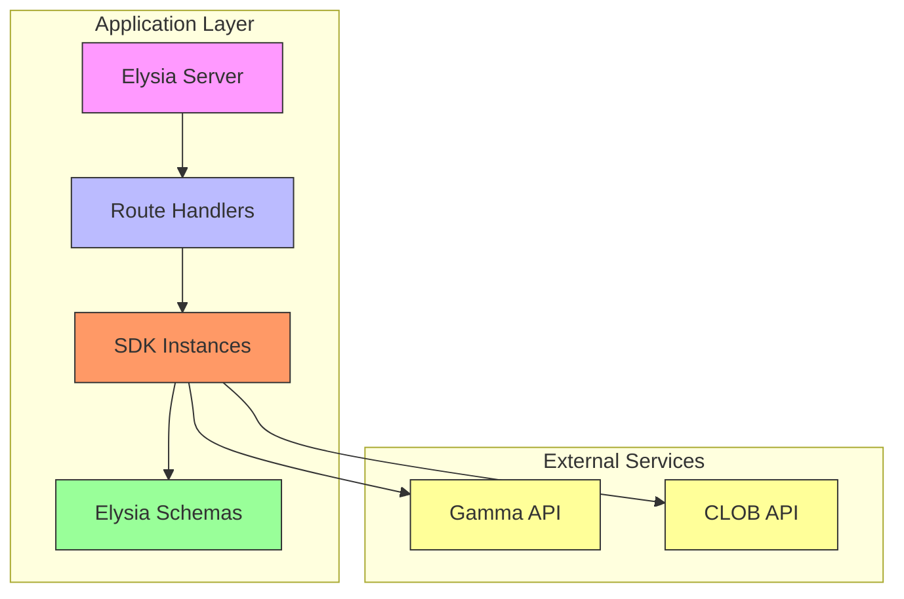
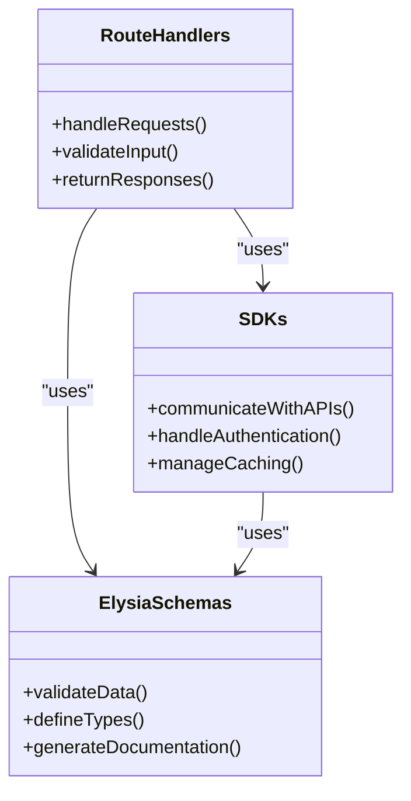
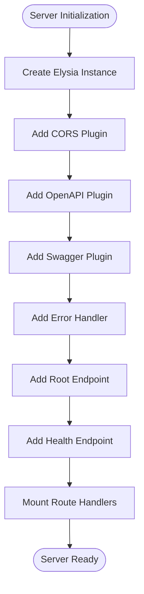
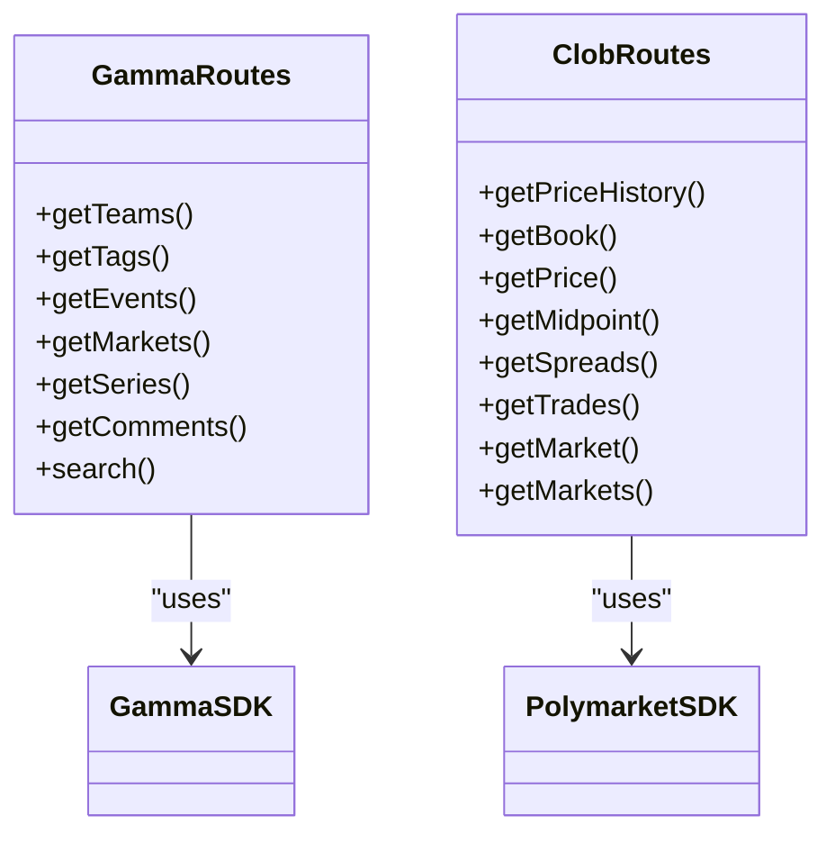
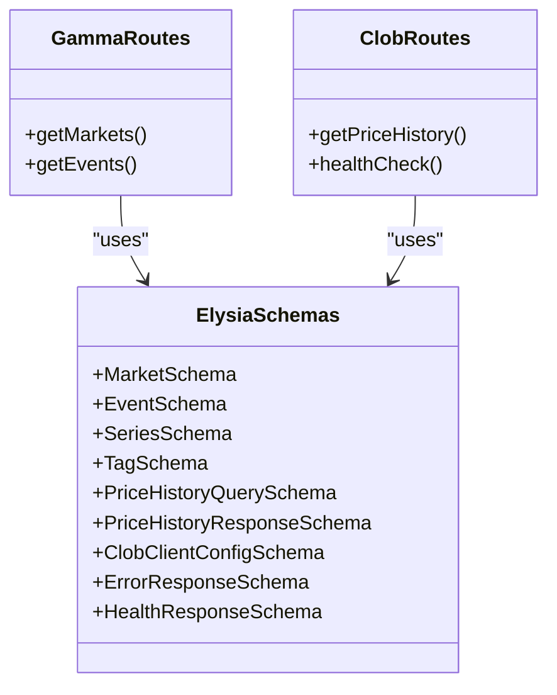
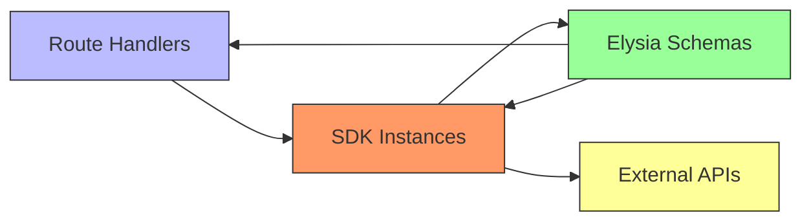
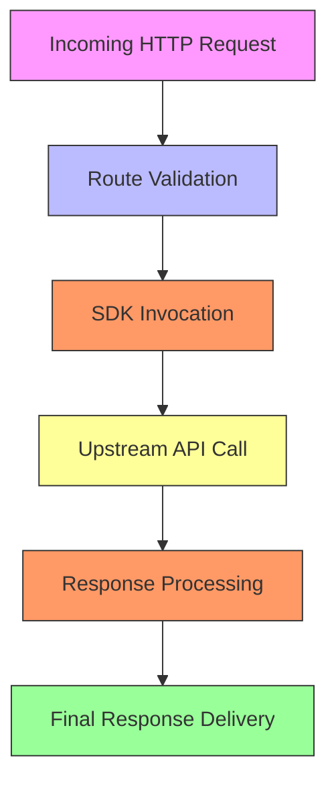
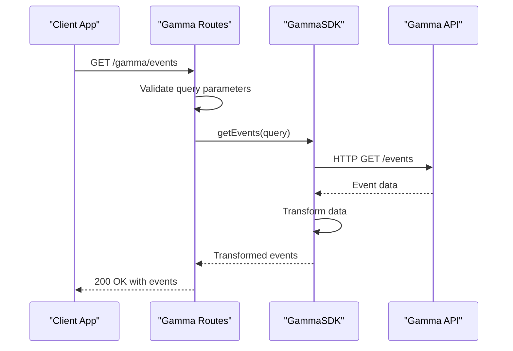
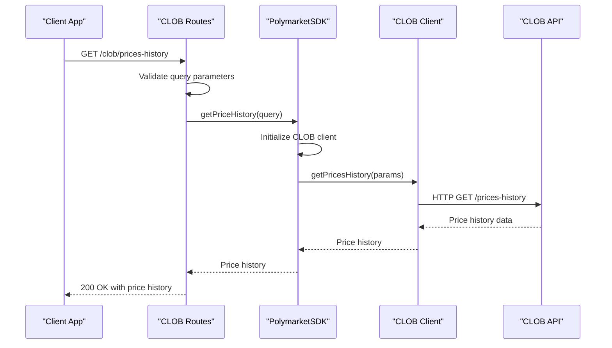

# Component Interactions

<cite>
**Referenced Files in This Document**   
- [index.ts](file://src/index.ts)
- [gamma.ts](file://src/routes/gamma.ts)
- [clob.ts](file://src/routes/clob.ts)
- [gamma-client.ts](file://src/sdk/gamma-client.ts)
- [client.ts](file://src/sdk/client.ts)
- [elysia-schemas.ts](file://src/types/elysia-schemas.ts)
</cite>

## Table of Contents
1. [Introduction](#introduction)
2. [Architecture Overview](#architecture-overview)
3. [MVC-like Pattern Implementation](#mvc-like-pattern-implementation)
4. [Elysia Server Initialization](#elysia-server-initialization)
5. [Route Handlers as Controllers](#route-handlers-as-controllers)
6. [SDKs as Service Layer](#sdks-as-service-layer)
7. [Elysia-Schemas as Model Layer](#elysia-schemas-as-model-layer)
8. [Dependency Chain Analysis](#dependency-chain-analysis)
9. [Data Flow Analysis](#data-flow-analysis)
10. [Sequence Diagrams](#sequence-diagrams)
11. [Conclusion](#conclusion)

## Introduction
The polymarket-kit implements a clean architectural pattern that closely resembles the Model-View-Controller (MVC) design pattern, adapted for API development. This documentation details how the application components interact, with routes acting as controllers, SDKs serving as service layers, and elysia-schemas defining the model layer. The Elysia server in index.ts serves as the central orchestrator, initializing the application and mounting route handlers that utilize SDK instances to communicate with external Polymarket APIs. This architecture provides a clear separation of concerns, type safety, and maintainability.

**Section sources**
- [index.ts](file://src/index.ts#L1-L165)

## Architecture Overview
The polymarket-kit application follows a layered architecture where the Elysia server acts as the foundation, mounting route handlers that serve as controllers. These controllers utilize SDK instances as service layers to communicate with external Polymarket APIs, while relying on type definitions from elysia-schemas.ts for validation and type safety. The architecture enables a clean separation of concerns, with each layer having distinct responsibilities and well-defined interfaces.



**Diagram sources**
- [index.ts](file://src/index.ts#L1-L165)
- [gamma.ts](file://src/routes/gamma.ts#L1-L724)
- [clob.ts](file://src/routes/clob.ts#L1-L1013)

**Section sources**
- [index.ts](file://src/index.ts#L1-L165)
- [gamma.ts](file://src/routes/gamma.ts#L1-L724)
- [clob.ts](file://src/routes/clob.ts#L1-L1013)

## MVC-like Pattern Implementation
The polymarket-kit application implements an MVC-like pattern adapted for API development, where routes act as controllers, SDKs serve as service layers, and elysia-schemas define the model layer. This pattern provides a clear separation of concerns, with each component having distinct responsibilities and well-defined interfaces. The controller layer handles HTTP requests and responses, the service layer manages business logic and external API communication, and the model layer provides data validation and type definitions.



**Diagram sources**
- [gamma.ts](file://src/routes/gamma.ts#L1-L724)
- [clob.ts](file://src/routes/clob.ts#L1-L1013)
- [gamma-client.ts](file://src/sdk/gamma-client.ts#L1-L891)
- [client.ts](file://src/sdk/client.ts#L1-L388)
- [elysia-schemas.ts](file://src/types/elysia-schemas.ts#L1-L1023)

**Section sources**
- [gamma.ts](file://src/routes/gamma.ts#L1-L724)
- [clob.ts](file://src/routes/clob.ts#L1-L1013)
- [gamma-client.ts](file://src/sdk/gamma-client.ts#L1-L891)
- [client.ts](file://src/sdk/client.ts#L1-L388)
- [elysia-schemas.ts](file://src/types/elysia-schemas.ts#L1-L1023)

## Elysia Server Initialization
The Elysia server in index.ts initializes the application by creating a new Elysia instance and configuring it with essential plugins and middleware. It sets up CORS support, OpenAPI/Swagger documentation, and a global error handler. The server then mounts the route handlers for the Gamma and CLOB APIs, creating a complete API server that serves as the entry point for all incoming requests. This initialization process establishes the foundation for the entire application.



**Diagram sources**
- [index.ts](file://src/index.ts#L1-L165)

**Section sources**
- [index.ts](file://src/index.ts#L1-L165)

## Route Handlers as Controllers
The route handlers in gamma.ts and clob.ts act as controllers in the MVC-like pattern, handling incoming HTTP requests and returning appropriate responses. They validate request parameters and bodies using the type definitions from elysia-schemas.ts, invoke the appropriate SDK methods to perform business logic, and return the results to the client. Each route handler is responsible for a specific endpoint or group of endpoints, providing a clear interface between the client and the service layer.



**Diagram sources**
- [gamma.ts](file://src/routes/gamma.ts#L1-L724)
- [clob.ts](file://src/routes/clob.ts#L1-L1013)
- [gamma-client.ts](file://src/sdk/gamma-client.ts#L1-L891)
- [client.ts](file://src/sdk/client.ts#L1-L388)

**Section sources**
- [gamma.ts](file://src/routes/gamma.ts#L1-L724)
- [clob.ts](file://src/routes/clob.ts#L1-L1013)

## SDKs as Service Layer
The SDKs in gamma-client.ts and client.ts serve as the service layer in the MVC-like pattern, encapsulating the business logic and handling communication with external Polymarket APIs. The GammaSDK provides methods for accessing the Gamma API, while the PolymarketSDK handles CLOB API operations. These SDKs manage authentication, caching, and error handling, providing a clean interface for the route handlers to use without needing to understand the underlying implementation details.

```mermaid
classDiagram
class GammaSDK {
+getTeams()
+getTags()
+getEvents()
+getMarkets()
+getSeries()
+getComments()
+search()
+makeRequest()
+transformData()
}
class PolymarketSDK {
+getPriceHistory()
+getBook()
+getPrice()
+getMidpoint()
+getSpreads()
+getTrades()
+getMarket()
+getMarkets()
+healthCheck()
+initializeClobClient()
}
GammaSDK --> "https : //gamma-api.polymarket.com" : "HTTP"
PolymarketSDK --> "https : //clob.polymarket.com" : "HTTP"
```

**Diagram sources**
- [gamma-client.ts](file://src/sdk/gamma-client.ts#L1-L891)
- [client.ts](file://src/sdk/client.ts#L1-L388)

**Section sources**
- [gamma-client.ts](file://src/sdk/gamma-client.ts#L1-L891)
- [client.ts](file://src/sdk/client.ts#L1-L388)

## Elysia-Schemas as Model Layer
The elysia-schemas.ts file defines the model layer in the MVC-like pattern, providing type definitions and validation schemas for all data used in the application. These schemas are used by the route handlers to validate incoming requests and by the SDKs to ensure data integrity. The model layer ensures type safety throughout the application, reducing errors and improving maintainability.



**Diagram sources**
- [elysia-schemas.ts](file://src/types/elysia-schemas.ts#L1-L1023)
- [gamma.ts](file://src/routes/gamma.ts#L1-L724)
- [clob.ts](file://src/routes/clob.ts#L1-L1013)

**Section sources**
- [elysia-schemas.ts](file://src/types/elysia-schemas.ts#L1-L1023)

## Dependency Chain Analysis
The dependency chain in the polymarket-kit application flows from the route handlers through the SDKs to the external APIs, with the elysia-schemas providing type definitions throughout. Route handlers import and utilize SDK classes (GammaSDK and PolymarketSDK) to perform actual API calls, while relying on type definitions from elysia-schemas.ts for validation. This dependency chain ensures a clear separation of concerns and makes the application easier to maintain and extend.



**Diagram sources**
- [gamma.ts](file://src/routes/gamma.ts#L1-L724)
- [clob.ts](file://src/routes/clob.ts#L1-L1013)
- [gamma-client.ts](file://src/sdk/gamma-client.ts#L1-L891)
- [client.ts](file://src/sdk/client.ts#L1-L388)
- [elysia-schemas.ts](file://src/types/elysia-schemas.ts#L1-L1023)

**Section sources**
- [gamma.ts](file://src/routes/gamma.ts#L1-L724)
- [clob.ts](file://src/routes/clob.ts#L1-L1013)
- [gamma-client.ts](file://src/sdk/gamma-client.ts#L1-L891)
- [client.ts](file://src/sdk/client.ts#L1-L388)
- [elysia-schemas.ts](file://src/types/elysia-schemas.ts#L1-L1023)

## Data Flow Analysis
The data flow in the polymarket-kit application follows a consistent pattern from incoming HTTP request through route validation, SDK invocation, upstream API call, response processing, and final response delivery. This flow ensures that all requests are properly validated, processed, and responded to in a consistent manner. The use of type-safe schemas and well-defined interfaces makes the data flow predictable and easy to understand.



**Diagram sources**
- [gamma.ts](file://src/routes/gamma.ts#L1-L724)
- [clob.ts](file://src/routes/clob.ts#L1-L1013)
- [gamma-client.ts](file://src/sdk/gamma-client.ts#L1-L891)
- [client.ts](file://src/sdk/client.ts#L1-L388)

**Section sources**
- [gamma.ts](file://src/routes/gamma.ts#L1-L724)
- [clob.ts](file://src/routes/clob.ts#L1-L1013)
- [gamma-client.ts](file://src/sdk/gamma-client.ts#L1-L891)
- [client.ts](file://src/sdk/client.ts#L1-L388)

## Sequence Diagrams
The following sequence diagrams illustrate the interaction between components for both Gamma and CLOB API requests. These diagrams show the step-by-step flow of data and control between the client, route handlers, SDKs, and external APIs, providing a clear understanding of how the components work together to handle requests.

### Gamma API Request Sequence


**Diagram sources**
- [gamma.ts](file://src/routes/gamma.ts#L1-L724)
- [gamma-client.ts](file://src/sdk/gamma-client.ts#L1-L891)

### CLOB API Request Sequence


**Diagram sources**
- [clob.ts](file://src/routes/clob.ts#L1-L1013)
- [client.ts](file://src/sdk/client.ts#L1-L388)

## Conclusion
The polymarket-kit application implements a clean and well-structured MVC-like pattern where routes act as controllers, SDKs serve as service layers, and elysia-schemas define the model layer. The Elysia server in index.ts initializes the application and mounts route handlers, which then use SDK instances to communicate with external Polymarket APIs. The dependency chain shows how route handlers import and utilize SDK classes (GammaSDK and PolymarketSDK) to perform actual API calls, while relying on type definitions from elysia-schemas.ts for validation. The data flow from incoming HTTP request through route validation, SDK invocation, upstream API call, response processing, and final response delivery is consistent and predictable. The sequence diagrams illustrate the interaction between components for both Gamma and CLOB API requests, providing a clear understanding of how the components work together to handle requests.