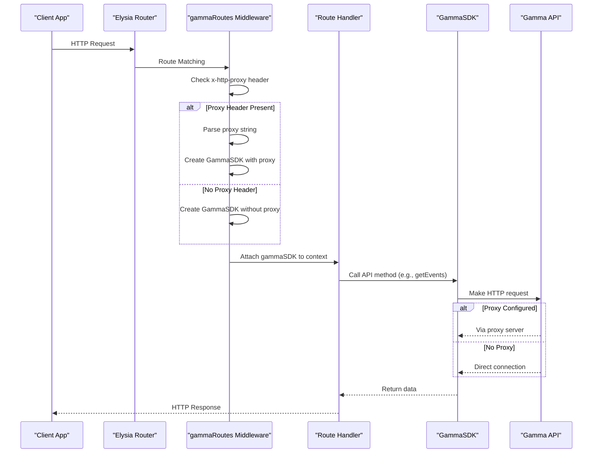
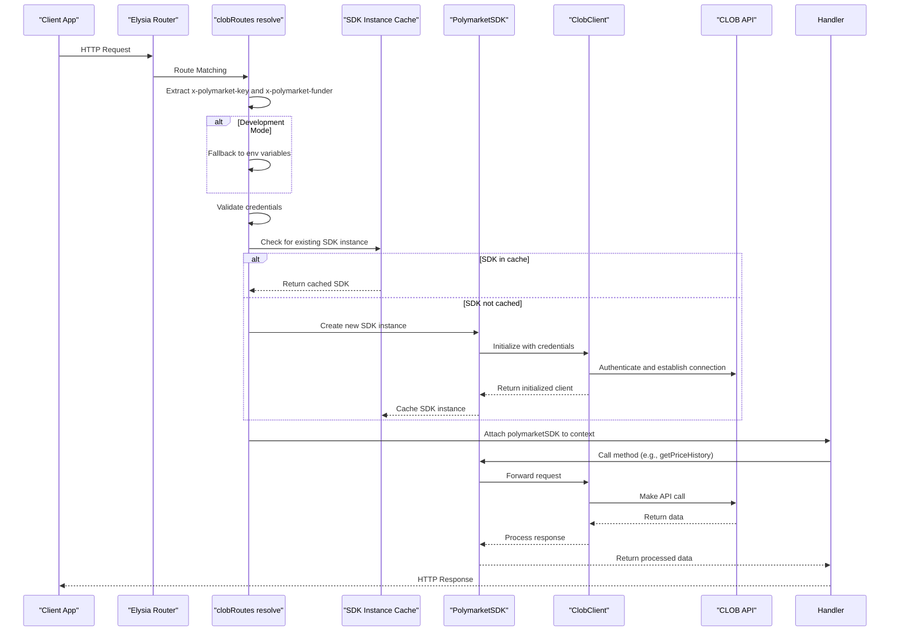
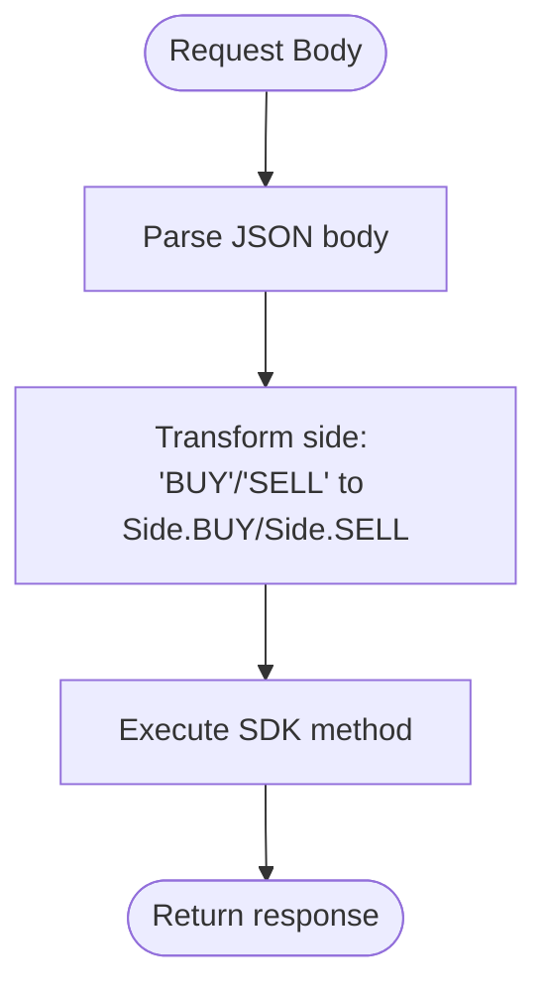
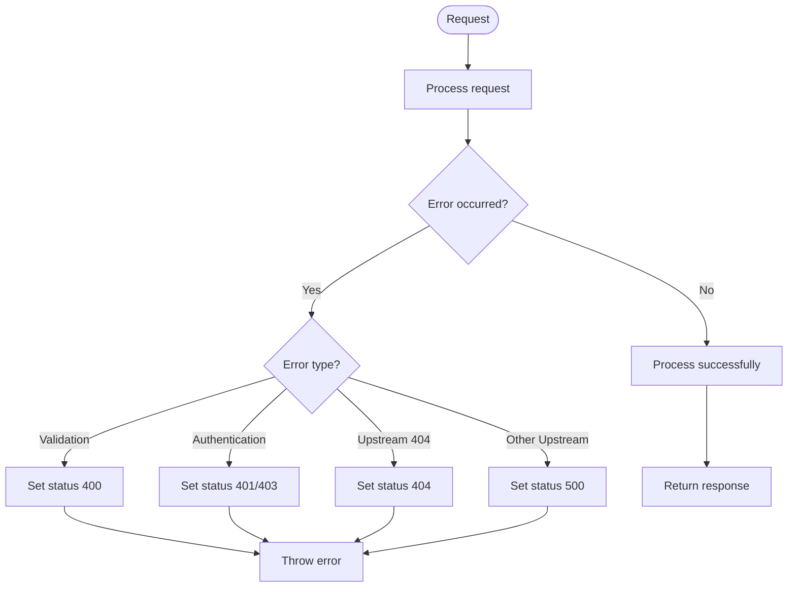

# Data Flow Patterns

<cite>
**Referenced Files in This Document**   
- [gamma.ts](file://src/routes/gamma.ts)
- [clob.ts](file://src/routes/clob.ts)
- [gamma-client.ts](file://src/sdk/gamma-client.ts)
- [client.ts](file://src/sdk/client.ts)
- [elysia-schemas.ts](file://src/types/elysia-schemas.ts)
</cite>

## Table of Contents
1. [Introduction](#introduction)
2. [Gamma API Request Flow](#gamma-api-request-flow)
3. [CLOB API Request Flow](#clob-api-request-flow)
4. [Data Transformation](#data-transformation)
5. [Error Handling](#error-handling)

## Introduction
This document details the data flow patterns in the polymarket-kit system, focusing on the complete request processing pipeline for both Gamma and CLOB API endpoints. The architecture leverages Elysia framework for routing and request handling, with distinct processing flows for public Gamma API data and authenticated CLOB operations. The Gamma API provides access to public market data without authentication, while the CLOB API requires authentication credentials for trading operations and price history access.

**Section sources**
- [gamma.ts](file://src/routes/gamma.ts#L1-L724)
- [clob.ts](file://src/routes/clob.ts#L1-L1013)

## Gamma API Request Flow

The Gamma API request flow processes incoming HTTP requests for public data from the Polymarket Gamma API (https://gamma-api.polymarket.com). This flow is designed for credential-free access to market data, sports information, events, and related content.

**Diagram sources**
- [gamma.ts](file://src/routes/gamma.ts#L1-L724)
- [gamma-client.ts](file://src/sdk/gamma-client.ts#L1-L891)

**Section sources**
- [gamma.ts](file://src/routes/gamma.ts#L1-L724)
- [gamma-client.ts](file://src/sdk/gamma-client.ts#L1-L891)

The flow begins with an HTTP request that is routed by Elysia to the appropriate Gamma endpoint. The `gammaRoutes` middleware processes the request by checking for the presence of an `x-http-proxy` header. If present, the proxy string is parsed into a configuration object that includes protocol, host, port, and optional authentication credentials. A GammaSDK instance is then created with this proxy configuration. If no proxy header is present, the SDK is created without proxy settings. The SDK instance is attached to the request context and passed to the route handler, which invokes the appropriate GammaSDK method. The GammaSDK makes HTTP requests to the upstream Gamma API, either directly or through the configured proxy. Response data is transformed as needed (e.g., parsing JSON string fields) before being returned through the handler to the client.

## CLOB API Request Flow

The CLOB API request flow handles authenticated requests for trading operations and price history data. This flow requires authentication credentials and implements caching to optimize performance for repeated requests.

**Diagram sources**
- [clob.ts](file://src/routes/clob.ts#L1-L1013)
- [client.ts](file://src/sdk/client.ts#L1-L388)

**Section sources**
- [clob.ts](file://src/routes/clob.ts#L1-L1013)
- [client.ts](file://src/sdk/client.ts#L1-L388)

The CLOB API request flow begins with an HTTP request containing authentication headers (`x-polymarket-key` and `x-polymarket-funder`). In development mode, the system falls back to environment variables if headers are not provided. The `clobRoutes` resolve hook validates the credentials and checks a global LRU cache for an existing SDK instance using a cache key derived from the private key, funder address, and other configuration parameters. If a cached instance exists, it is reused; otherwise, a new PolymarketSDK instance is created. The SDK initializes a ClobClient with the provided credentials, establishing an authenticated connection to the CLOB API. The SDK instance is cached for future requests. Route handlers use the attached SDK to make API calls, which are forwarded to the ClobClient for execution against the upstream API. Response data is processed and returned to the client.

## Data Transformation

The system implements several data transformation steps to ensure consistent and usable data formats across the API endpoints.

### Query Parameter Parsing
Both Gamma and CLOB APIs parse incoming query parameters according to defined schemas in `elysia-schemas.ts`. The Gamma API handles string-based parameters that are converted to appropriate types (numbers, booleans) during processing. The CLOB API supports both Unix timestamps and human-readable date strings, which are converted to timestamps for API requests.

### Request Body Transformation
For CLOB API endpoints that accept arrays of parameters (e.g., `/orderbooks`, `/prices`), the system transforms the request body by converting string side indicators ("BUY"/"SELL") to the appropriate enum values from the `@polymarket/clob-client` package:

**Diagram sources**
- [clob.ts](file://src/routes/clob.ts#L1-L1013)
- [client.ts](file://src/sdk/client.ts#L1-L388)

### Response Processing
The GammaSDK performs response processing to transform data from the upstream API into consistent formats. This includes parsing JSON string fields (e.g., outcomes, outcomePrices, clobTokenIds) into actual arrays and transforming nested market data within events. The CLOB API responses are processed to extract relevant data and format it according to the defined response schemas, including calculating time ranges from price history data points.

**Section sources**
- [gamma-client.ts](file://src/sdk/gamma-client.ts#L1-L891)
- [client.ts](file://src/sdk/client.ts#L1-L388)
- [elysia-schemas.ts](file://src/types/elysia-schemas.ts#L1-L1023)

## Error Handling

The system implements comprehensive error handling across both API flows, with distinct handling for different error types.

### Validation Errors
Validation errors are handled by Elysia's built-in validation system using the schemas defined in `elysia-schemas.ts`. Invalid requests receive 400 responses with detailed error information.

### Authentication Errors
CLOB API authentication errors occur when required headers are missing or invalid. In production mode, missing headers result in immediate 400 errors. Invalid credentials during ClobClient initialization result in 500 errors with descriptive messages.

### Upstream API Errors
Both Gamma and CLOB APIs handle upstream API errors through try-catch blocks in route handlers. The GammaSDK returns null for 404 responses (e.g., resource not found), which route handlers convert to appropriate 404 responses. Other upstream errors are propagated as 500 responses. The CLOB API distinguishes between different error types, setting appropriate status codes (404 for "No orderbook exists" errors, 500 for other errors).

**Diagram sources**
- [gamma.ts](file://src/routes/gamma.ts#L1-L724)
- [clob.ts](file://src/routes/clob.ts#L1-L1013)

**Section sources**
- [gamma.ts](file://src/routes/gamma.ts#L1-L724)
- [clob.ts](file://src/routes/clob.ts#L1-L1013)