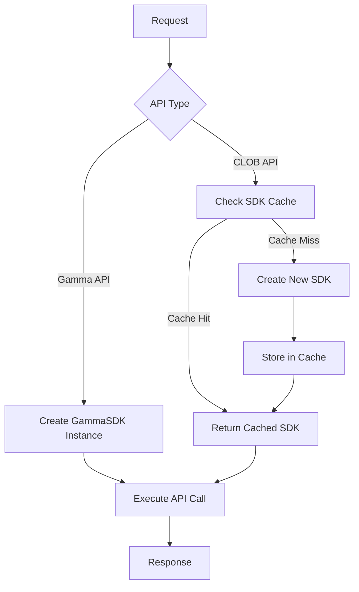
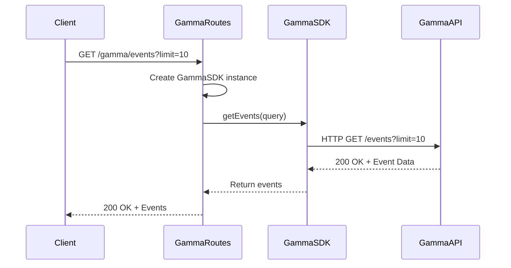
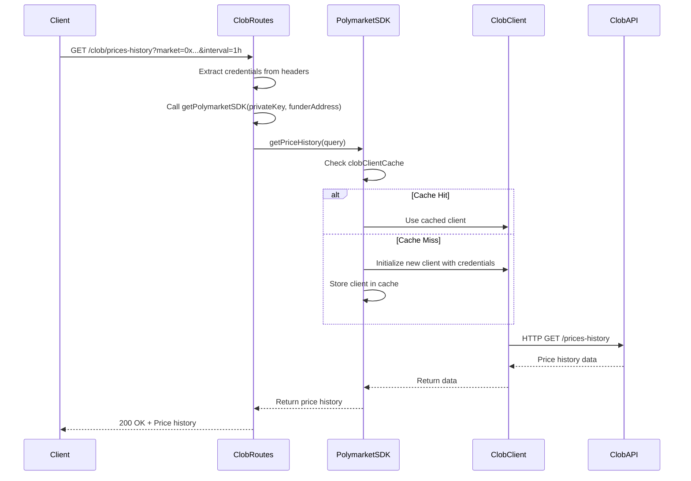
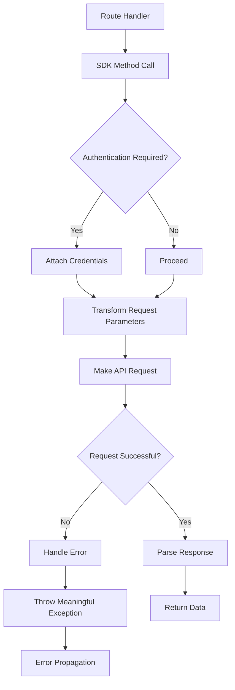

# SDK Integration

<cite>
**Referenced Files in This Document**   
- [gamma.ts](file://src/routes/gamma.ts)
- [clob.ts](file://src/routes/clob.ts)
- [gamma-client.ts](file://src/sdk/gamma-client.ts)
- [client.ts](file://src/sdk/client.ts)
- [index.ts](file://src/sdk/index.ts)
</cite>

## Table of Contents
1. [Introduction](#introduction)
2. [SDK Initialization and Instance Management](#sdk-initialization-and-instance-management)
3. [Gamma SDK Integration](#gamma-sdk-integration)
4. [CLOB SDK Integration](#clob-sdk-integration)
5. [Service Layer Responsibilities](#service-layer-responsibilities)
6. [Interface Contracts](#interface-contracts)
7. [Common Integration Issues](#common-integration-issues)
8. [Conclusion](#conclusion)

## Introduction
The polymarket-kit SDK integration pattern demonstrates how route handlers utilize the GammaSDK and PolymarketSDK classes to interact with external Polymarket services. The architecture separates concerns between the Gamma API (public data, no authentication) and CLOB API (authenticated trading operations). Route handlers in gamma.ts and clob.ts import these SDKs to perform actual API calls, with distinct initialization patterns for each SDK. The GammaSDK is instantiated directly with optional proxy configuration, while the PolymarketSDK uses a caching mechanism to manage authenticated client instances. This documentation details the integration patterns, service layer responsibilities, interface contracts, and common issues encountered when using these SDKs.

**Section sources**
- [gamma.ts](file://src/routes/gamma.ts)
- [clob.ts](file://src/routes/clob.ts)

## SDK Initialization and Instance Management
The polymarket-kit implements two distinct SDK initialization patterns based on the authentication requirements of the target API. The GammaSDK, used for public data access, follows a dependency injection pattern where instances are created fresh for each request based on incoming headers. In contrast, the PolymarketSDK, which requires authentication credentials, employs a caching strategy to optimize performance and resource usage.

The GammaSDK initialization occurs in the `gammaRoutes` Elysia plugin through the `derive` method, which creates a new GammaSDK instance for each request. This instance can be configured with proxy settings parsed from the `x-http-proxy` header, allowing for flexible routing of requests through intermediary servers. The simplicity of this approach is possible because the Gamma API does not require authentication, eliminating the need for credential management.

Conversely, the PolymarketSDK uses a more sophisticated initialization pattern involving caching. The `getPolymarketSDK` function manages a global LRU cache (`sdkCache`) that stores SDK instances keyed by a combination of private key and funder address. This caching mechanism prevents the expensive operation of reinitializing authenticated clients for every request. When a route handler needs a PolymarketSDK instance, it calls `getPolymarketSDK` with the required credentials, which first checks the cache before creating a new instance. This approach significantly improves performance in high-traffic scenarios while maintaining security by properly isolating credentials.

**Diagram sources**
- [gamma.ts](file://src/routes/gamma.ts#L50-L80)
- [clob.ts](file://src/routes/clob.ts#L25-L45)

**Section sources**
- [gamma.ts](file://src/routes/gamma.ts#L50-L80)
- [clob.ts](file://src/routes/clob.ts#L25-L45)

## Gamma SDK Integration
The GammaSDK integration in gamma.ts demonstrates a straightforward dependency injection pattern for accessing the Polymarket Gamma API. Route handlers import the GammaSDK from the SDK module and instantiate it within the Elysia plugin's `derive` method, making the SDK instance available to all route handlers through the request context.

The primary integration point is the `getEvents()` method, which is called from multiple route handlers in gamma.ts. For example, the `/events` endpoint directly invokes `gammaSDK.getEvents(query)` to retrieve events with specified filtering parameters. Similarly, the `/events/pagination` endpoint calls `gammaSDK.getEventsPaginated(query)` to fetch paginated event data. These method calls demonstrate the clean separation between route handling logic and API communication, with the SDK abstracting the underlying HTTP requests and response parsing.

The GammaSDK provides comprehensive coverage of the Gamma API endpoints, including sports, tags, events, markets, series, comments, and search functionality. Each route handler in gamma.ts maps directly to a corresponding method in the GammaSDK, maintaining a consistent pattern across the API surface. The integration also supports advanced features like proxy configuration, where the `x-http-proxy` header can be used to route requests through intermediary servers, providing flexibility for deployment scenarios that require specific network routing.

**Diagram sources**
- [gamma.ts](file://src/routes/gamma.ts#L150-L180)
- [gamma-client.ts](file://src/sdk/gamma-client.ts#L250-L280)

**Section sources**
- [gamma.ts](file://src/routes/gamma.ts#L150-L180)
- [gamma-client.ts](file://src/sdk/gamma-client.ts#L250-L280)

## CLOB SDK Integration
The CLOB SDK integration in clob.ts implements a caching-based pattern for managing authenticated connections to the Polymarket CLOB API. Unlike the GammaSDK, which can be instantiated freely, the PolymarketSDK requires authentication credentials and benefits from connection reuse, leading to the implementation of a sophisticated caching mechanism.

The integration begins with the `resolve` method in the `clobRoutes` Elysia plugin, which extracts authentication credentials from headers or environment variables and uses them to obtain a PolymarketSDK instance via the `getPolymarketSDK` function. This function serves as the gateway to the SDK cache, ensuring that authenticated client instances are reused when possible. The cache key is constructed from the private key, funder address, host, and chain ID, ensuring that each unique combination of credentials and configuration has its own isolated client instance.

A key integration example is the `getPriceHistory()` method, which is invoked from the `/prices-history` endpoint in clob.ts. The route handler calls `polymarketSDK.getPriceHistory()` with parameters including market identifier, time range, and interval specification. This method call demonstrates the abstraction provided by the SDK, which handles the complexities of authentication, request formatting, and response parsing. The integration also includes error handling that translates SDK-level errors into appropriate HTTP status codes, such as converting authentication failures to 401 responses and API errors to 500 responses.

**Diagram sources**
- [clob.ts](file://src/routes/clob.ts#L100-L130)
- [client.ts](file://src/sdk/client.ts#L150-L180)

**Section sources**
- [clob.ts](file://src/routes/clob.ts#L100-L130)
- [client.ts](file://src/sdk/client.ts#L150-L180)

## Service Layer Responsibilities
The service layer implemented in the GammaSDK and PolymarketSDK classes handles several critical responsibilities that abstract the complexities of API communication from the route handlers. These responsibilities include authentication management, request transformation, error handling, and caching strategies, providing a clean and consistent interface for consuming the Polymarket APIs.

Authentication management is primarily handled by the PolymarketSDK, which manages the lifecycle of authenticated CLOB client instances. The SDK automatically handles the creation and signing of API keys using the provided private key and funder address. It also manages the session state of the CLOB client, ensuring that authentication credentials are properly attached to all outgoing requests. In contrast, the GammaSDK has no authentication requirements, reflecting the public nature of the Gamma API.

Request transformation is a key responsibility of both SDKs, particularly in handling the conversion between high-level query parameters and the specific formats required by the underlying APIs. The PolymarketSDK's `getPriceHistory` method exemplifies this by transforming various date input formats (Unix timestamps or ISO strings) into the appropriate time range parameters for the CLOB API. Similarly, the GammaSDK transforms query objects into URL search parameters, handling array values and null/undefined values appropriately.

Error handling is implemented consistently across both SDKs, with methods wrapping API calls in try-catch blocks and translating low-level network or API errors into meaningful exceptions. Both SDKs provide detailed error messages that include the original error context, aiding in debugging and troubleshooting. The GammaSDK handles HTTP status codes like 404 (not found) by returning null values, while the PolymarketSDK propagates errors up to the route layer for appropriate HTTP status code mapping.

Caching strategies differ between the two SDKs based on their use cases. The PolymarketSDK implements a two-tier caching system: an LRU cache for SDK instances (`sdkCache`) and another for CLOB client instances (`clobClientCache`). This prevents the expensive operation of reinitializing authenticated clients for every request. The GammaSDK does not implement caching at the SDK level, leaving caching decisions to the caller, though it does support proxy-based caching through the `x-http-proxy` header.

**Diagram sources**
- [client.ts](file://src/sdk/client.ts#L50-L200)
- [gamma-client.ts](file://src/sdk/gamma-client.ts#L50-L200)

**Section sources**
- [client.ts](file://src/sdk/client.ts#L50-L200)
- [gamma-client.ts](file://src/sdk/gamma-client.ts#L50-L200)

## Interface Contracts
The interface contracts between route handlers and SDKs in polymarket-kit are defined through TypeScript interfaces and method signatures that ensure type safety and consistency across the integration points. These contracts specify the parameter types, return value structures, and error conditions for all SDK methods, providing a clear and predictable API surface.

For the GammaSDK, the interface contract is defined by methods like `getEvents(query: UpdatedEventQueryType): Promise<EventType[]>` and `getEventById(id: number, query?: EventByIdQueryType): Promise<EventType | null>`. These signatures specify that the `getEvents` method accepts a query object conforming to `UpdatedEventQueryType` and returns a promise resolving to an array of `EventType` objects. The `getEventById` method demonstrates optional parameters and nullable return types, accurately reflecting the API's behavior where requests for non-existent resources return null.

The PolymarketSDK interface contract is exemplified by methods like `getPriceHistory(query: PriceHistoryQuery): Promise<PriceHistoryResponse>` and `healthCheck(): Promise<HealthCheckResponse>`. The `getPriceHistory` method accepts a comprehensive query object with parameters for market identifier, time range, interval, and fidelity, returning a structured response containing price history data and time range information. The `healthCheck` method returns a detailed status object that includes connection status, timestamp, and caching information, enabling comprehensive health monitoring.

Both SDKs use TypeScript generics and utility types to ensure type safety throughout the API surface. The route handlers in gamma.ts and clob.ts leverage these contracts through Elysia's type validation system, which automatically validates incoming requests against the specified query, params, and body schemas. This end-to-end type safety ensures that data flows correctly from the HTTP layer through the SDK to the external APIs, with appropriate error handling at each boundary.

**Section sources**
- [gamma-client.ts](file://src/sdk/gamma-client.ts#L250-L300)
- [client.ts](file://src/sdk/client.ts#L150-L200)
- [gamma.ts](file://src/routes/gamma.ts#L150-L200)
- [clob.ts](file://src/routes/clob.ts#L100-L150)

## Common Integration Issues
Several common integration issues can arise when using the polymarket-kit SDKs, particularly related to authentication failures, caching inconsistencies, and error propagation from SDK to API layer. Understanding these issues and their solutions is critical for maintaining reliable integration with Polymarket services.

Authentication failures are the most common issue with the PolymarketSDK, typically occurring when invalid or missing credentials are provided. In production environments, the SDK requires both `x-polymarket-key` and `x-polymarket-funder` headers, while development environments allow fallback to environment variables. Missing or malformed credentials result in initialization errors that propagate up to the route layer. To mitigate this, applications should validate credentials before SDK initialization and provide clear error messages that distinguish between missing credentials and authentication rejection by the API.

Caching inconsistencies can occur when the LRU cache for SDK instances becomes stale or when memory pressure causes premature eviction of client instances. This can lead to increased latency as new authenticated clients must be reinitialized. The SDK provides cache management methods like `clearCache()` and `clearAllCache()` to address these issues, allowing applications to force refresh client instances when needed. Monitoring cache hit rates through the `/cache/stats` endpoint can help identify when cache sizing needs adjustment.

Error propagation from the SDK to API layer requires careful handling to maintain API contract integrity. Both SDKs wrap underlying errors in meaningful exceptions, but route handlers must translate these into appropriate HTTP status codes. For example, a 404 response from the Gamma API should result in a 404 HTTP status, while authentication failures with the CLOB API should return 401 status codes. Improper error handling can lead to misleading responses, such as returning 500 errors for client-side issues that should be 4xx status codes.

Network-related issues, particularly with proxy configuration for the GammaSDK, can also cause integration problems. Malformed proxy URLs in the `x-http-proxy` header can prevent SDK initialization, though the current implementation gracefully falls back to direct connections. Applications should validate proxy configurations before use and monitor for connectivity issues that may indicate proxy server problems.

**Section sources**
- [clob.ts](file://src/routes/clob.ts#L30-L50)
- [client.ts](file://src/sdk/client.ts#L200-L250)
- [gamma.ts](file://src/routes/gamma.ts#L60-L80)

## Conclusion
The SDK integration pattern in polymarket-kit demonstrates a robust approach to consuming Polymarket APIs through well-defined service layers that abstract authentication, request transformation, error handling, and caching. The dual SDK architecture separates concerns between public data access (GammaSDK) and authenticated trading operations (PolymarketSDK), each with appropriate initialization patterns and service responsibilities. The GammaSDK's dependency injection model provides flexibility for proxy-based routing, while the PolymarketSDK's caching strategy optimizes performance for authenticated operations. Clear interface contracts ensure type safety throughout the integration, and comprehensive error handling enables reliable operation in production environments. By understanding the initialization patterns, service layer responsibilities, and common integration issues, developers can effectively leverage these SDKs to build reliable applications on top of the Polymarket platform.