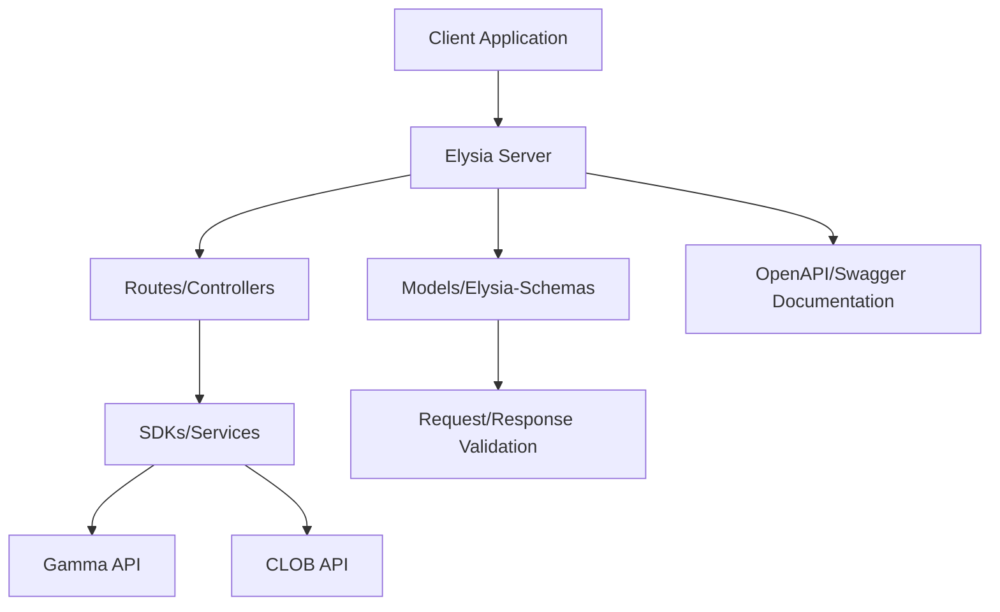
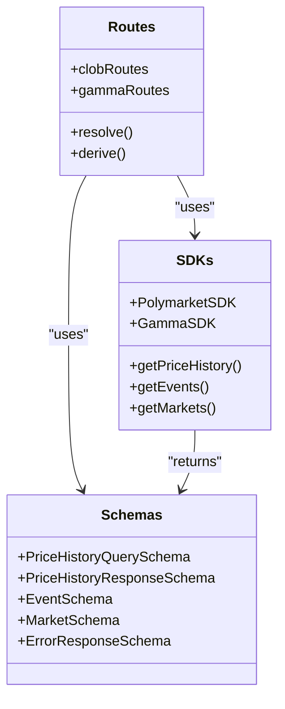
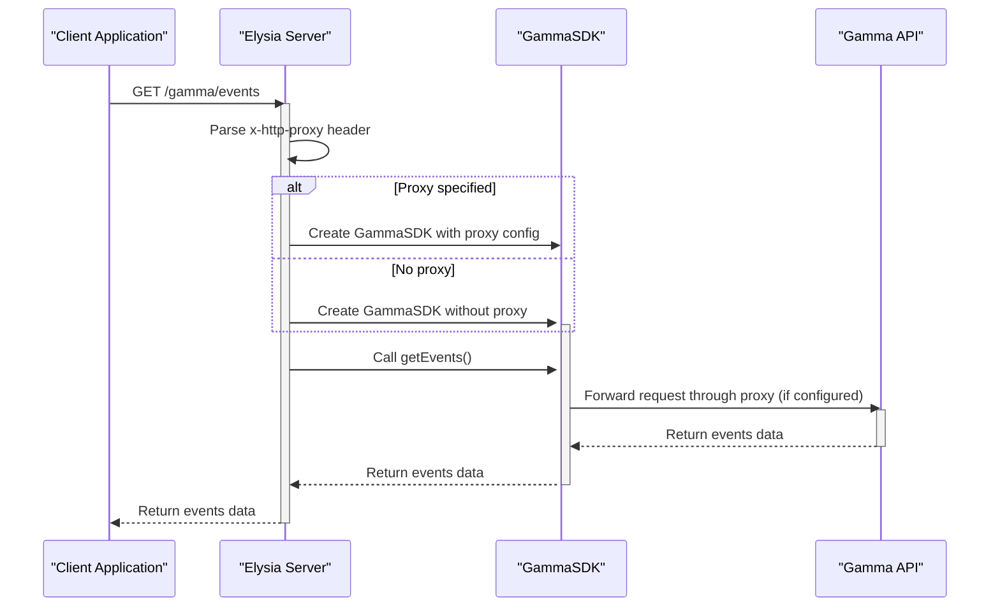
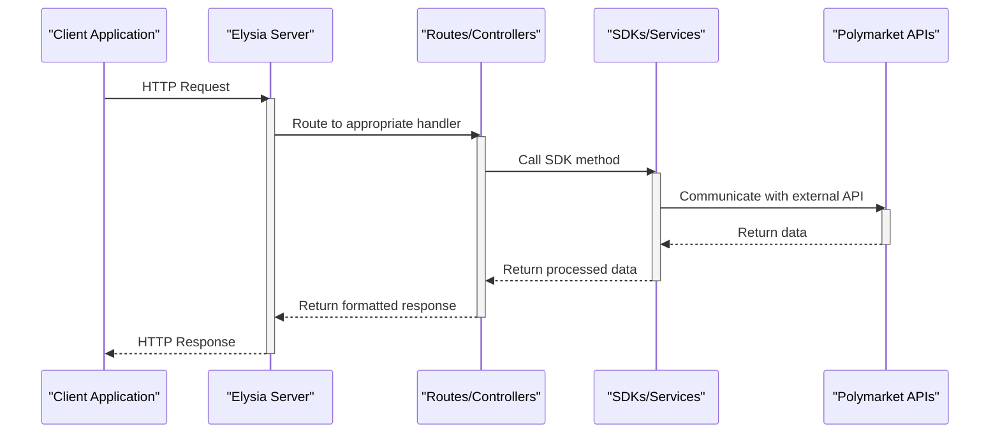
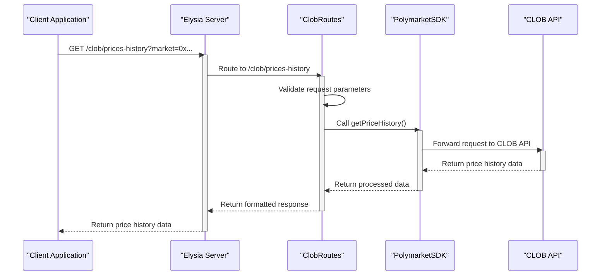
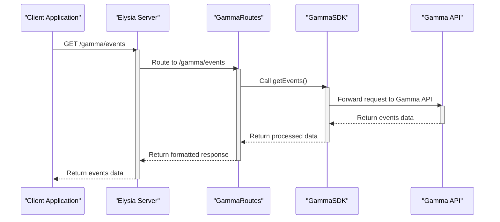
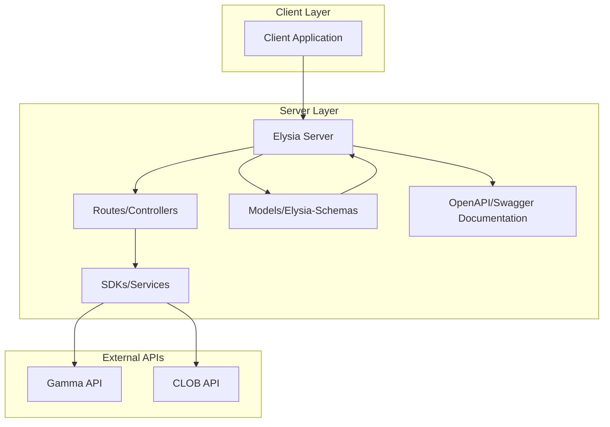

# Core Architecture

<cite>
**Referenced Files in This Document**   
- [index.ts](file://src/index.ts)
- [clob.ts](file://src/routes/clob.ts)
- [gamma.ts](file://src/routes/gamma.ts)
- [client.ts](file://src/sdk/client.ts)
- [gamma-client.ts](file://src/sdk/gamma-client.ts)
- [elysia-schemas.ts](file://src/types/elysia-schemas.ts)
</cite>

## Table of Contents
1. [Introduction](#introduction)
2. [Architecture Overview](#architecture-overview)
3. [MVC-like Pattern Implementation](#mvc-like-pattern-implementation)
4. [Proxy Pattern Implementation](#proxy-pattern-implementation)
5. [Component Interactions](#component-interactions)
6. [Technology Stack Decisions](#technology-stack-decisions)
7. [Sequence Diagrams](#sequence-diagrams)
8. [Component Diagram](#component-diagram)
9. [Conclusion](#conclusion)

## Introduction
The polymarket-kit is a fully typed API translation layer built on Elysia.js that serves as a proxy between clients and Polymarket's Gamma and CLOB APIs. This architectural documentation details the core components, patterns, and interactions that enable this proxy server to provide type-safe endpoints with comprehensive validation and automatic OpenAPI schema generation. The system implements an MVC-like pattern where routes act as controllers, SDKs serve as services, and elysia-schemas define models, creating a clean separation of concerns and enhancing maintainability.

**Section sources**
- [index.ts](file://src/index.ts#L1-L165)

## Architecture Overview
The polymarket-kit architecture is designed as a typed API translation layer that acts as a proxy between clients and Polymarket's Gamma and CLOB APIs. Built on Elysia.js, the server provides type-safe endpoints with comprehensive validation and OpenAPI schema generation. The architecture follows an MVC-like pattern where routes function as controllers, SDKs serve as services, and elysia-schemas define models. This separation of concerns ensures that each component has a single responsibility, making the system more maintainable and easier to understand.

The server receives requests through Elysia's routing system, which directs them to appropriate handlers based on the requested endpoint. These handlers then use SDK instances to communicate with external Polymarket APIs, transforming and returning the data to clients. The architecture supports both REST API access and MCP server integration, making it versatile for various use cases. The system also includes comprehensive error handling, CORS support, and health checks to ensure reliability and security.

**Diagram sources**
- [index.ts](file://src/index.ts#L1-L165)
- [clob.ts](file://src/routes/clob.ts#L1-L799)
- [gamma.ts](file://src/routes/gamma.ts#L1-L724)

**Section sources**
- [index.ts](file://src/index.ts#L1-L165)
- [clob.ts](file://src/routes/clob.ts#L1-L799)
- [gamma.ts](file://src/routes/gamma.ts#L1-L724)

## MVC-like Pattern Implementation
The polymarket-kit implements an MVC-like pattern where routes act as controllers, SDKs serve as services, and elysia-schemas define models. This architectural approach provides a clear separation of concerns, making the codebase more maintainable and easier to understand. The routes (controllers) handle incoming requests, validate parameters, and coordinate with the appropriate SDK (service) to fulfill the request. The SDKs encapsulate the business logic and communication with external APIs, while the elysia-schemas define the data models and ensure type safety throughout the system.

The elysia-schemas in the types directory define the models used throughout the application, including request and response schemas for various API endpoints. These schemas are used for request validation, response validation, and OpenAPI documentation generation. The routes in the routes directory serve as controllers, defining the endpoints and their behavior. They use the schemas to validate incoming requests and outgoing responses, ensuring type safety. The SDKs in the sdk directory act as services, providing a high-level interface to the Polymarket APIs and handling authentication, caching, and error handling.

**Diagram sources**
- [clob.ts](file://src/routes/clob.ts#L1-L799)
- [gamma.ts](file://src/routes/gamma.ts#L1-L724)
- [client.ts](file://src/sdk/client.ts#L1-L387)
- [gamma-client.ts](file://src/sdk/gamma-client.ts#L1-L799)
- [elysia-schemas.ts](file://src/types/elysia-schemas.ts#L1-L799)

**Section sources**
- [clob.ts](file://src/routes/clob.ts#L1-L799)
- [gamma.ts](file://src/routes/gamma.ts#L1-L724)
- [client.ts](file://src/sdk/client.ts#L1-L387)
- [gamma-client.ts](file://src/sdk/gamma-client.ts#L1-L799)
- [elysia-schemas.ts](file://src/types/elysia-schemas.ts#L1-L799)

## Proxy Pattern Implementation
The polymarket-kit implements a proxy pattern that intercepts client requests, optionally applies proxy configuration via the x-http-proxy header, and forwards requests to upstream Polymarket APIs. This pattern allows the server to act as an intermediary between clients and the Polymarket APIs, providing additional functionality such as authentication, caching, and request transformation. The proxy configuration is particularly useful for the Gamma API, where requests can be routed through a specified proxy server for enhanced privacy or to bypass network restrictions.

The proxy functionality is implemented in the gammaRoutes module, which uses the x-http-proxy header to determine the proxy configuration for outgoing requests. When a request is received with this header, the server parses the proxy string and configures the HTTP client to route requests through the specified proxy server. This allows clients to control the network path of their requests, which can be useful for various scenarios such as accessing the API from restricted networks or using different proxy servers for load balancing.

**Diagram sources**
- [gamma.ts](file://src/routes/gamma.ts#L1-L724)
- [gamma-client.ts](file://src/sdk/gamma-client.ts#L1-L799)

**Section sources**
- [gamma.ts](file://src/routes/gamma.ts#L1-L724)
- [gamma-client.ts](file://src/sdk/gamma-client.ts#L1-L799)

## Component Interactions
The component interactions in the polymarket-kit architecture demonstrate how the Elysia server receives requests, routes them to appropriate handlers, which then use SDK instances to communicate with external APIs. The server acts as the central component, receiving incoming HTTP requests and directing them to the appropriate route handlers based on the requested endpoint. These handlers, defined in the routes directory, serve as controllers that validate request parameters, coordinate with the appropriate SDK, and format the response.

The SDKs, located in the sdk directory, act as services that encapsulate the business logic and communication with the Polymarket APIs. When a route handler needs to interact with an external API, it calls the appropriate method on the SDK instance. The SDK handles authentication, caching, and error handling, providing a clean interface for the route handlers to use. This separation of concerns ensures that the route handlers remain focused on request handling and response formatting, while the SDKs manage the complexities of API communication.

**Diagram sources**
- [index.ts](file://src/index.ts#L1-L165)
- [clob.ts](file://src/routes/clob.ts#L1-L799)
- [gamma.ts](file://src/routes/gamma.ts#L1-L724)
- [client.ts](file://src/sdk/client.ts#L1-L387)
- [gamma-client.ts](file://src/sdk/gamma-client.ts#L1-L799)

**Section sources**
- [index.ts](file://src/index.ts#L1-L165)
- [clob.ts](file://src/routes/clob.ts#L1-L799)
- [gamma.ts](file://src/routes/gamma.ts#L1-L724)
- [client.ts](file://src/sdk/client.ts#L1-L387)
- [gamma-client.ts](file://src/sdk/gamma-client.ts#L1-L799)

## Technology Stack Decisions
The technology stack decisions for the polymarket-kit are centered around Elysia.js, chosen for its performance and type safety. Elysia.js provides a robust foundation for building the API translation layer, offering features such as request validation, OpenAPI schema generation, and middleware support. The use of TypeScript throughout the codebase ensures type safety, reducing the likelihood of runtime errors and improving developer productivity. The combination of Elysia.js and TypeScript enables the creation of a fully typed proxy server with comprehensive validation and automatic OpenAPI documentation.

The architecture supports both REST API access and MCP server integration, making it versatile for various use cases. The use of Elysia.js allows for seamless integration with other tools and frameworks, while the modular design of the codebase makes it easy to extend and maintain. The decision to use Elysia.js also aligns with the project's goal of providing a high-performance, type-safe API translation layer that can handle a large volume of requests efficiently.

**Section sources**
- [index.ts](file://src/index.ts#L1-L165)
- [package.json](file://package.json#L1-L55)

## Sequence Diagrams
The sequence diagrams illustrate the request flow and component interactions in the polymarket-kit architecture. These diagrams provide a visual representation of how the system processes incoming requests, from the initial HTTP request to the final response. The diagrams highlight the role of each component in the request processing pipeline and demonstrate the flow of data between components.

### CLOB API Request Flow

**Diagram sources**
- [clob.ts](file://src/routes/clob.ts#L1-L799)
- [client.ts](file://src/sdk/client.ts#L1-L387)

### Gamma API Request Flow

**Diagram sources**
- [gamma.ts](file://src/routes/gamma.ts#L1-L724)
- [gamma-client.ts](file://src/sdk/gamma-client.ts#L1-L799)

## Component Diagram
The component diagram provides a high-level view of the system layout, showing the main components and their relationships. This diagram illustrates how the different parts of the system work together to provide the API translation functionality.

**Diagram sources**
- [index.ts](file://src/index.ts#L1-L165)
- [clob.ts](file://src/routes/clob.ts#L1-L799)
- [gamma.ts](file://src/routes/gamma.ts#L1-L724)
- [client.ts](file://src/sdk/client.ts#L1-L387)
- [gamma-client.ts](file://src/sdk/gamma-client.ts#L1-L799)
- [elysia-schemas.ts](file://src/types/elysia-schemas.ts#L1-L799)

**Section sources**
- [index.ts](file://src/index.ts#L1-L165)
- [clob.ts](file://src/routes/clob.ts#L1-L799)
- [gamma.ts](file://src/routes/gamma.ts#L1-L724)
- [client.ts](file://src/sdk/client.ts#L1-L387)
- [gamma-client.ts](file://src/sdk/gamma-client.ts#L1-L799)
- [elysia-schemas.ts](file://src/types/elysia-schemas.ts#L1-L799)

## Conclusion
The polymarket-kit architecture effectively implements a typed API translation layer built on Elysia.js that acts as a proxy between clients and Polymarket's Gamma and CLOB APIs. By following an MVC-like pattern where routes act as controllers, SDKs serve as services, and elysia-schemas define models, the system achieves a clean separation of concerns and enhanced maintainability. The proxy pattern implementation allows for flexible routing of requests, including optional proxy configuration via the x-http-proxy header. The component interactions demonstrate a well-structured flow from request reception to response generation, with the Elysia server coordinating between routes, SDKs, and external APIs. The technology stack decisions, particularly the use of Elysia.js for its performance and type safety, support both REST API access and MCP server integration, making the system versatile and efficient.