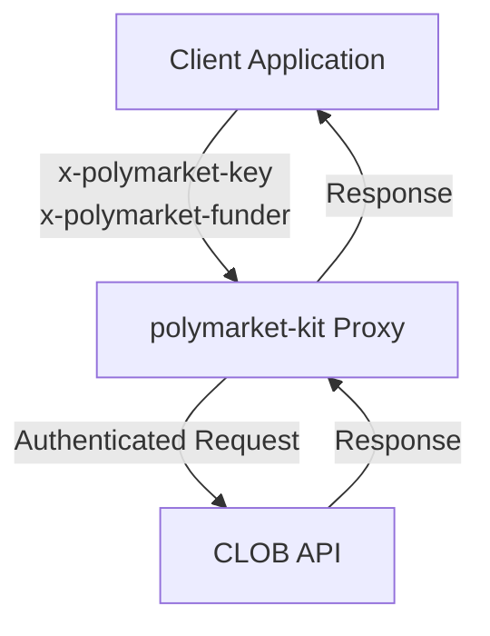
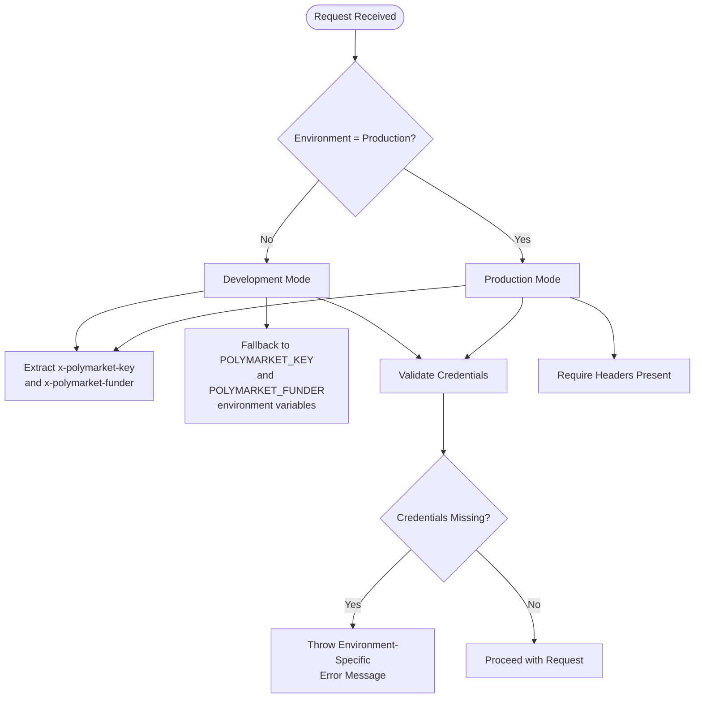
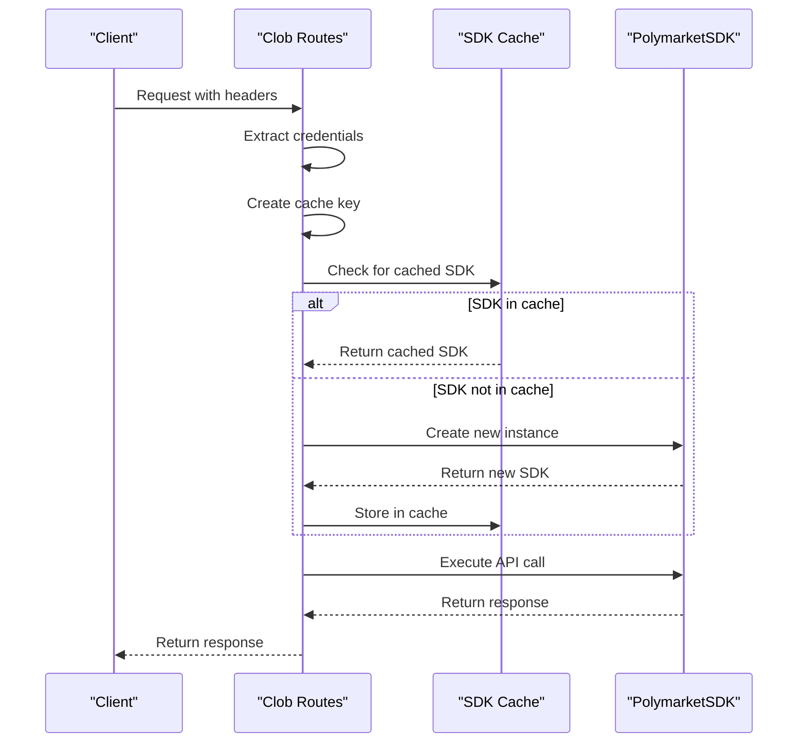
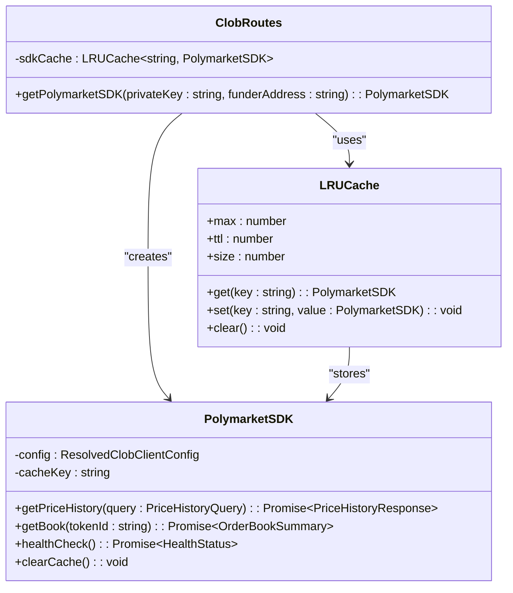
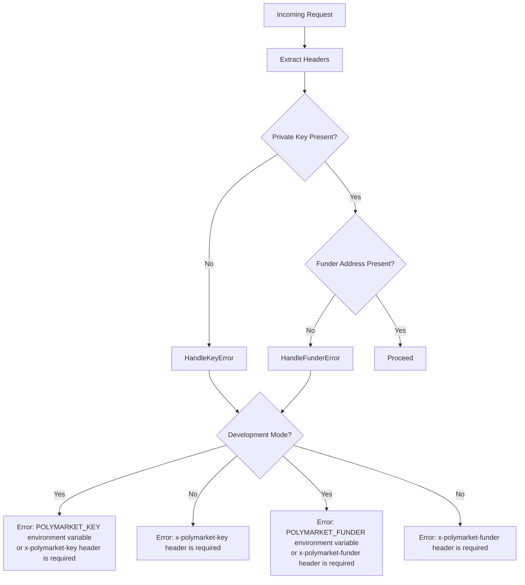

# Authentication Forwarding

<cite>
**Referenced Files in This Document**   
- [clob.ts](file://src/routes/clob.ts)
- [client.ts](file://src/sdk/client.ts)
- [env.ts](file://src/utils/env.ts)
</cite>

## Table of Contents
1. [Introduction](#introduction)
2. [Authentication Headers](#authentication-headers)
3. [Environment-Based Authentication Model](#environment-based-authentication-model)
4. [SDK Instance Management](#sdk-instance-management)
5. [LRUCache Implementation](#lrucache-implementation)
6. [Error Handling and Validation](#error-handling-and-validation)
7. [Common Issues and Troubleshooting](#common-issues-and-troubleshooting)
8. [Security Model](#security-model)

## Introduction
The polymarket-kit implements a robust authentication forwarding mechanism for secure communication with the CLOB API. This system uses custom HTTP headers to forward authentication credentials while providing development-friendly fallbacks to environment variables. The authentication system is designed with security, performance, and developer experience in mind, implementing caching strategies to optimize repeated requests while maintaining strict security requirements in production environments.

**Section sources**
- [clob.ts](file://src/routes/clob.ts#L1-L50)

## Authentication Headers
The authentication system relies on two custom HTTP headers for credential transmission:

- **x-polymarket-key**: Contains the private key used for CLOB authentication
- **x-polymarket-funder**: Contains the funder address for CLOB operations

These headers are required for all requests to the CLOB API endpoints in production environments. The header-based authentication approach ensures that credentials are securely transmitted with each request while maintaining compatibility with standard HTTP authentication patterns.

The system is case-sensitive regarding header names, requiring exact matching of the header format. Documentation and API specifications clearly indicate these requirements to prevent common issues related to incorrect header casing.

**Diagram sources**
- [clob.ts](file://src/routes/clob.ts#L50-L100)

**Section sources**
- [clob.ts](file://src/routes/clob.ts#L50-L100)

## Environment-Based Authentication Model
The authentication system implements different behavior based on the execution environment, determined by the NODE_ENV environment variable:

In development mode (when NODE_ENV is "development" or not set), the system attempts to extract credentials from the x-polymarket-key and x-polymarket-funder headers but falls back to environment variables (POLYMARKET_KEY and POLYMARKET_FUNDER) if headers are not present. This provides flexibility for local development and testing.

In production mode, the system strictly requires the presence of both headers, with no fallback to environment variables. This security model prevents accidental exposure of credentials through environment variables in production environments.

**Section sources**
- [clob.ts](file://src/routes/clob.ts#L35-L105)
- [env.ts](file://src/utils/env.ts#L1-L3)

## SDK Instance Management
The system implements efficient SDK instance management through a caching mechanism that prevents unnecessary reinitialization of PolymarketSDK instances for repeated requests with the same credentials.

When a request is received, the system follows this process:
1. Extract authentication credentials (private key and funder address)
2. Create a cache key by combining the privateKey and funderAddress
3. Check if a PolymarketSDK instance already exists for this cache key
4. If found, return the cached instance
5. If not found, create a new instance and store it in the cache

This approach ensures that SDK instances are reused when possible, reducing initialization overhead and improving performance for frequently accessed endpoints with the same credentials.

**Diagram sources**
- [clob.ts](file://src/routes/clob.ts#L107-L150)

**Section sources**
- [clob.ts](file://src/routes/clob.ts#L107-L150)

## LRUCache Implementation
The system utilizes an LRUCache (Least Recently Used Cache) to store PolymarketSDK instances, optimizing memory usage and performance. The cache is configured with environment-controlled parameters:

- **Max size**: Controlled by SDK_CACHE_MAX_SIZE environment variable (default: 50)
- **TTL**: Controlled by SDK_CACHE_TTL_HOURS environment variable (default: 1 hour)
- **Update age on get**: Enabled to reset the TTL when an SDK instance is accessed

The cache key is created by combining the privateKey and funderAddress with the format "privateKey_funderAddress". This ensures that different credential combinations result in separate cache entries.

The LRUCache implementation automatically removes the least recently used entries when the cache reaches its maximum size, preventing unbounded memory growth. The TTL setting ensures that cached SDK instances are periodically refreshed, which can help recover from potential connection issues or credential changes.

**Diagram sources**
- [clob.ts](file://src/routes/clob.ts#L25-L33)
- [client.ts](file://src/sdk/client.ts#L15-L25)

**Section sources**
- [clob.ts](file://src/routes/clob.ts#L25-L33)
- [client.ts](file://src/sdk/client.ts#L15-L25)

## Error Handling and Validation
The authentication system implements comprehensive error handling with environment-specific error messages to guide developers during development while maintaining security in production.

When authentication credentials are missing, the system throws errors with different messages based on the environment:

In development mode, error messages explicitly mention both the header and environment variable options, helping developers understand the available authentication methods. In production mode, error messages only reference the required headers, avoiding any disclosure of alternative authentication methods that could be exploited.

The validation occurs early in the request lifecycle through the Elysia resolve hook, ensuring that invalid requests are rejected before any further processing occurs.

**Section sources**
- [clob.ts](file://src/routes/clob.ts#L80-L105)

## Common Issues and Troubleshooting
Several common issues may arise when working with the authentication forwarding mechanism:

### Header Casing Issues
HTTP headers are case-insensitive by specification, but implementation details may cause issues. Ensure that headers are sent with the exact case:
- Correct: `x-polymarket-key`, `x-polymarket-funder`
- Incorrect: `X-Polymarket-Key`, `X-POLYMARKET-FUNDER`

Some HTTP clients or proxies may normalize header casing, which could potentially cause issues if the framework does not handle case normalization properly.

### Authentication Failures
Authentication failures can occur due to:
- Missing or malformed private key
- Invalid funder address format
- Network issues preventing credential validation
- Expired or revoked credentials

When troubleshooting authentication failures, first verify that the correct headers are being sent with properly formatted values. Use the health check endpoint to test authentication independently of other API functionality.

### Cache Invalidation Scenarios
The SDK cache may need to be invalidated in several scenarios:
- Credential rotation or changes
- Connection issues with the CLOB API
- Testing different authentication configurations

The PolymarketSDK class provides methods for cache management:
- `clearCache()`: Clears the cache for a specific SDK instance
- `clearAllCache()`: Clears all cached CLOB clients globally
- `getCacheStats()`: Returns current cache size and maximum size

These methods allow for programmatic cache management during development and debugging.

**Section sources**
- [clob.ts](file://src/routes/clob.ts#L150-L200)
- [client.ts](file://src/sdk/client.ts#L350-L386)

## Security Model
The authentication forwarding mechanism implements a layered security model designed to balance developer convenience with production security requirements.

The core principle is environment-based security escalation:
- **Development**: Flexible authentication with multiple options (headers or environment variables)
- **Production**: Strict header-only authentication with no fallback options

This model ensures that developers can work efficiently during development while preventing accidental security vulnerabilities in production. The requirement for headers in production prevents credentials from being accidentally exposed through environment variables, which may be visible in logs or debugging tools.

The system also implements several additional security measures:
- Credential validation at the earliest possible point in the request lifecycle
- No logging of authentication credentials
- Time-limited caching of SDK instances
- Isolation of credentials by user (each privateKey_funderAddress combination has a separate cache entry)

The security model assumes that the proxy server is deployed in a trusted environment where header manipulation is not possible. The proxy acts as a trusted intermediary between clients and the CLOB API, handling authentication on behalf of clients while maintaining credential confidentiality.

**Section sources**
- [clob.ts](file://src/routes/clob.ts#L35-L105)
- [client.ts](file://src/sdk/client.ts#L54-L100)