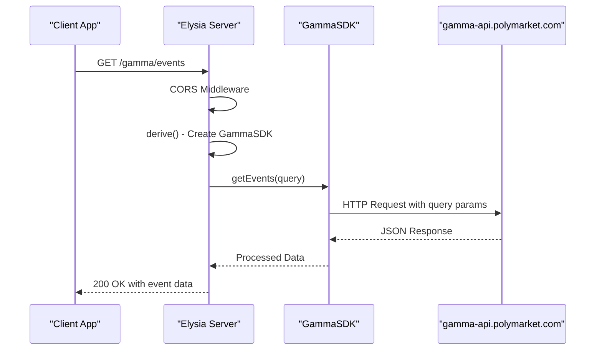
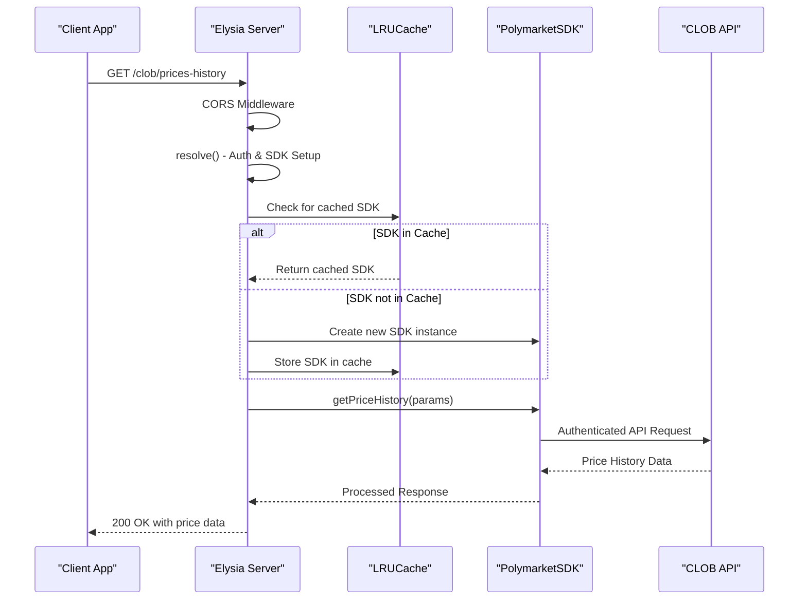
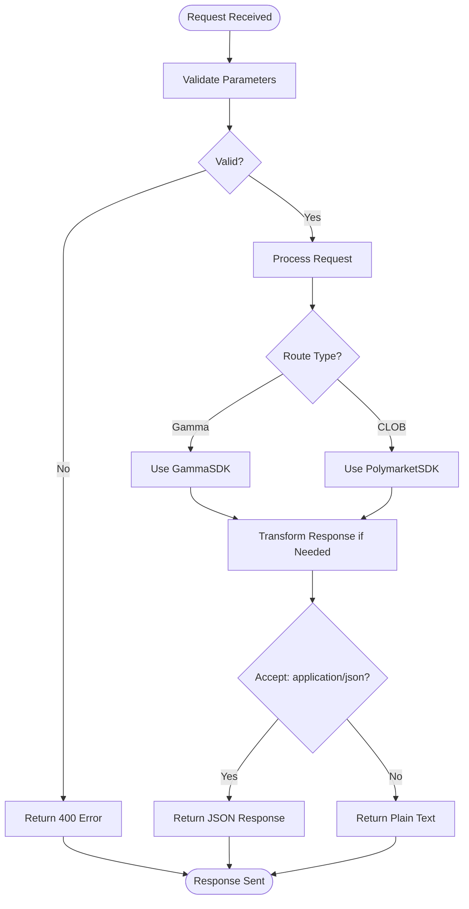

# Request Lifecycle

<cite>
**Referenced Files in This Document**   
- [index.ts](file://src/index.ts)
- [gamma.ts](file://src/routes/gamma.ts)
- [clob.ts](file://src/routes/clob.ts)
- [gamma-client.ts](file://src/sdk/gamma-client.ts)
- [elysia-schemas.ts](file://src/types/elysia-schemas.ts)
- [markdown-formatters.ts](file://src/utils/markdown-formatters.ts)
</cite>

## Table of Contents
1. [Introduction](#introduction)
2. [Request Routing and Middleware Execution](#request-routing-and-middleware-execution)
3. [Gamma Route Processing](#gamma-route-processing)
4. [CLOB Route Processing](#clob-route-processing)
5. [Parameter Validation and Error Handling](#parameter-validation-and-error-handling)
6. [Response Generation and Delivery](#response-generation-and-delivery)
7. [Conclusion](#conclusion)

## Introduction
This document details the complete request lifecycle in the polymarket-kit application, tracing the journey from client request to final response. The system uses Elysia as a framework to handle HTTP requests to routes under `/gamma` and `/clob` prefixes. The lifecycle encompasses routing, middleware execution, authentication, parameter validation, API calls through SDKs, response transformation, and error handling at each stage. The document explains how different routes are processed based on their specific requirements, with Gamma routes focusing on public data access and CLOB routes requiring authentication credentials.

## Request Routing and Middleware Execution

When a client sends an HTTP request to a route under `/gamma` or `/clob`, the Elysia framework routes it to the appropriate handler based on the method and path. The request first passes through global middleware defined in the application setup, including CORS and error handling. The CORS middleware allows all origins in development mode and supports standard HTTP methods. The global error handler intercepts various error types and returns appropriate HTTP status codes and error messages. For validation errors, a 400 status is returned; for not-found resources, a 404 status is returned; and for unexpected errors, a 500 status is returned. The application structure in `index.ts` sets up these global configurations and mounts the route modules for Gamma and CLOB APIs.

**Section sources**
- [index.ts](file://src/index.ts#L1-L165)

## Gamma Route Processing

For routes under the `/gamma` prefix, the application uses the `derive()` function to instantiate a GammaSDK instance before handling the request. This preprocessing step examines the `x-http-proxy` header to configure proxy settings for the SDK. If the header is present, the proxy string is parsed into a ProxyConfigType object containing protocol, host, port, and optional authentication credentials. The parsing function handles various formats including basic URLs, authenticated proxies, and different protocols. If proxy parsing fails, the system logs a warning and creates the SDK without proxy configuration. The GammaSDK, defined in `gamma-client.ts`, provides methods for accessing public data from the Gamma API without requiring authentication. Each route handler then uses this pre-configured SDK instance to make the appropriate API call to retrieve data such as events, markets, tags, or comments.

**Diagram sources**
- [gamma.ts](file://src/routes/gamma.ts#L1-L724)
- [gamma-client.ts](file://src/sdk/gamma-client.ts#L1-L891)

## CLOB Route Processing

Routes under the `/clob` prefix follow a different preprocessing pattern using the `resolve()` function to handle authentication and SDK instantiation. The system first determines whether it's running in development or production mode. In development mode, authentication credentials can come from either HTTP headers (`x-polymarket-key` and `x-polymarket-funder`) or environment variables, providing flexibility for testing. In production mode, these headers are required. The credentials are used to either retrieve an existing PolymarketSDK instance from an LRU cache or create a new one if not already cached. The caching mechanism, implemented with LRUCache, stores SDK instances keyed by the combination of private key and funder address, with configurable maximum size and TTL (time-to-live). This caching strategy prevents unnecessary SDK recreation on subsequent requests with the same credentials, improving performance. The PolymarketSDK handles authenticated operations on the CLOB API, such as retrieving price history, order books, or executing trades.

**Diagram sources**
- [clob.ts](file://src/routes/clob.ts#L1-L1013)
- [gamma-client.ts](file://src/sdk/gamma-client.ts#L1-L891)

## Parameter Validation and Error Handling

Both Gamma and CLOB routes implement comprehensive parameter validation using Zod schemas defined in `elysia-schemas.ts`. Each route handler specifies the expected query parameters, request body structure, and response format through Elysia's type system. For example, the `/clob/prices-history` endpoint validates that the `market` parameter is present and that time range parameters are correctly formatted. The Gamma routes use schemas like `EventByIdQuerySchema` and `MarketQuerySchema` to ensure request parameters meet the API requirements. When validation fails, the global error handler intercepts the `VALIDATION` error code and returns a 400 status with details about the invalid parameters. The system also handles specific API errors, such as returning a 404 status when a requested resource is not found (e.g., when `getTagById` returns null). For CLOB routes, additional error handling is implemented within the route handlers to distinguish between different types of failures, such as "No orderbook exists" errors which are mapped to 404 status codes, while other errors result in 500 status codes.

**Section sources**
- [gamma.ts](file://src/routes/gamma.ts#L1-L724)
- [clob.ts](file://src/routes/clob.ts#L1-L1013)
- [elysia-schemas.ts](file://src/types/elysia-schemas.ts#L1-L1023)

## Response Generation and Delivery

After successful processing, the system generates and delivers responses according to the specific route requirements. For Gamma routes, a notable feature is the transformation of event data into markdown format, particularly for the `/events/:id/markdown` and `/events/slug/:slug/markdown` endpoints. These routes use the `formatEventToMarkdown` function from `markdown-formatters.ts` to convert event data into a structured markdown format optimized for LLM analysis. The function supports different verbosity levels (0-2) and can include market details based on query parameters. The response format depends on the Accept header: if the client requests `application/json`, the markdown is returned as a JSON object with a "markdown" field; otherwise, plain text markdown is returned with the appropriate content-type header. For other routes, the raw data from the SDK calls is returned directly, with Elysia automatically handling the JSON serialization. The system also implements specific response transformations, such as parsing JSON string fields in market and event data to ensure proper array formatting in the response.

**Diagram sources**
- [gamma.ts](file://src/routes/gamma.ts#L1-L724)
- [clob.ts](file://src/routes/clob.ts#L1-L1013)
- [markdown-formatters.ts](file://src/utils/markdown-formatters.ts#L1-L355)

## Conclusion
The request lifecycle in polymarket-kit follows a well-defined pattern from client request to final response. The system leverages Elysia's routing and middleware capabilities to handle requests to both Gamma and CLOB APIs. Gamma routes focus on public data access with optional proxy configuration, while CLOB routes require authentication and implement caching for improved performance. Comprehensive parameter validation using Zod schemas ensures data integrity, and robust error handling provides meaningful feedback for various failure scenarios. The response generation phase includes specialized transformations, particularly the markdown formatting for event data, which is optimized for LLM analysis. This architecture provides a type-safe, well-structured interface to the Polymarket APIs with clear separation of concerns and efficient resource management.