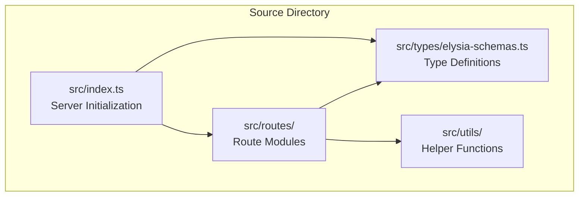
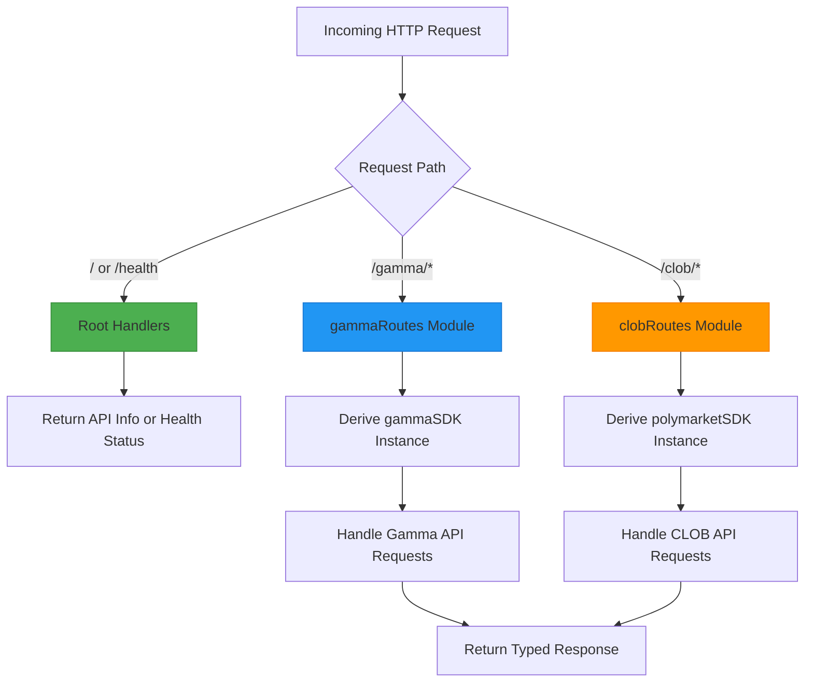
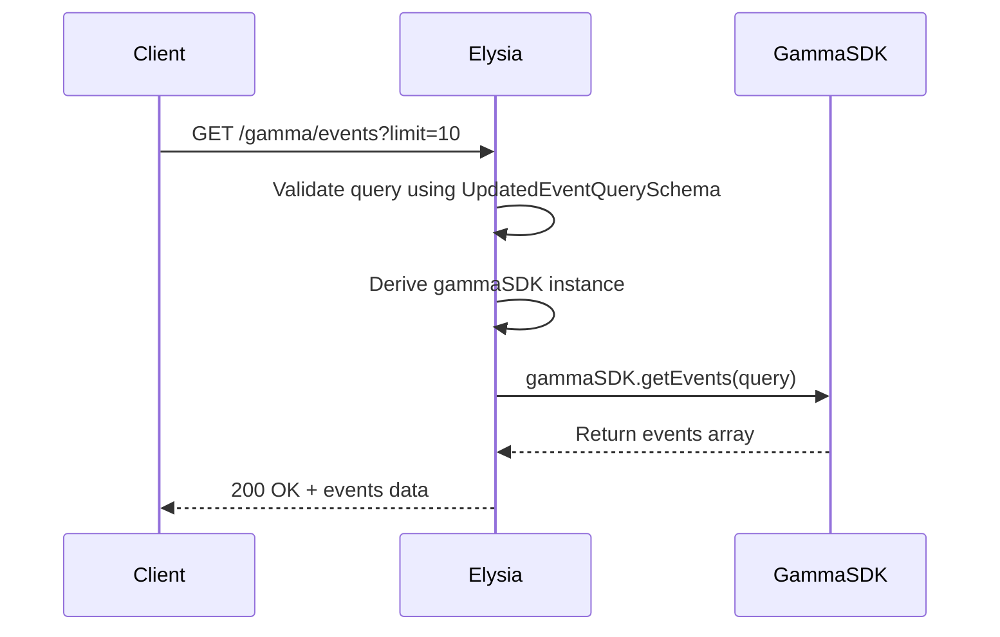
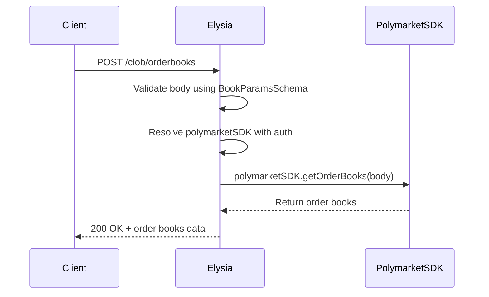
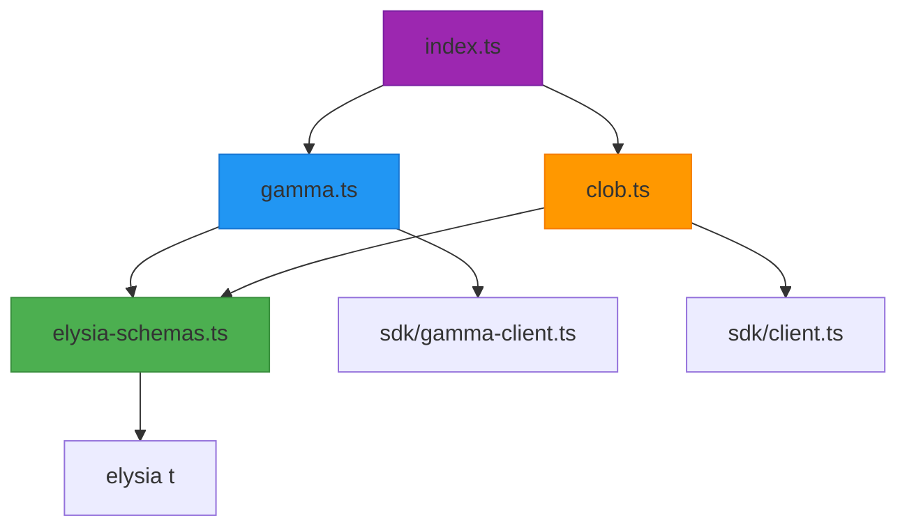

# Request Routing

<cite>
**Referenced Files in This Document**   
- [index.ts](file://src/index.ts)
- [gamma.ts](file://src/routes/gamma.ts)
- [clob.ts](file://src/routes/clob.ts)
- [elysia-schemas.ts](file://src/types/elysia-schemas.ts)
</cite>

## Table of Contents
1. [Introduction](#introduction)
2. [Project Structure](#project-structure)
3. [Core Components](#core-components)
4. [Architecture Overview](#architecture-overview)
5. [Detailed Component Analysis](#detailed-component-analysis)
6. [Dependency Analysis](#dependency-analysis)
7. [Performance Considerations](#performance-considerations)
8. [Troubleshooting Guide](#troubleshooting-guide)
9. [Conclusion](#conclusion)

## Introduction

The Polymarket-kit request routing mechanism is built on Elysia.js, a TypeScript-first framework that enables fully typed API endpoints with automatic OpenAPI documentation generation. The system organizes its API endpoints using route prefixes `/gamma` and `/clob`, which serve as top-level namespaces for two distinct sets of functionality: market data from the Gamma API and trading operations from the CLOB (Central Limit Order Book) system.

This architectural approach leverages Elysia's modular routing system to mount separate route modules under their respective prefixes, ensuring clean separation of concerns, maintainable code structure, and scalable endpoint organization. Each route module encapsulates related functionality, uses shared TypeScript interfaces and Zod-based validation schemas for type safety, and automatically generates OpenAPI-compliant documentation.

The routing system also includes special endpoints at the root level (`/`) for API discovery and `/health` for system monitoring, providing essential operational visibility and developer usability.

**Section sources**
- [index.ts](file://src/index.ts#L1-L165)

## Project Structure

The project follows a feature-based modular structure with clearly separated concerns:

- `src/index.ts`: Main entry point that initializes the Elysia server, applies global middleware (CORS, Swagger), defines global error handling, and mounts route modules.
- `src/routes/gamma.ts`: Contains all routes prefixed with `/gamma`, handling read-only market data operations from the Gamma API.
- `src/routes/clob.ts`: Contains all routes prefixed with `/clob`, handling trading, price history, and order book operations from the CLOB system.
- `src/types/elysia-schemas.ts`: Centralized location for all TypeScript type schemas used for request validation, response typing, and OpenAPI documentation.

This structure enables independent development and testing of each API domain while maintaining consistent typing and validation across the entire proxy server.



**Diagram sources**
- [index.ts](file://src/index.ts#L1-L165)
- [gamma.ts](file://src/routes/gamma.ts#L1-L724)
- [clob.ts](file://src/routes/clob.ts#L1-L1013)
- [elysia-schemas.ts](file://src/types/elysia-schemas.ts#L1-L1023)

## Core Components

The core components of the request routing system are:

- **Elysia Application Instance**: Created in `index.ts`, serves as the foundation for all routing and middleware.
- **Route Prefixing**: Achieved through Elysia's module system with `{ prefix: "/gamma" }` and `{ prefix: "/clob" }` options.
- **Modular Route Mounting**: Using `.use(gammaRoutes)` and `.use(clobRoutes)` to attach pre-configured route modules.
- **Type-Safe Validation**: Leveraging Elysia's built-in type system with schemas from `elysia-schemas.ts` for query parameters, request bodies, and response payloads.
- **OpenAPI Documentation**: Automatically generated via the `@elysiajs/swagger` plugin with detailed metadata including tags, summaries, and descriptions.

These components work together to create a robust, self-documenting API proxy that ensures type safety at every level of the request-response cycle.

**Section sources**
- [index.ts](file://src/index.ts#L1-L165)
- [gamma.ts](file://src/routes/gamma.ts#L1-L724)
- [clob.ts](file://src/routes/clob.ts#L1-L1013)
- [elysia-schemas.ts](file://src/types/elysia-schemas.ts#L1-L1023)

## Architecture Overview

The request routing architecture follows a layered pattern where incoming HTTP requests are processed through a series of stages:

1. **Global Middleware**: CORS and Swagger/OpenAPI are applied globally.
2. **Root Endpoints**: Special endpoints at `/` and `/health` are defined directly on the main app.
3. **Route Module Mounting**: Gamma and CLOB route modules are mounted with their respective prefixes.
4. **Per-Module Middleware**: Each route module applies its own derivation logic (e.g., SDK instantiation).
5. **Endpoint Handling**: Individual routes handle requests with typed parameters and responses.



**Diagram sources**
- [index.ts](file://src/index.ts#L1-L165)
- [gamma.ts](file://src/routes/gamma.ts#L1-L724)
- [clob.ts](file://src/routes/clob.ts#L1-L1013)

## Detailed Component Analysis

### Gamma API Routing Analysis

The `gammaRoutes` module handles all endpoints under the `/gamma` prefix, providing access to market data from the Gamma API. It uses Elysia's `.derive()` method to create a `gammaSDK` instance for each request, optionally configured with proxy settings from the `x-http-proxy` header.

All endpoints use TypeScript interfaces and Zod-based schemas imported from `elysia-schemas.ts` to ensure type safety for query parameters and response payloads. For example, the `/gamma/events` endpoint uses `UpdatedEventQuerySchema` for input validation and returns an array of objects conforming to `EventSchema`.



**Diagram sources**
- [gamma.ts](file://src/routes/gamma.ts#L1-L724)
- [elysia-schemas.ts](file://src/types/elysia-schemas.ts#L1-L1023)

### CLOB API Routing Analysis

The `clobRoutes` module handles all endpoints under the `/clob` prefix, providing access to trading and price history data. It uses Elysia's `.resolve()` method to authenticate and instantiate a `polymarketSDK` instance, reading credentials from headers (`x-polymarket-key`, `x-polymarket-funder`) or environment variables.

The module implements both GET and POST endpoints, with POST requests requiring body validation using schemas like `BookParamsSchema`. Responses are typed using schemas such as `OrderBookSummarySchema` and `PriceHistoryResponseSchema`.



**Diagram sources**
- [clob.ts](file://src/routes/clob.ts#L1-L1013)
- [elysia-schemas.ts](file://src/types/elysia-schemas.ts#L1-L1023)

### Type Safety and Schema Validation

Type safety is enforced throughout the routing system using centralized schemas defined in `elysia-schemas.ts`. These schemas are built using Elysia's `t` object and provide compile-time and runtime validation.

Key schema categories include:
- **Request Parameters**: `PriceHistoryQuerySchema`, `MarketQuerySchema`
- **Response Payloads**: `PriceHistoryResponseSchema`, `OrderBookSummarySchema`
- **Error Responses**: `ErrorResponseSchema`, `GammaErrorResponseSchema`
- **Authentication**: `ClobClientConfigSchema`

The use of composite schemas (e.g., `t.Composite([EventByIdQuerySchema, MarkdownOptionsSchema])`) allows combining multiple schema definitions for complex endpoints.

```mermaid
classDiagram
class PriceHistoryQuerySchema {
+market : string
+startTs? : number
+endTs? : number
+interval? : "1m"|"1h"|"6h"|"1d"|"1w"|"max"
+fidelity? : number
}
class PriceHistoryResponseSchema {
+history : PriceHistoryPointSchema[]
+timeRange : {start : string, end : string} | null
}
class OrderBookSummarySchema {
+market : string
+asset_id : string
+timestamp : string
+bids : OrderSummarySchema[]
+asks : OrderSummarySchema[]
}
PriceHistoryQuerySchema --> PriceHistoryResponseSchema : "maps to"
OrderBookSummarySchema --> OrderSummarySchema : "contains"
```

**Diagram sources**
- [elysia-schemas.ts](file://src/types/elysia-schemas.ts#L1-L1023)

## Dependency Analysis

The request routing system has a clear dependency hierarchy:



Key dependencies:
- `index.ts` depends on both route modules and initializes the server
- Both route modules depend on `elysia-schemas.ts` for type definitions
- Route modules depend on their respective SDK clients for API communication
- All modules depend on Elysia framework components

This dependency structure ensures loose coupling between modules while maintaining strong typing across the entire system.

**Diagram sources**
- [index.ts](file://src/index.ts#L1-L165)
- [gamma.ts](file://src/routes/gamma.ts#L1-L724)
- [clob.ts](file://src/routes/clob.ts#L1-L1013)
- [elysia-schemas.ts](file://src/types/elysia-schemas.ts#L1-L1023)

## Performance Considerations

The routing system incorporates several performance optimizations:

- **SDK Instance Caching**: The CLOB module uses an LRU cache (`LRUCache`) to store PolymarketSDK instances, reducing initialization overhead for repeated requests with the same credentials.
- **Conditional Proxy Parsing**: The Gamma module only parses proxy configuration when the `x-http-proxy` header is present, avoiding unnecessary computation.
- **Efficient Schema Validation**: Elysia's built-in validation is optimized for performance and only runs when necessary.
- **Selective Field Inclusion**: Many endpoints support query parameters that control response verbosity (e.g., `include_markets`), allowing clients to request only needed data.

These optimizations ensure that the routing layer adds minimal latency to proxied API calls while maintaining robust functionality.

## Troubleshooting Guide

Common issues and their solutions:

- **400 Bad Request**: Caused by invalid query parameters or request body. Check that all parameters conform to the defined schemas in `elysia-schemas.ts`.
- **404 Not Found**: Occurs when requested resources don't exist. Verify IDs, slugs, or token IDs are correct.
- **500 Internal Server Error**: Indicates unexpected server-side issues. Check logs for error messages and stack traces.
- **503 Service Unavailable**: Returned by `/clob/health` when the CLOB service is unhealthy. Verify credentials and network connectivity.
- **Authentication Errors**: Ensure `x-polymarket-key` and `x-polymarket-funder` headers are provided in production, or that environment variables are set in development.

The OpenAPI documentation at `/docs` provides complete endpoint specifications, including required parameters, response formats, and error codes.

**Section sources**
- [index.ts](file://src/index.ts#L1-L165)
- [gamma.ts](file://src/routes/gamma.ts#L1-L724)
- [clob.ts](file://src/routes/clob.ts#L1-L1013)
- [elysia-schemas.ts](file://src/types/elysia-schemas.ts#L1-L1023)

## Conclusion

The request routing mechanism in polymarket-kit effectively leverages Elysia.js's modular architecture to create a well-organized, type-safe API proxy. By using route prefixes `/gamma` and `/clob`, the system cleanly separates market data and trading functionality while maintaining consistent patterns across both domains.

The integration of TypeScript interfaces and Zod-based schemas from `elysia-schemas.ts` ensures end-to-end type safety, catching errors at compile time and validating data at runtime. Automatic OpenAPI documentation generation provides comprehensive API documentation without additional maintenance overhead.

The architecture supports both simple GET requests and complex POST operations, handles authentication and caching appropriately for each API domain, and includes essential operational endpoints for discovery and health monitoring. This design results in a robust, maintainable, and developer-friendly API proxy system.