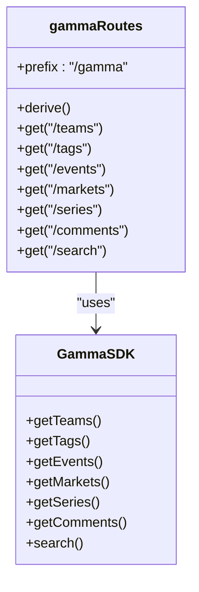
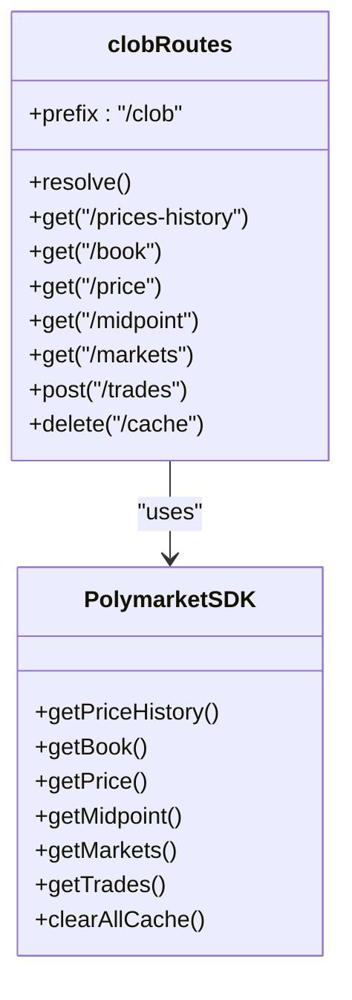
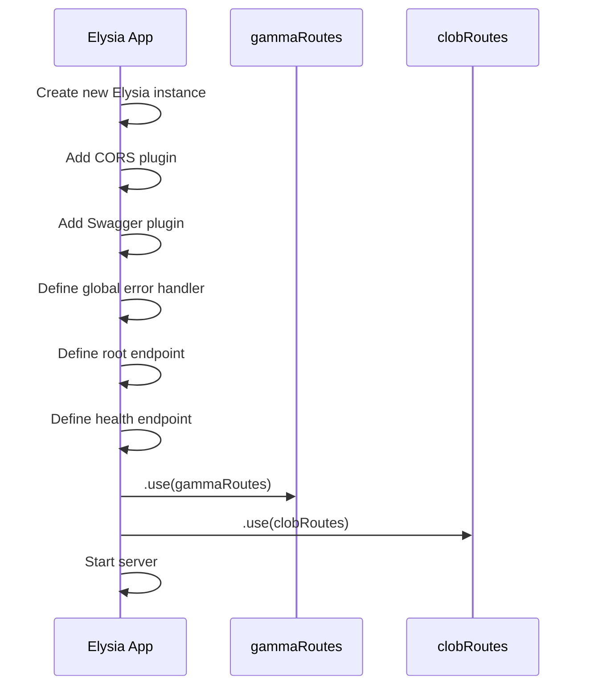

# Route Organization

<cite>
**Referenced Files in This Document**   
- [src/index.ts](file://src/index.ts)
- [src/routes/gamma.ts](file://src/routes/gamma.ts)
- [src/routes/clob.ts](file://src/routes/clob.ts)
- [src/types/elysia-schemas.ts](file://src/types/elysia-schemas.ts)
</cite>

## Table of Contents
1. [Introduction](#introduction)
2. [Project Structure](#project-structure)
3. [Core Components](#core-components)
4. [Architecture Overview](#architecture-overview)
5. [Detailed Component Analysis](#detailed-component-analysis)
6. [Dependency Analysis](#dependency-analysis)
7. [Performance Considerations](#performance-considerations)
8. [Troubleshooting Guide](#troubleshooting-guide)
9. [Conclusion](#conclusion)

## Introduction
The Polymarket-kit application implements a modular route architecture using Elysia.js to provide a type-safe proxy server for Polymarket APIs. This documentation details how the application organizes its routes into distinct modules for the Gamma API (public market data) and CLOB API (trading and price operations), using route prefixes to logically separate these domains. The architecture leverages Elysia's modular system to enhance maintainability, scalability, and API documentation generation.

## Project Structure
The application follows a clean and organized structure with routes separated into dedicated modules. The core route organization is located in the `src/routes/` directory, which contains two primary files: `gamma.ts` for Gamma API routes and `clob.ts` for CLOB API routes. These modules are mounted onto the main application instance in `src/index.ts` using Elysia's `.use()` method. The separation of routes into distinct files enables independent development and testing of each API domain while maintaining a cohesive server structure.

```mermaid
graph TD
A[Main Application] --> B[/gamma prefix]
A --> C[/clob prefix]
B --> D[Gamma API Routes]
C --> E[CLOB API Routes]
D --> F[Sports, Tags, Events, Markets]
E --> G[Prices, Order Books, Trades]
```

**Diagram sources**
- [src/index.ts](file://src/index.ts#L1-L20)
- [src/routes/gamma.ts](file://src/routes/gamma.ts#L1-L50)
- [src/routes/clob.ts](file://src/routes/clob.ts#L1-L50)

**Section sources**
- [src/index.ts](file://src/index.ts#L1-L165)
- [src/routes/gamma.ts](file://src/routes/gamma.ts#L1-L725)
- [src/routes/clob.ts](file://src/routes/clob.ts#L1-L1013)

## Core Components
The route organization in polymarket-kit centers around two core components: `gammaRoutes` and `clobRoutes`. These are defined as independent Elysia modules in `src/routes/gamma.ts` and `src/routes/clob.ts` respectively. Each module encapsulates its own handlers, validation schemas, and dependencies, providing a clean separation of concerns. The modules are mounted onto the main application instance in `src/index.ts` using the `.use()` method, which integrates their routes while preserving their individual configurations and middleware.

**Section sources**
- [src/index.ts](file://src/index.ts#L23-L165)
- [src/routes/gamma.ts](file://src/routes/gamma.ts#L1-L725)
- [src/routes/clob.ts](file://src/routes/clob.ts#L1-L1013)

## Architecture Overview
The application architecture uses Elysia's modular system to create a well-organized API structure with distinct namespaces for different API domains. The Gamma API routes are prefixed with `/gamma` and handle public market data operations, while the CLOB API routes are prefixed with `/clob` and manage trading and price operations. This prefix-based organization provides namespace isolation, making the API endpoints intuitive and easy to navigate. The modular approach also supports automatic OpenAPI documentation generation with distinct tags for each API domain.

```mermaid
graph TD
A[Elysia Application] --> B[gammaRoutes]
A --> C[clobRoutes]
B --> D[/gamma/teams]
B --> E[/gamma/events]
B --> F[/gamma/markets]
C --> G[/clob/prices-history]
C --> H[/clob/book]
C --> I[/clob/trades]
J[OpenAPI Documentation] --> K[Gamma API Tag]
J --> L[CLOB API Tag]
```

**Diagram sources**
- [src/index.ts](file://src/index.ts#L23-L165)
- [src/routes/gamma.ts](file://src/routes/gamma.ts#L1-L725)
- [src/routes/clob.ts](file://src/routes/clob.ts#L1-L1013)

## Detailed Component Analysis

### Gamma API Module Analysis
The `gammaRoutes` module in `src/routes/gamma.ts` defines all endpoints for the Polymarket Gamma API. It uses the `new Elysia({ prefix: "/gamma" })` constructor to create a module with the `/gamma` prefix. The module includes routes for various Gamma API operations such as teams, tags, events, markets, series, comments, and search functionality. Each route is defined with proper typing and validation using Elysia's built-in type system and schemas from `src/types/elysia-schemas.ts`.



**Diagram sources**
- [src/routes/gamma.ts](file://src/routes/gamma.ts#L1-L725)
- [src/sdk/gamma-client.ts](file://src/sdk/gamma-client.ts#L1-L50)

**Section sources**
- [src/routes/gamma.ts](file://src/routes/gamma.ts#L1-L725)
- [src/types/elysia-schemas.ts](file://src/types/elysia-schemas.ts#L1-L1023)

### CLOB API Module Analysis
The `clobRoutes` module in `src/routes/clob.ts` defines all endpoints for the Polymarket CLOB API. It uses the `new Elysia({ prefix: "/clob" })` constructor to create a module with the `/clob` prefix. The module includes routes for price history, order books, prices, midpoints, spreads, trades, and markets. The module implements authentication using headers (`x-polymarket-key` and `x-polymarket-funder`) and includes caching mechanisms for improved performance.



**Diagram sources**
- [src/routes/clob.ts](file://src/routes/clob.ts#L1-L1013)
- [src/sdk/client.ts](file://src/sdk/client.ts#L1-L50)

**Section sources**
- [src/routes/clob.ts](file://src/routes/clob.ts#L1-L1013)
- [src/types/elysia-schemas.ts](file://src/types/elysia-schemas.ts#L1-L1023)

### Route Mounting and Integration
The main application in `src/index.ts` integrates the route modules using Elysia's `.use()` method. This approach allows for the modular composition of the application, where each route module can be developed and tested independently before being mounted onto the main application. The integration process preserves the route prefixes and combines the validation schemas, error handlers, and middleware from each module.



**Diagram sources**
- [src/index.ts](file://src/index.ts#L23-L165)

**Section sources**
- [src/index.ts](file://src/index.ts#L23-L165)

## Dependency Analysis
The route modules have well-defined dependencies that support their functionality. The `gammaRoutes` module depends on the `GammaSDK` for API access and uses validation schemas from `elysia-schemas.ts`. The `clobRoutes` module depends on the `PolymarketSDK` for CLOB operations and implements caching using `LRUCache`. Both modules leverage Elysia's built-in features for CORS, OpenAPI generation, and error handling. The dependency structure promotes loose coupling and high cohesion within each module.

```mermaid
graph TD
A[gammaRoutes] --> B[GammaSDK]
A --> C[elysia-schemas]
A --> D[Elysia Core]
E[clobRoutes] --> F[PolymarketSDK]
E --> G[elysia-schemas]
E --> H[LRUCache]
E --> D
I[index.ts] --> A
I --> E
I --> J[@elysiajs/cors]
I --> K[@elysiajs/swagger]
```

**Diagram sources**
- [src/index.ts](file://src/index.ts#L1-L25)
- [src/routes/gamma.ts](file://src/routes/gamma.ts#L1-L50)
- [src/routes/clob.ts](file://src/routes/clob.ts#L1-L50)

**Section sources**
- [src/index.ts](file://src/index.ts#L1-L165)
- [src/routes/gamma.ts](file://src/routes/gamma.ts#L1-L725)
- [src/routes/clob.ts](file://src/routes/clob.ts#L1-L1013)

## Performance Considerations
The route organization includes several performance optimizations. The `clobRoutes` module implements an LRU cache for SDK instances to avoid creating them on every request. The cache has a configurable maximum size and TTL, with the ability to reset the TTL when an SDK is accessed. The application also benefits from Elysia's built-in performance features such as efficient routing and request handling. The modular structure allows for targeted performance optimizations in specific API domains without affecting the entire application.

**Section sources**
- [src/routes/clob.ts](file://src/routes/clob.ts#L1-L1013)

## Troubleshooting Guide
When troubleshooting issues with the route organization, consider the following common scenarios:
- Ensure that route prefixes are correctly defined in the Elysia module constructors
- Verify that the route modules are properly imported and mounted in `src/index.ts`
- Check that validation schemas are correctly referenced in route definitions
- Confirm that authentication headers are properly handled in the CLOB API routes
- Validate that the OpenAPI documentation is correctly generated with the expected tags

**Section sources**
- [src/index.ts](file://src/index.ts#L78-L164)
- [src/routes/gamma.ts](file://src/routes/gamma.ts#L1-L725)
- [src/routes/clob.ts](file://src/routes/clob.ts#L1-L1013)

## Conclusion
The route organization in polymarket-kit demonstrates an effective use of Elysia's modular system to create a well-structured and maintainable API proxy server. By separating the Gamma API and CLOB API into distinct modules with appropriate prefixes, the application achieves logical separation of concerns, enhanced maintainability, and improved scalability. The modular approach also facilitates automatic OpenAPI documentation generation with clear tagging, making the API easier to understand and use. This architecture serves as a solid foundation for future expansion and refinement of the Polymarket API proxy.