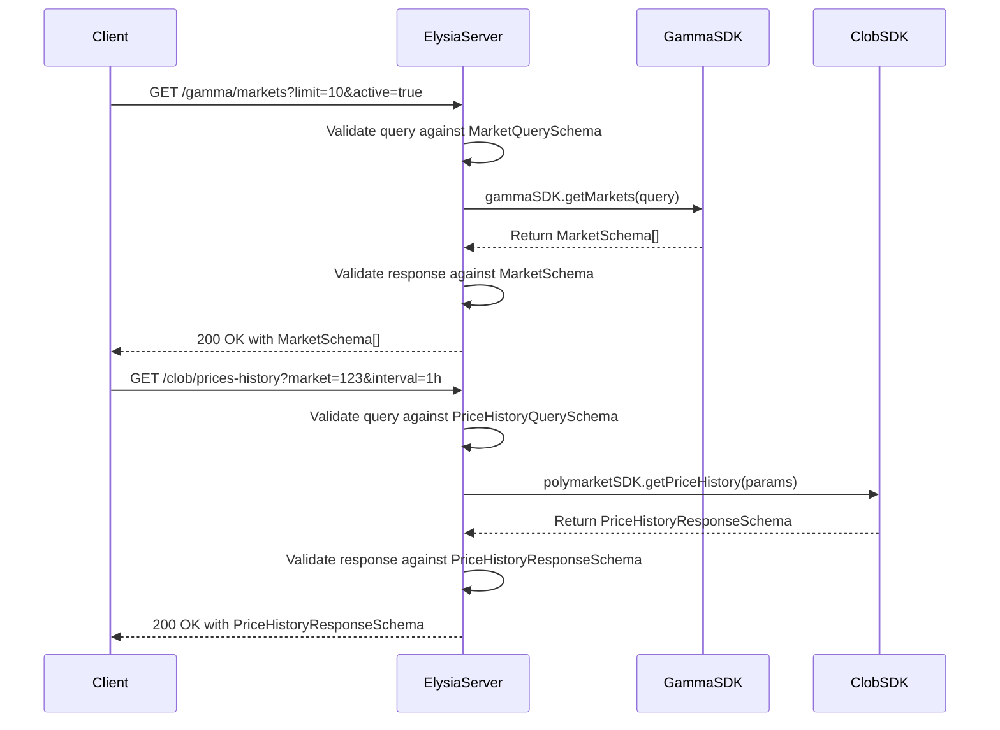
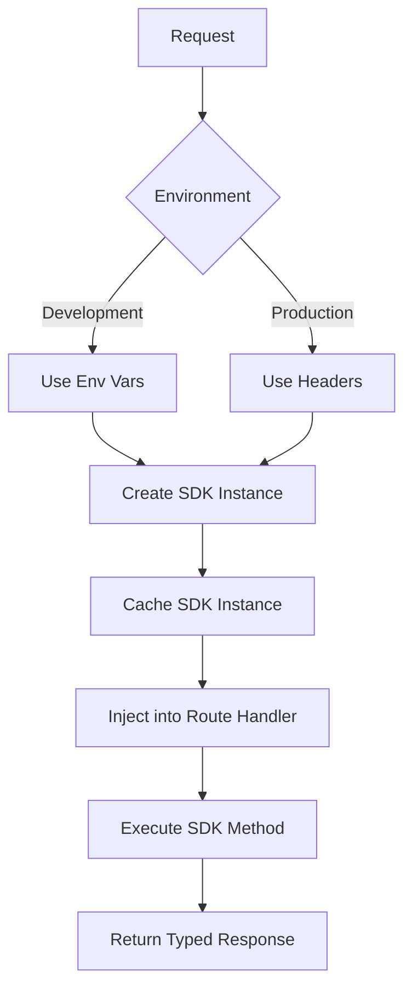

# Type Safety Implementation

<cite>
**Referenced Files in This Document**   
- [elysia-schemas.ts](file://src/types/elysia-schemas.ts)
- [gamma.ts](file://src/routes/gamma.ts)
- [clob.ts](file://src/routes/clob.ts)
- [gamma-client.ts](file://src/sdk/gamma-client.ts)
- [index.ts](file://src/sdk/index.ts)
</cite>

## Table of Contents
1. [Introduction](#introduction)
2. [Type Safety Architecture](#type-safety-architecture)
3. [Schema Definition and Validation](#schema-definition-and-validation)
4. [Route Implementation Examples](#route-implementation-examples)
5. [SDK Integration and Type Inference](#sdk-integration-and-type-inference)
6. [Error Handling and Response Validation](#error-handling-and-response-validation)
7. [Benefits of Type-Safe Routing](#benefits-of-type-safe-routing)
8. [Common Issues and Development Workflow](#common-issues-and-development-workflow)
9. [Conclusion](#conclusion)

## Introduction
This document details the type safety implementation in polymarket-kit's request routing system. The architecture leverages TypeScript interfaces and Zod-based validation schemas to enforce strict typing across all API endpoints. By integrating Elysia's type validation system with custom schemas defined in elysia-schemas.ts, the system ensures both compile-time and runtime type safety for request parameters, query strings, headers, and response payloads. This approach provides comprehensive type checking, automatic OpenAPI documentation generation, and improved developer experience while reducing runtime errors.

## Type Safety Architecture
The type safety architecture in polymarket-kit is built on Elysia's type validation system, which provides a unified approach to type checking at both compile-time and runtime. The system uses TypeScript interfaces and Elysia's type utilities to define schemas for all API interactions. These schemas are applied consistently across request parameters, query strings, headers, and response payloads. The architecture separates schema definitions from route implementations, allowing for reusable type definitions that can be shared across multiple endpoints. This separation enables consistent type checking while maintaining flexibility in route configuration.

**Section sources**
- [elysia-schemas.ts](file://src/types/elysia-schemas.ts#L1-L1023)
- [gamma.ts](file://src/routes/gamma.ts#L1-L725)
- [clob.ts](file://src/routes/clob.ts#L1-L1013)

## Schema Definition and Validation
The schema definition system in polymarket-kit uses Elysia's type utilities to create comprehensive validation schemas for all API interactions. These schemas are defined in elysia-schemas.ts and include interfaces for market objects, price history data, error responses, and various query parameters. The system uses Elysia's t.Object, t.Array, t.Union, and t.Composite utilities to construct complex type definitions that accurately represent the data structures used throughout the application. Each schema includes detailed descriptions and constraints to ensure data integrity and provide clear documentation for developers.

```mermaid
classDiagram
class MarketSchema {
+id : string
+question : string
+conditionId : string
+slug : string
+liquidity : string | undefined
+startDate : string | undefined
+image : string
+icon : string
+description : string
+active : boolean
+volume : string
+outcomes : string[]
+outcomePrices : string[]
+closed : boolean
+volumeNum : number
+liquidityNum : number | undefined
+clobTokenIds : string[]
+events : EventSchema[] | undefined
}
class PriceHistoryQuerySchema {
+market : string
+startTs : number | undefined
+endTs : number | undefined
+startDate : string | undefined
+endDate : string | undefined
+interval : "1m" | "1h" | "6h" | "1d" | "1w" | "max" | undefined
+fidelity : number | undefined
}
class ErrorResponseSchema {
+error : string
+message : string
+details : string | undefined
}
class EventSchema {
+id : string
+ticker : string
+slug : string
+title : string
+description : string | undefined
+startDate : string | undefined
+creationDate : string
+endDate : string
+image : string
+icon : string
+active : boolean
+closed : boolean
+archived : boolean
+liquidity : number | undefined
+volume : number
+createdAt : string
+updatedAt : string
+markets : MarketSchema[]
+series : SeriesSchema[] | undefined
+tags : TagSchema[] | undefined
}
MarketSchema --> EventSchema : "contained in"
PriceHistoryQuerySchema --> MarketSchema : "references"
ErrorResponseSchema --> "*" : "used by all endpoints"
```

**Diagram sources**
- [elysia-schemas.ts](file://src/types/elysia-schemas.ts#L150-L250)
- [elysia-schemas.ts](file://src/types/elysia-schemas.ts#L600-L650)
- [elysia-schemas.ts](file://src/types/elysia-schemas.ts#L100-L120)

## Route Implementation Examples
The route implementations in gamma.ts and clob.ts demonstrate how the defined schemas are applied to actual API endpoints. Each route uses the appropriate schema to validate incoming requests and ensure proper response typing. For example, the price history endpoint in clob.ts uses PriceHistoryQuerySchema to validate query parameters and PriceHistoryResponseSchema to define the expected response structure. Similarly, the market endpoints in gamma.ts use MarketSchema and MarketQuerySchema to enforce type safety for both requests and responses. The use of Elysia's t.Composite utility allows for combining multiple schemas, such as when merging event query parameters with markdown formatting options.



**Diagram sources**
- [gamma.ts](file://src/routes/gamma.ts#L200-L250)
- [clob.ts](file://src/routes/clob.ts#L50-L100)

## SDK Integration and Type Inference
The integration of SDK instances into route handlers is achieved through Elysia's derive() and resolve() methods, which ensure type-safe injection of SDK instances. In gamma.ts, the derive() method creates a gammaSDK instance based on proxy headers, while in clob.ts, the resolve() method injects a polymarketSDK instance with proper authentication credentials. These methods leverage TypeScript's type inference to ensure that the injected SDK instances are properly typed and can be used safely within route handlers. The SDK implementations in gamma-client.ts and client.ts are fully typed, providing autocomplete and type checking for all available methods.



**Diagram sources**
- [gamma.ts](file://src/routes/gamma.ts#L50-L80)
- [clob.ts](file://src/routes/clob.ts#L80-L120)
- [gamma-client.ts](file://src/sdk/gamma-client.ts#L1-L891)

## Error Handling and Response Validation
The error handling system in polymarket-kit uses dedicated schemas to ensure consistent error responses across all API endpoints. The ErrorResponseSchema and GammaErrorResponseSchema define the structure for error responses, including error messages, details, and specific error types. These schemas are applied to all routes, ensuring that clients receive predictable error responses regardless of the endpoint. The system also validates response payloads against the appropriate schemas, catching any discrepancies between expected and actual response structures during development.

```mermaid
classDiagram
class ErrorResponseSchema {
+error : string
+message : string
+details : string | undefined
}
class GammaErrorResponseSchema {
+type : string
+error : string
}
class HealthResponseSchema {
+status : "healthy" | "unhealthy"
+timestamp : string
+clob : string
+cached : boolean | undefined
+error : string | undefined
}
ErrorResponseSchema <|-- GammaErrorResponseSchema
ErrorResponseSchema <|-- HealthResponseSchema
ErrorResponseSchema <|-- "*" : "Base for all errors"
```

**Diagram sources**
- [elysia-schemas.ts](file://src/types/elysia-schemas.ts#L700-L750)

## Benefits of Type-Safe Routing
The type-safe routing implementation in polymarket-kit provides several significant benefits. First, it enables automatic OpenAPI/Swagger documentation generation, as the type definitions contain all necessary information for generating comprehensive API documentation. Second, it improves the developer experience by providing autocomplete, type checking, and immediate feedback on schema mismatches. Third, it reduces runtime errors by catching type inconsistencies during development rather than at runtime. Finally, it ensures consistency across the codebase, as all endpoints use the same schema definitions and validation rules.

**Section sources**
- [elysia-schemas.ts](file://src/types/elysia-schemas.ts#L1-L1023)
- [gamma.ts](file://src/routes/gamma.ts#L1-L725)
- [clob.ts](file://src/routes/clob.ts#L1-L1013)

## Common Issues and Development Workflow
Common issues in the type safety implementation typically involve schema mismatches between expected and actual data structures. These issues are caught during development through TypeScript's compile-time checking and Elysia's runtime validation. The development workflow involves defining schemas in elysia-schemas.ts, applying them to routes in gamma.ts and clob.ts, and verifying their correctness through automated tests. When schema mismatches occur, developers can quickly identify and resolve them by examining the type errors reported by TypeScript and the validation errors from Elysia. This immediate feedback loop helps maintain type consistency throughout the development process.

**Section sources**
- [elysia-schemas.ts](file://src/types/elysia-schemas.ts#L1-L1023)
- [gamma.ts](file://src/routes/gamma.ts#L1-L725)
- [clob.ts](file://src/routes/clob.ts#L1-L1013)

## Conclusion
The type safety implementation in polymarket-kit's request routing system demonstrates a robust approach to ensuring data integrity and developer productivity. By leveraging TypeScript interfaces and Elysia's validation system, the architecture provides comprehensive type checking at both compile-time and runtime. The use of centralized schema definitions in elysia-schemas.ts ensures consistency across all API endpoints, while the integration of SDK instances through derive() and resolve() methods maintains type safety throughout the request lifecycle. This approach not only reduces runtime errors but also enhances the overall developer experience through automatic documentation generation and immediate feedback on type inconsistencies.