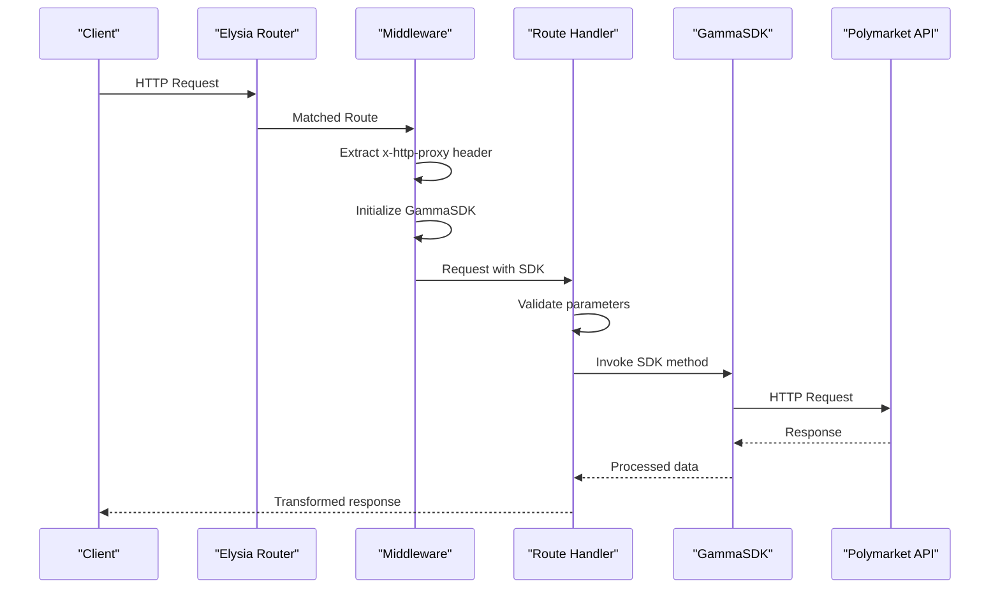
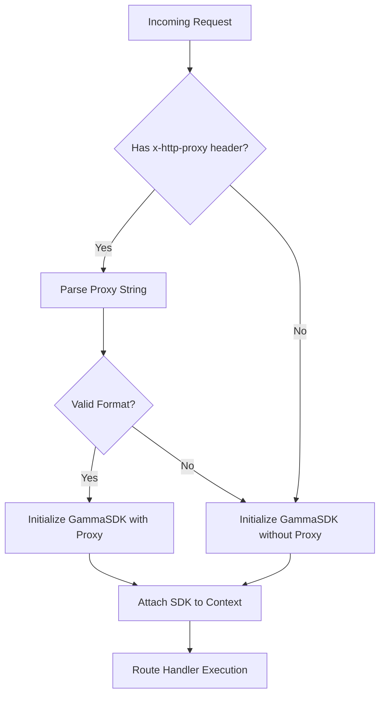
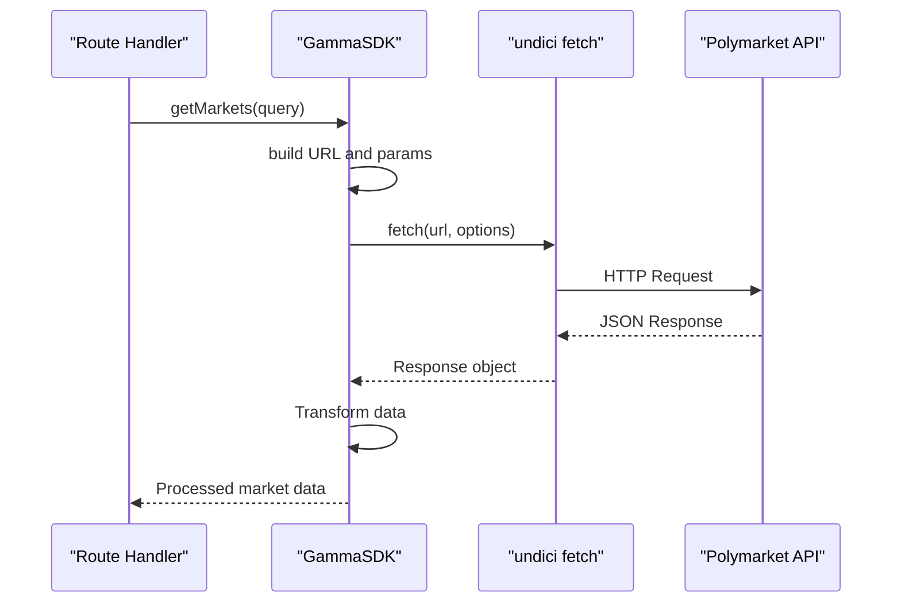
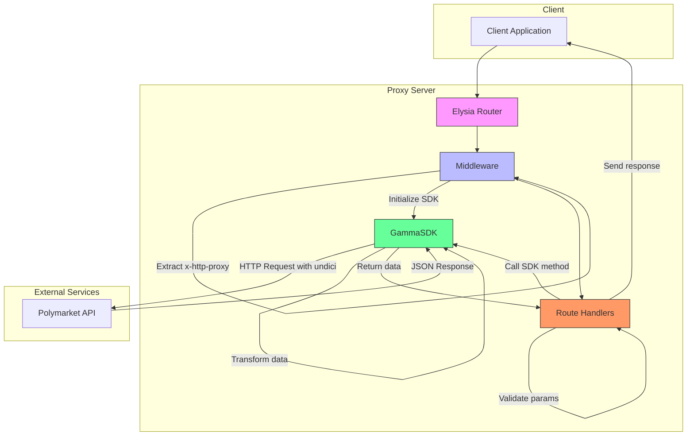

# Request Flow

<cite>
**Referenced Files in This Document**   
- [gamma.ts](file://src/routes/gamma.ts)
- [gamma-client.ts](file://src/sdk/gamma-client.ts)
- [elysia-schemas.ts](file://src/types/elysia-schemas.ts)
- [index.ts](file://src/index.ts)
</cite>

## Table of Contents
1. [Introduction](#introduction)
2. [Request Lifecycle Overview](#request-lifecycle-overview)
3. [Route Matching and Entry Points](#route-matching-and-entry-points)
4. [Middleware Processing and SDK Initialization](#middleware-processing-and-sdk-initialization)
5. [Parameter Validation with Elysia Schemas](#parameter-validation-with-elysia-schemas)
6. [SDK Execution and API Communication](#sdk-execution-and-api-communication)
7. [Response Transformation and Return](#response-transformation-and-return)
8. [Error Handling and Status Code Propagation](#error-handling-and-status-code-propagation)
9. [Example Flow: /gamma/markets Request](#example-flow-gamma-markets-request)
10. [Architecture Diagram](#architecture-diagram)

## Introduction
This document details the complete request flow in the polymarket-kit system, from initial HTTP request reception through to final response delivery. The flow involves multiple layers of processing including route matching, middleware execution, parameter validation, SDK invocation, external API communication, and response transformation. The system uses Elysia as the web framework, providing type-safe routing and validation capabilities.

**Section sources**
- [index.ts](file://src/index.ts#L1-L165)

## Request Lifecycle Overview
The request lifecycle in polymarket-kit follows a structured path from client to response. When a client makes an HTTP request, the Elysia router first matches the request to the appropriate route handler based on the URL path and HTTP method. The request then passes through middleware that extracts headers and initializes SDK instances. Route handlers validate incoming parameters against predefined schemas, invoke the appropriate SDK methods, and handle the responses. The SDK makes actual HTTP requests to Polymarket APIs and returns data that is transformed and sent back to the client with proper typing and status codes.

**Diagram sources**
- [index.ts](file://src/index.ts#L1-L165)
- [gamma.ts](file://src/routes/gamma.ts#L1-L725)
- [gamma-client.ts](file://src/sdk/gamma-client.ts#L1-L891)

## Route Matching and Entry Points
The Elysia router receives HTTP requests and matches them to appropriate route handlers based on the URL path and HTTP method. The main entry point is defined in the root application, which mounts route modules for different API sections. The gammaRoutes module handles all requests under the /gamma prefix, providing typed endpoints for Gamma API operations. Each route is configured with query and response validation schemas that ensure type safety throughout the request flow.

**Section sources**
- [index.ts](file://src/index.ts#L1-L165)
- [gamma.ts](file://src/routes/gamma.ts#L1-L725)

## Middleware Processing and SDK Initialization
The middleware layer extracts the x-http-proxy header from incoming requests and uses it to initialize the GammaSDK instance. The parseProxyString function processes the proxy header value, supporting various formats including authentication credentials. If the proxy header is present and valid, the GammaSDK is instantiated with proxy configuration. If parsing fails or the header is absent, the SDK is created without proxy settings. This derived context is then made available to all route handlers within the request scope.

**Diagram sources**
- [gamma.ts](file://src/routes/gamma.ts#L49-L103)

## Parameter Validation with Elysia Schemas
Route handlers validate incoming parameters against elysia-schemas to ensure data integrity and type safety. The validation occurs at both query and response levels, with specific schemas defined for each endpoint. For example, the /gamma/markets endpoint uses UpdatedMarketQuerySchema for input validation and MarketSchema for response typing. This validation happens automatically through Elysia's built-in type system, preventing invalid data from reaching the business logic layer and ensuring clients receive properly structured responses.

**Section sources**
- [elysia-schemas.ts](file://src/types/elysia-schemas.ts#L1-L1023)
- [gamma.ts](file://src/routes/gamma.ts#L1-L725)

## SDK Execution and API Communication
The GammaSDK handles communication with Polymarket's external APIs using the fetch API with undici for HTTP requests. When a route handler invokes a SDK method, the makeRequest function constructs the appropriate URL, applies query parameters, and executes the request with proper headers. The SDK transforms response data to match expected schemas, particularly handling JSON string fields that should be arrays. Proxy configuration is applied through undici's ProxyAgent when specified in the request headers, allowing requests to flow through intermediary servers.

**Diagram sources**
- [gamma-client.ts](file://src/sdk/gamma-client.ts#L1-L891)

## Response Transformation and Return
The SDK transforms raw API responses into properly typed data structures before returning them to route handlers. This transformation includes parsing JSON string fields into arrays and ensuring all data conforms to the expected schema. Route handlers may perform additional transformations, such as converting event data to markdown format when requested. The final response is returned with proper HTTP status codes and content types, with Elysia ensuring the response matches the declared response schema for type safety.

**Section sources**
- [gamma-client.ts](file://src/sdk/gamma-client.ts#L1-L891)
- [gamma.ts](file://src/routes/gamma.ts#L1-L725)

## Error Handling and Status Code Propagation
The system implements comprehensive error handling throughout the request flow. Elysia's global error handler catches validation errors and other exceptions, returning appropriate HTTP status codes. The SDK propagates HTTP status codes from the external API, with 404 responses converted to null values for not-found cases. Route handlers set specific status codes when appropriate, such as 404 for missing resources. Validation errors result in 400 status codes, while internal errors are reported as 500 responses, ensuring clients receive meaningful error information.

**Section sources**
- [index.ts](file://src/index.ts#L1-L165)
- [gamma-client.ts](file://src/sdk/gamma-client.ts#L1-L891)

## Example Flow: /gamma/markets Request
A request to /gamma/markets follows the complete request flow: The Elysia router matches the path and invokes the gammaRoutes handler. Middleware extracts the x-http-proxy header if present and initializes the GammaSDK accordingly. The route handler validates query parameters against UpdatedMarketQuerySchema. The handler invokes gammaSDK.getMarkets() with the validated parameters. The SDK constructs a request to https://gamma-api.polymarket.com/markets with the query parameters, applies proxy configuration if specified, and makes the HTTP request. The response data is transformed to ensure array fields are properly parsed, then returned to the handler. The handler returns the validated market data to the client with a 200 status code, or an error response if validation or API communication failed.

**Section sources**
- [gamma.ts](file://src/routes/gamma.ts#L1-L725)
- [gamma-client.ts](file://src/sdk/gamma-client.ts#L1-L891)
- [elysia-schemas.ts](file://src/types/elysia-schemas.ts#L1-L1023)

## Architecture Diagram

**Diagram sources**
- [index.ts](file://src/index.ts#L1-L165)
- [gamma.ts](file://src/routes/gamma.ts#L1-L725)
- [gamma-client.ts](file://src/sdk/gamma-client.ts#L1-L891)