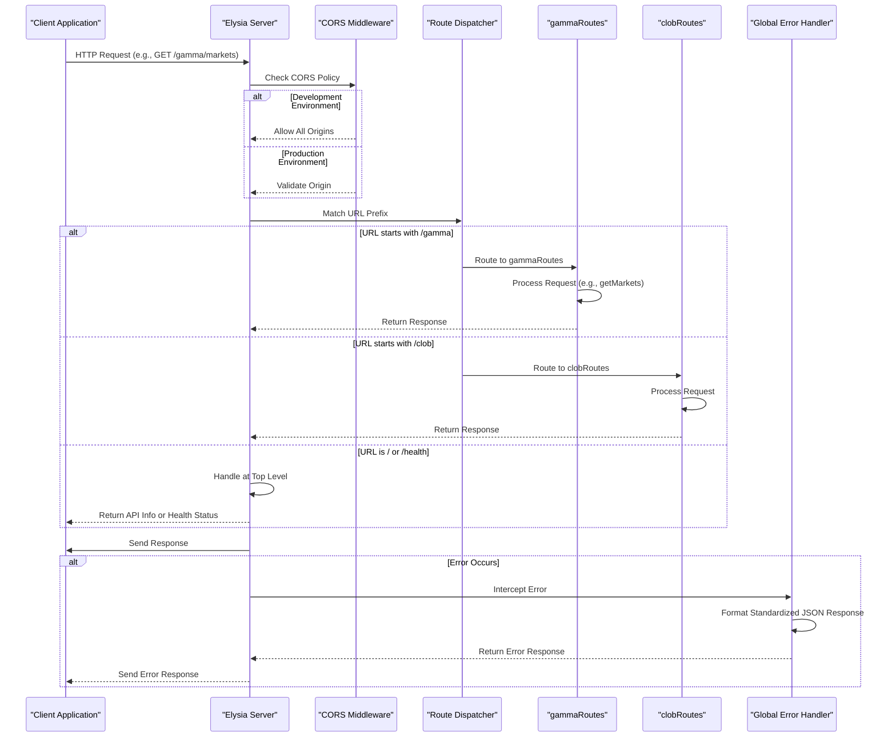

# Request Ingress

<cite>
**Referenced Files in This Document**   
- [index.ts](file://src/index.ts)
- [gamma.ts](file://src/routes/gamma.ts)
- [clob.ts](file://src/routes/clob.ts)
- [elysia-schemas.ts](file://src/types/elysia-schemas.ts)
- [env.ts](file://src/utils/env.ts)
</cite>

## Table of Contents
1. [Introduction](#introduction)
2. [Request Routing Mechanism](#request-routing-mechanism)
3. [CORS Middleware Configuration](#cors-middleware-configuration)
4. [Global Error Handling](#global-error-handling)
5. [Root and Health Endpoints](#root-and-health-endpoints)
6. [OpenAPI/Swagger Documentation Integration](#openapiswagger-documentation-integration)
7. [Sequence Diagram: Request Ingress Flow](#sequence-diagram-request-ingress-flow)

## Introduction
The Polymarket proxy server, built with Elysia, serves as a fully typed translation layer for Polymarket APIs. It provides type-safe endpoints for both CLOB and Gamma APIs with comprehensive validation, CORS support, and automatic OpenAPI schema generation. This document details the request ingress phase, explaining how incoming HTTP requests are received, routed, and processed through the server's middleware and error handling systems.

**Section sources**
- [index.ts](file://src/index.ts#L1-L25)

## Request Routing Mechanism
The Elysia server receives incoming HTTP requests and routes them based on URL prefixes. The server is configured with two primary route modules: `gammaRoutes` for the Gamma API (prefixed with `/gamma`) and `clobRoutes` for the CLOB API (prefixed with `/clob`). When a request arrives, the server matches the URL path against these prefixes to determine which module should handle the request.

For example, a request to `/gamma/markets` is routed to the `gammaRoutes` module, where it is processed by the corresponding handler function. The routing system uses Elysia's modular architecture, allowing each route module to define its own set of endpoints with specific validation schemas and response types. This ensures that requests are directed to the appropriate handlers based on their URL structure.

**Section sources**
- [index.ts](file://src/index.ts#L50-L55)
- [gamma.ts](file://src/routes/gamma.ts#L103-L105)

## CORS Middleware Configuration
The server implements CORS (Cross-Origin Resource Sharing) middleware to support web applications in both development and production environments. In development, the CORS configuration allows all origins (`origin: true`), enabling flexible testing across different domains. The middleware supports standard HTTP methods including GET, POST, PUT, DELETE, and OPTIONS.

The CORS settings are applied globally through the `cors` plugin from `@elysiajs/cors`. This configuration ensures that the server can respond appropriately to preflight requests (OPTIONS) and include the necessary headers for cross-origin access. In production, the server can be configured to restrict origins to specific domains, enhancing security while maintaining compatibility with authorized clients.

**Section sources**
- [index.ts](file://src/index.ts#L27-L33)

## Global Error Handling
The server implements a comprehensive global error handling system that intercepts validation, parsing, and internal server errors, transforming them into standardized JSON responses. The error handler is defined using Elysia's `onError` method, which captures errors at the application level.

When a validation error occurs (e.g., invalid request parameters), the handler returns a 400 status with a standardized response containing "Bad Request" as the error type and details about the validation failure. Similarly, parsing errors (e.g., invalid JSON in request body) trigger a 400 response, while not-found errors result in a 404 response. All other unhandled errors default to a 500 Internal Server Error response. This consistent error format ensures clients receive predictable and informative error messages regardless of the error source.

**Section sources**
- [index.ts](file://src/index.ts#L35-L75)

## Root and Health Endpoints
The server handles the root endpoint (`/`) and health endpoint (`/health`) at the top level before delegating requests to specific route modules. The root endpoint returns basic API information, including the API name, version, description, and available endpoints such as documentation, Gamma API, CLOB API, and health check. This provides a quick overview of the API's capabilities and structure.

The health endpoint (`/health`) returns the server's health status, including uptime, memory usage, and version information. This endpoint is crucial for monitoring and ensures that the server is operational. Both endpoints are defined at the top level of the Elysia application, making them accessible without requiring any specific route prefix. This design allows clients to quickly verify the server's availability and obtain essential information without navigating through specific API modules.

**Section sources**
- [index.ts](file://src/index.ts#L77-L128)

## OpenAPI/Swagger Documentation Integration
The server integrates OpenAPI/Swagger documentation generation through the `swagger` and `openapi` plugins from `@elysiajs/swagger` and `@elysiajs/openapi`. The documentation is accessible at the `/docs` path and provides a comprehensive interface for exploring the API's endpoints, request/response formats, and parameters.

The OpenAPI configuration includes detailed information about the API, such as title, version, description, and contact details. It also defines tags for different API sections (Gamma API, CLOB API, System) to organize endpoints logically. The documentation is automatically generated based on the route definitions and validation schemas, ensuring that it remains up-to-date with the actual API implementation. This integration allows developers to interact with the API directly from the documentation interface, facilitating testing and integration.

**Section sources**
- [index.ts](file://src/index.ts#L13-L25)

## Sequence Diagram: Request Ingress Flow

**Diagram sources**
- [index.ts](file://src/index.ts#L1-L165)
- [gamma.ts](file://src/routes/gamma.ts#L1-L725)
- [clob.ts](file://src/routes/clob.ts#L1-L1013)