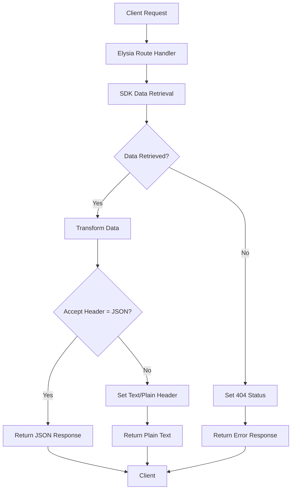
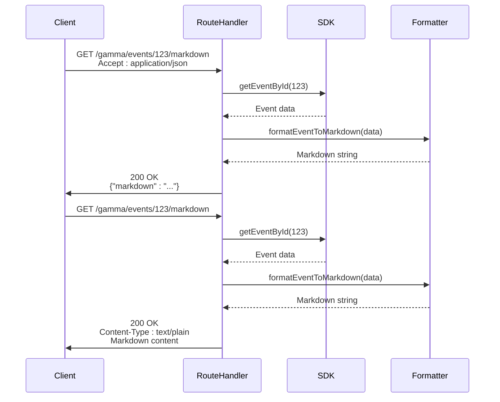
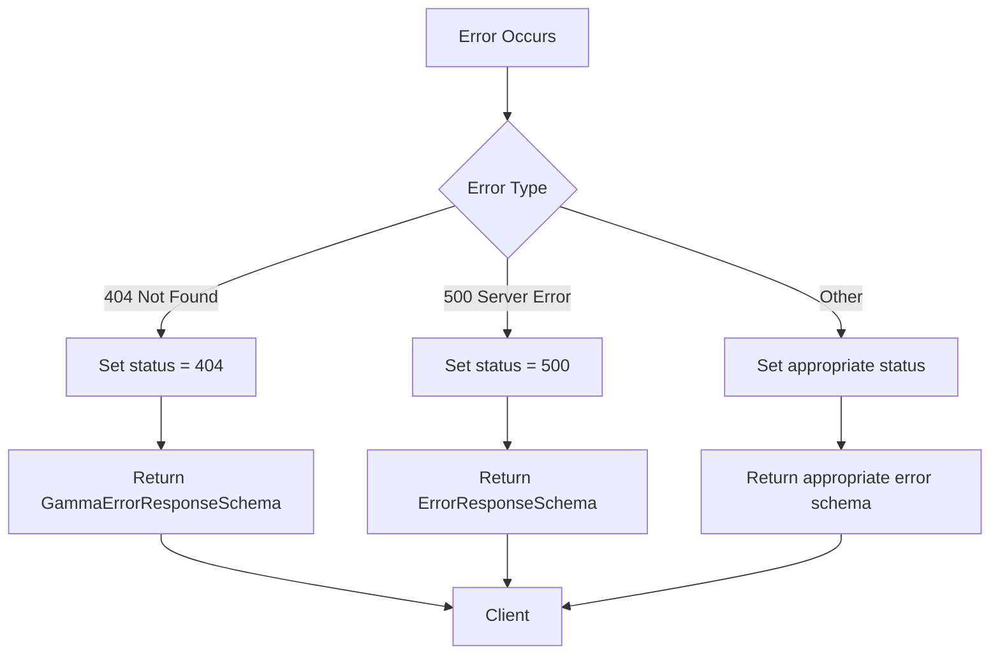
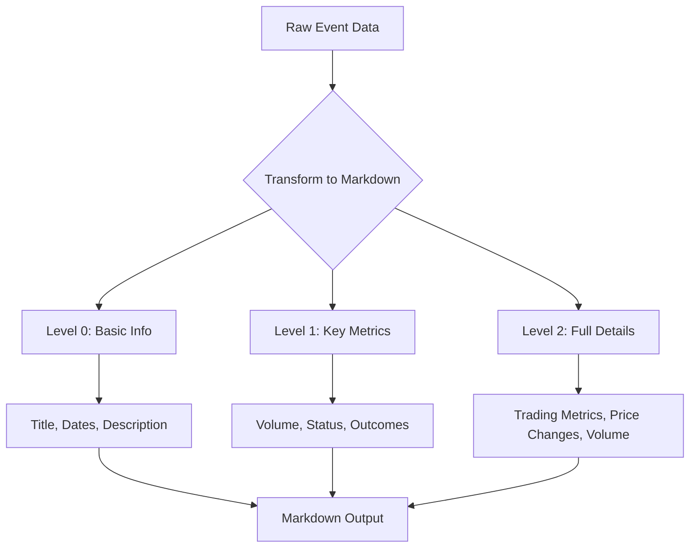

# Response Egress

<cite>
**Referenced Files in This Document**   
- [gamma.ts](file://src/routes/gamma.ts)
- [clob.ts](file://src/routes/clob.ts)
- [gamma-client.ts](file://src/sdk/gamma-client.ts)
- [elysia-schemas.ts](file://src/types/elysia-schemas.ts)
- [markdown-formatters.ts](file://src/utils/markdown-formatters.ts)
</cite>

## Table of Contents
1. [Introduction](#introduction)
2. [Response Transformation and Egress Flow](#response-transformation-and-egress-flow)
3. [Content Negotiation in Gamma Endpoints](#content-negotiation-in-gamma-endpoints)
4. [Response Schemas and Type Safety](#response-schemas-and-type-safety)
5. [Error Response Formatting and Status Code Mapping](#error-response-formatting-and-status-code-mapping)
6. [Data Transformation Examples](#data-transformation-examples)
7. [Response Headers and Content Types](#response-headers-and-content-types)
8. [Conclusion](#conclusion)

## Introduction
This document details the response egress phase in the polymarket-kit system, focusing on how processed data from SDKs is transformed and returned to clients through Elysia route handlers. It covers content negotiation, response schema validation, error handling, and specific data transformation examples such as event-to-markdown conversion and cache statistics responses.

## Response Transformation and Egress Flow
The response egress process begins after data is retrieved from external APIs via SDKs. The Elysia framework handles the transformation and delivery of responses to clients through a structured flow that ensures type safety, proper content negotiation, and consistent error handling.



**Diagram sources**
- [gamma.ts](file://src/routes/gamma.ts#L200-L300)
- [clob.ts](file://src/routes/clob.ts#L100-L150)

**Section sources**
- [gamma.ts](file://src/routes/gamma.ts#L1-L100)
- [clob.ts](file://src/routes/clob.ts#L1-L100)

## Content Negotiation in Gamma Endpoints
The polymarket-kit implements content negotiation in endpoints like `/gamma/events/:id/markdown` to return either JSON or plain text based on the Accept header. This allows clients to choose their preferred response format for the same resource.

The content negotiation logic checks the Accept header for "application/json" and responds accordingly:
- When Accept header includes "application/json", returns a JSON object with a markdown property
- Otherwise, returns raw markdown text with content-type set to text/plain



**Diagram sources**
- [gamma.ts](file://src/routes/gamma.ts#L400-L450)
- [markdown-formatters.ts](file://src/utils/markdown-formatters.ts#L1-L50)

**Section sources**
- [gamma.ts](file://src/routes/gamma.ts#L400-L450)
- [markdown-formatters.ts](file://src/utils/markdown-formatters.ts#L1-L50)

## Response Schemas and Type Safety
Response schemas defined in route configurations ensure type safety and automatically generate OpenAPI documentation. The Elysia framework uses TypeScript types to validate both request and response payloads.

For the `/gamma/events/:id/markdown` endpoint, the response schema is defined as a union type:
- JSON response: Object with a markdown string property
- Plain text response: Raw string content

The schema definitions in `elysia-schemas.ts` provide comprehensive type validation for all API responses, ensuring that:
- Response structure matches expected format
- Data types are correctly validated
- Required fields are present
- Optional fields are properly handled

```mermaid
classDiagram
class MarkdownResponseSchema {
+Union~Object~String~
+Object : {markdown : String}
+String : Raw markdown content
}
class ErrorResponseSchema {
+error : String
+message : String
+details : String (optional)
}
class CacheStatsResponseSchema {
+sdkCache : Object
+clobClientCache : Object
+timestamp : String
}
MarkdownResponseSchema <|-- ErrorResponseSchema
CacheStatsResponseSchema <|-- ErrorResponseSchema
```

**Diagram sources**
- [elysia-schemas.ts](file://src/types/elysia-schemas.ts#L500-L600)
- [gamma.ts](file://src/routes/gamma.ts#L400-L450)

**Section sources**
- [elysia-schemas.ts](file://src/types/elysia-schemas.ts#L500-L600)
- [gamma.ts](file://src/routes/gamma.ts#L400-L450)

## Error Response Formatting and Status Code Mapping
Error responses follow a consistent format across all endpoints, with proper HTTP status code mapping. The system handles various error scenarios including resource not found (404) and server errors (500).

When resources are not found, the system:
- Sets the response status to 404
- Returns a standardized error object with type and error message
- Uses different error schema formats for different API endpoints

For the `/clob/cache/stats` endpoint, the response structure is predefined with:
- sdkCache: Size and maximum size of SDK instance cache
- clobClientCache: Size and maximum size of CLOB client cache
- timestamp: ISO string of when the statistics were collected



**Diagram sources**
- [gamma.ts](file://src/routes/gamma.ts#L300-L350)
- [clob.ts](file://src/routes/clob.ts#L200-L250)
- [elysia-schemas.ts](file://src/types/elysia-schemas.ts#L400-L450)

**Section sources**
- [gamma.ts](file://src/routes/gamma.ts#L300-L350)
- [clob.ts](file://src/routes/clob.ts#L200-L250)
- [elysia-schemas.ts](file://src/types/elysia-schemas.ts#L400-L450)

## Data Transformation Examples
The system includes specific data transformation examples that demonstrate how raw API data is converted to client-ready formats.

### Event to Markdown Transformation
The `/gamma/events/:id/markdown` endpoint transforms event data into markdown format optimized for LLM analysis. The transformation supports:
- Verbose levels (0-2) controlling detail depth
- Inclusion/exclusion of market details
- Proper formatting of pricing data and trading metrics

### Cache Statistics Response
The `/clob/cache/stats` endpoint returns structured cache statistics including:
- SDK instance cache size and limits
- CLOB client cache size and limits
- Timestamp of statistics collection



**Diagram sources**
- [markdown-formatters.ts](file://src/utils/markdown-formatters.ts#L100-L300)
- [gamma.ts](file://src/routes/gamma.ts#L400-L450)

**Section sources**
- [markdown-formatters.ts](file://src/utils/markdown-formatters.ts#L100-L300)
- [gamma.ts](file://src/routes/gamma.ts#L400-L450)

## Response Headers and Content Types
Response headers are set appropriately based on the content type being returned. The system ensures proper content-type headers for different response formats:

- JSON responses: Content-Type set to "application/json"
- Plain text responses: Content-Type set to "text/plain; charset=utf-8"
- Error responses: Appropriate status codes with consistent error format

The header setting is particularly important for the content-negotiated endpoints, where the same endpoint may return different content types based on client preferences expressed in the Accept header.

```mermaid
sequenceDiagram
participant Client
participant Server
Client->>Server : GET /gamma/events/123/markdown
Server->>Server : Check Accept header
alt Accept includes application/json
Server->>Client : Content-Type : application/json
else
Server->>Client : Content-Type : text/plain; charset=utf-8
end
```

**Diagram sources**
- [gamma.ts](file://src/routes/gamma.ts#L420-L430)
- [clob.ts](file://src/routes/clob.ts#L150-L160)

**Section sources**
- [gamma.ts](file://src/routes/gamma.ts#L420-L430)
- [clob.ts](file://src/routes/clob.ts#L150-L160)

## Conclusion
The response egress phase in polymarket-kit is a well-structured process that transforms SDK data into client-ready responses through Elysia route handlers. The system implements content negotiation, ensures type safety through response schemas, handles errors consistently, and properly sets response headers for different content types. This approach provides a robust and flexible API that can serve various client needs while maintaining consistency and reliability.