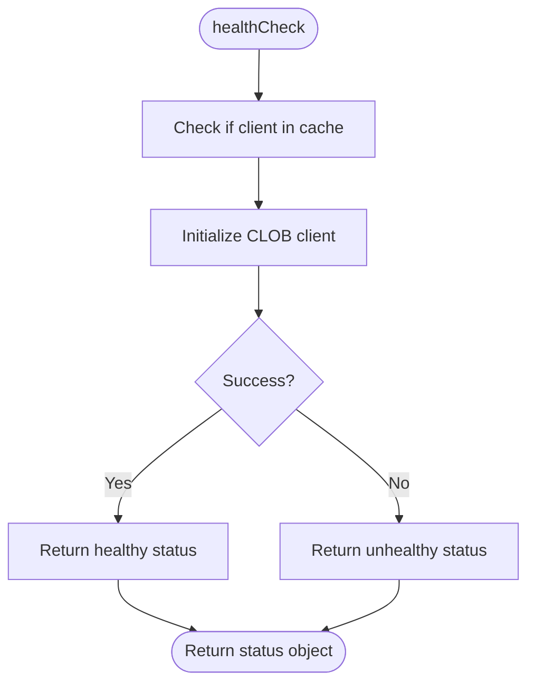
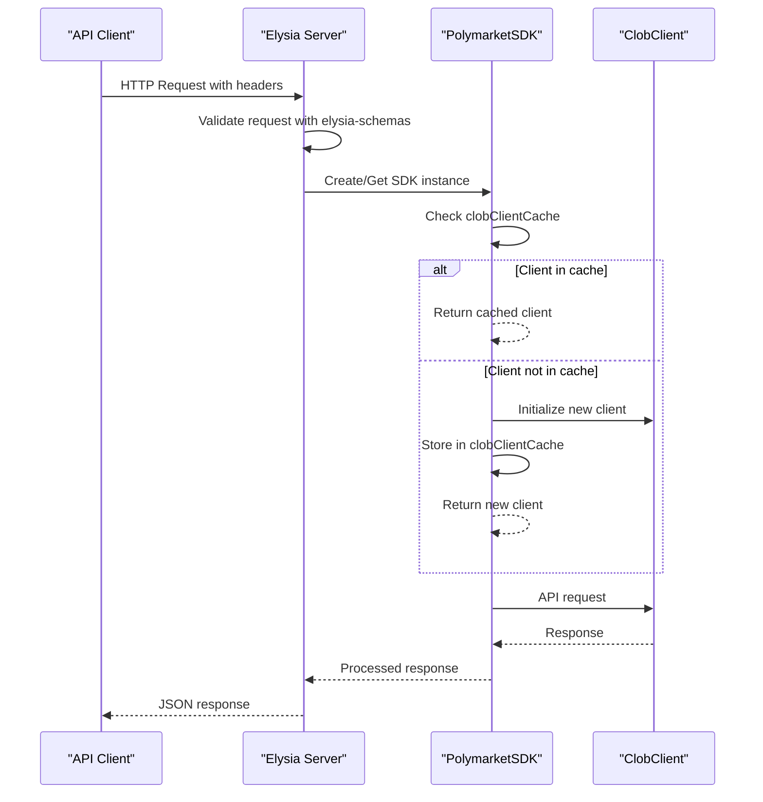

# CLOB SDK

<cite>
**Referenced Files in This Document**   
- [client.ts](file://src/sdk/client.ts)
- [elysia-schemas.ts](file://src/types/elysia-schemas.ts)
- [clob.ts](file://src/routes/clob.ts)
</cite>

## Table of Contents
1. [Introduction](#introduction)
2. [Core Components](#core-components)
3. [Initialization Process](#initialization-process)
4. [Caching Mechanism](#caching-mechanism)
5. [Price History Method](#price-history-method)
6. [Health Check and Cache Management](#health-check-and-cache-management)
7. [Usage Patterns](#usage-patterns)
8. [Error Handling](#error-handling)
9. [Integration with Elysia Route Layer](#integration-with-elysia-route-layer)

## Introduction
The PolymarketSDK class provides a type-safe wrapper for authenticated operations on Polymarket's CLOB API. It simplifies interaction with the CLOB API by handling authentication, caching, and type safety. The SDK is designed to work seamlessly with the Elysia route layer and provides comprehensive functionality for accessing market data including price history, order books, prices, midpoints, spreads, and trades.

## Core Components

The PolymarketSDK class is the central component of the CLOB SDK, providing a high-level interface to the Polymarket CLOB API. It encapsulates authentication logic, caching mechanisms, and type-safe methods for interacting with the CLOB API. The SDK uses the @polymarket/clob-client library under the hood but adds additional functionality like credential management, caching, and enhanced type safety.

**Section sources**
- [client.ts](file://src/sdk/client.ts#L54-L386)

## Initialization Process

The PolymarketSDK class is initialized with a configuration object containing required authentication credentials and optional settings. The constructor requires a privateKey and funderAddress for authentication, with optional parameters for host and chainId that have sensible defaults. During initialization, the SDK creates a composite cache key based on the credentials and configuration, which is used for caching client instances.

The initialization process involves creating a Wallet instance from the provided privateKey, then using the ClobClient to create or derive an API key. This process handles the authentication flow transparently, allowing developers to focus on using the API rather than managing authentication details.

**Section sources**
- [client.ts](file://src/sdk/client.ts#L54-L102)

## Caching Mechanism

The SDK implements a sophisticated caching mechanism using the lru-cache library to optimize performance and reduce redundant API calls. A global LRUCache instance (clobClientCache) stores initialized ClobClient instances, with configurable maximum size and TTL (time-to-live) values read from environment variables. The cache uses a composite key based on the privateKey, host, chainId, and funderAddress to uniquely identify client instances.

The caching strategy includes:
- Configurable maximum cache size via CLOB_CLIENT_CACHE_MAX_SIZE environment variable (default: 100)
- Configurable TTL via CLOB_CLIENT_CACHE_TTL_MINUTES environment variable (default: 30 minutes)
- Automatic TTL reset on cache access (updateAgeOnGet: true)
- Individual client cache invalidation through clearCache()
- Global cache management through static methods

**Section sources**
- [client.ts](file://src/sdk/client.ts#L29-L386)

## Price History Method

The getPriceHistory method provides type-safe access to price history data with comprehensive date handling capabilities. It accepts a query object with parameters including market, interval, and optional date ranges. The method handles conversion between human-readable date strings and Unix timestamps, supporting both startDate/endDate and startTs/endTs parameters.

The method constructs properly typed responses with price history data and calculated time ranges. When date strings are provided, they are converted to Unix timestamps using JavaScript's Date object. The response includes both the raw price history data and a timeRange object with ISO-formatted start and end times derived from the first and last data points.

**Section sources**
- [client.ts](file://src/sdk/client.ts#L152-L222)
- [elysia-schemas.ts](file://src/types/elysia-schemas.ts#L287-L307)

## Health Check and Cache Management

The SDK provides comprehensive health check and cache management utilities. The healthCheck method tests the CLOB client connection and returns detailed status information including connection status, timestamp, and caching details. It indicates whether the client was retrieved from cache, helping diagnose performance issues.

Cache management is handled through three methods:
- clearCache(): Removes the current client instance from cache
- getCacheStats(): Static method returning current cache size and maximum size
- clearAllCache(): Static method clearing all cached client instances

These utilities enable effective debugging and cache management, allowing developers to monitor cache performance and force refreshes when needed.



**Diagram sources**
- [client.ts](file://src/sdk/client.ts#L308-L333)

**Section sources**
- [client.ts](file://src/sdk/client.ts#L308-L384)

## Usage Patterns

The SDK supports various usage patterns for accessing CLOB data:

### Price History
```ts
const history = await sdk.getPriceHistory({
  market: "0x...",
  interval: "1h",
  startDate: "2024-01-01",
  endDate: "2024-01-02"
});
```

### Order Books
```ts
// Single order book
const book = await sdk.getBook("0x...");

// Multiple order books
const books = await sdk.getOrderBooks([
  { token_id: "0x...", side: "BUY" }
]);
```

### Prices and Midpoints
```ts
// Get price for specific side
const price = await sdk.getPrice("0x...", "buy");

// Get midpoint
const midpoint = await sdk.getMidpoint("0x...");
```

### Spreads and Trades
```ts
// Get spreads
const spreads = await sdk.getSpreads([
  { token_id: "0x..." }
]);

// Get trades
const trades = await sdk.getTrades({
  market: "0x..."
});
```

**Section sources**
- [client.ts](file://src/sdk/client.ts#L54-L386)

## Error Handling

The SDK implements robust error handling with clear error propagation to route handlers. All methods wrap API calls in try-catch blocks, transforming low-level errors into meaningful error messages. Errors are propagated to the Elysia route layer where they are handled appropriately, with HTTP status codes set based on the error type.

The healthCheck method specifically handles connection errors, returning detailed error information in the response when the CLOB connection fails. This enables clients to diagnose authentication issues, network problems, or service outages.

**Section sources**
- [client.ts](file://src/sdk/client.ts#L54-L386)
- [clob.ts](file://src/routes/clob.ts#L100-L120)

## Integration with Elysia Route Layer

The SDK is designed to integrate seamlessly with the Elysia route layer, providing type validation through elysia-schemas. The clob.ts route file uses the SDK to handle API requests, with Elysia's validation ensuring that incoming requests conform to expected schemas. The route layer handles authentication headers (x-polymarket-key and x-polymarket-funder), falling back to environment variables in development mode.

The integration includes:
- Type-safe request validation using elysia-schemas
- Proper HTTP status code handling
- Development/production mode differentiation
- Header-based authentication
- Comprehensive API documentation through Elysia's detail property



**Diagram sources**
- [clob.ts](file://src/routes/clob.ts#L1-L1013)
- [client.ts](file://src/sdk/client.ts#L54-L386)

**Section sources**
- [clob.ts](file://src/routes/clob.ts#L1-L1013)
- [elysia-schemas.ts](file://src/types/elysia-schemas.ts#L1-L1023)