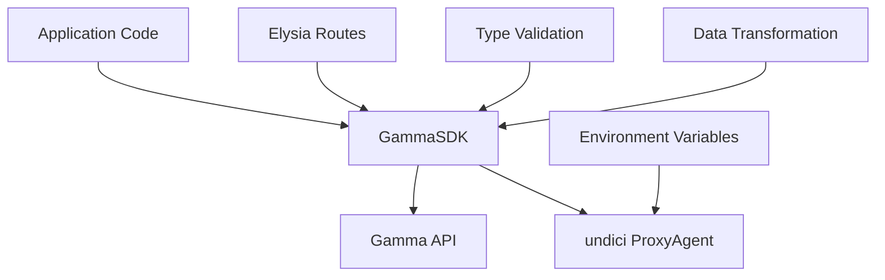
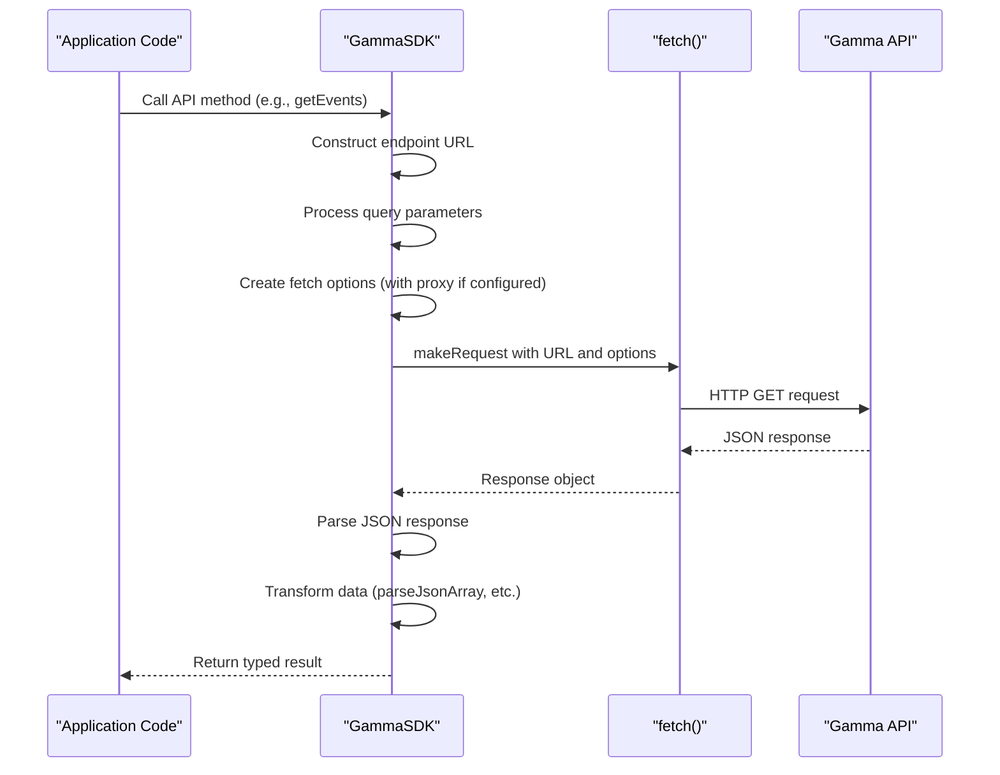
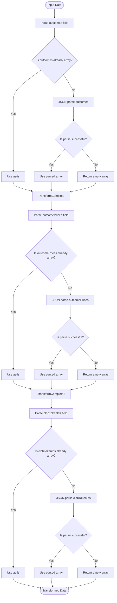
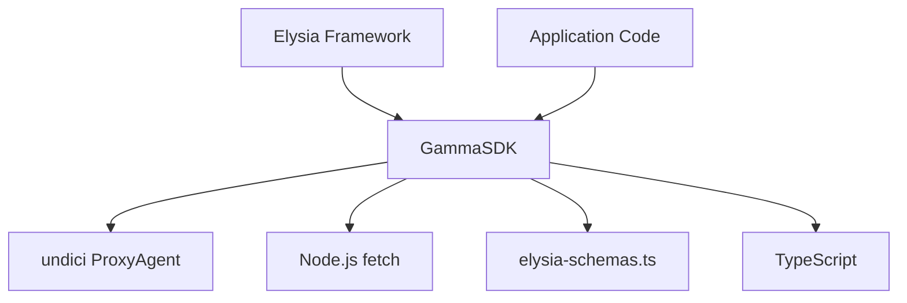

# Gamma SDK

<cite>
**Referenced Files in This Document**   
- [gamma-client.ts](file://src/sdk/gamma-client.ts)
- [gamma.ts](file://src/routes/gamma.ts)
- [elysia-schemas.ts](file://src/types/elysia-schemas.ts)
</cite>

## Table of Contents
1. [Introduction](#introduction)
2. [Core Components](#core-components)
3. [Architecture Overview](#architecture-overview)
4. [Detailed Component Analysis](#detailed-component-analysis)
5. [Dependency Analysis](#dependency-analysis)
6. [Performance Considerations](#performance-considerations)
7. [Troubleshooting Guide](#troubleshooting-guide)
8. [Conclusion](#conclusion)

## Introduction
The GammaSDK class in polymarket-kit serves as a type-safe wrapper for Polymarket's public Gamma API, providing a structured interface to access prediction market data. This SDK enables developers to interact with various endpoints including events, markets, tags, series, comments, and search functionality without requiring authentication. The implementation features robust error handling, proxy support through undici's ProxyAgent, and comprehensive type validation via elysia-schemas. Designed for integration with the Elysia route layer, the SDK transforms raw API responses into properly typed objects while handling JSON string fields that represent arrays. The documentation covers the complete implementation details, usage patterns, and integration points within the larger system architecture.

## Core Components

The GammaSDK class provides a comprehensive interface to Polymarket's Gamma API with type-safe methods for all available endpoints. The implementation includes specialized methods for handling different data types such as events, markets, tags, series, and comments. Each method follows a consistent pattern of request construction, execution, and response processing. The SDK handles data transformation through dedicated methods like transformMarketData and transformEventData that parse JSON string fields into proper array types. Proxy support is implemented through the createFetchOptions method which configures undici's ProxyAgent when proxy configuration is provided. The makeRequest method serves as the central hub for all API interactions, handling URL construction, query parameter serialization, and error propagation.

**Section sources**
- [gamma-client.ts](file://src/sdk/gamma-client.ts#L50-L889)

## Architecture Overview

The GammaSDK operates as a middleware layer between the application and Polymarket's Gamma API, abstracting the complexities of HTTP requests and response parsing. The architecture follows a client-server pattern where the SDK acts as a client to the Gamma API and as a server component when integrated with the Elysia framework. The SDK's methods are organized by API endpoint categories (events, markets, tags, etc.), each providing typed access to specific data resources. The implementation leverages TypeScript generics and interfaces to ensure type safety throughout the API interaction lifecycle. Error handling is centralized in the makeRequest method, which captures both HTTP errors and network exceptions, propagating them appropriately to calling code.



**Diagram sources **
- [gamma-client.ts](file://src/sdk/gamma-client.ts#L50-L889)
- [gamma.ts](file://src/routes/gamma.ts#L0-L724)

## Detailed Component Analysis

### GammaSDK Class Analysis
The GammaSDK class implements a comprehensive wrapper for Polymarket's Gamma API with a focus on type safety and ease of use. The class provides methods for all major API endpoints, each returning properly typed responses based on interfaces defined in elysia-schemas.ts. The implementation handles the complete request-response cycle, from URL construction to response parsing and error handling.

#### Class Structure
```mermaid
classDiagram
class GammaSDK {
-gammaApiBase : string
-proxyConfig : ProxyConfigType
+constructor(config : GammaSDKConfig)
-createFetchOptions() : RequestInit
-buildProxyUrl(proxy : ProxyConfigType) : string
-buildSearchParams(query : Record~string, any~) : URLSearchParams
-makeRequest~T~(endpoint : string, query : Record~string, any~) : Promise~{data : T | null, status : number, ok : boolean, errorData? : any}~
-transformMarketData(item : any) : MarketType
-transformEventData(item : any) : EventType
-parseJsonArray(value : string | string[]) : string[]
+getTeams(query : TeamQueryType) : Promise~TeamType[]~
+getTags(query : TagQueryType) : Promise~UpdatedTagType[]~
+getTagById(id : number, query : TagByIdQueryType) : Promise~UpdatedTagType | null~
+getTagBySlug(slug : string, query : TagByIdQueryType) : Promise~UpdatedTagType | null~
+getRelatedTagsRelationshipsByTagId(id : number, query : RelatedTagsQueryType) : Promise~RelatedTagRelationshipType[]~
+getRelatedTagsRelationshipsByTagSlug(slug : string, query : RelatedTagsQueryType) : Promise~RelatedTagRelationshipType[]~
+getTagsRelatedToTagId(id : number, query : RelatedTagsQueryType) : Promise~UpdatedTagType[]~
+getTagsRelatedToTagSlug(slug : string, query : RelatedTagsQueryType) : Promise~UpdatedTagType[]~
+getEvents(query : UpdatedEventQueryType) : Promise~EventType[]~
+getEventsPaginated(query : PaginatedEventQueryType) : Promise~{data : EventType[], pagination : {hasMore : boolean, totalResults : number}}~
+getEventById(id : number, query : EventByIdQueryType) : Promise~EventType | null~
+getEventTags(id : number) : Promise~UpdatedTagType[]~
+getEventBySlug(slug : string, query : EventByIdQueryType) : Promise~EventType | null~
+getMarkets(query : UpdatedMarketQueryType) : Promise~MarketType[]~
+getMarketById(id : number, query : MarketByIdQueryType) : Promise~MarketType | null~
+getMarketTags(id : number) : Promise~UpdatedTagType[]~
+getMarketBySlug(slug : string, query : MarketByIdQueryType) : Promise~MarketType | null~
+getSeries(query : SeriesQueryType) : Promise~SeriesType[]~
+getSeriesById(id : number, query : SeriesByIdQueryType) : Promise~SeriesType | null~
+getComments(query : CommentQueryType) : Promise~CommentType[]~
+getCommentsByCommentId(id : number, query : CommentByIdQueryType) : Promise~CommentType[]~
+getCommentsByUserAddress(userAddress : string, query : CommentsByUserQueryType) : Promise~CommentType[]~
+search(query : SearchQueryType) : Promise~SearchResponseType~
+getActiveEvents(query : Omit~UpdatedEventQueryType, "active"~) : Promise~EventType[]~
+getClosedEvents(query : Omit~UpdatedEventQueryType, "closed"~) : Promise~EventType[]~
+getFeaturedEvents(query : Omit~UpdatedEventQueryType, "featured"~) : Promise~EventType[]~
+getActiveMarkets(query : Omit~UpdatedMarketQueryType, "active"~) : Promise~MarketType[]~
+getClosedMarkets(query : Omit~UpdatedMarketQueryType, "closed"~) : Promise~MarketType[]~
}
```

**Diagram sources **
- [gamma-client.ts](file://src/sdk/gamma-client.ts#L50-L889)

### Request Processing Flow
The request processing flow in GammaSDK follows a standardized pattern across all API methods. Each public method constructs a request by combining the base API URL with the specific endpoint path, then processes query parameters through the buildSearchParams method before executing the request via makeRequest.



**Diagram sources **
- [gamma-client.ts](file://src/sdk/gamma-client.ts#L124-L164)
- [gamma-client.ts](file://src/sdk/gamma-client.ts#L170-L194)

### Data Transformation Logic
The GammaSDK implements specific data transformation logic to handle inconsistencies in the API response format, particularly for fields that are transmitted as JSON strings but should be treated as arrays.



**Diagram sources **
- [gamma-client.ts](file://src/sdk/gamma-client.ts#L170-L177)
- [gamma-client.ts](file://src/sdk/gamma-client.ts#L183-L194)

## Dependency Analysis

The GammaSDK class has dependencies on several external and internal components that enable its functionality. The primary external dependency is undici's ProxyAgent for proxy support, which is dynamically imported when proxy configuration is provided. The SDK also depends on Node.js's built-in fetch implementation for HTTP requests. Internally, the SDK relies heavily on type definitions from elysia-schemas.ts to ensure type safety across all API interactions. The implementation uses TypeScript generics extensively to maintain type integrity throughout the request-response cycle. The SDK is designed to work seamlessly with the Elysia framework, as evidenced by the gamma.ts route file which integrates the SDK with Elysia's routing and validation system.



**Diagram sources **
- [gamma-client.ts](file://src/sdk/gamma-client.ts#L50-L889)
- [elysia-schemas.ts](file://src/types/elysia-schemas.ts#L0-L1023)

## Performance Considerations

The GammaSDK implementation includes several performance optimizations to ensure efficient API interactions. The use of a single makeRequest method for all API calls reduces code duplication and allows for centralized optimization of the request pipeline. The SDK efficiently handles query parameters by converting them to URLSearchParams objects, which are natively supported by the fetch API. For proxy support, the implementation first attempts to use undici's ProxyAgent for optimal performance, falling back to environment variables only if the dynamic import fails. The data transformation methods are designed to be lightweight, performing minimal processing on the response data. The SDK does not implement caching, leaving this responsibility to higher-level components or the client application.

## Troubleshooting Guide

When encountering issues with the GammaSDK, consider the following common problems and solutions:

1. **Proxy Configuration Failures**: If proxy configuration fails, the SDK logs a warning and falls back to environment variables. Ensure the proxy URL is correctly formatted and accessible.

2. **JSON Parsing Errors**: The transformMarketData and transformEventData methods include error handling for JSON parsing failures, returning empty arrays when parsing fails. Verify that the API response format matches expectations.

3. **Type Validation Issues**: Ensure that query parameters match the expected types defined in elysia-schemas.ts. String values are automatically converted, but complex types must be properly formatted.

4. **Network Errors**: The makeRequest method captures network errors and throws descriptive exceptions. Check network connectivity and API endpoint availability.

5. **404 Responses**: The SDK handles 404 responses by returning null for single-item requests. Verify that the requested resource IDs or slugs are correct.

**Section sources**
- [gamma-client.ts](file://src/sdk/gamma-client.ts#L50-L889)
- [elysia-schemas.ts](file://src/types/elysia-schemas.ts#L0-L1023)

## Conclusion

The GammaSDK provides a robust, type-safe interface to Polymarket's Gamma API with comprehensive support for all major endpoints. The implementation demonstrates careful attention to error handling, proxy support, and data transformation, making it a reliable component for applications that need to access prediction market data. The integration with Elysia's type validation system ensures that API interactions are both safe and efficient. The SDK's modular design and clear separation of concerns make it easy to maintain and extend as the underlying API evolves. By providing convenience methods for common use cases and handling the complexities of data transformation, the GammaSDK significantly reduces the development effort required to work with the Gamma API.