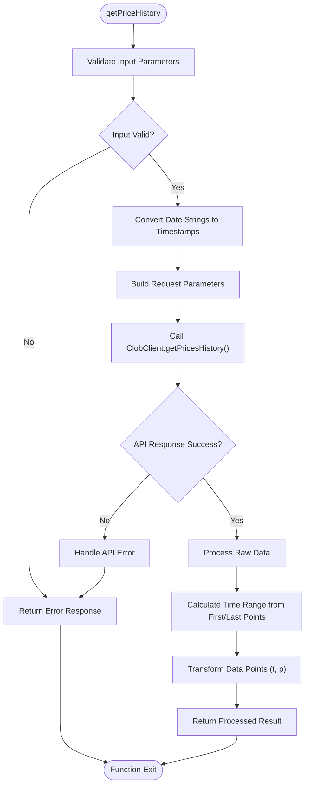
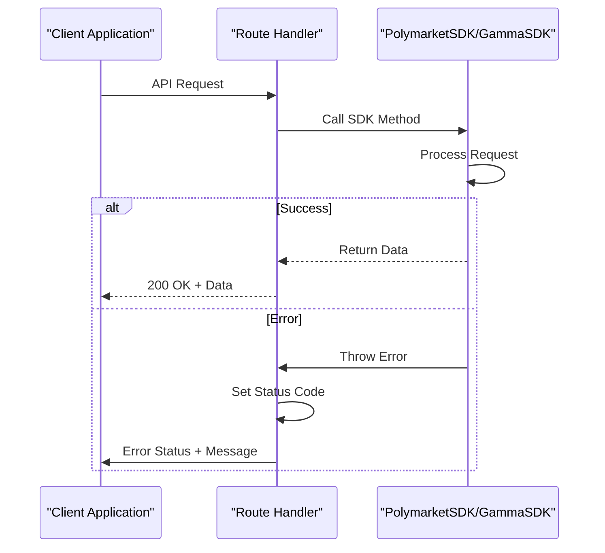
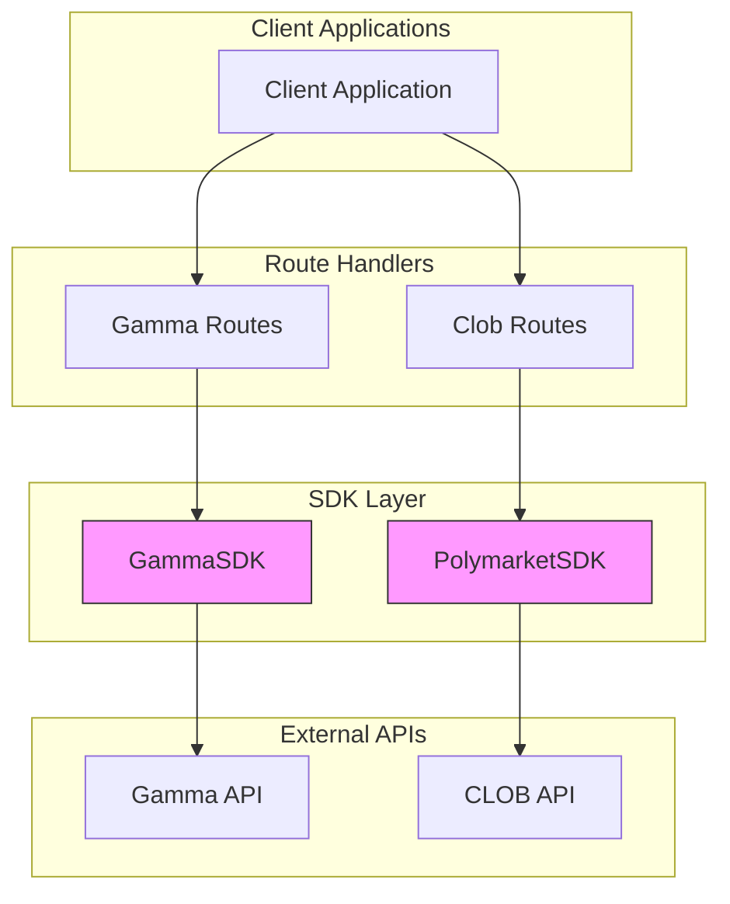

# SDK Communication

<cite>
**Referenced Files in This Document**   
- [gamma-client.ts](file://src/sdk/gamma-client.ts)
- [client.ts](file://src/sdk/client.ts)
- [gamma.ts](file://src/routes/gamma.ts)
- [clob.ts](file://src/routes/clob.ts)
- [elysia-schemas.ts](file://src/types/elysia-schemas.ts)
</cite>

## Table of Contents
1. [Introduction](#introduction)
2. [GammaSDK Communication Layer](#gammasdk-communication-layer)
3. [PolymarketSDK Initialization and Caching](#polymarketsdk-initialization-and-caching)
4. [Response Transformation and Data Parsing](#response-transformation-and-data-parsing)
5. [Error Propagation and Handling](#error-propagation-and-handling)
6. [Architecture Overview](#architecture-overview)

## Introduction
The polymarket-kit SDK provides two distinct communication layers for interacting with Polymarket's API endpoints: GammaSDK for public data access and PolymarketSDK for authenticated CLOB operations. These SDKs abstract direct API calls, providing type-safe methods, response transformation, and enhanced functionality such as proxy support and client caching. The GammaSDK handles read-only operations against the Gamma API endpoints, while the PolymarketSDK manages authenticated operations against the CLOB API with wallet-based authentication and stateful client management.

## GammaSDK Communication Layer

The GammaSDK class provides a comprehensive interface to Polymarket's Gamma API endpoints, abstracting direct HTTP calls with type-safe methods for all available operations. It supports proxy configuration through the `makeRequest` method, which implements proxy support via undici's ProxyAgent with fallback to environment variables.

```mermaid
classDiagram
class GammaSDK {
-gammaApiBase : string
-proxyConfig? : ProxyConfigType
+constructor(config? : GammaSDKConfig)
-createFetchOptions() : RequestInit
-buildProxyUrl(proxy : ProxyConfigType) : string
-buildSearchParams(query : Record~string, any~) : URLSearchParams
-makeRequest~T~(endpoint : string, query? : Record~string, any~) : Promise~{data : T | null, status : number, ok : boolean, errorData? : any}~
-transformMarketData(item : any) : MarketType
-transformEventData(item : any) : EventType
-parseJsonArray(value : string | string[]) : string[]
+getTeams(query : TeamQueryType) : Promise~TeamType[]~
+getTags(query : TagQueryType) : Promise~UpdatedTagType[]~
+getTagById(id : number, query : TagByIdQueryType) : Promise~UpdatedTagType | null~
+getTagBySlug(slug : string, query : TagByIdQueryType) : Promise~UpdatedTagType | null~
+getRelatedTagsRelationshipsByTagId(id : number, query : RelatedTagsQueryType) : Promise~RelatedTagRelationshipType[]~
+getRelatedTagsRelationshipsByTagSlug(slug : string, query : RelatedTagsQueryType) : Promise~RelatedTagRelationshipType[]~
+getTagsRelatedToTagId(id : number, query : RelatedTagsQueryType) : Promise~UpdatedTagType[]~
+getTagsRelatedToTagSlug(slug : string, query : RelatedTagsQueryType) : Promise~UpdatedTagType[]~
+getEvents(query : UpdatedEventQueryType) : Promise~EventType[]~
+getEventsPaginated(query : PaginatedEventQueryType) : Promise~{data : EventType[], pagination : {hasMore : boolean, totalResults : number}}~
+getEventById(id : number, query : EventByIdQueryType) : Promise~EventType | null~
+getEventTags(id : number) : Promise~UpdatedTagType[]~
+getEventBySlug(slug : string, query : EventByIdQueryType) : Promise~EventType | null~
+getMarkets(query : UpdatedMarketQueryType) : Promise~MarketType[]~
+getMarketById(id : number, query : MarketByIdQueryType) : Promise~MarketType | null~
+getMarketTags(id : number) : Promise~UpdatedTagType[]~
+getMarketBySlug(slug : string, query : MarketByIdQueryType) : Promise~MarketType | null~
+getSeries(query : SeriesQueryType) : Promise~SeriesType[]~
+getSeriesById(id : number, query : SeriesByIdQueryType) : Promise~SeriesType | null~
+getComments(query : CommentQueryType) : Promise~CommentType[]~
+getCommentsByCommentId(id : number, query : CommentByIdQueryType) : Promise~CommentType[]~
+getCommentsByUserAddress(userAddress : string, query : CommentsByUserQueryType) : Promise~CommentType[]~
+search(query : SearchQueryType) : Promise~SearchResponseType~
}
class GammaSDKConfig {
+proxy? : ProxyConfigType
}
GammaSDK --> GammaSDKConfig : "uses"
```

**Diagram sources**
- [gamma-client.ts](file://src/sdk/gamma-client.ts#L50-L891)

**Section sources**
- [gamma-client.ts](file://src/sdk/gamma-client.ts#L50-L891)
- [elysia-schemas.ts](file://src/types/elysia-schemas.ts#L1014-L1021)

## PolymarketSDK Initialization and Caching

The PolymarketSDK class manages authenticated operations against Polymarket's CLOB API, handling wallet creation, API key derivation, and client caching. It uses an LRUCache to store initialized ClobClient instances, reducing initialization overhead for repeated requests. The SDK derives credentials from the provided private key and funder address, creating a unique cache key based on these credentials and configuration parameters.

```mermaid
classDiagram
class PolymarketSDK {
-config : ResolvedClobClientConfig
-cacheKey : string
+constructor(config : ClobClientConfig)
-initializeClobClient() : Promise~ClobClient~
+getPriceHistory(query : PriceHistoryQuery) : Promise~PriceHistoryResponse~
+getBook(tokenId : string) : Promise~OrderBookSummary~
+getOrderBooks(params : BookParams[]) : Promise~OrderBookSummary[]~
+getPrice(tokenId : string, side : "buy" | "sell") : Promise~number~
+getPrices(params : BookParams[]) : Promise~number[]~
+getMidpoint(tokenId : string) : Promise~number~
+getMidpoints(params : BookParams[]) : Promise~number[]~
+getSpreads(params : BookParams[]) : Promise~number[]~
+getTrades(params? : TradeParams, onlyFirstPage? : boolean, nextCursor? : string) : Promise~Trade[]~
+getMarket(conditionId : string) : Promise~any~
+getMarkets(nextCursor? : string) : Promise~PaginationPayload~
+getSamplingMarkets(nextCursor? : string) : Promise~PaginationPayload~
+getSimplifiedMarkets(nextCursor? : string) : Promise~PaginationPayload~
+getSamplingSimplifiedMarkets(nextCursor? : string) : Promise~PaginationPayload~
+healthCheck() : Promise~{status : "healthy" | "unhealthy", timestamp : string, clob : string, error? : string, cached? : boolean}~
+clearCache() : void
+static getCacheStats() : {size : number, maxSize : number}
+static clearAllCache() : void
}
class ResolvedClobClientConfig {
+privateKey : string
+funderAddress : string
+host : string
+chainId : number
+signatureType : number
}
PolymarketSDK --> ResolvedClobClientConfig : "uses"
```

**Diagram sources**
- [client.ts](file://src/sdk/client.ts#L10-L388)

**Section sources**
- [client.ts](file://src/sdk/client.ts#L10-L388)

## Response Transformation and Data Parsing

Both SDKs implement comprehensive response transformation to convert raw API responses into properly typed objects. The GammaSDK includes specialized methods for parsing JSON string fields that should be arrays, such as market outcomes and prices. The PolymarketSDK transforms price history responses by converting timestamps and constructing time range objects from the first and last data points.

For the `getPriceHistory` method in PolymarketSDK, date strings are converted to Unix timestamps, and the final response includes a timeRange object with ISO string timestamps. The method handles both interval-based queries and time range queries, supporting various input formats including Unix timestamps and human-readable dates.



**Diagram sources**
- [client.ts](file://src/sdk/client.ts#L152-L222)

**Section sources**
- [client.ts](file://src/sdk/client.ts#L152-L222)
- [gamma-client.ts](file://src/sdk/gamma-client.ts#L199-L210)

## Error Propagation and Handling

Error propagation from SDK methods to route handlers is implemented through structured error handling and status code mapping. Both SDKs throw descriptive errors that are caught by route handlers and converted to appropriate HTTP responses. The GammaSDK routes handle 404 responses by setting the status code and returning appropriate error objects, while the PolymarketSDK routes map specific error types to HTTP status codes (e.g., 404 for "No orderbook exists" errors).

The route handlers implement try-catch blocks that capture SDK errors and set the appropriate HTTP status codes before re-throwing the errors. This ensures that client applications receive meaningful error messages and status codes that reflect the underlying issue, whether it's a validation error, authentication issue, or resource not found condition.



**Diagram sources**
- [clob.ts](file://src/routes/clob.ts#L100-L799)
- [gamma.ts](file://src/routes/gamma.ts#L100-L725)

**Section sources**
- [clob.ts](file://src/routes/clob.ts#L100-L799)
- [gamma.ts](file://src/routes/gamma.ts#L100-L725)

## Architecture Overview

The SDK communication layer follows a clean separation of concerns, with distinct SDKs for different API endpoints and clear boundaries between the SDK layer and route handlers. The GammaSDK handles public data access without authentication, while the PolymarketSDK manages authenticated operations with wallet-based credentials. Both SDKs provide type-safe interfaces to the underlying APIs, with comprehensive response transformation and error handling.



**Diagram sources**
- [gamma-client.ts](file://src/sdk/gamma-client.ts#L50-L891)
- [client.ts](file://src/sdk/client.ts#L10-L388)
- [gamma.ts](file://src/routes/gamma.ts#L100-L725)
- [clob.ts](file://src/routes/clob.ts#L100-L799)

**Section sources**
- [gamma-client.ts](file://src/sdk/gamma-client.ts#L50-L891)
- [client.ts](file://src/sdk/client.ts#L10-L388)
- [gamma.ts](file://src/routes/gamma.ts#L100-L725)
- [clob.ts](file://src/routes/clob.ts#L100-L799)