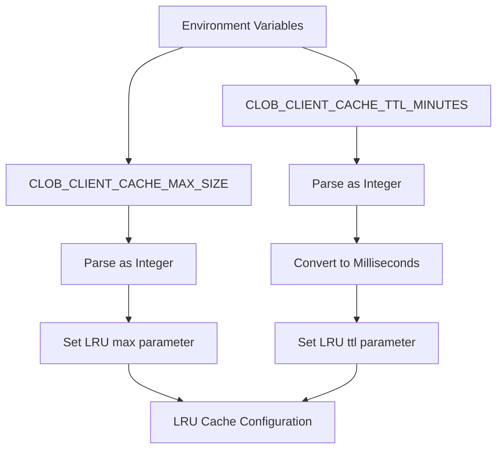
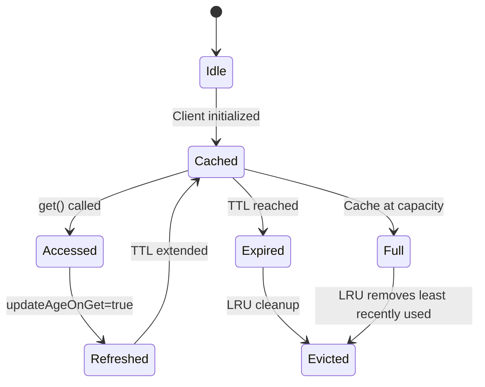
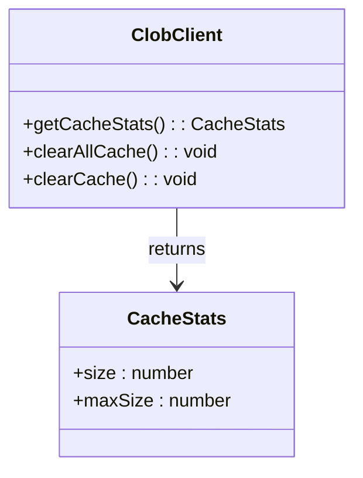
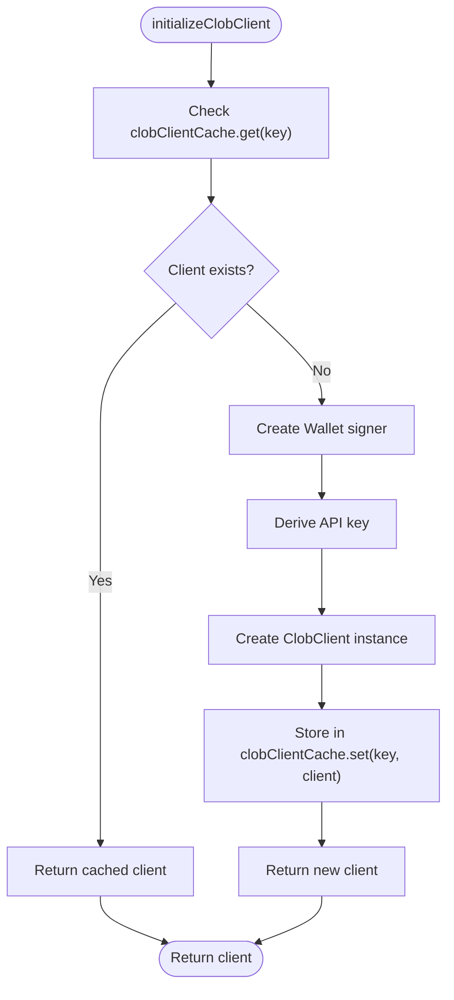

# Caching Strategy

<cite>
**Referenced Files in This Document**   
- [client.ts](file://src/sdk/client.ts)
- [clob/cache_stats_get_response_escaped_clob_client_cache.go](file://go-polymarket/client/clob/cache_stats_get_response_escaped_clob_client_cache.go)
- [clob/cache_stats_get_response.go](file://go-polymarket/client/clob/cache_stats_get_response.go)
- [api.json](file://go-polymarket/api.json)
</cite>

## Table of Contents
1. [Introduction](#introduction)
2. [Cache Configuration](#cache-configuration)
3. [Cache Key Generation](#cache-key-generation)
4. [LRU Cache Behavior](#lru-cache-behavior)
5. [Cache Management Methods](#cache-management-methods)
6. [Performance Benefits](#performance-benefits)
7. [Cache Usage in Client Initialization](#cache-usage-in-client-initialization)
8. [Cache Invalidation and Best Practices](#cache-invalidation-and-best-practices)

## Introduction
The Polymarket SDK implements a sophisticated caching strategy to optimize performance and reduce connection overhead when interacting with the CLOB (Central Limit Order Book) API. This documentation details the caching mechanism centered around the `clobClientCache` global LRU (Least Recently Used) cache, which stores initialized `ClobClient` instances. The cache is configurable through environment variables, supports TTL (Time To Live) with access-based renewal, and provides monitoring and control interfaces for production use.

**Section sources**
- [client.ts](file://src/sdk/client.ts#L29-L34)

## Cache Configuration
The caching system is configured using environment variables that control both size and expiration behavior. The `CLOB_CLIENT_CACHE_MAX_SIZE` environment variable sets the maximum number of client instances that can be stored in the cache, defaulting to 100 if not specified. The `CLOB_CLIENT_CACHE_TTL_MINUTES` variable determines how long cached clients remain valid, with a default of 30 minutes. These values are parsed and converted to milliseconds for the underlying LRU-cache library.

**Diagram sources**
- [client.ts](file://src/sdk/client.ts#L29-L34)

**Section sources**
- [client.ts](file://src/sdk/client.ts#L29-L34)

## Cache Key Generation
The cache key strategy ensures proper isolation of client instances by combining multiple configuration parameters into a unique composite key. The key includes the `privateKey`, `host`, `chainId`, and `funderAddress` components, which together represent a unique client configuration. This approach prevents conflicts between clients with different credentials, network configurations, or funding addresses, ensuring that each distinct configuration maintains its own isolated client instance.

**Section sources**
- [client.ts](file://src/sdk/client.ts#L95-L133)

## LRU Cache Behavior
The caching implementation uses an LRU (Least Recently Used) eviction policy with TTL (Time To Live) expiration. A critical behavioral feature is the `updateAgeOnGet` parameter, which is set to `true`. This setting extends the TTL of a cached client instance whenever it is accessed, effectively implementing a "sliding window" expiration that keeps frequently used clients alive longer. This optimization significantly improves cache efficiency by prioritizing active client instances while still ensuring stale entries are eventually removed.

**Diagram sources**
- [client.ts](file://src/sdk/client.ts#L29-L34)

**Section sources**
- [client.ts](file://src/sdk/client.ts#L29-L34)

## Cache Management Methods
The SDK provides several methods for monitoring and controlling the cache state. The static `getCacheStats()` method returns current cache metrics including size and maximum capacity. The `clearAllCache()` static method removes all entries from the cache, useful for global reset operations. Individual client instances can also be removed via the `clearCache()` instance method, which deletes only the specific client's entry using its cache key.

**Diagram sources**
- [client.ts](file://src/sdk/client.ts#L361-L370)
- [client.ts](file://src/sdk/client.ts#L383-L385)
- [client.ts](file://src/sdk/client.ts#L348-L361)

**Section sources**
- [client.ts](file://src/sdk/client.ts#L361-L385)

## Performance Benefits
The caching strategy delivers significant performance improvements by eliminating redundant client initialization. Each cache hit avoids the overhead of creating new cryptographic signers, establishing API connections, and deriving API keys. This results in faster response times for repeated operations and reduced load on both client and server systems. The combination of size limits and TTL ensures memory usage remains bounded while still providing substantial performance gains for typical usage patterns.

**Section sources**
- [client.ts](file://src/sdk/client.ts#L95-L133)

## Cache Usage in Client Initialization
The `initializeClobClient()` method implements the core cache interaction logic. It first checks for an existing client in the cache using the generated key. If found (cache hit), the existing client is returned immediately. If not found (cache miss), a new client is created with the appropriate configuration and stored in the cache before being returned. The health check method also leverages the cache by checking presence before initialization, providing visibility into cache usage patterns.

**Diagram sources**
- [client.ts](file://src/sdk/client.ts#L95-L133)
- [client.ts](file://src/sdk/client.ts#L296-L348)

**Section sources**
- [client.ts](file://src/sdk/client.ts#L95-L133)

## Cache Invalidation and Best Practices
Cache invalidation occurs automatically through TTL expiration and LRU eviction. The SDK also supports manual invalidation through the `clearCache()` and `clearAllCache()` methods. For production usage, it is recommended to monitor cache hit rates using the health check endpoint and adjust cache size accordingly. The `updateAgeOnGet` behavior should be maintained to optimize for frequently accessed clients. Environment variables should be set appropriately for the deployment context, with larger cache sizes for high-concurrency applications and shorter TTLs for environments requiring rapid configuration changes.

**Section sources**
- [client.ts](file://src/sdk/client.ts#L296-L348)
- [client.ts](file://src/sdk/client.ts#L348-L361)
- [client.ts](file://src/sdk/client.ts#L383-L385)