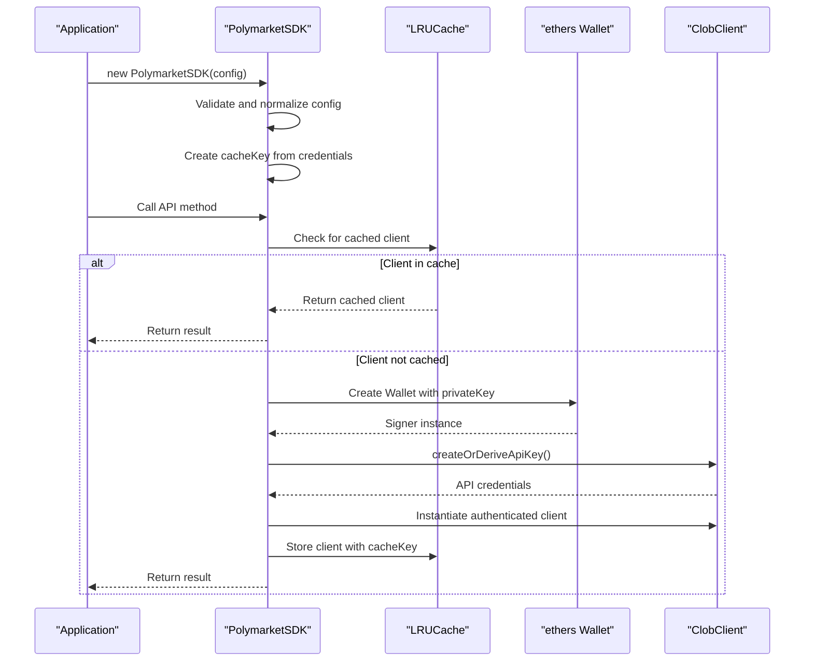
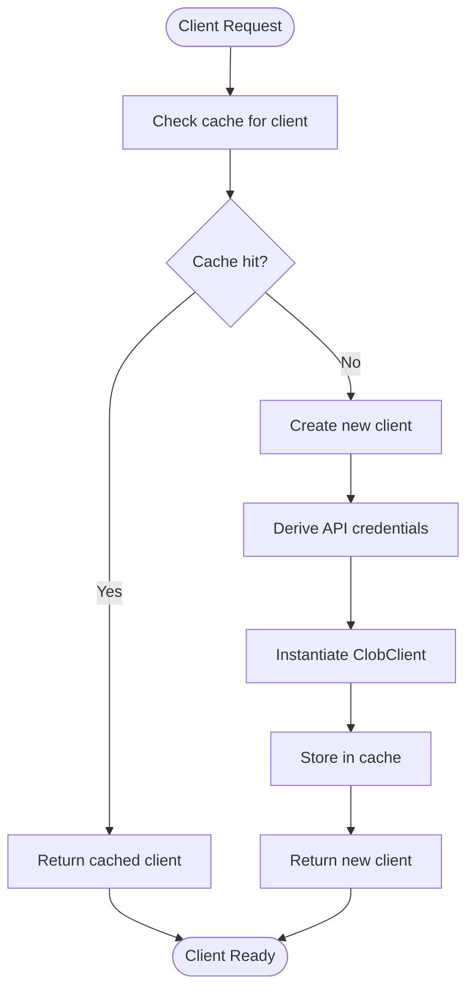

# CLOB Client Initialization

<cite>
**Referenced Files in This Document**   
- [client.ts](file://src/sdk/client.ts)
- [clob.ts](file://src/routes/clob.ts)
</cite>

## Table of Contents
1. [Introduction](#introduction)
2. [Initialization Process](#initialization-process)
3. [Caching Mechanism](#caching-mechanism)
4. [Wallet and API Key Derivation](#wallet-and-api-key-derivation)
5. [Usage Examples](#usage-examples)
6. [Error Handling](#error-handling)
7. [Cache Management](#cache-management)
8. [Common Issues](#common-issues)

## Introduction
The PolymarketSDK CLOB client initialization follows a two-phase pattern designed for efficient credential management and performance optimization. The process separates configuration validation from actual client creation, leveraging caching to avoid redundant initialization. This document details the complete initialization workflow, including configuration handling, caching strategy, wallet integration, and error management.

**Section sources**
- [client.ts](file://src/sdk/client.ts#L29-L34)

## Initialization Process
The CLOB client initialization occurs in two distinct phases:

1. **Constructor Phase**: The `PolymarketSDK` constructor validates and normalizes configuration parameters including `privateKey`, `funderAddress`, `host`, `chainId`, and `signatureType`. Default values are applied for optional parameters.

2. **Asynchronous Initialization Phase**: The actual `ClobClient` creation happens in the private `initializeClobClient()` method, which is called before any API operation. This method handles the asynchronous process of creating or deriving API credentials.



**Diagram sources**
- [client.ts](file://src/sdk/client.ts#L95-L133)

**Section sources**
- [client.ts](file://src/sdk/client.ts#L29-L34)

## Caching Mechanism
The SDK implements a caching strategy using LRUCache to store initialized ClobClient instances, preventing redundant credential derivation and client creation.

### Cache Configuration
The global `clobClientCache` is configured with:
- Maximum size controlled by `CLOB_CLIENT_CACHE_MAX_SIZE` environment variable (default: 100)
- Time-to-live controlled by `CLOB_CLIENT_CACHE_TTL_MINUTES` environment variable (default: 30 minutes)
- `updateAgeOnGet: true` to reset TTL when a client is accessed

### Cache Key Generation
The cache key is derived from a combination of credentials and configuration:
```typescript
this.cacheKey = `${this.config.privateKey}_${this.config.host}_${this.config.chainId}_${this.config.funderAddress}`;
```

This ensures that clients are uniquely identified by their complete configuration, preventing conflicts between different accounts or network configurations.



**Diagram sources**
- [client.ts](file://src/sdk/client.ts#L29-L34)
- [client.ts](file://src/sdk/client.ts#L95-L133)

**Section sources**
- [client.ts](file://src/sdk/client.ts#L29-L34)

## Wallet and API Key Derivation
The initialization process leverages the ethers Wallet to derive API credentials from the provided private key.

### Wallet Integration
The SDK uses the ethers Wallet to:
1. Create a signer instance from the private key
2. Use the signer for API key derivation
3. Provide authentication for ClobClient operations

### API Key Derivation Process
The API key derivation follows this sequence:
1. Create a temporary ClobClient instance with basic parameters
2. Call `createOrDeriveApiKey()` to generate authenticated credentials
3. Use these credentials to instantiate the final authenticated ClobClient

This two-step process ensures that API keys are properly derived and cached along with the client instance, eliminating the need to repeat the derivation process for subsequent requests.

**Section sources**
- [client.ts](file://src/sdk/client.ts#L95-L133)

## Usage Examples
### Basic Initialization
```typescript
const sdk = new PolymarketSDK({
  privateKey: "0x...",
  funderAddress: "0x...",
  host: "https://clob.polymarket.com", // optional
  chainId: 137 // optional
});
```

### Health Check with Cache Information
```typescript
const health = await sdk.healthCheck();
console.log(health.status); // "healthy" | "unhealthy"
console.log(health.cached); // true if client was cached
```

### Cache Statistics
```typescript
const stats = PolymarketSDK.getCacheStats();
console.log(`Cache: ${stats.size}/${stats.maxSize}`);
```

**Section sources**
- [client.ts](file://src/sdk/client.ts#L296-L348)

## Error Handling
The initialization process includes comprehensive error handling for various failure scenarios.

### Constructor Validation
The constructor validates required parameters and throws descriptive errors:
```typescript
if (!config.privateKey || !config.funderAddress) {
  throw new Error(
    "Missing required configuration parameters: privateKey and funderAddress"
  );
}
```

### Client Initialization Errors
The `initializeClobClient()` method catches and wraps errors that occur during client creation:
```typescript
catch (error) {
  console.error("CLOB Client initialization failed:", error);
  throw new Error(
    `Failed to initialize CLOB client: ${
      error instanceof Error ? error.message : "Unknown error"
    }`
  );
}
```

**Section sources**
- [client.ts](file://src/sdk/client.ts#L95-L133)

## Cache Management
The SDK provides several methods for cache inspection and management.

### Instance-Level Cache Control
```typescript
// Clear only this client instance from cache
sdk.clearCache();
```

### Global Cache Management
```typescript
// Get cache statistics
const stats = PolymarketSDK.getCacheStats();

// Clear all cached clients
PolymarketSDK.clearAllCache();
```

### Cache Route
The CLOB routes expose a cache statistics endpoint:
```typescript
.get("/cache/stats", async () => {
  return {
    sdkCache: {
      size: sdkCache.size,
      maxSize: sdkCache.max || 0,
    },
    clobClientCache: PolymarketSDK.getCacheStats(),
    timestamp: new Date().toISOString(),
  };
})
```

**Section sources**
- [client.ts](file://src/sdk/client.ts#L296-L348)
- [clob.ts](file://src/routes/clob.ts#L200-L212)

## Common Issues
### Private Key Format Errors
Ensure the private key is in the correct format (32 bytes, hex string with 0x prefix). Invalid formats will cause wallet creation to fail.

### ChainId Mismatches
Verify that the `chainId` matches the network being used. Using an incorrect chainId can lead to authentication failures or unexpected behavior.

### API Key Derivation Failures
These typically occur when:
- The private key does not have sufficient permissions
- Network connectivity issues prevent API key derivation
- Rate limiting is applied by the CLOB service

### Cache Invalidation Strategies
The cache automatically invalidates entries based on TTL. For manual invalidation:
- Use `clearCache()` to remove a specific client
- Use `clearAllCache()` to reset the entire cache
- Modify any component of the cache key (privateKey, host, chainId, funderAddress) to force reinitialization

**Section sources**
- [client.ts](file://src/sdk/client.ts#L29-L34)
- [client.ts](file://src/sdk/client.ts#L95-L133)