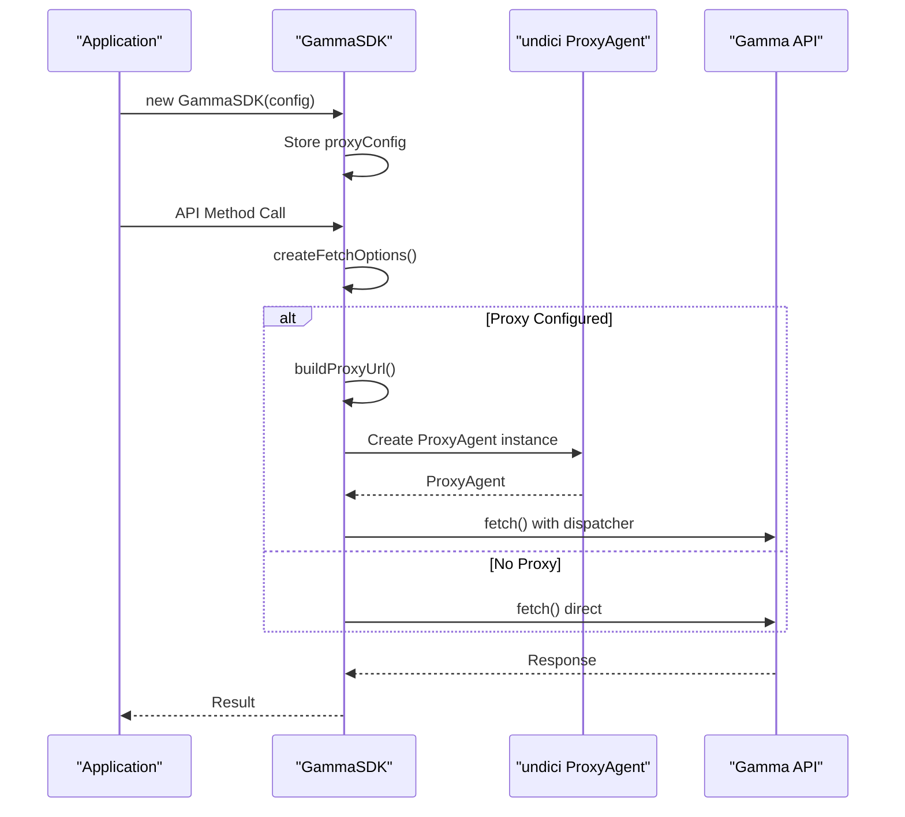
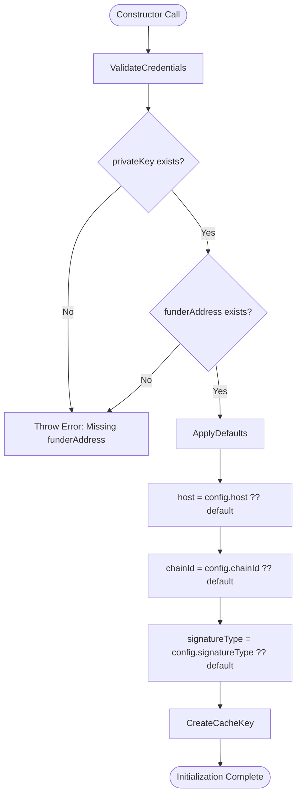
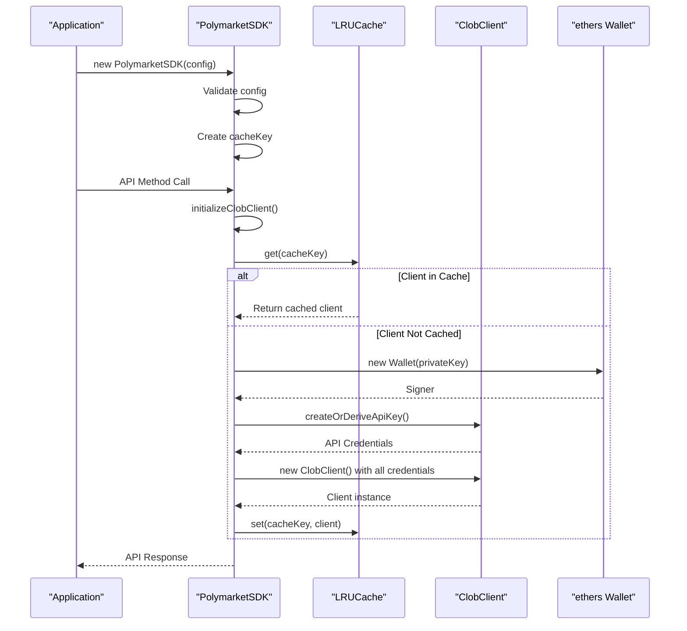
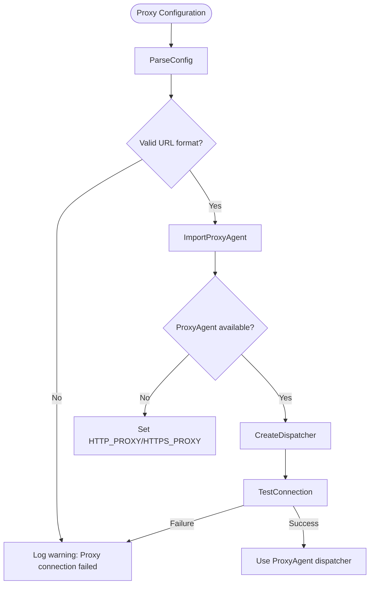

# Client Initialization

<cite>
**Referenced Files in This Document**   
- [gamma-client.ts](file://src/sdk/gamma-client.ts)
- [client.ts](file://src/sdk/client.ts)
- [gamma.ts](file://src/routes/gamma.ts)
- [clob.ts](file://src/routes/clob.ts)
</cite>

## Table of Contents
1. [Introduction](#introduction)
2. [GammaSDK Initialization](#gammasdk-initialization)
3. [PolymarketSDK Initialization](#polymarketsdk-initialization)
4. [Initialization Examples](#initialization-examples)
5. [Common Initialization Issues](#common-initialization-issues)
6. [Conclusion](#conclusion)

## Introduction
This document provides comprehensive documentation for the client initialization processes in both GammaSDK and PolymarketSDK classes. The GammaSDK handles public data operations through the Polymarket Gamma API, while the PolymarketSDK manages authenticated operations via the CLOB API. Each SDK has distinct initialization requirements, configuration options, and error handling mechanisms that are critical for proper integration and operation.

**Section sources**
- [gamma-client.ts](file://src/sdk/gamma-client.ts#L1-L50)
- [client.ts](file://src/sdk/client.ts#L1-L50)

## GammaSDK Initialization

### Configuration Options and Proxy Support
The GammaSDK supports optional proxy configuration through the `GammaSDKConfig` interface, which includes a `proxy` property of type `ProxyConfigType`. This configuration enables HTTP/HTTPS proxy support for API requests, particularly important for Bun runtime compatibility.

The proxy configuration accepts the following properties:
- **protocol**: The protocol to use (http or https)
- **host**: The proxy server hostname
- **port**: The proxy server port
- **username**: Optional authentication username
- **password**: Optional authentication password

When a proxy is configured, the SDK uses undici's ProxyAgent to route requests through the specified proxy server. This implementation is specifically designed for Bun runtime compatibility.



**Diagram sources**
- [gamma-client.ts](file://src/sdk/gamma-client.ts#L54-L89)

### createFetchOptions Method
The `createFetchOptions()` method is responsible for creating fetch options with proxy support. It initializes a RequestInit object with default headers and applies proxy configuration when available.

The method implements a two-tier fallback strategy:
1. First attempts to use undici's ProxyAgent with the dispatcher option for optimal Bun runtime compatibility
2. If ProxyAgent import fails, falls back to environment variables (HTTP_PROXY and HTTPS_PROXY)

This dual approach ensures maximum compatibility across different runtime environments while maintaining the preferred dispatcher-based proxy configuration.

**Section sources**
- [gamma-client.ts](file://src/sdk/gamma-client.ts#L54-L100)

## PolymarketSDK Initialization

### Constructor Parameter Validation
The PolymarketSDK constructor performs strict validation of required parameters and applies sensible defaults to optional properties. The constructor accepts a `ClobClientConfig` object with the following properties:

- **privateKey**: Required - The user's private key for authentication
- **funderAddress**: Required - The funder address for CLOB operations
- **host**: Optional - API endpoint (defaults to "https://clob.polymarket.com")
- **chainId**: Optional - Blockchain network ID (defaults to 137 for Polygon)
- **signatureType**: Optional - Signature scheme (defaults to 1)

The constructor immediately validates the presence of required credentials and throws an error if either privateKey or funderAddress is missing. This early validation prevents initialization of improperly configured SDK instances.



**Diagram sources**
- [client.ts](file://src/sdk/client.ts#L58-L79)

### Two-Phase Initialization Process
The PolymarketSDK employs a two-phase initialization process centered around the `initializeClobClient()` method. This approach separates SDK instantiation from the actual ClobClient creation, enabling efficient resource management and caching.

The initialization process follows these steps:
1. Check the global LRU cache for an existing ClobClient instance using the cache key
2. If cached client exists, return it immediately
3. If no cached client, create a new Wallet instance from the private key
4. Derive API credentials using the ClobClient's createOrDeriveApiKey method
5. Create a new ClobClient instance with all credentials
6. Cache the newly created client for future use

This two-phase approach ensures that expensive client creation operations only occur when necessary, while maintaining proper credential management and security.



**Diagram sources**
- [client.ts](file://src/sdk/client.ts#L103-L155)

### Error Handling and Credential Management
The initialization process includes comprehensive error handling to manage potential failures during client creation. Errors are caught and wrapped in descriptive messages that help diagnose issues.

Credential management is handled securely through the following mechanisms:
- Private keys are never exposed in logs or error messages
- Credentials are derived programmatically using the ClobClient's built-in methods
- The global LRU cache stores client instances rather than raw credentials
- Cache entries have configurable TTL (Time To Live) and maximum size

The SDK also provides static methods for cache management (`getCacheStats()` and `clearAllCache()`) and instance-level cache control (`clearCache()`), giving developers fine-grained control over credential lifecycle.

**Section sources**
- [client.ts](file://src/sdk/client.ts#L103-L155)

## Initialization Examples

### GammaSDK Instantiation Examples
```typescript
// Basic instantiation without proxy
const gamma = new GammaSDK();

// With proxy configuration (no authentication)
const gammaWithProxy = new GammaSDK({
  proxy: {
    protocol: "http",
    host: "proxy.example.com",
    port: 8080
  }
});

// With proxy configuration and authentication
const gammaWithAuthProxy = new GammaSDK({
  proxy: {
    protocol: "https",
    host: "secure-proxy.example.com",
    port: 3128,
    username: "user123",
    password: "pass456"
  }
});
```

### PolymarketSDK Instantiation Examples
```typescript
// Basic instantiation with required credentials
const sdk = new PolymarketSDK({
  privateKey: "0x...",
  funderAddress: "0x..."
});

// With custom host and chainId
const sdkWithCustomConfig = new PolymarketSDK({
  privateKey: "0x...",
  funderAddress: "0x...",
  host: "https://staging-clob.polymarket.com",
  chainId: 80001, // Polygon Mumbai
  signatureType: 1
});
```

**Section sources**
- [gamma-client.ts](file://src/sdk/gamma-client.ts#L54-L100)
- [client.ts](file://src/sdk/client.ts#L58-L79)

## Common Initialization Issues

### Missing Credentials
The most common initialization issue with PolymarketSDK is missing required credentials. When either privateKey or funderAddress is omitted, the constructor throws a descriptive error:

```typescript
// This will throw: "Missing required configuration parameters: privateKey and funderAddress"
const sdk = new PolymarketSDK({
  privateKey: "0x..." // funderAddress missing
});
```

In production environments, credentials must be provided via headers (x-polymarket-key and x-polymarket-funder), while development environments support fallback to environment variables.

### Proxy Configuration Failures
GammaSDK proxy configuration can fail in several scenarios:
- Invalid proxy URL format
- Unreachable proxy server
- Authentication failure with proxy
- Missing undici package in runtime environment

When proxy configuration fails, the SDK logs a warning and attempts to fall back to environment proxy variables (HTTP_PROXY and HTTPS_PROXY). Applications should monitor these warnings in logs to identify proxy-related issues.



**Diagram sources**
- [gamma-client.ts](file://src/sdk/gamma-client.ts#L54-L89)
- [gamma.ts](file://src/routes/gamma.ts#L49-L103)

## Conclusion
The client initialization processes for GammaSDK and PolymarketSDK are designed with different requirements in mind. GammaSDK focuses on flexibility and proxy support for public API access, while PolymarketSDK emphasizes secure credential management and efficient resource utilization for authenticated operations.

Key takeaways:
- GammaSDK uses a simple configuration model with optional proxy support through undici's ProxyAgent
- PolymarketSDK implements a two-phase initialization with caching to optimize performance
- Both SDKs provide clear error messages and fallback mechanisms for common failure scenarios
- Proper initialization requires attention to environment-specific requirements and credential management

Understanding these initialization patterns is essential for successful integration and reliable operation of both SDKs in production environments.