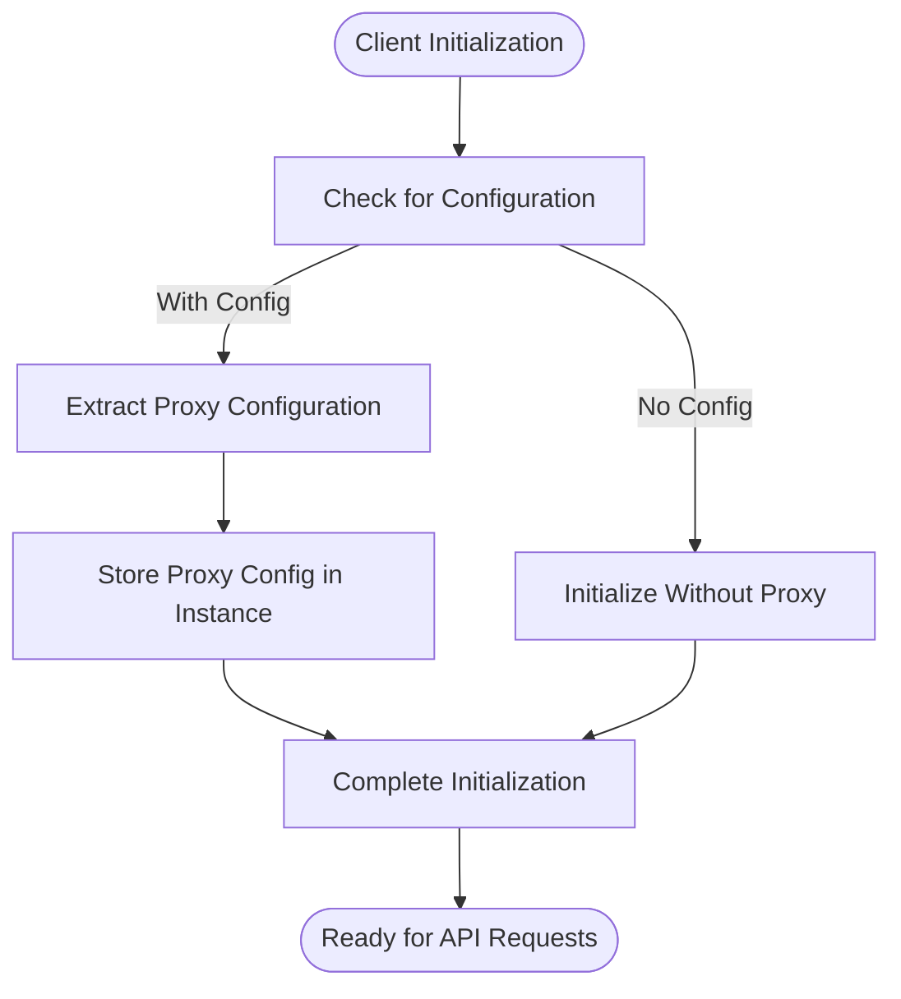
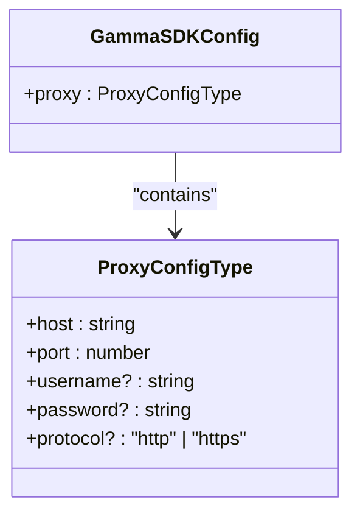
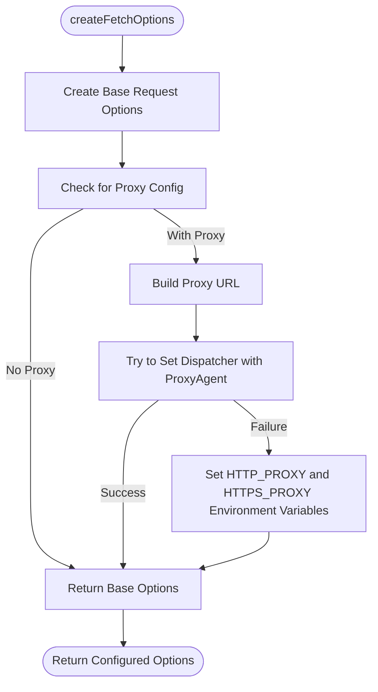
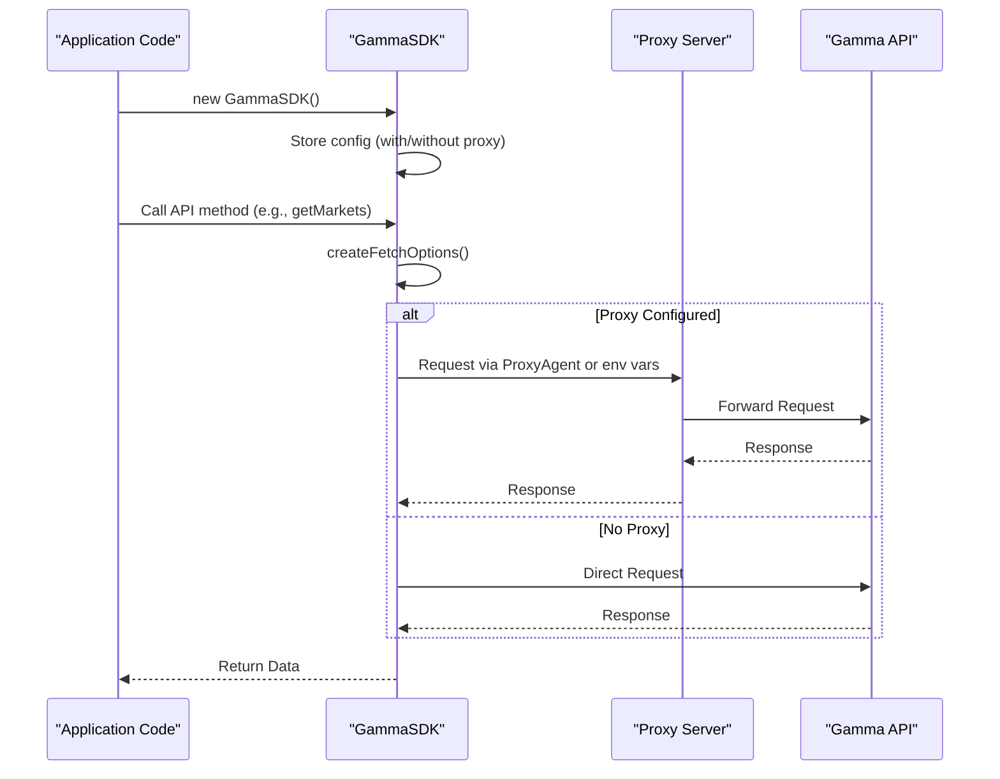
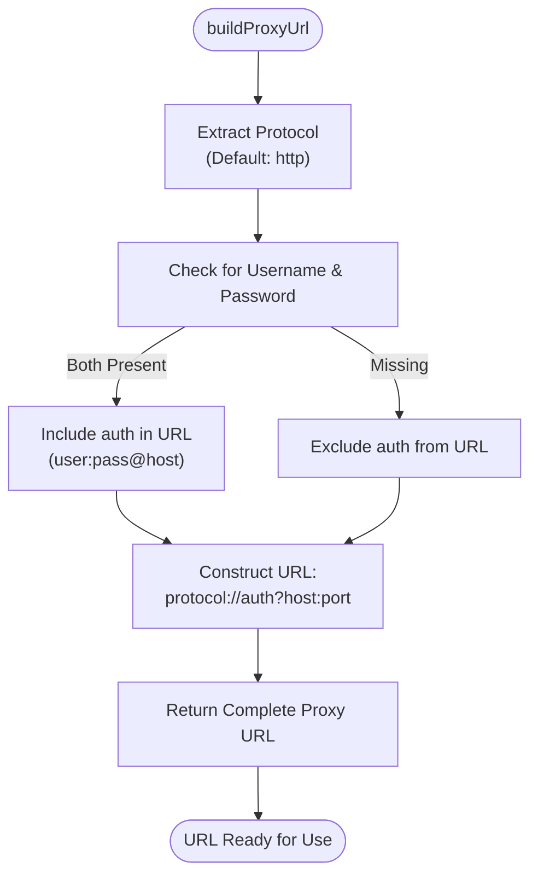

# Gamma Client Initialization

<cite>
**Referenced Files in This Document**   
- [gamma-client.ts](file://src/sdk/gamma-client.ts)
- [elysia-schemas.ts](file://src/types/elysia-schemas.ts)
- [gamma.ts](file://src/routes/gamma.ts)
</cite>

## Table of Contents
1. [Introduction](#introduction)
2. [Client Initialization](#client-initialization)
3. [Proxy Configuration](#proxy-configuration)
4. [Fetch Options Configuration](#fetch-options-configuration)
5. [Usage Examples](#usage-examples)
6. [Common Issues](#common-issues)
7. [Helper Functions](#helper-functions)

## Introduction
The GammaSDK provides a fully typed wrapper for the Polymarket Gamma API endpoints, enabling access to public data operations without authentication requirements. This documentation details the client initialization process with a focus on proxy configuration capabilities, including how to set up protocol, host, port, and authentication credentials through the GammaSDKConfig interface.

**Section sources**
- [gamma-client.ts](file://src/sdk/gamma-client.ts#L1-L50)

## Client Initialization
The GammaSDK client is initialized through its constructor, which accepts an optional GammaSDKConfig parameter. When no configuration is provided, the client operates without proxy settings. The initialization process stores the proxy configuration for later use in HTTP request configuration.

**Diagram sources**
- [gamma-client.ts](file://src/sdk/gamma-client.ts#L50-L54)

**Section sources**
- [gamma-client.ts](file://src/sdk/gamma-client.ts#L50-L54)

## Proxy Configuration
The GammaSDK supports optional proxy configuration through the GammaSDKConfig interface, which includes a proxy property of type ProxyConfigType. This configuration object allows setting the protocol, host, port, and authentication credentials (username and password) for HTTP/HTTPS proxy servers.

The ProxyConfigType is defined with the following properties:
- **host**: Proxy server hostname or IP address
- **port**: Proxy server port number
- **username**: Optional proxy authentication username
- **password**: Optional proxy authentication password  
- **protocol**: Optional proxy protocol (defaults to "http")

When initializing the client with proxy configuration, the provided settings are validated and stored for use in subsequent API requests.

**Diagram sources**
- [elysia-schemas.ts](file://src/types/elysia-schemas.ts#L1014-L1021)
- [gamma-client.ts](file://src/sdk/gamma-client.ts#L15-L25)

**Section sources**
- [gamma-client.ts](file://src/sdk/gamma-client.ts#L15-L25)
- [elysia-schemas.ts](file://src/types/elysia-schemas.ts#L1014-L1021)

## Fetch Options Configuration
The createFetchOptions() method configures HTTP request options with proxy support for Bun runtime compatibility. When proxy configuration is present, the method constructs a proxy URL and attempts to use undici's ProxyAgent through the dispatcher option. If undici cannot be imported, it falls back to setting environment variables (HTTP_PROXY and HTTPS_PROXY).

The method first creates base request options with JSON content-type headers, then checks for proxy configuration. If present, it builds the proxy URL and attempts to configure the dispatcher with ProxyAgent. On failure, it sets the environment variables as a fallback mechanism.

**Diagram sources**
- [gamma-client.ts](file://src/sdk/gamma-client.ts#L54-L80)

**Section sources**
- [gamma-client.ts](file://src/sdk/gamma-client.ts#L54-L80)

## Usage Examples
The GammaSDK can be instantiated with or without proxy settings. Without proxy configuration, the client makes direct HTTP requests to the Gamma API. With proxy configuration, all requests are routed through the specified proxy server.

In server environments, the gammaRoutes middleware demonstrates how to create GammaSDK instances based on the "x-http-proxy" header, parsing the proxy string into the appropriate configuration format and handling parsing errors gracefully by falling back to direct connections.

**Diagram sources**
- [gamma-client.ts](file://src/sdk/gamma-client.ts#L50-L100)
- [gamma.ts](file://src/routes/gamma.ts#L49-L103)

**Section sources**
- [gamma-client.ts](file://src/sdk/gamma-client.ts#L50-L100)
- [gamma.ts](file://src/routes/gamma.ts#L49-L103)

## Common Issues
Several common issues may arise when configuring proxy settings for the GammaSDK:

**Proxy Authentication Failures**: Occur when invalid credentials are provided or the proxy server rejects authentication. The client will log a warning and fall back to environment variables, but requests may still fail if the proxy requires authentication.

**Incorrect URL Formatting**: The proxy URL must follow standard formatting (protocol://[username:password@]host:port). Invalid formats will cause parsing errors in the buildProxyUrl method, leading to connection failures.

**Network Connectivity Problems**: These occur when the proxy server is unreachable, the port is blocked, or network configuration prevents connection. The client will attempt to use the proxy but ultimately fail if connectivity cannot be established.

Error handling is implemented to provide meaningful feedback, with detailed error messages that help diagnose configuration issues and connection problems.

**Section sources**
- [gamma-client.ts](file://src/sdk/gamma-client.ts#L80-L100)
- [gamma.ts](file://src/routes/gamma.ts#L49-L70)

## Helper Functions
The GammaSDK implementation includes several helper functions that support the initialization and configuration process. The buildProxyUrl() function constructs a properly formatted proxy URL from the configuration options, handling authentication credentials and default protocol values.

This helper method extracts the protocol (defaulting to "http" if not specified), conditionally includes authentication credentials when both username and password are provided, and combines these elements with the host and port to create a complete proxy URL string that can be used with undici's ProxyAgent or environment variables.

**Diagram sources**
- [gamma-client.ts](file://src/sdk/gamma-client.ts#L82-L90)

**Section sources**
- [gamma-client.ts](file://src/sdk/gamma-client.ts#L82-L90)