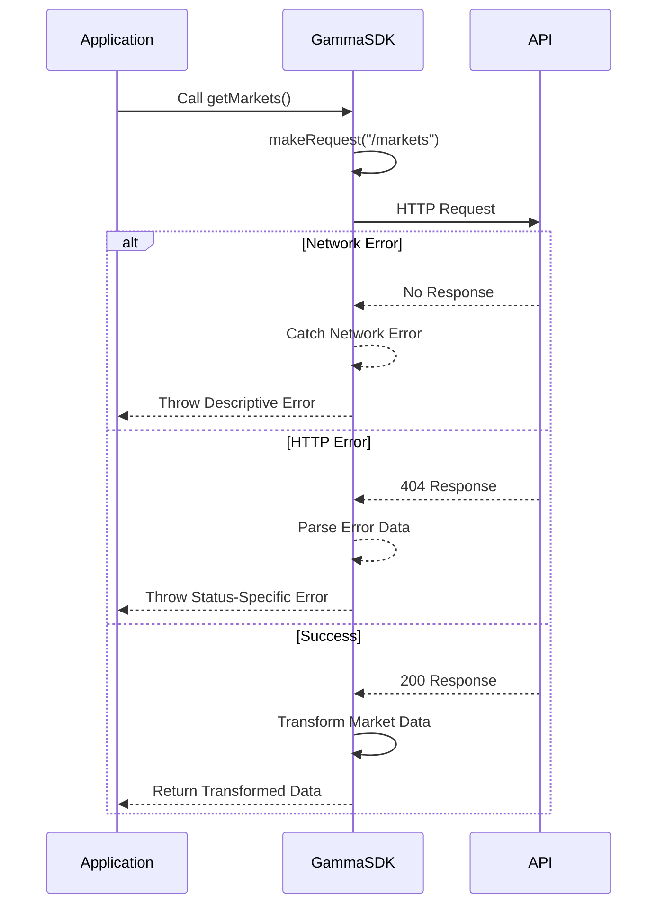
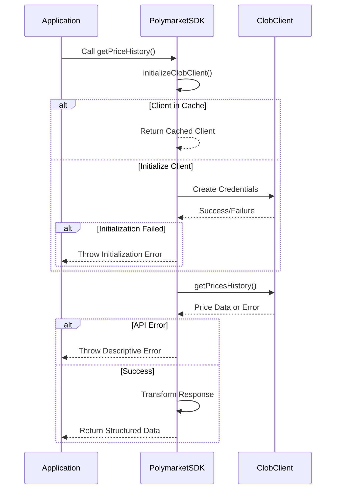

# Error Handling

<cite>
**Referenced Files in This Document**   
- [gamma-client.ts](file://src/sdk/gamma-client.ts)
- [client.ts](file://src/sdk/client.ts)
- [polymarket_client.go](file://go-polymarket/client/polymarket_client.go)
</cite>

## Table of Contents
1. [Introduction](#introduction)
2. [GammaSDK Error Handling](#gammasdk-error-handling)
3. [PolymarketSDK Error Handling](#polymarketsdk-error-handling)
4. [Error Message Formatting](#error-message-formatting)
5. [Common Error Scenarios](#common-error-scenarios)
6. [Best Practices for Error Handling](#best-practices-for-error-handling)
7. [Conclusion](#conclusion)

## Introduction
The Polymarket SDK implements comprehensive error handling mechanisms across its GammaSDK and PolymarketSDK components to ensure robust API interactions and client operations. This documentation details the error handling strategies employed by both SDKs, focusing on how they manage API request failures, client initialization issues, and data transformation errors. The GammaSDK handles public data API operations with sophisticated error capture and transformation, while the PolymarketSDK manages authenticated CLOB operations with graceful degradation and structured health reporting. Both SDKs preserve underlying error details while providing descriptive error messages to consuming applications.

## GammaSDK Error Handling

The GammaSDK implements a centralized error handling mechanism through its `makeRequest()` method, which serves as the foundation for all API interactions. This method captures HTTP status codes, parses error responses, and throws descriptive errors that provide meaningful context to developers. The error handling process begins with the construction of fetch options that support proxy configurations, ensuring connectivity in various network environments.

When making API requests, the `makeRequest()` method wraps the fetch operation in a try-catch block to capture network-level errors. If the fetch operation succeeds but returns a non-200 status code, the method returns a structured response with `ok: false`, the HTTP status code, and the parsed error data from the response body. This approach allows calling methods to handle specific HTTP status codes appropriately, such as returning `null` for 404 responses to indicate resource not found, rather than throwing an exception.

The SDK also implements specialized error handling for data transformation operations. The `parseJsonArray()` method safely handles JSON parsing errors when transforming string fields into arrays, returning empty arrays for invalid JSON rather than propagating parsing exceptions. This defensive programming approach ensures that malformed data in the API response does not crash the application, allowing it to continue processing valid data.

**Diagram sources**
- [gamma-client.ts](file://src/sdk/gamma-client.ts#L102-L164)

**Section sources**
- [gamma-client.ts](file://src/sdk/gamma-client.ts#L102-L164)
- [gamma-client.ts](file://src/sdk/gamma-client.ts#L250-L270)

## PolymarketSDK Error Handling

The PolymarketSDK employs a different error handling strategy optimized for authenticated CLOB operations, focusing on graceful degradation and structured error reporting. Unlike the GammaSDK, which throws exceptions for API errors, the PolymarketSDK's `healthCheck()` method returns structured error information instead of throwing, enabling applications to handle connection issues without exception handling overhead.

The `initializeClobClient()` method implements try-catch blocks around the client creation process, capturing errors during credential derivation and client initialization. When an error occurs, it logs the failure and throws a descriptive error message that includes the underlying cause. This approach ensures that client initialization failures are transparent while preventing the application from crashing due to configuration issues.

The `getPriceHistory()` method wraps external API calls in try-catch blocks, transforming low-level errors into descriptive messages that include context about the specific operation that failed. This method also handles empty responses gracefully by returning a structured response with an empty history array and null time range, rather than throwing an exception when no data is available.

**Diagram sources**
- [client.ts](file://src/sdk/client.ts#L200-L250)
- [client.ts](file://src/sdk/client.ts#L296-L348)

**Section sources**
- [client.ts](file://src/sdk/client.ts#L200-L250)
- [client.ts](file://src/sdk/client.ts#L296-L348)

## Error Message Formatting

Both SDKs implement consistent error message formatting to provide developers with clear and actionable information. The GammaSDK formats errors with the pattern "Failed to [operation]: [HTTP status]", such as "Failed to get markets: 404", which clearly identifies both the operation and the specific HTTP error code. This formatting helps developers quickly diagnose issues by distinguishing between different types of API failures.

The PolymarketSDK uses more descriptive error messages that include context about the operation, such as "Failed to initialize CLOB client: [underlying error]" and "Failed to fetch price history: [underlying error]". These messages preserve the underlying error details from the ClobClient library while wrapping them in a more readable format that indicates which high-level operation failed.

For network-level errors, both SDKs include the endpoint in the error message, following the pattern "Failed to fetch from [endpoint]: [error message]". This approach helps developers identify connectivity issues and distinguish between problems with specific endpoints versus general network connectivity.

## Common Error Scenarios

The SDKs handle several common error scenarios with specific strategies. Network failures are caught at the fetch level in GammaSDK and during client initialization in PolymarketSDK, with descriptive messages that help diagnose connectivity issues. Authentication issues are handled during CLOB client initialization, where invalid private keys or funder addresses result in clear error messages that guide developers to check their configuration.

Rate limiting is implicitly handled by respecting HTTP 429 responses from the API, which are captured by the `makeRequest()` method and transformed into appropriate error messages. The SDKs do not implement automatic retry logic, leaving this decision to consuming applications, but provide sufficient information for applications to implement their own retry strategies based on the error type and status code.

The GammaSDK specifically handles 404 responses by returning `null` for single resource endpoints like `getTagById()` and `getEventById()`, treating resource not found as an expected condition rather than an exceptional one. This design choice simplifies application logic by eliminating the need for try-catch blocks when checking for the existence of resources.

## Best Practices for Error Handling

Consuming applications should implement error handling strategies that align with the SDK's design patterns. For GammaSDK operations, applications should use try-catch blocks around API calls and handle specific HTTP status codes appropriately. When a method returns `null` (such as `getTagById()`), applications should treat this as a valid response indicating the resource was not found, rather than an error condition.

For PolymarketSDK operations, applications should check the return value of `healthCheck()` before performing critical operations, allowing them to detect connection issues proactively. When handling errors from methods like `getPriceHistory()`, applications should parse the descriptive error messages to determine the appropriate recovery strategy, such as retrying with different parameters or alerting the user to configuration issues.

Applications should also monitor the cache status returned by `healthCheck()` to understand whether client initialization is using cached credentials or creating new ones, which can help diagnose performance issues. For long-running applications, periodic health checks can prevent failures due to expired credentials or network connectivity issues.

## Conclusion
The Polymarket SDK implements robust error handling mechanisms that balance comprehensive error capture with developer-friendly interfaces. The GammaSDK's approach of throwing descriptive errors for API failures provides clear feedback for debugging, while the PolymarketSDK's structured health reporting enables graceful degradation in production environments. Both SDKs preserve underlying error details while providing context-rich messages that help developers diagnose and resolve issues efficiently. By following the documented best practices, consuming applications can build resilient systems that handle the full spectrum of potential errors in market data retrieval and trading operations.