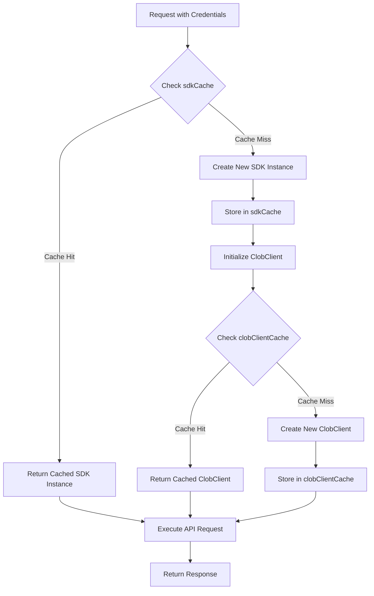
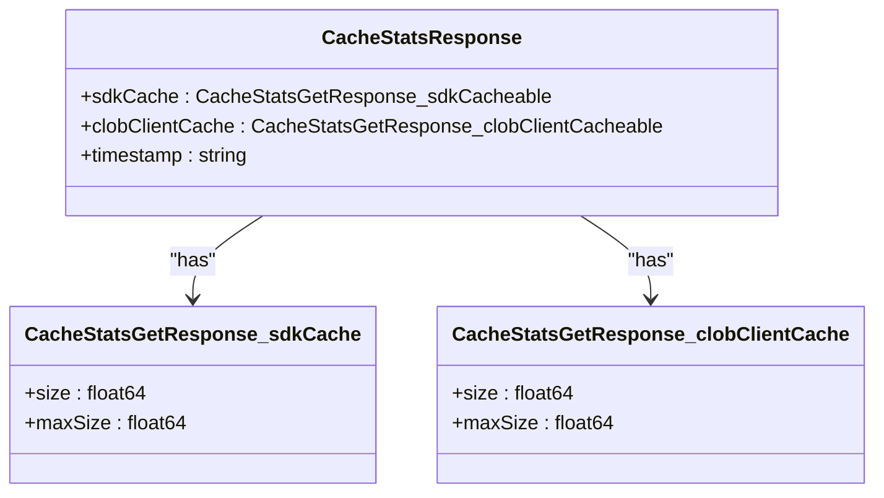

# SDK Implementation

<cite>
**Referenced Files in This Document**   
- [client.ts](file://src/sdk/client.ts)
- [gamma-client.ts](file://src/sdk/gamma-client.ts)
- [index.ts](file://src/sdk/index.ts)
- [clob.ts](file://src/routes/clob.ts)
- [gamma.ts](file://src/routes/gamma.ts)
</cite>

## Table of Contents
1. [Introduction](#introduction)
2. [Core SDK Classes](#core-sdk-classes)
3. [GammaSDK Implementation](#gammasdk-implementation)
4. [PolymarketSDK Implementation](#polymarketsdk-implementation)
5. [Caching Mechanism](#caching-mechanism)
6. [Initialization and Configuration](#initialization-and-configuration)
7. [Error Handling and Response Transformation](#error-handling-and-response-transformation)
8. [Route Integration](#route-integration)
9. [Cache Statistics and Health Monitoring](#cache-statistics-and-health-monitoring)
10. [Conclusion](#conclusion)

## Introduction

The polymarket-kit SDK implementation layer provides a comprehensive interface for interacting with Polymarket's Gamma and CLOB APIs. This documentation details the architecture and functionality of the SDK classes, focusing on the GammaSDK and PolymarketSDK implementations that encapsulate communication with their respective APIs. The system employs a sophisticated caching strategy using the LRU (Least Recently Used) algorithm to optimize performance by reusing client instances and reducing connection overhead. The SDKs handle authentication, proxy configuration, error handling, and response transformation to provide a seamless developer experience.

**Section sources**
- [client.ts](file://src/sdk/client.ts#L1-L30)
- [gamma-client.ts](file://src/sdk/gamma-client.ts#L1-L30)
- [index.ts](file://src/sdk/index.ts#L1-L10)

## Core SDK Classes

The SDK implementation consists of two primary classes: GammaSDK for the Gamma API and PolymarketSDK for the CLOB API. These classes are exported through the index.ts file, which serves as the entry point for the SDK module. The GammaSDK provides access to public data endpoints without requiring authentication, while the PolymarketSDK handles authenticated operations on the CLOB API. Both classes are designed with type safety in mind, leveraging TypeScript interfaces to ensure correct usage and provide comprehensive documentation through JSDoc comments.

```mermaid
classDiagram
class GammaSDK {
+gammaApiBase : string
-proxyConfig : ProxyConfigType
+constructor(config? : GammaSDKConfig)
+getTeams(query : TeamQueryType) : Promise~TeamType[]~
+getTags(query : TagQueryType) : Promise~UpdatedTagType[]~
+getTagById(id : number, query : TagByIdQueryType) : Promise~UpdatedTagType | null~
+getEvents(query : UpdatedEventQueryType) : Promise~EventType[]~
+getMarkets(query : UpdatedMarketQueryType) : Promise~MarketType[]~
+getSeries(query : SeriesQueryType) : Promise~SeriesType[]~
+getComments(query : CommentQueryType) : Promise~CommentType[]~
+search(query : SearchQueryType) : Promise~SearchResponseType~
-createFetchOptions() : RequestInit
-buildProxyUrl(proxy : ProxyConfigType) : string
-buildSearchParams(query : Record~string, any~) : URLSearchParams
-makeRequest~T~(endpoint : string, query? : Record~string, any~) : Promise~{data : T | null, status : number, ok : boolean, errorData? : any}~
-transformMarketData(item : any) : MarketType
-transformEventData(item : any) : EventType
-parseJsonArray(value : string | string[]) : string[]
}
class PolymarketSDK {
-config : ResolvedClobClientConfig
-cacheKey : string
+constructor(config : ClobClientConfig)
+getPriceHistory(query : PriceHistoryQuery) : Promise~PriceHistoryResponse~
+getBook(tokenId : string) : Promise~OrderBookSummary~
+getOrderBooks(params : BookParams[]) : Promise~OrderBookSummary[]~
+getPrice(tokenId : string, side : "buy" | "sell") : Promise~number~
+getPrices(params : BookParams[]) : Promise~number[]~
+getMidpoint(tokenId : string) : Promise~number~
+getMidpoints(params : BookParams[]) : Promise~number[]~
+getSpreads(params : BookParams[]) : Promise~number[]~
+getTrades(params? : TradeParams, onlyFirstPage? : boolean, nextCursor? : string) : Promise~Trade[]~
+getMarket(conditionId : string) : Promise~any~
+getMarkets(nextCursor? : string) : Promise~PaginationPayload~
+healthCheck() : Promise~{status : "healthy" | "unhealthy", timestamp : string, clob : string, error? : string, cached? : boolean}~
+clearCache() : void
+static getCacheStats() : {size : number, maxSize : number}
+static clearAllCache() : void
-initializeClobClient() : Promise~ClobClient~
}
GammaSDK <|-- PolymarketSDK : "extends"
```

**Diagram sources**
- [gamma-client.ts](file://src/sdk/gamma-client.ts#L50-L889)
- [client.ts](file://src/sdk/client.ts#L50-L387)

## GammaSDK Implementation

The GammaSDK class provides a fully typed wrapper for the Polymarket Gamma API, which offers access to public data such as sports, tags, events, markets, series, comments, and search functionality. The SDK is designed to be lightweight and does not require authentication credentials. It supports optional proxy configuration through the GammaSDKConfig interface, allowing requests to be routed through HTTP/HTTPS proxies when needed. The class includes comprehensive error handling and response transformation to ensure consistent data formats across all API endpoints.

The GammaSDK implements several helper methods to facilitate API communication. The createFetchOptions method configures fetch requests with appropriate headers and proxy support using undici's ProxyAgent. The buildSearchParams method converts query objects into URLSearchParams for proper query string formatting. The makeRequest method handles the core HTTP communication with error handling and JSON parsing. Additionally, the SDK includes data transformation methods like transformMarketData and transformEventData to parse JSON string fields into arrays, ensuring the returned data matches the expected schema.

**Section sources**
- [gamma-client.ts](file://src/sdk/gamma-client.ts#L50-L889)

## PolymarketSDK Implementation

The PolymarketSDK class provides a high-level interface to the Polymarket CLOB API for authenticated operations. It requires valid privateKey and funderAddress for authentication and manages the creation of ClobClient instances from the @polymarket/clob-client package. The SDK handles credential management, including creating or deriving API keys using the provided private key. It exposes a comprehensive set of methods for market data retrieval, including price history, order books, prices, midpoints, spreads, trades, and market information.

The PolymarketSDK implements a health check mechanism through the healthCheck method, which tests the CLOB client connection and returns detailed status information including whether the client was retrieved from cache. The SDK also provides cache management methods such as clearCache to remove a specific client instance from the cache, and static methods getCacheStats and clearAllCache for global cache monitoring and management. Error handling is implemented throughout the SDK to provide meaningful error messages and ensure robust operation even when API requests fail.

**Section sources**
- [client.ts](file://src/sdk/client.ts#L50-L387)

## Caching Mechanism

The SDK implementation employs a sophisticated caching strategy using the LRU (Least Recently Used) algorithm to optimize performance and reduce connection overhead. Two global caches are implemented: sdkCache for PolymarketSDK instances and clobClientCache for ClobClient instances. The sdkCache is defined in the clob.ts route file and stores SDK instances based on the combination of privateKey and funderAddress. The clobClientCache is defined within the client.ts file and stores ClobClient instances using a cache key that incorporates the privateKey, host, chainId, and funderAddress.

Both caches are configured with configurable maximum sizes and time-to-live (TTL) values, allowing for fine-tuned performance optimization. The sdkCache has a default maximum size of 50 instances and a TTL of 1 hour, while the clobClientCache has a default maximum size of 100 instances and a TTL of 30 minutes. The updateAgeOnGet option is enabled for both caches, which resets the TTL when a cached item is accessed, effectively keeping frequently used instances in the cache longer. This caching mechanism significantly improves performance by reusing client instances and avoiding the overhead of repeated authentication and connection establishment.



**Diagram sources**
- [client.ts](file://src/sdk/client.ts#L20-L30)
- [clob.ts](file://src/routes/clob.ts#L20-L30)

## Initialization and Configuration

The SDK classes are designed with flexible initialization and configuration options to accommodate various deployment scenarios. The GammaSDK accepts an optional GammaSDKConfig parameter in its constructor, allowing for proxy configuration without requiring authentication credentials. The PolymarketSDK requires a configuration object with privateKey and funderAddress, with optional parameters for host, chainId, and signatureType that default to sensible values if not provided.

Configuration parameters are applied with sensible defaults to minimize the configuration burden on developers. For example, the PolymarketSDK defaults to the production CLOB host (https://clob.polymarket.com) and Polygon chain (chainId: 137) if not explicitly specified. The cache configurations are controlled through environment variables (SDK_CACHE_MAX_SIZE, SDK_CACHE_TTL_HOURS, CLOB_CLIENT_CACHE_MAX_SIZE, CLOB_CLIENT_CACHE_TTL_MINUTES), allowing for runtime configuration without code changes. This flexible configuration system enables the SDK to adapt to different environments and requirements while maintaining a consistent interface.

**Section sources**
- [client.ts](file://src/sdk/client.ts#L50-L100)
- [gamma-client.ts](file://src/sdk/gamma-client.ts#L50-L100)

## Error Handling and Response Transformation

The SDK implementation includes comprehensive error handling and response transformation to ensure reliable operation and consistent data formats. The GammaSDK's makeRequest method handles HTTP errors by returning a structured response with data, status, ok flag, and errorData, allowing callers to distinguish between different types of errors. Network errors are caught and rethrown with descriptive messages. The PolymarketSDK implements similar error handling in its API methods, wrapping errors with context-specific messages.

Response transformation is a key feature of the SDK, particularly in the GammaSDK. The transformMarketData and transformEventData methods parse JSON string fields into arrays, ensuring the returned data matches the expected schema. This transformation is necessary because the Gamma API returns some array fields as JSON strings rather than actual arrays. The SDK also handles 404 responses gracefully by returning null for single-item retrieval methods, allowing callers to distinguish between "not found" and other error conditions. This comprehensive error handling and response transformation system provides a robust and developer-friendly interface to the underlying APIs.

**Section sources**
- [gamma-client.ts](file://src/sdk/gamma-client.ts#L200-L300)
- [client.ts](file://src/sdk/client.ts#L200-L300)

## Route Integration

The SDK classes are integrated into the application through route handlers in the clob.ts and gamma.ts files. These route files use the Elysia framework to define typed endpoints for all available API operations. The routes implement a resolve pattern to create or retrieve SDK instances based on request headers, with fallback to environment variables in development mode. The clob.ts file defines the sdkCache and getPolymarketSDK function to manage SDK instance caching, while the gamma.ts file implements a similar pattern for GammaSDK instances with proxy support.

The route handlers provide comprehensive validation and documentation through Elysia's type system and OpenAPI integration. Each endpoint includes detailed JSDoc comments, parameter validation schemas, and response type definitions. The routes handle authentication headers (x-polymarket-key, x-polymarket-funder) for the CLOB API and proxy headers (x-http-proxy) for the Gamma API. This integration pattern ensures that SDK instances are efficiently reused across requests while maintaining proper isolation between different users' credentials.

**Section sources**
- [clob.ts](file://src/routes/clob.ts#L1-L100)
- [gamma.ts](file://src/routes/gamma.ts#L1-L100)

## Cache Statistics and Health Monitoring

The SDK implementation includes built-in monitoring capabilities through cache statistics and health check endpoints. The clob.ts route file defines a /cache/stats endpoint that returns statistics for both the sdkCache and clobClientCache, including current size and maximum size. This endpoint provides visibility into cache utilization and helps diagnose performance issues. The PolymarketSDK class also includes a static getCacheStats method that returns similar information for the clobClientCache.

The healthCheck method in the PolymarketSDK provides comprehensive health monitoring for CLOB client connections. It returns detailed status information including connection status, timestamp, CLOB connection status, and whether the client was retrieved from cache. This information is exposed through the /health endpoint in the clob.ts routes, allowing external monitoring systems to verify the health of the SDK implementation. These monitoring features are essential for maintaining system reliability and diagnosing issues in production environments.



**Diagram sources**
- [clob.ts](file://src/routes/clob.ts#L150-L200)
- [client.ts](file://src/sdk/client.ts#L300-L350)

## Conclusion

The SDK implementation in polymarket-kit provides a robust and efficient interface to Polymarket's Gamma and CLOB APIs. The GammaSDK and PolymarketSDK classes encapsulate the complexities of API communication, authentication, and data transformation, offering developers a clean and type-safe interface. The LRU caching mechanism significantly improves performance by reusing client instances and reducing connection overhead. The flexible configuration system, comprehensive error handling, and built-in monitoring capabilities make the SDK suitable for both development and production environments. This implementation demonstrates best practices in SDK design, providing a reliable foundation for applications that interact with Polymarket's trading platform.