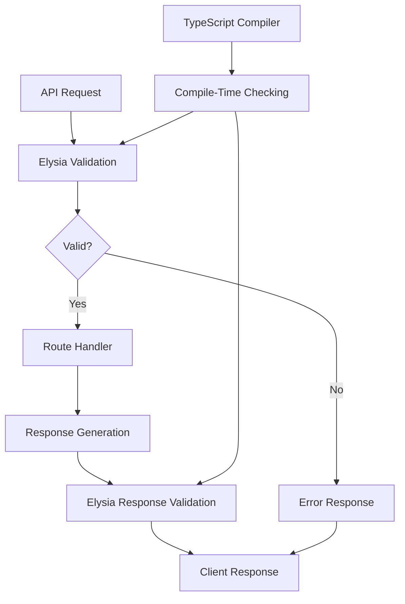
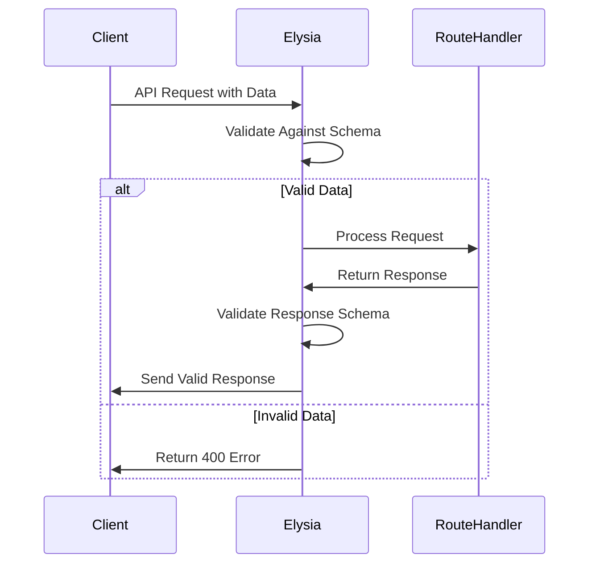
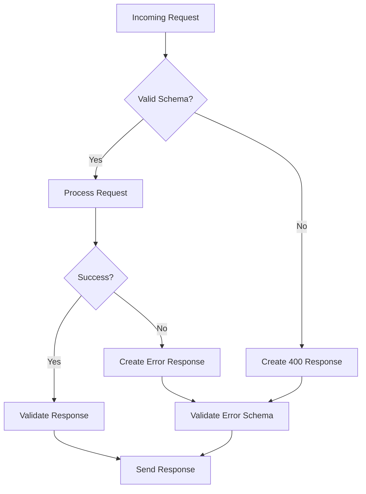

# Type Safety System

<cite>
**Referenced Files in This Document**   
- [elysia-schemas.ts](file://src/types/elysia-schemas.ts)
- [gamma.ts](file://src/routes/gamma.ts)
- [clob.ts](file://src/routes/clob.ts)
</cite>

## Table of Contents
1. [Introduction](#introduction)
2. [Core Type Safety Architecture](#core-type-safety-architecture)
3. [Schema Definition System](#schema-definition-system)
4. [Route Integration and Validation](#route-integration-and-validation)
5. [Custom Schema Compositions](#custom-schema-compositions)
6. [Error Handling and Response Validation](#error-handling-and-response-validation)
7. [OpenAPI Documentation Generation](#openapi-documentation-generation)
8. [Runtime Validation and Compile-Time Checking](#runtime-validation-and-compile-time-checking)
9. [Practical Implementation Examples](#practical-implementation-examples)
10. [Conclusion](#conclusion)

## Introduction
The Polymarket Kit implements a robust type safety system that ensures end-to-end type validation from API routes to responses. This system combines Elysia's runtime type validation with TypeScript's compile-time type checking to create a comprehensive safety net for API interactions. The core of this system is built around the `elysia-schemas.ts` file, which defines all request and response schemas using Elysia's `t` object. These schemas provide automatic request validation, response structure definition, and OpenAPI/Swagger documentation generation, ensuring that both clients and servers maintain predictable data contracts.

## Core Type Safety Architecture
The type safety system in Polymarket Kit is built on Elysia's type validation framework, which provides a bridge between TypeScript's static type system and runtime data validation. This dual-layer approach ensures that type errors are caught both during development and at runtime. The architecture follows a clear pattern where all API endpoints are defined with explicit request and response schemas that are validated against incoming and outgoing data. This system prevents common errors such as malformed requests, unexpected response structures, and type mismatches that could lead to application failures.



**Diagram sources**
- [elysia-schemas.ts](file://src/types/elysia-schemas.ts)
- [gamma.ts](file://src/routes/gamma.ts)

**Section sources**
- [elysia-schemas.ts](file://src/types/elysia-schemas.ts)
- [gamma.ts](file://src/routes/gamma.ts)

## Schema Definition System
The schema definition system in Polymarket Kit is centered around the `elysia-schemas.ts` file, which exports a comprehensive set of type schemas for all API interactions. These schemas are created using Elysia's `t` object, which provides a rich set of type constructors for defining complex data structures. The system includes base types like `StringArray`, `OptionalString`, and `OptionalNumber` that are reused across multiple schemas to ensure consistency.

The schemas cover various aspects of the API, including:
- Market data structures with pricing, volume, and liquidity information
- Event objects that group related markets
- Series data for thematic market groupings
- Tag categorization systems
- Price history tracking with timestamped data points
- Query parameters for filtering, sorting, and pagination

Each schema precisely defines the expected structure, data types, and optional fields for its corresponding data entity, providing a single source of truth for type definitions across the application.

**Section sources**
- [elysia-schemas.ts](file://src/types/elysia-schemas.ts#L1-L200)

## Route Integration and Validation
The integration of type schemas into route definitions is a critical aspect of the type safety system. In both `gamma.ts` and `clob.ts`, routes are defined with explicit schema references for query parameters, request bodies, and response types. This integration enables automatic validation of incoming requests against the defined schemas.

For example, in the Gamma API routes, endpoints like `/gamma/events` use the `UpdatedEventQuerySchema` to validate query parameters and `t.Array(EventSchema)` to ensure the response conforms to the expected structure. Similarly, CLOB API routes use schemas like `PriceHistoryQuerySchema` and `PriceHistoryResponseSchema` to validate price history requests and responses.

The validation process occurs automatically when requests are received, rejecting invalid requests with appropriate error messages before they reach the route handlers. This prevents malformed data from propagating through the system and ensures that only valid data is processed.



**Diagram sources**
- [gamma.ts](file://src/routes/gamma.ts#L100-L150)
- [clob.ts](file://src/routes/clob.ts#L50-L100)

**Section sources**
- [gamma.ts](file://src/routes/gamma.ts)
- [clob.ts](file://src/routes/clob.ts)

## Custom Schema Compositions
The type safety system includes several custom schema compositions that enable reusable type patterns across multiple endpoints. One of the most important of these is the `PaginatedResponseSchema`, a generic function that creates paginated response structures for any given schema. This function takes a schema as a parameter and returns a new schema with a standardized pagination wrapper.

The `PaginatedResponseSchema` function is defined as:
```typescript
export const PaginatedResponseSchema = <T extends TSchema>(schema: T) =>
  t.Object({
    data: t.Array(schema),
    pagination: t.Object({
      hasMore: t.Boolean(),
      totalResults: t.Number(),
    }),
  });
```

This composition allows endpoints to consistently return paginated data with a uniform structure, regardless of the underlying data type. Other custom compositions include query parameter schemas that combine multiple filtering, sorting, and pagination options into reusable patterns that can be applied across different resource types.

**Section sources**
- [elysia-schemas.ts](file://src/types/elysia-schemas.ts#L704-L711)

## Error Handling and Response Validation
The type safety system includes comprehensive error handling and response validation to ensure clients receive predictable and well-structured error responses. Standard error schemas like `ErrorResponseSchema` and `GammaErrorResponseSchema` define the structure of error responses, ensuring consistency across all API endpoints.

When invalid requests are received, the system automatically rejects them with appropriate HTTP status codes and error messages that conform to these schemas. For example, requests with invalid query parameters are rejected with 400 status codes and error responses that include an error message and optional details. Similarly, requests for non-existent resources return 404 status codes with standardized error structures.

The response validation ensures that even when errors occur, the response structure itself is type-safe and predictable, making it easier for clients to handle errors programmatically.



**Diagram sources**
- [elysia-schemas.ts](file://src/types/elysia-schemas.ts#L150-L200)
- [gamma.ts](file://src/routes/gamma.ts#L200-L250)

**Section sources**
- [elysia-schemas.ts](file://src/types/elysia-schemas.ts)
- [gamma.ts](file://src/routes/gamma.ts)

## OpenAPI Documentation Generation
The type safety system automatically generates OpenAPI/Swagger documentation from the defined schemas and route configurations. Each route includes a `detail` object with metadata such as tags, summary, and description, which is used to generate comprehensive API documentation. The request and response schemas are translated into OpenAPI schema definitions, providing clients with detailed information about expected request formats and response structures.

This automatic documentation generation ensures that the API documentation is always up-to-date with the actual implementation, reducing the risk of documentation drift. The generated documentation includes information about:
- Available endpoints and their HTTP methods
- Required and optional parameters
- Expected request body structures
- Possible response types and status codes
- Error response formats

**Section sources**
- [gamma.ts](file://src/routes/gamma.ts#L50-L100)
- [clob.ts](file://src/routes/clob.ts#L20-L70)

## Runtime Validation and Compile-Time Checking
The type safety system combines runtime validation with compile-time checking to provide comprehensive protection against type-related errors. During development, TypeScript's compiler checks ensure that route handlers return data that matches the defined response schemas. This catchs type mismatches before the code is deployed.

At runtime, Elysia's validation system checks incoming requests against the defined schemas, rejecting invalid data before it reaches the application logic. This two-layer approach ensures that both developers and clients are held to the same type contracts, preventing errors that could occur from mismatched expectations.

The system also handles the conversion between string-based query parameters and their intended types, parsing and validating parameters like numbers and booleans that arrive as strings in HTTP requests. This ensures that route handlers receive data in the expected types, reducing the need for manual type conversion and validation within the handlers.

**Section sources**
- [elysia-schemas.ts](file://src/types/elysia-schemas.ts)
- [gamma.ts](file://src/routes/gamma.ts)
- [clob.ts](file://src/routes/clob.ts)

## Practical Implementation Examples
The type safety system is implemented across various endpoints in the Polymarket Kit. For example, the `/clob/prices-history` endpoint uses the `PriceHistoryQuerySchema` to validate incoming requests, ensuring that required parameters like `market` are present and that optional parameters like `interval` conform to the allowed values (`1m`, `1h`, `6h`, `1d`, `1w`, `max`).

Similarly, the `/gamma/events/pagination` endpoint uses the `PaginatedEventQuerySchema` for request validation and a composed response schema that wraps the `EventSchema` in a pagination structure. This ensures that clients receive consistently formatted paginated responses with metadata about the total number of results and whether more results are available.

These implementations demonstrate how the type safety system prevents common errors by validating data at multiple points in the request-response cycle, from initial parameter parsing to final response generation.

**Section sources**
- [clob.ts](file://src/routes/clob.ts#L150-L200)
- [gamma.ts](file://src/routes/gamma.ts#L300-L350)

## Conclusion
The type safety system in Polymarket Kit provides a robust framework for ensuring data integrity across all API interactions. By combining Elysia's runtime type validation with TypeScript's compile-time type checking, the system creates a comprehensive safety net that prevents common errors and ensures predictable API behavior. The use of centralized schema definitions in `elysia-schemas.ts` promotes consistency and reusability across endpoints, while custom schema compositions like `PaginatedResponseSchema` enable flexible and standardized response patterns. This approach not only improves reliability but also enhances developer experience by providing clear contracts and automatic documentation generation.