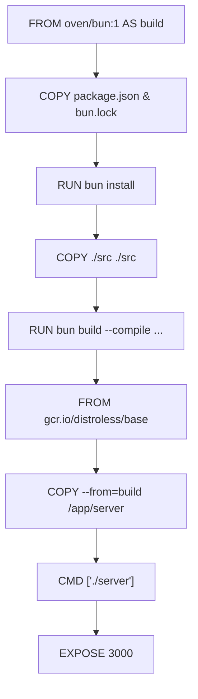
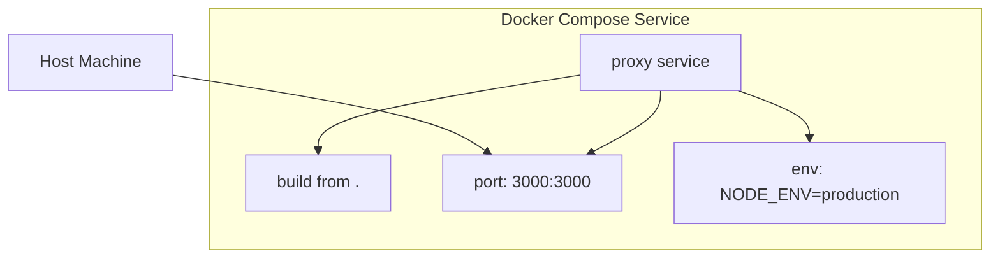

# Deployment Configuration

<cite>
**Referenced Files in This Document**   
- [Dockerfile](file://Dockerfile)
- [docker-compose.yml](file://docker-compose.yml)
- [package.json](file://package.json)
- [src/run.ts](file://src/run.ts)
- [src/utils/env.ts](file://src/utils/env.ts)
</cite>

## Table of Contents
1. [Introduction](#introduction)
2. [Configuration Flow Overview](#configuration-flow-overview)
3. [Standalone Execution with Bun](#standalone-execution-with-bun)
4. [Docker Container Deployment](#docker-container-deployment)
5. [Docker Compose Orchestration](#docker-compose-orchestration)
6. [Environment Variable Management](#environment-variable-management)
7. [Port Exposure and Networking](#port-exposure-and-networking)
8. [Customization for Scaling and Integration](#customization-for-scaling-and-integration)
9. [Troubleshooting Common Deployment Issues](#troubleshooting-common-deployment-issues)

## Introduction
This document details the deployment configuration strategies for the Polymarket Proxy Server across multiple environments: direct execution using Bun, standalone Docker containers, and orchestrated services via Docker Compose. It explains how configuration is managed through scripts, environment variables, and build stages to ensure consistent behavior across deployment targets.

## Configuration Flow Overview
The deployment configuration flows from `package.json` scripts to Docker build processes and runtime execution. Development starts with `bun run --hot src/run.ts`, while production deployments use Dockerized builds that compile the application into a standalone binary. Environment variables control runtime behavior, and port settings are abstracted through configuration utilities.

**Section sources**
- [package.json](file://package.json#L20-L30)
- [src/run.ts](file://src/run.ts#L1-L10)
- [src/utils/env.ts](file://src/utils/env.ts#L1-L12)

## Standalone Execution with Bun
The application can be executed directly using Bun with hot-reload capabilities for development. The `dev` script in `package.json` invokes `bun run --hot src/run.ts`, enabling live reloading during development. For production-like testing, the `build.ts` script compiles the application, and the resulting binary can be executed independently.

The server listens on a configurable port (default: 3000) bound to all interfaces (`0.0.0.0`) to allow external access when running in containerized or remote environments.

**Section sources**
- [package.json](file://package.json#L20-L21)
- [src/run.ts](file://src/run.ts#L1-L10)
- [src/utils/env.ts](file://src/utils/env.ts#L4-L6)

## Docker Container Deployment
The Docker deployment uses a multi-stage build process defined in `Dockerfile`. The first stage uses the `oven/bun:1` image to install dependencies and compile the application into a standalone executable via `bun build --compile`. This produces a self-contained binary named `server` from `src/run.ts`.

The second stage uses Google's distroless base image for minimal footprint and security. It copies only the compiled binary from the build stage, sets the production environment, and defines the entry point. Port 3000 is explicitly exposed to align with the application's default configuration.

**Diagram sources**
- [Dockerfile](file://Dockerfile#L1-L35)

**Section sources**
- [Dockerfile](file://Dockerfile#L1-L35)
- [src/run.ts](file://src/run.ts#L1-L10)

## Docker Compose Orchestration
Docker Compose simplifies multi-container deployments and service coordination. The `docker-compose.yml` defines a `proxy` service that builds the image from the current directory (using the Dockerfile). It maps host port 3000 to container port 3000 and sets `NODE_ENV=production` to ensure production-mode behavior.

This configuration enables consistent local deployments that mirror production environments and facilitates integration with other services through network linking when extended.

**Diagram sources**
- [docker-compose.yml](file://docker-compose.yml#L1-L8)

**Section sources**
- [docker-compose.yml](file://docker-compose.yml#L1-L8)
- [Dockerfile](file://Dockerfile#L1-L35)

## Environment Variable Management
Environment variables are centrally managed through the `getEnv()` and `getPort()` functions in `src/utils/env.ts`. The application reads `NODE_ENV` to determine execution mode and `PORT` to set the listening port, defaulting to 3000. `BASE_URL` can override the advertised server URL in logs and responses.

In Docker deployments, `NODE_ENV` is set to `production` both during build and runtime. Variables can be overridden in `docker-compose.yml` or passed via command line when running containers directly.

**Section sources**
- [src/utils/env.ts](file://src/utils/env.ts#L1-L12)
- [docker-compose.yml](file://docker-compose.yml#L5-L7)
- [Dockerfile](file://Dockerfile#L15-L16)

## Port Exposure and Networking
The application listens on port 3000 by default, configurable via the `PORT` environment variable. The `EXPOSE 3000` directive in `Dockerfile` documents this port usage. Docker Compose explicitly maps host port 3000 to container port 3000, enabling external access.

When deploying multiple instances or integrating with other services, port conflicts can be resolved by modifying the host port mapping in `docker-compose.yml` (e.g., `"3001:3000"`) or setting a different `PORT` environment variable.

**Section sources**
- [Dockerfile](file://Dockerfile#L34-L35)
- [docker-compose.yml](file://docker-compose.yml#L3-L4)
- [src/utils/env.ts](file://src/utils/env.ts#L4-L6)

## Customization for Scaling and Integration
To scale the deployment, modify the `docker-compose.yml` to include multiple instances and integrate with a reverse proxy or load balancer. For integration with other services, extend the compose file to define additional services and network links.

Custom environment variables can be added to `src/utils/env.ts` and injected via `docker-compose.yml`. The build process can be customized by modifying the `bun build` command in `Dockerfile` or the `build.ts` script. For cloud deployments, the `deploy` script in `package.json` integrates with Cloudflare Workers via Wrangler.

**Section sources**
- [docker-compose.yml](file://docker-compose.yml#L1-L8)
- [Dockerfile](file://Dockerfile#L1-L35)
- [package.json](file://package.json#L23-L24)
- [src/utils/env.ts](file://src/utils/env.ts#L1-L12)

## Troubleshooting Common Deployment Issues
**Port Conflicts**: If port 3000 is already in use, change the host port mapping in `docker-compose.yml` (e.g., `"3001:3000"`) or set a different `PORT` environment variable.

**Missing Dependencies**: Ensure `bun install` completes successfully during Docker build. If dependencies fail to resolve, verify `package.json` and `bun.lock` are present and valid.

**Incorrect Environment Propagation**: Verify `NODE_ENV` is properly set in both build and runtime contexts. Use `console.log(getEnv())` in `src/run.ts` to debug environment detection.

**Base URL Issues**: If the server advertises an incorrect URL, set `BASE_URL` explicitly in environment variables to override the default `http://localhost:3000` construction.

**Build Failures**: Ensure the `bun build` command in `Dockerfile` points to the correct entry file (`src/run.ts`) and that `build.ts` exists and is executable.

**Section sources**
- [Dockerfile](file://Dockerfile#L1-L35)
- [docker-compose.yml](file://docker-compose.yml#L1-L8)
- [src/run.ts](file://src/run.ts#L1-L10)
- [src/utils/env.ts](file://src/utils/env.ts#L1-L12)