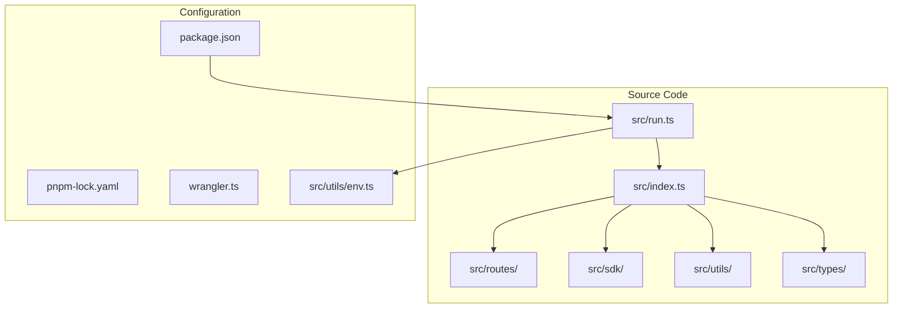
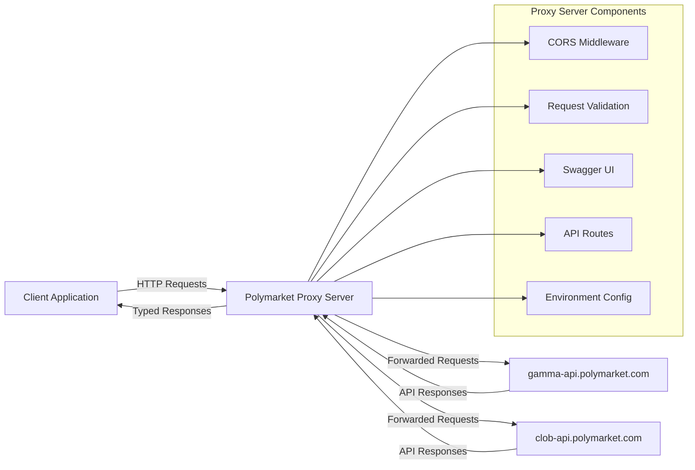
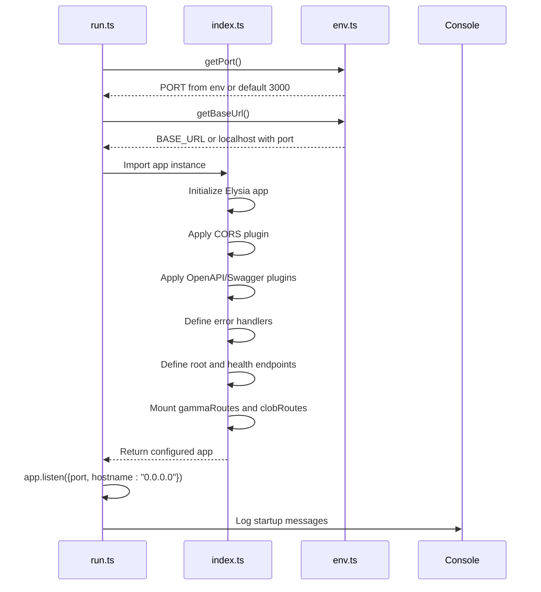
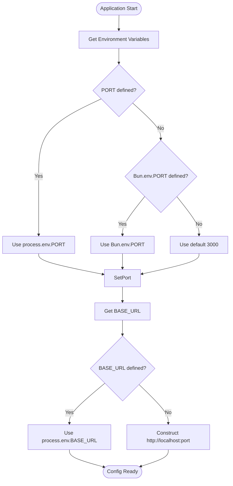

# Bare Metal/Node.js

<cite>
**Referenced Files in This Document**   
- [package.json](file://package.json)
- [src/index.ts](file://src/index.ts)
- [src/run.ts](file://src/run.ts)
- [src/utils/env.ts](file://src/utils/env.ts)
</cite>

## Table of Contents
1. [Introduction](#introduction)
2. [Project Structure](#project-structure)
3. [Core Components](#core-components)
4. [Architecture Overview](#architecture-overview)
5. [Detailed Component Analysis](#detailed-component-analysis)
6. [Dependency Analysis](#dependency-analysis)
7. [Performance Considerations](#performance-considerations)
8. [Troubleshooting Guide](#troubleshooting-guide)
9. [Conclusion](#conclusion)

## Introduction
This document provides comprehensive guidance for deploying the Polymarket Kit application on bare metal Node.js servers. The application is a fully typed proxy server built with the Elysia framework, designed to interface with Polymarket's CLOB and Gamma APIs. It supports type-safe endpoints with validation, OpenAPI/Swagger documentation, CORS, and health monitoring. This guide covers installation, configuration, process management, security, scaling, and performance optimization for production environments.

## Project Structure
The project follows a modular structure with clear separation of concerns. The core server logic resides in the `src` directory, which contains routes, SDK clients, utilities, and type definitions. Configuration and deployment scripts are located at the root level, including package management via `package.json` and `pnpm-lock.yaml`. The application uses Bun as the runtime environment with support for Cloudflare Workers via Wrangler, though this documentation focuses on standalone Node.js deployment.



**Diagram sources**
- [src/index.ts](file://src/index.ts#L1-L165)
- [src/run.ts](file://src/run.ts#L1-L27)
- [package.json](file://package.json#L1-L55)

**Section sources**
- [src/index.ts](file://src/index.ts#L1-L165)
- [src/run.ts](file://src/run.ts#L1-L27)
- [package.json](file://package.json#L1-L55)

## Core Components
The application's core components include the Elysia server instance defined in `src/index.ts`, the startup logic in `src/run.ts`, environment configuration utilities in `src/utils/env.ts`, and API route modules for CLOB and Gamma services. The server is configured with CORS, OpenAPI, and Swagger support for enhanced developer experience and API discoverability. Error handling is centralized with detailed logging and appropriate HTTP status codes returned for different error types.

**Section sources**
- [src/index.ts](file://src/index.ts#L1-L165)
- [src/run.ts](file://src/run.ts#L1-L27)
- [src/utils/env.ts](file://src/utils/env.ts#L1-L11)

## Architecture Overview
The application follows a microservices-inspired architecture where the proxy server acts as an intermediary between clients and Polymarket's external APIs. It exposes a unified interface with typed endpoints while handling cross-cutting concerns like authentication, rate limiting (implied), and request transformation. The Elysia framework provides a plugin-based architecture that enables modular feature addition such as CORS, OpenAPI generation, and custom middleware.



**Diagram sources**
- [src/index.ts](file://src/index.ts#L1-L165)
- [src/run.ts](file://src/run.ts#L1-L27)

## Detailed Component Analysis

### Server Initialization Analysis
The server initialization process begins with environment configuration and port binding, followed by Elysia app setup with middleware and route mounting. The entry point is `src/run.ts`, which imports the configured app instance and starts listening on the specified port.



**Diagram sources**
- [src/run.ts](file://src/run.ts#L1-L27)
- [src/index.ts](file://src/index.ts#L1-L165)
- [src/utils/env.ts](file://src/utils/env.ts#L1-L11)

### Environment Configuration Analysis
The environment configuration system provides a simple abstraction for accessing runtime settings such as port number and base URL. It supports environment variable overrides with sensible defaults, enabling easy configuration across different deployment environments.



**Diagram sources**
- [src/utils/env.ts](file://src/utils/env.ts#L1-L11)

**Section sources**
- [src/utils/env.ts](file://src/utils/env.ts#L1-L11)

## Dependency Analysis
The application relies on several key dependencies for its functionality. The Elysia framework serves as the core web server with built-in TypeScript support and plugin architecture. Additional plugins provide CORS handling, OpenAPI schema generation, and Swagger UI. The application also depends on Polymarket's official CLOB client and Gamma SDK for interfacing with their APIs, along with standard utilities like LRU cache and Ethers.js wallet functionality.

```mermaid
graph TD
App[Polymarket Proxy App]
subgraph "Core Framework"
Elysia[Elysia Framework]
Typescript[TypeScript]
end
subgraph "Plugins"
Cors[@elysiajs/cors]
Swagger[@elysiajs/swagger]
OpenAPI[@elysiajs/openapi]
end
subgraph "API Clients"
ClobClient[@polymarket/clob-client]
GammaSDK[GammaSDK]
end
subgraph "Utilities"
LruCache[lru-cache]
EthersWallet[@ethersproject/wallet]
Undici[undici]
Zod[zod]
end
App --> Elysia
App --> Cors
App --> Swagger
App --> OpenAPI
App --> ClobClient
App --> GammaSDK
App --> LruCache
App --> EthersWallet
App --> Undici
App --> Zod
Elysia --> Typescript
Cors --> Elysia
Swagger --> Elysia
OpenAPI --> Elysia
```

**Diagram sources**
- [package.json](file://package.json#L1-L55)

**Section sources**
- [package.json](file://package.json#L1-L55)

## Performance Considerations
For optimal performance on bare metal deployments, consider the following tuning options:

- **Worker Threads**: While the current implementation doesn't explicitly use worker threads, Node.js's built-in worker threads module can be leveraged for CPU-intensive tasks like data processing or cryptographic operations.
- **Memory Allocation**: Configure Node.js memory limits appropriately using `--max-old-space-size` flag based on available system RAM.
- **Connection Pooling**: The undici HTTP client used internally by Elysia supports connection pooling. Ensure proper configuration for high-concurrency scenarios.
- **Caching**: Implement response caching using the provided LRU cache dependency for frequently accessed endpoints to reduce upstream API calls.
- **Compression**: Consider adding gzip compression middleware to reduce network payload sizes.

## Troubleshooting Guide
Common issues and their solutions:

- **Port Already in Use**: Change the PORT environment variable or terminate the conflicting process.
- **Environment Variables Not Loading**: Ensure variables are properly exported in the shell or loaded via a .env file if using appropriate middleware.
- **API Routes Not Found**: Verify that route modules are correctly imported and mounted in the main app instance.
- **Proxy Configuration Issues**: Validate proxy URL format when using the x-http-proxy header; it should follow standard URL syntax.
- **OpenAPI Documentation Not Accessible**: Check that the swagger plugin is properly configured and the /docs endpoint is not blocked by middleware.

**Section sources**
- [src/index.ts](file://src/index.ts#L1-L165)
- [src/run.ts](file://src/run.ts#L1-L27)
- [src/utils/env.ts](file://src/utils/env.ts#L1-L11)

## Conclusion
The Polymarket Kit application is well-suited for deployment on bare metal Node.js servers, offering a robust, type-safe proxy interface to Polymarket's trading APIs. With proper configuration of environment variables, process management, and security measures such as reverse proxying and SSL termination, the application can be deployed reliably in production environments. The modular architecture and comprehensive error handling make it maintainable and observable in real-world scenarios.