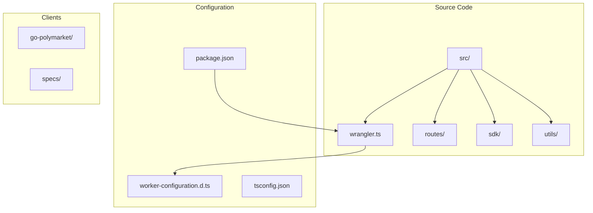
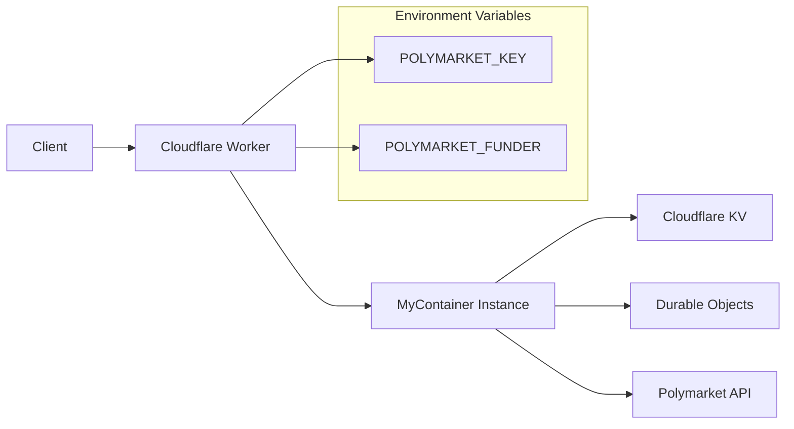
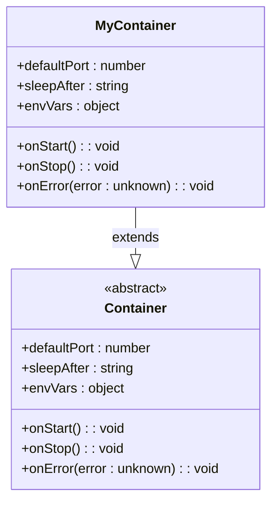
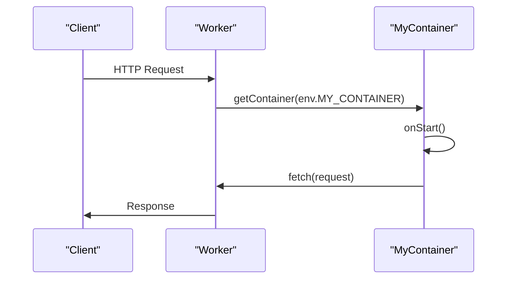
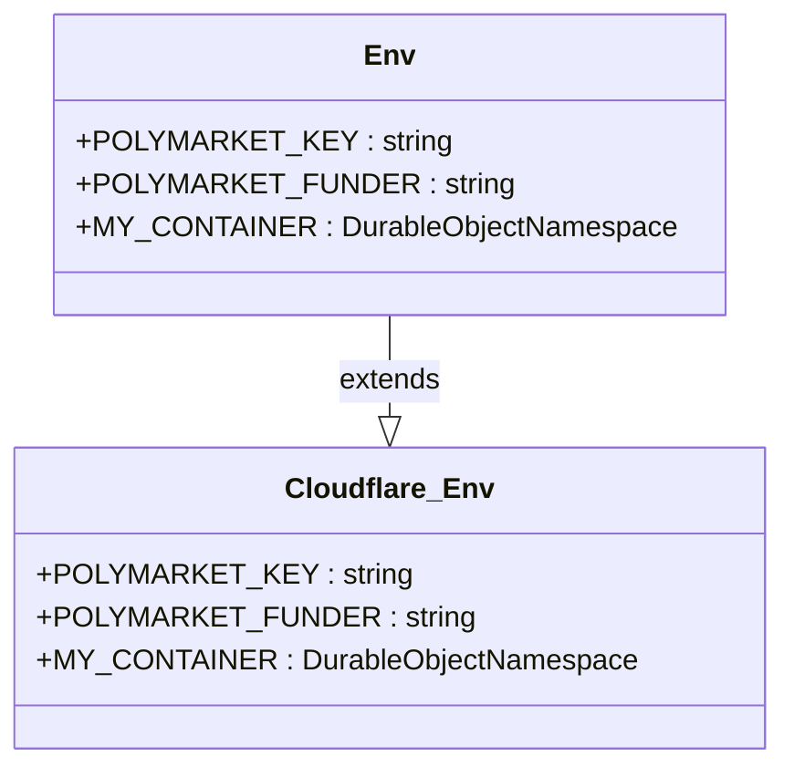

# Cloudflare Workers

<cite>
**Referenced Files in This Document**   
- [wrangler.ts](file://src/wrangler.ts)
- [worker-configuration.d.ts](file://worker-configuration.d.ts)
- [package.json](file://package.json)
- [env.ts](file://src/utils/env.ts)
</cite>

## Table of Contents
1. [Introduction](#introduction)
2. [Project Structure](#project-structure)
3. [Core Components](#core-components)
4. [Architecture Overview](#architecture-overview)
5. [Detailed Component Analysis](#detailed-component-analysis)
6. [Dependency Analysis](#dependency-analysis)
7. [Performance Considerations](#performance-considerations)
8. [Troubleshooting Guide](#troubleshooting-guide)
9. [Conclusion](#conclusion)

## Introduction
This document provides comprehensive guidance for deploying the Polymarket application on Cloudflare Workers. It covers configuration through wrangler.ts, environment variable management, deployment workflows, and Cloudflare-specific constraints. The documentation includes setup instructions for Wrangler CLI, worker configuration, and best practices for environment management and monitoring.

## Project Structure
The project is structured with a clear separation of concerns, featuring source code in the `src` directory, Go-based client code in `go-polymarket`, and configuration files at the root level. The Cloudflare Workers configuration is managed through `wrangler.ts` in the `src` directory, while type definitions for worker bindings are defined in `worker-configuration.d.ts` at the root.



**Diagram sources**
- [wrangler.ts](file://src/wrangler.ts#L1-L77)
- [worker-configuration.d.ts](file://worker-configuration.d.ts#L1-L8693)

**Section sources**
- [wrangler.ts](file://src/wrangler.ts#L1-L77)
- [worker-configuration.d.ts](file://worker-configuration.d.ts#L1-L8693)
- [package.json](file://package.json#L1-L56)

## Core Components
The core components for Cloudflare Workers deployment include the `MyContainer` class defined in `wrangler.ts` which extends `Container<Env>` from `@cloudflare/containers`, and the environment type definitions in `worker-configuration.d.ts`. These components work together to define the worker's behavior, environment variables, and bindings.

**Section sources**
- [wrangler.ts](file://src/wrangler.ts#L1-L77)
- [worker-configuration.d.ts](file://worker-configuration.d.ts#L1-L8693)

## Architecture Overview
The application architecture leverages Cloudflare Workers with Durable Objects through the `@cloudflare/containers` library. The worker acts as a proxy, forwarding all requests to container instances. This architecture enables stateful services on the edge with automatic scaling and management.



**Diagram sources**
- [wrangler.ts](file://src/wrangler.ts#L1-L77)
- [worker-configuration.d.ts](file://worker-configuration.d.ts#L1-L8693)

## Detailed Component Analysis

### MyContainer Class Analysis
The `MyContainer` class is the primary component that defines the worker's behavior and configuration. It extends the `Container` class from `@cloudflare/containers` and specifies various settings including port, sleep timeout, and environment variables.

#### For Object-Oriented Components:


**Diagram sources**
- [wrangler.ts](file://src/wrangler.ts#L5-L35)

#### For API/Service Components:


**Diagram sources**
- [wrangler.ts](file://src/wrangler.ts#L37-L48)

### Environment Configuration Analysis
The environment configuration is defined through TypeScript interfaces and type definitions that ensure type safety for environment variables and bindings used by the worker.

#### For Object-Oriented Components:


**Diagram sources**
- [worker-configuration.d.ts](file://worker-configuration.d.ts#L5-L7)

## Dependency Analysis
The project has several key dependencies that enable Cloudflare Workers functionality, including `@cloudflare/containers` for container management and `hono` for the web framework. The `wrangler` CLI tool is used for deployment and development.

```mermaid
graph TD
wrangler[Wrangler CLI] --> worker[Cloudflare Worker]
worker --> containers[@cloudflare/containers]
worker --> hono[Hono]
containers --> workerd[Workerd Runtime]
hono --> workerd
subgraph "Development"
wrangler --> typescript[TypeScript]
wrangler --> biome[Biome]
end
```

**Diagram sources**
- [package.json](file://package.json#L1-L56)
- [wrangler.ts](file://src/wrangler.ts#L1-L77)

**Section sources**
- [package.json](file://package.json#L1-L56)
- [wrangler.ts](file://src/wrangler.ts#L1-L77)

## Performance Considerations
Cloudflare Workers have specific limitations that impact performance, including CPU time limits, memory constraints, and cold start behavior. The configuration in `wrangler.ts` sets the container to sleep after 2 minutes of inactivity, which can lead to cold starts for infrequently accessed endpoints.

The worker leverages Cloudflare's global network for low-latency responses but must account for the 50ms CPU time limit for free tier workers and 100ms for paid workers. The use of Durable Objects through `@cloudflare/containers` provides stateful capabilities while managing these constraints.

## Troubleshooting Guide
Common issues when deploying to Cloudflare Workers include environment variable misconfiguration, request timeouts, and KV storage limits. The error handling in the `MyContainer` class provides basic logging for container errors.

For deployment issues, ensure that the `POLYMARKET_KEY` and `POLYMARKET_FUNDER` environment variables are properly set in the Cloudflare dashboard or through wrangler CLI. Use the `wrangler dev` command for local testing before deployment.

When encountering request timeouts, consider optimizing the code to complete within Cloudflare's CPU time limits or implement proper error handling for timeout scenarios. Monitor KV storage usage to avoid hitting the storage limits.

**Section sources**
- [wrangler.ts](file://src/wrangler.ts#L28-L35)
- [worker-configuration.d.ts](file://worker-configuration.d.ts#L5-L7)

## Conclusion
The Polymarket application is configured for deployment on Cloudflare Workers using the `@cloudflare/containers` library and Hono framework. The configuration in `wrangler.ts` defines the container behavior, while `worker-configuration.d.ts` provides type safety for environment variables and bindings. Deployment can be accomplished using the Wrangler CLI with proper environment variable configuration.