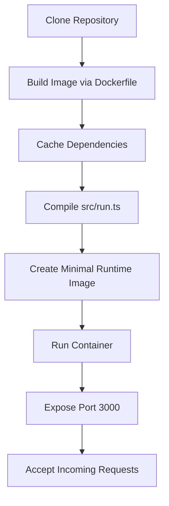
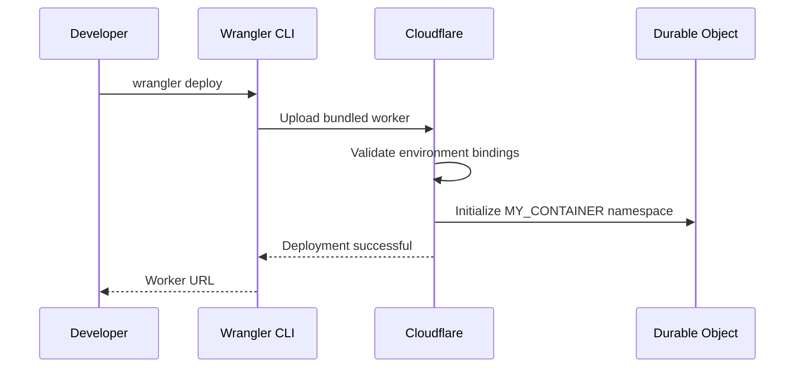
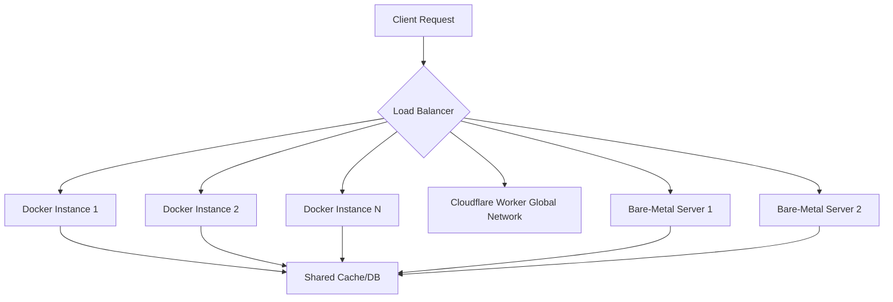

# Deployment

<cite>
**Referenced Files in This Document**   
- [Dockerfile](file://Dockerfile)
- [docker-compose.yml](file://docker-compose.yml)
- [wrangler.ts](file://src/wrangler.ts)
- [worker-configuration.d.ts](file://worker-configuration.d.ts)
- [package.json](file://package.json)
- [env.ts](file://src/utils/env.ts)
</cite>

## Table of Contents
1. [Introduction](#introduction)
2. [Docker Deployment](#docker-deployment)
3. [Cloudflare Workers Deployment](#cloudflare-workers-deployment)
4. [Bare-Metal Node.js Deployment](#bare-metal-nodejs-deployment)
5. [Scaling Considerations](#scaling-considerations)
6. [Monitoring and Logging](#monitoring-and-logging)
7. [Security Best Practices](#security-best-practices)
8. [Troubleshooting Common Issues](#troubleshooting-common-issues)
9. [Conclusion](#conclusion)

## Introduction
This document provides comprehensive deployment guidance for the Polymarket Kit across multiple platforms, including Docker, Cloudflare Workers, and bare-metal Node.js environments. The system is built using Bun as the runtime and leverages modern TypeScript tooling with Elysia for API handling. It supports proxying and SDK interactions with the Polymarket CLOB (Central Limit Order Book) and Gamma APIs.

The deployment configurations are designed to support both development and production workflows, with environment-specific settings and secure credential management. This guide covers setup, configuration, scaling, monitoring, and troubleshooting for each supported platform.

**Section sources**
- [package.json](file://package.json#L1-L56)

## Docker Deployment

To deploy Polymarket Kit using Docker, utilize the provided `Dockerfile` and `docker-compose.yml`. The Docker image is multi-stage, first building the application using Bun and then creating a minimal runtime image based on Google's distroless base.

The build process caches dependencies via `bun install`, compiles the entrypoint `src/run.ts` into a standalone binary using `bun build --compile`, and sets the production environment. The final image exposes port 3000 and runs the compiled server binary.

For orchestration, `docker-compose.yml` defines a service named `proxy` that builds from the current directory, maps host port 3000 to container port 3000, and injects the `NODE_ENV=production` environment variable.

### Build and Run Commands
```bash
# Build the Docker image
docker build -t polymarket-proxy .

# Run the container
docker run --rm -p 3000:3000 polymarket-proxy
```

### Using Docker Compose
```bash
# Start the service
docker-compose up --build

# Run in detached mode
docker-compose up -d
```

Network configuration is handled automatically via Docker's default bridge network. For custom networks or service discovery in clustered environments, define a custom network in `docker-compose.yml`.

Environment variables such as `POLYMARKET_KEY` and `BASE_URL` can be injected via the `environment` section in `docker-compose.yml` or through an `.env` file.



**Diagram sources**
- [Dockerfile](file://Dockerfile#L1-L35)
- [docker-compose.yml](file://docker-compose.yml#L1-L8)

**Section sources**
- [Dockerfile](file://Dockerfile#L1-L35)
- [docker-compose.yml](file://docker-compose.yml#L1-L8)
- [env.ts](file://src/utils/env.ts#L1-L11)

## Cloudflare Workers Deployment

The Polymarket Kit can be deployed as a Cloudflare Worker using the Wrangler CLI. Configuration is defined in `wrangler.ts`, and environment types are generated in `worker-configuration.d.ts`.

### Setup Process
1. Install Wrangler globally:
   ```bash
   npm install -g wrangler
   ```

2. Authenticate with Cloudflare:
   ```bash
   wrangler login
   ```

3. Generate environment type definitions:
   ```bash
   npm run cf-typegen
   ```

The `worker-configuration.d.ts` file defines the required environment bindings:
- `POLYMARKET_KEY`: API key for Polymarket authentication
- `POLYMARKET_FUNDER`: Funding address or identifier
- `MY_CONTAINER`: Durable Object namespace for stateful operations

These variables must be configured in the Cloudflare dashboard or via Wrangler CLI before deployment.

### Deployment Commands
```bash
# Deploy in production mode
NODE_ENV=production wrangler deploy

# Develop locally with live reload
NODE_ENV=development wrangler dev
```

The `package.json` includes convenience scripts for both deployment and local development on Cloudflare.

### Resource Limitations
Cloudflare Workers impose the following constraints:
- **CPU Time**: 50ms CPU time per request (burst up to 100ms)
- **Memory**: 128MB per instance
- **Request Size**: 10MB maximum
- **Response Size**: 100MB maximum
- **Durable Objects**: Limited by namespace and jurisdiction

Ensure that API calls to external services are optimized for low latency to avoid timeouts.



**Diagram sources**
- [wrangler.ts](file://src/wrangler.ts#L1-L8693)
- [worker-configuration.d.ts](file://worker-configuration.d.ts#L1-L799)

**Section sources**
- [wrangler.ts](file://src/wrangler.ts#L1-L8693)
- [worker-configuration.d.ts](file://worker-configuration.d.ts#L1-L799)
- [package.json](file://package.json#L40-L45)

## Bare-Metal Node.js Deployment

For direct deployment on Node.js servers, the application can be run using Bun, which is compatible with Node.js APIs. The entrypoint is `src/run.ts`, which should be compiled or executed directly.

### Process Management Recommendations
Use a process manager such as PM2 or systemd to ensure reliability and automatic restarts.

#### Using PM2
```bash
# Install PM2 globally
npm install -g pm2

# Start the application
pm2 start "bun run src/run.ts" --name polymarket-proxy

# Enable startup script
pm2 startup
pm2 save
```

#### Using systemd
Create a service file at `/etc/systemd/system/polymarket-proxy.service`:
```ini
[Unit]
Description=Polymarket Proxy Service
After=network.target

[Service]
Type=simple
User=polymarket
WorkingDirectory=/opt/polymarket-kit
ExecStart=/usr/local/bin/bun run src/run.ts
Environment=NODE_ENV=production
Restart=always

[Install]
WantedBy=multi-user.target
```

Enable and start the service:
```bash
sudo systemctl enable polymarket-proxy
sudo systemctl start polymarket-proxy
```

Set the `PORT` environment variable to control the listening port, defaulting to 3000. The `getPort()` function in `env.ts` handles fallback logic.

Ensure the server has sufficient memory and CPU resources, especially under high request volume. Monitor process memory usage to prevent OOM (Out of Memory) kills.

**Section sources**
- [env.ts](file://src/utils/env.ts#L1-L11)
- [run.ts](file://src/run.ts)
- [package.json](file://package.json#L30-L31)

## Scaling Considerations

Each deployment platform has distinct scaling characteristics:

### Docker
- Scale horizontally using Docker Swarm or Kubernetes
- Use load balancers (e.g., NGINX, Traefik) to distribute traffic
- Configure health checks via `/health` endpoint
- Use external Redis or database for shared state if needed

### Cloudflare Workers
- Automatically scales globally with no configuration
- Limited by per-request resource constraints
- Use Durable Objects for stateful sessions
- Optimize cold start performance by minimizing bundle size

### Bare-Metal Node.js
- Scale vertically by increasing CPU and RAM
- Deploy multiple instances behind a reverse proxy (NGINX, Apache)
- Use clustering via Bun’s built-in worker threads if applicable
- Implement external caching (Redis) to reduce backend load

For all platforms, ensure API rate limits are respected when interacting with Polymarket services. Implement client-side throttling if necessary.



**Diagram sources**
- [Dockerfile](file://Dockerfile#L1-L35)
- [wrangler.ts](file://src/wrangler.ts#L1-L8693)
- [env.ts](file://src/utils/env.ts#L1-L11)

## Monitoring and Logging

### Logging Strategies
The application uses Bun’s native logging and console output. Logs include:
- Request/response cycles
- Error traces
- Performance metrics

Redirect logs to external systems:
- **Docker**: Use `docker logs` or integrate with Fluentd, Logstash
- **Cloudflare**: Use Workers Analytics Engine or Logpush
- **Bare-Metal**: Pipe to syslog or file rotation tools (e.g., logrotate)

### Monitoring Setup
- Expose `/health` endpoint for liveness probes
- Use Prometheus + Grafana for metrics collection (if self-hosted)
- Enable Cloudflare RUM (Real User Monitoring) for client-side insights
- Set up alerts for error rates and latency spikes

Ensure `NODE_ENV=production` disables verbose debug logs.

**Section sources**
- [env.ts](file://src/utils/env.ts#L1-L11)
- [run.ts](file://src/run.ts)

## Security Best Practices

### API Key Protection
- Never commit `POLYMARKET_KEY` to version control
- Use environment variables or secret managers (e.g., Hashicorp Vault, AWS Secrets Manager)
- Rotate keys regularly
- Restrict key permissions to minimum required scope

### Rate Limiting
Implement rate limiting to prevent abuse:
- Use Cloudflare’s built-in rate limiting rules
- For Docker or bare-metal, use middleware like `elysia-rate-limit` or NGINX limit_req
- Set thresholds based on expected usage patterns

### HTTPS Enforcement
- Terminate TLS at the load balancer or CDN level
- Redirect HTTP to HTTPS
- Use HSTS headers for browser enforcement

### Input Validation
Leverage Zod schemas (via `zod` dependency) to validate all incoming requests and prevent injection attacks.

### Secure Headers
Use `@elysiajs/cors` and consider adding security headers (CSP, X-Frame-Options) via middleware.

**Section sources**
- [package.json](file://package.json#L25-L26)
- [env.ts](file://src/utils/env.ts#L1-L11)

## Troubleshooting Common Issues

### Cold Starts (Cloudflare Workers)
- **Symptom**: High latency on first request after inactivity
- **Solution**: Use Cloudflare’s Always-On feature or schedule periodic pings

### Memory Limits
- **Symptom**: Worker crashes or requests fail
- **Solution**: Reduce payload size, stream responses, avoid large in-memory operations

### Network Connectivity Problems
- **Symptom**: Timeouts when calling external APIs
- **Solution**: 
  - Verify DNS resolution
  - Check firewall rules
  - Test connectivity from within container/worker
  - Use `undici` for robust HTTP client behavior

### Environment Variable Missing
- **Symptom**: `POLYMARKET_KEY` not found
- **Solution**: Ensure variables are set in Wrangler config or Docker environment

### Port Conflicts (Bare-Metal)
- **Symptom**: "Address already in use"
- **Solution**: Change `PORT` environment variable or stop conflicting service

### Docker Build Failures
- **Symptom**: `bun install` fails
- **Solution**: Ensure correct platform image (`oven/bun:1`) and network access

**Section sources**
- [env.ts](file://src/utils/env.ts#L1-L11)
- [Dockerfile](file://Dockerfile#L1-L35)
- [worker-configuration.d.ts](file://worker-configuration.d.ts#L1-L799)

## Conclusion
The Polymarket Kit supports flexible deployment across Docker, Cloudflare Workers, and bare-metal Node.js environments. Each platform offers trade-offs between control, scalability, and operational complexity. Docker provides portability, Cloudflare enables global low-latency execution, and bare-metal offers maximum performance and customization.

Proper configuration of environment variables, process management, monitoring, and security practices ensures reliable and secure operation in production. Use the provided tooling and scripts to streamline deployment and maintenance.