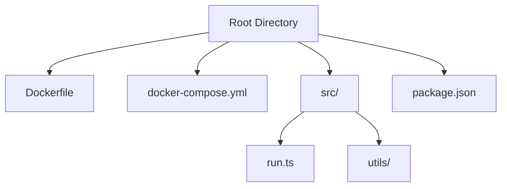
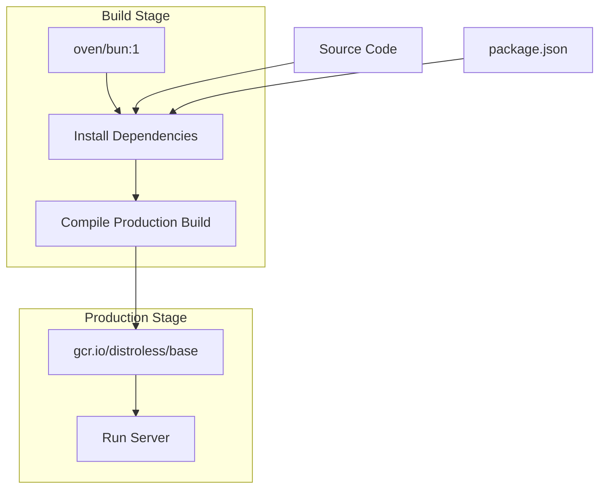
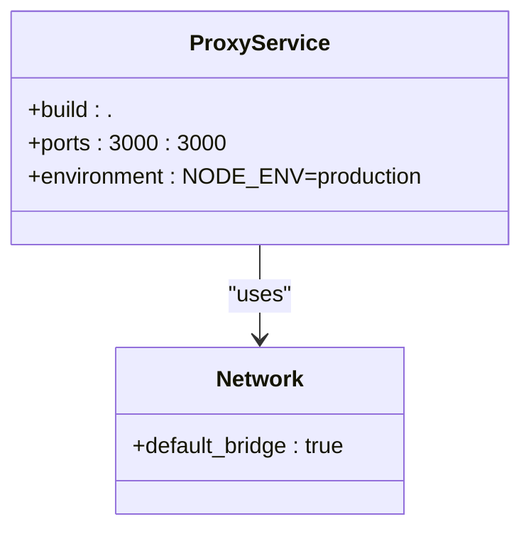
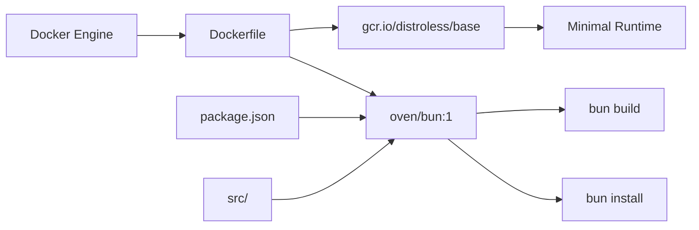

# Docker Deployment

<cite>
**Referenced Files in This Document**   
- [Dockerfile](file://Dockerfile)
- [docker-compose.yml](file://docker-compose.yml)
- [src/run.ts](file://src/run.ts)
- [src/utils/env.ts](file://src/utils/env.ts)
- [package.json](file://package.json)
</cite>

## Table of Contents
1. [Introduction](#introduction)
2. [Project Structure](#project-structure)
3. [Core Components](#core-components)
4. [Architecture Overview](#architecture-overview)
5. [Detailed Component Analysis](#detailed-component-analysis)
6. [Dependency Analysis](#dependency-analysis)
7. [Performance Considerations](#performance-considerations)
8. [Troubleshooting Guide](#troubleshooting-guide)
9. [Conclusion](#conclusion)

## Introduction
This document provides comprehensive guidance on Docker deployment for the Polymarket proxy server. It covers the multi-stage build process using Bun, containerization with minimal base images, and orchestration via docker-compose. The documentation includes best practices for production deployment, optimization techniques, and solutions to common issues.

## Project Structure
The project follows a modular structure with distinct directories for source code, configuration, and deployment assets. The Docker deployment configuration is located at the root level, enabling straightforward integration with CI/CD pipelines and local development workflows.



**Diagram sources**
- [Dockerfile](file://Dockerfile#L1-L35)
- [docker-compose.yml](file://docker-compose.yml#L1-L7)

**Section sources**
- [Dockerfile](file://Dockerfile#L1-L35)
- [docker-compose.yml](file://docker-compose.yml#L1-L7)

## Core Components
The Docker deployment relies on several core components: the multi-stage Dockerfile for optimized builds, docker-compose.yml for service orchestration, and environment configuration files that control runtime behavior. These components work together to create a secure, efficient containerized application.

**Section sources**
- [Dockerfile](file://Dockerfile#L1-L35)
- [docker-compose.yml](file://docker-compose.yml#L1-L7)
- [package.json](file://package.json#L1-L55)

## Architecture Overview
The deployment architecture uses a multi-stage build process to separate development dependencies from the production runtime. This approach minimizes image size and attack surface while maintaining build efficiency through dependency caching.



**Diagram sources**
- [Dockerfile](file://Dockerfile#L1-L35)

## Detailed Component Analysis

### Dockerfile Analysis
The Dockerfile implements a multi-stage build process that optimizes both build speed and production security. The first stage uses the official Bun image to install dependencies and compile the application, while the second stage uses Google's distroless base image for minimal footprint.

#### Multi-Stage Build Process
```mermaid
flowchart TD
Start([Build Start]) --> CopyPkg["Copy package.json & bun.lock"]
CopyPkg --> Install["Run bun install"]
Install --> CopySrc["Copy source code"]
CopySrc --> Build["Run bun build --compile"]
Build --> Stage2["Switch to distroless/base"]
Stage2 --> CopyBinary["Copy compiled server binary"]
CopyBinary --> SetEnv["Set NODE_ENV=production"]
SetEnv --> Expose["EXPOSE 3000"]
Expose --> CMD["CMD [\"./server\"]"]
CMD --> End([Image Ready])
```

**Diagram sources**
- [Dockerfile](file://Dockerfile#L1-L35)

#### Dependency Caching Strategy
The Dockerfile implements an effective caching strategy by copying package manifests before source code. This ensures that dependency installation only occurs when package.json or bun.lock changes, significantly speeding up subsequent builds.

**Section sources**
- [Dockerfile](file://Dockerfile#L6-L10)
- [package.json](file://package.json#L1-L55)

### docker-compose.yml Analysis
The docker-compose configuration defines a single service that orchestrates the proxy container with proper port mapping and environment configuration.

#### Service Orchestration


**Diagram sources**
- [docker-compose.yml](file://docker-compose.yml#L1-L7)

**Section sources**
- [docker-compose.yml](file://docker-compose.yml#L1-L7)
- [src/utils/env.ts](file://src/utils/env.ts#L1-L11)

## Dependency Analysis
The containerization strategy leverages several key dependencies and tools to ensure efficient builds and secure runtime execution. The build process depends on Bun for package management and compilation, while the runtime depends on minimal system libraries provided by the distroless image.



**Diagram sources**
- [Dockerfile](file://Dockerfile#L1-L35)
- [package.json](file://package.json#L1-L55)

**Section sources**
- [Dockerfile](file://Dockerfile#L1-L35)
- [package.json](file://package.json#L1-L55)

## Performance Considerations
The deployment configuration includes several performance optimizations. The multi-stage build with dependency caching reduces build times, while the compiled Bun binary ensures fast startup and execution. The distroless base image minimizes memory footprint and attack surface.

### Build Optimization
To maximize build cache efficiency:
1. Copy package manifests before source code
2. Use consistent layer ordering
3. Leverage Docker's layer caching mechanism
4. Avoid unnecessary file copies

### Runtime Performance
The production container benefits from:
- Compiled Bun binary for fast execution
- Minimal base image reducing memory overhead
- Direct binary execution without interpreter startup
- Optimized network performance through proper port mapping

**Section sources**
- [Dockerfile](file://Dockerfile#L1-L35)
- [src/run.ts](file://src/run.ts#L1-L27)

## Troubleshooting Guide
Common deployment issues and their solutions:

### Permission Errors
Ensure the compiled binary has execute permissions:
```bash
docker run --rm -v $(pwd):/app alpine chmod +x /app/server
```

### Network Connectivity
Verify port mapping configuration:
- Check docker-compose.yml ports section
- Ensure host port 3000 is available
- Validate container exposes port 3000

### Environment Variable Loading
Confirm environment variables are properly set:
- NODE_ENV should be 'production' in docker-compose.yml
- PORT can be overridden via environment variable
- BASE_URL affects generated URLs in logs

### Build Issues
Common build problems and solutions:
- Invalid package.json: validate JSON syntax
- Missing bun.lock: run `bun install` locally first
- Compilation errors: check TypeScript types and syntax

**Section sources**
- [docker-compose.yml](file://docker-compose.yml#L1-L7)
- [src/utils/env.ts](file://src/utils/env.ts#L1-L11)
- [Dockerfile](file://Dockerfile#L1-L35)

## Conclusion
The Docker deployment configuration provides a robust, secure foundation for running the Polymarket proxy server in production environments. By leveraging multi-stage builds, dependency caching, and minimal base images, the setup optimizes both build efficiency and runtime performance. The docker-compose configuration simplifies orchestration while allowing for easy customization through environment variables and port mapping.