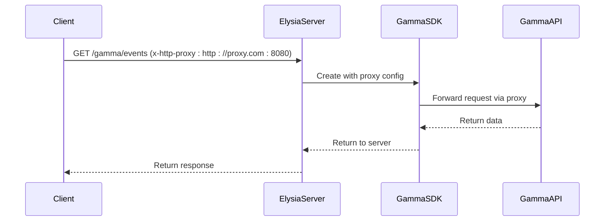
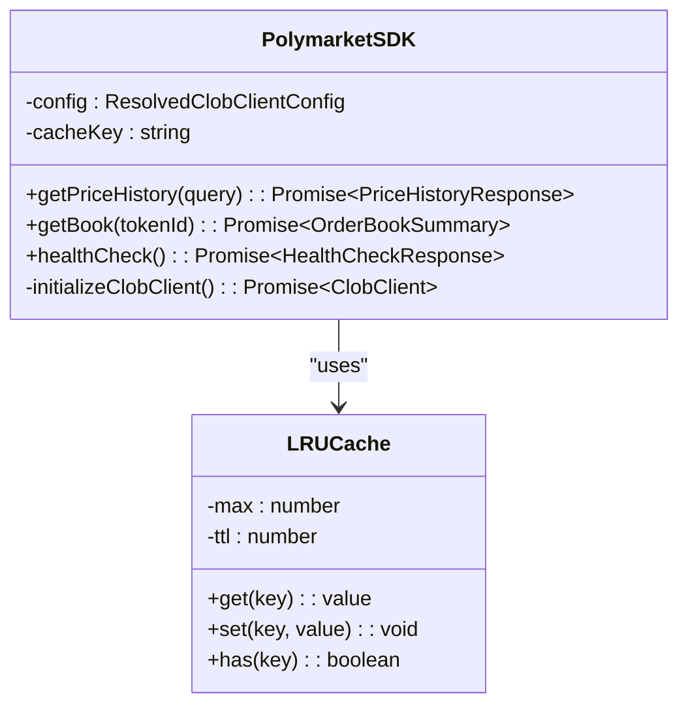
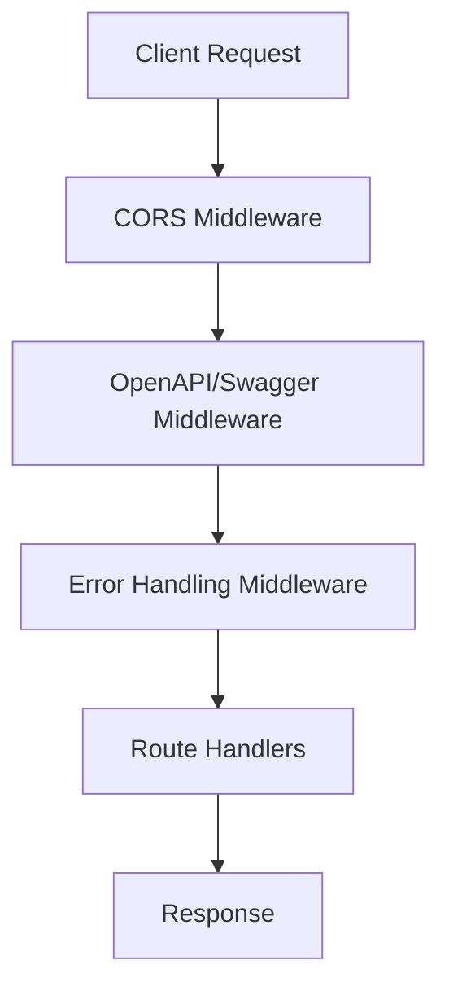
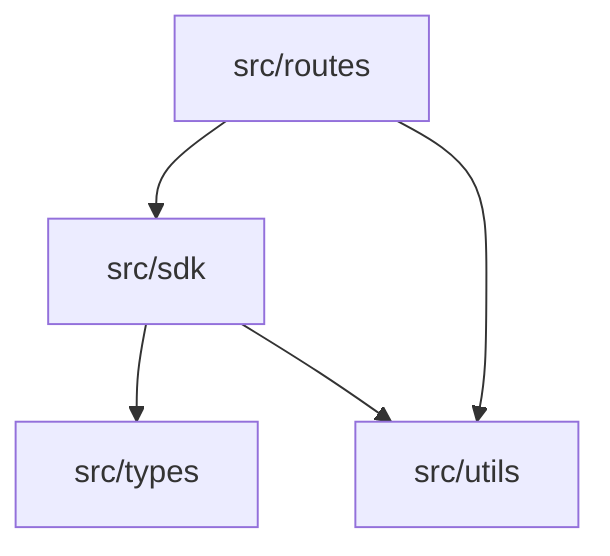
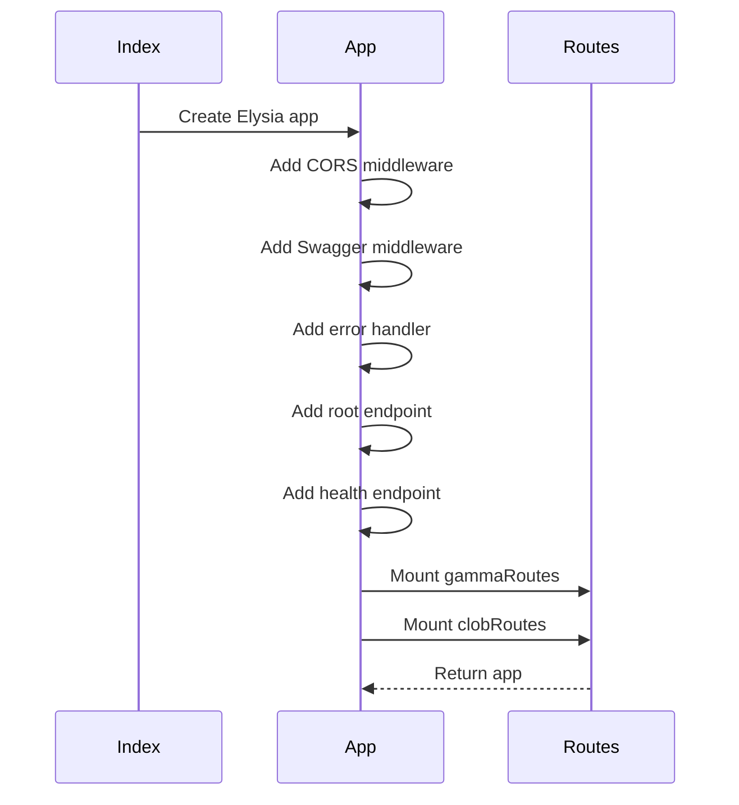

# Codebase Structure

<cite>
**Referenced Files in This Document**   
- [src/routes/clob.ts](file://src/routes/clob.ts)
- [src/routes/gamma.ts](file://src/routes/gamma.ts)
- [src/sdk/client.ts](file://src/sdk/client.ts)
- [src/sdk/gamma-client.ts](file://src/sdk/gamma-client.ts)
- [src/types/elysia-schemas.ts](file://src/types/elysia-schemas.ts)
- [src/utils/markdown-formatters.ts](file://src/utils/markdown-formatters.ts)
- [src/index.ts](file://src/index.ts)
- [tsconfig.json](file://tsconfig.json)
- [biome.json](file://biome.json)
</cite>

## Table of Contents
1. [Introduction](#introduction)
2. [Directory Structure and Responsibilities](#directory-structure-and-responsibilities)
3. [Architectural Patterns](#architectural-patterns)
4. [TypeScript Configuration](#typescript-configuration)
5. [Linting and Formatting with Biome](#linting-and-formatting-with-biome)
6. [Dependency Flow](#dependency-flow)
7. [Server Initialization and Route Mounting](#server-initialization-and-route-mounting)
8. [Adding New Endpoints](#adding-new-endpoints)

## Introduction
The polymarket-kit project is a fully typed translation proxy server built with Elysia for Polymarket APIs. It provides type-safe endpoints for both CLOB and Gamma APIs with comprehensive validation and OpenAPI schema generation. The codebase is structured to separate concerns into distinct directories, each with specific responsibilities and architectural patterns. This document explains the structure, patterns, and configuration of the codebase to guide developers in understanding and extending the system.

## Directory Structure and Responsibilities

### src/routes (API Route Handlers)
The `src/routes` directory contains the API route handlers that define the endpoints exposed by the server. Each route file corresponds to a specific API (CLOB or Gamma) and uses Elysia's routing system to define typed endpoints.

- **clob.ts**: Handles routes for the Polymarket CLOB API, including price history, order books, prices, midpoints, spreads, and trades. It uses the `PolymarketSDK` from the SDK layer and validates requests using schemas from the types layer.
- **gamma.ts**: Handles routes for the Polymarket Gamma API, providing endpoints for sports, tags, events, markets, series, comments, and search. It uses the `GammaSDK` and validates requests with Elysia schemas.

**Section sources**
- [src/routes/clob.ts](file://src/routes/clob.ts)
- [src/routes/gamma.ts](file://src/routes/gamma.ts)

### src/sdk (Type-Safe API Clients)
The `src/sdk` directory contains type-safe API clients that abstract the interaction with Polymarket's APIs. These clients provide a clean interface for making requests and handle authentication, caching, and error handling.

- **client.ts**: Implements the `PolymarketSDK` class for the CLOB API, which manages authentication via private key and funder address, and uses an LRU cache to store initialized CLOB clients. It follows the singleton pattern with caching to avoid redundant client initialization.
- **gamma-client.ts**: Implements the `GammaSDK` class for the Gamma API, which provides methods for all public data operations without authentication. It supports proxy configuration via the `proxy` parameter in the constructor.

**Section sources**
- [src/sdk/client.ts](file://src/sdk/client.ts)
- [src/sdk/gamma-client.ts](file://src/sdk/gamma-client.ts)

### src/types (Validation Schemas)
The `src/types` directory contains validation schemas used by Elysia for request and response validation. These schemas ensure that data conforms to expected types and structures, providing type safety across the API.

- **elysia-schemas.ts**: Defines all type schemas for the server, including query parameters, response formats, and error responses. It uses Elysia's `t` object to create schemas for markets, events, tags, price history, and more.

**Section sources**
- [src/types/elysia-schemas.ts](file://src/types/elysia-schemas.ts)

### src/utils (Shared Utilities)
The `src/utils` directory contains shared utility functions that are used across the codebase. These utilities provide common functionality that can be reused in different parts of the application.

- **markdown-formatters.ts**: Contains functions for formatting event data as markdown, which is used in the Gamma API routes to provide LLM-friendly output.
- **env.ts**: Provides functions for retrieving environment variables, such as the base URL and port for the server.

**Section sources**
- [src/utils/markdown-formatters.ts](file://src/utils/markdown-formatters.ts)
- [src/utils/env.ts](file://src/utils/env.ts)

## Architectural Patterns

### Proxy Pattern for API Forwarding
The proxy pattern is used in the `gamma.ts` route handler to forward requests to the Gamma API with optional proxy configuration. The `derive` middleware in Elysia creates a `GammaSDK` instance based on the `x-http-proxy` header, allowing clients to route their requests through a specified proxy server.



**Diagram sources**
- [src/routes/gamma.ts](file://src/routes/gamma.ts#L49-L103)
- [src/sdk/gamma-client.ts](file://src/sdk/gamma-client.ts#L54-L100)

### Singleton Pattern with LRU Caching in SDKs
The `PolymarketSDK` class in `client.ts` implements the singleton pattern with LRU caching to manage CLOB client instances. The `sdkCache` LRU cache stores initialized SDK instances based on the private key and funder address, ensuring that each unique combination of credentials has only one SDK instance.



**Diagram sources**
- [src/sdk/client.ts](file://src/sdk/client.ts#L30-L38)
- [src/routes/clob.ts](file://src/routes/clob.ts#L15-L25)

### Middleware Usage via Elysia.js
Elysia.js middleware is used extensively to handle cross-cutting concerns such as CORS, OpenAPI documentation, and error handling. The `index.ts` file sets up global middleware for CORS, Swagger documentation, and error handling, which applies to all routes.



**Diagram sources**
- [src/index.ts](file://src/index.ts#L10-L78)

## TypeScript Configuration
The TypeScript configuration in `tsconfig.json` is set up for strict type checking and modern ECMAScript support. Key settings include:

- **lib**: `["ESNext"]` - Enables the latest ECMAScript features.
- **target**: `"ESNext"` - Compiles to the latest ECMAScript version.
- **strict**: `true` - Enables all strict type-checking options.
- **noFallthroughCasesInSwitch**: `true` - Ensures that switch statements have a break or return for each case.
- **noUncheckedIndexedAccess**: `true` - Ensures that indexed access is checked for undefined values.

These settings ensure that the codebase maintains high type safety and leverages modern JavaScript features.

**Section sources**
- [tsconfig.json](file://tsconfig.json#L1-L30)

## Linting and Formatting with Biome
Biome is used for linting and formatting with custom rules defined in `biome.json`. The configuration includes:

- **Formatter**: Enabled with tab indentation.
- **Linter**: Enabled with recommended rules, but the `noExplicitAny` rule is disabled to allow `any` types in specific cases.
- **Overrides**: The `noExplicitAny` rule is explicitly disabled for `src/sdk/client.ts` to accommodate dynamic typing in the SDK client.

```json
{
	"linter": {
		"rules": {
			"suspicious": {
				"noExplicitAny": "off"
			}
		}
	},
	"overrides": [
		{
			"includes": ["src/sdk/client.ts"],
			"linter": {
				"rules": {
					"suspicious": {
						"noExplicitAny": "off"
					}
				}
			}
		}
	]
}
```

**Section sources**
- [biome.json](file://biome.json#L0-L55)

## Dependency Flow
The dependency flow in the codebase follows a clear hierarchy:

- **routes** depend on **sdk** for API client functionality.
- **sdk** uses **types** for validation schemas and type definitions.
- **utils** provide cross-cutting functions used by both routes and SDKs.

This separation ensures that each layer has a single responsibility and can be developed and tested independently.



**Diagram sources**
- [src/routes/clob.ts](file://src/routes/clob.ts)
- [src/routes/gamma.ts](file://src/routes/gamma.ts)
- [src/sdk/client.ts](file://src/sdk/client.ts)
- [src/sdk/gamma-client.ts](file://src/sdk/gamma-client.ts)
- [src/types/elysia-schemas.ts](file://src/types/elysia-schemas.ts)
- [src/utils/markdown-formatters.ts](file://src/utils/markdown-formatters.ts)

## Server Initialization and Route Mounting
The server is initialized in `index.ts`, where the Elysia app is created and configured with middleware, routes, and error handling. The `app` instance is exported for use in other parts of the application.



**Diagram sources**
- [src/index.ts](file://src/index.ts#L0-L165)

## Adding New Endpoints
To add new endpoints, follow the existing conventions for consistency:

1. **Create a new route file** in `src/routes` if the endpoint belongs to a new API.
2. **Define the route** using Elysia's routing system, specifying query and response schemas from `src/types`.
3. **Use the appropriate SDK** from `src/sdk` to handle the API logic.
4. **Add validation schemas** to `src/types/elysia-schemas.ts` if new types are needed.
5. **Mount the route** in `index.ts` using `app.use()`.

For example, to add a new endpoint for market data in the CLOB API, create a new method in `client.ts`, define the route in `clob.ts` with the appropriate schema, and mount it in `index.ts`.

**Section sources**
- [src/index.ts](file://src/index.ts#L150-L164)
- [src/routes/clob.ts](file://src/routes/clob.ts)
- [src/sdk/client.ts](file://src/sdk/client.ts)
- [src/types/elysia-schemas.ts](file://src/types/elysia-schemas.ts)