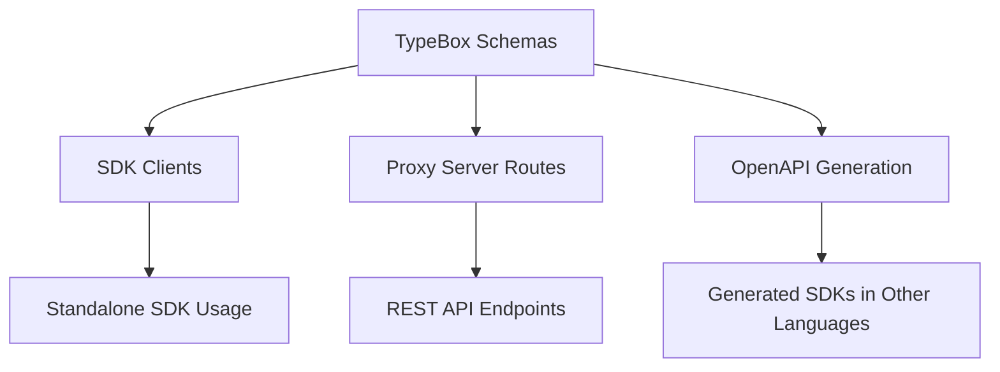
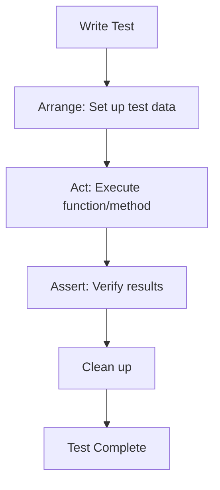
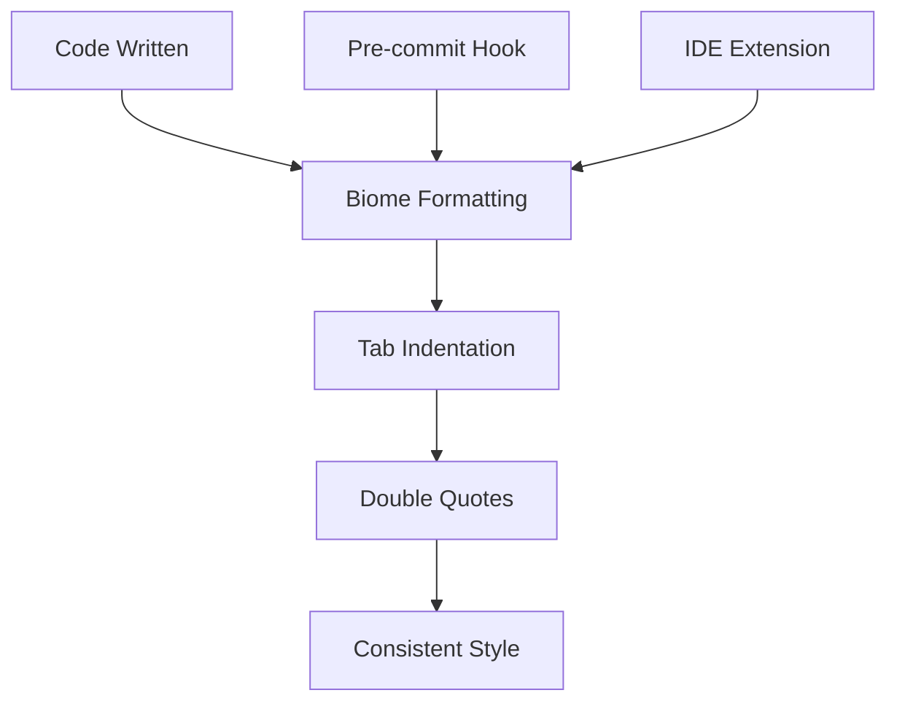

# Development Guide

<cite>
**Referenced Files in This Document**   
- [biome.json](file://biome.json)
- [package.json](file://package.json)
- [README.md](file://README.md)
- [AGENTS.md](file://AGENTS.md)
- [src/routes/gamma.ts](file://src/routes/gamma.ts)
- [src/sdk/gamma-client.ts](file://src/sdk/gamma-client.ts)
- [src/utils/env.ts](file://src/utils/env.ts)
- [src/types/elysia-schemas.ts](file://src/types/elysia-schemas.ts)
- [src/sdk/__tests__/gamma-client.test.ts](file://src/sdk/__tests__/gamma-client.test.ts)
- [src/routes/__tests__/gamma.test.ts](file://src/routes/__tests__/gamma.test.ts)
</cite>

## Table of Contents
1. [Introduction](#introduction)
2. [Project Structure](#project-structure)
3. [Code Structure and Conventions](#code-structure-and-conventions)
4. [Development Workflow](#development-workflow)
5. [Testing Strategies](#testing-strategies)
6. [Linting and Formatting Rules](#linting-and-formatting-rules)
7. [Contribution Guidelines](#contribution-guidelines)
8. [Versioning and Release Management](#versioning-and-release-management)
9. [Extending the Codebase](#extending-the-codebase)

## Introduction
This development guide provides comprehensive documentation for contributors to the polymarket-kit project. The guide covers the code structure, development workflow, testing strategies, linting rules, contribution guidelines, versioning practices, and extension patterns. The polymarket-kit project is a fully typed SDK and proxy server built with Elysia for Polymarket APIs, providing both standalone SDK clients and a proxy server with type-safe endpoints for CLOB and Gamma APIs.

## Project Structure
The polymarket-kit project follows a well-organized directory structure that separates concerns and facilitates maintainability. The project is divided into several key directories:

- `go-polymarket/`: Contains Go client code generated using Kiota from an OpenAPI specification
- `specs/001-write-a-mcp/`: Contains design documents and specifications for the MCP server
- `src/`: Main source code directory containing the core application
- Root-level configuration files for package management, linting, and deployment

The `src` directory contains the following subdirectories:
- `mcp/`: Model Context Protocol implementation
- `routes/`: Elysia server routes with corresponding tests in `__tests__` directories
- `sdk/`: Standalone SDK clients with tests
- `types/`: Type definitions using Elysia TypeBox
- `utils/`: Utility functions with corresponding tests

This structure supports both the standalone SDK usage and the proxy server functionality, with clear separation between the two.

**Section sources**
- [README.md](file://README.md#L50-L150)

## Code Structure and Conventions
The polymarket-kit project follows several key structural and naming conventions to ensure consistency across the codebase.

### File Organization
The codebase uses a feature-based organization pattern where related functionality is grouped together. Each major component (routes, SDK, types, utils) has its own directory with appropriate subdirectories. Test files are colocated with their corresponding implementation files in `__tests__` directories, following the pattern `src/**/__tests__/*.test.ts`.

### Naming Patterns
The project uses kebab-case for filenames (e.g., `gamma-client.ts`, `markdown-formatters.ts`) and PascalCase for class names (e.g., `GammaSDK`). Constants are written in UPPER_CASE, while variables and functions use camelCase. Type definitions are suffixed with `Type` (e.g., `MarketType`) and schema definitions with `Schema` (e.g., `MarketSchema`).

### TypeScript Best Practices
The project adheres to several TypeScript best practices:
- Full type safety with no `any` types
- Unified TypeBox schema system for single source of truth
- Proper export organization through `jsr.json` and `package.json` exports
- Strict mode enabled in `tsconfig.json`
- Comprehensive type definitions for all API operations

The codebase uses Elysia TypeBox schemas in `src/types/elysia-schemas.ts` as the single source of truth for all type definitions and validation. This approach provides compile-time type safety, runtime validation, and automatic OpenAPI schema generation.

**Diagram sources**
- [README.md](file://README.md#L250-L300)
- [src/types/elysia-schemas.ts](file://src/types/elysia-schemas.ts)

**Section sources**
- [README.md](file://README.md#L200-L400)
- [AGENTS.md](file://AGENTS.md#L20-L40)

## Development Workflow
The development workflow for the polymarket-kit project is designed to be efficient and consistent across different development environments.

### Setting Up the Local Environment
To set up the local development environment:

1. Install dependencies using `bun install`
2. Configure environment variables:
   - `POLYMARKET_KEY`: Private key for CLOB API access
   - `POLYMARKET_FUNDER`: Funder address for CLOB operations
   - `PORT`: Server port (defaults to 3000)
   - Various cache configuration variables

The environment variables are accessed through utility functions in `src/utils/env.ts` which provide default values when variables are not set.

### Running the Application
The project supports multiple ways to run the application:

- **Development mode**: `bun run dev` - starts the server with hot reloading
- **Production mode**: `bun run src/index.ts` - runs the server directly
- **Cloudflare Workers development**: `bun run dev:cf` - uses Wrangler for local development
- **Deployment**: `bun run deploy` - deploys to Cloudflare Workers

The entry points are:
- `src/index.ts`: Elysia server entry point
- `src/run.ts`: Development runner with hot reload
- `src/client.ts`: Proxy client entry point

### Debugging
Debugging can be performed using standard TypeScript debugging tools. The Bun runtime provides good debugging support, and the codebase is compatible with standard debugging workflows. Console logging is used for basic debugging, and the structured error handling provides clear error messages for troubleshooting.

**Section sources**
- [README.md](file://README.md#L300-L400)
- [AGENTS.md](file://AGENTS.md#L35-L45)
- [src/utils/env.ts](file://src/utils/env.ts#L0-L11)

## Testing Strategies
The polymarket-kit project employs a comprehensive testing strategy using Bun's built-in test runner.

### Test Organization
Tests are organized in `__tests__` directories colocated with the code they test. This pattern makes it easy to find and update tests when modifying functionality. The test files follow the naming convention `*.test.ts` and are placed in `src/**/__tests__` directories.

The project contains several types of tests:
- SDK method tests in `src/sdk/__tests__`
- Route handler tests in `src/routes/__tests__`
- Utility function tests in `src/utils/__tests__`

### Writing New Tests
When writing new tests, follow these guidelines:

1. Use the `bun:test` framework with `describe`, `test`, and `expect` functions
2. Place tests in the appropriate `__tests__` directory
3. Name test files with the `.test.ts` suffix
4. Use descriptive test names that clearly indicate what is being tested
5. Aim to cover both success and error cases
6. Use test fixtures rather than making actual network requests when possible

The test suite includes both unit tests for individual functions and integration tests for API endpoints. For example, the Gamma SDK tests verify that methods like `getTagById` and `getTagBySlug` return expected results or null for invalid inputs.

**Diagram sources**
- [AGENTS.md](file://AGENTS.md#L40-L45)
- [src/sdk/__tests__/gamma-client.test.ts](file://src/sdk/__tests__/gamma-client.test.ts#L89-L130)

**Section sources**
- [AGENTS.md](file://AGENTS.md#L40-L45)
- [src/sdk/__tests__/gamma-client.test.ts](file://src/sdk/__tests__/gamma-client.test.ts)
- [src/routes/__tests__/gamma.test.ts](file://src/routes/__tests__/gamma.test.ts)

## Linting and Formatting Rules
The polymarket-kit project uses Biome for linting and formatting, ensuring consistent code style across the codebase.

### Biome Configuration
The Biome configuration is defined in `biome.json` with the following key settings:

- **Formatter**: Enabled with tab indentation
- **Linter**: Enabled with recommended rules
- **Quote style**: Double quotes for JavaScript/TypeScript
- **Organize imports**: Disabled to avoid automatic import sorting

The configuration includes overrides for specific files:
- `src/sdk/client.ts`: Disables the "noExplicitAny" rule due to external API constraints
- `worker-configuration.d.ts`: Disables linting entirely for this generated file

### IDE Configuration
To configure your IDE for the project's linting and formatting rules:

1. Install the Biome extension for your IDE
2. Ensure the formatter is set to use tabs instead of spaces
3. Configure the editor to use double quotes for strings
4. Disable automatic import organization if your IDE has this feature

The project's Biome configuration ensures that all code follows the same style guidelines, making the codebase more readable and maintainable. Developers should run `bun run format` before committing code to ensure compliance with the formatting rules.

**Diagram sources**
- [biome.json](file://biome.json)
- [package.json](file://package.json#L30-L35)

**Section sources**
- [biome.json](file://biome.json)
- [package.json](file://package.json#L30-L35)
- [AGENTS.md](file://AGENTS.md#L25-L30)

## Contribution Guidelines
The polymarket-kit project follows specific guidelines for contributions to maintain code quality and consistency.

### Branching Strategy
The project uses a simple branching model:
- `main` branch: Stable production code
- Feature branches: Created for new features or bug fixes
- Pull requests are required for all changes to `main`

When creating a new feature or fixing a bug, create a branch from `main` with a descriptive name following the pattern `feature/descriptive-name` or `fix/descriptive-name`.

### Pull Request Requirements
Pull requests must include:
- Clear description of the changes
- Reference to the related issue (if applicable)
- Updated tests to cover new functionality
- Any necessary documentation updates
- Screenshots or cURL examples for new API endpoints (if applicable)

### Code Review Process
The code review process includes the following steps:
1. Automated checks run on the pull request (formatting, type checking, tests)
2. At least one maintainer reviews the code for quality, correctness, and adherence to project standards
3. Feedback is provided and addressed by the contributor
4. Once approved, the pull request is merged into `main`

All contributions should follow the existing TypeScript patterns, ensure proper Elysia type validation for new endpoints, and update OpenAPI documentation when adding new functionality.

**Section sources**
- [AGENTS.md](file://AGENTS.md#L45-L55)
- [README.md](file://README.md#L400-L410)

## Versioning and Release Management
The polymarket-kit project follows semantic versioning (SemVer) for release management.

### Versioning Scheme
The versioning scheme follows the pattern `MAJOR.MINOR.PATCH`:
- MAJOR: Breaking changes
- MINOR: New features that are backward compatible
- PATCH: Bug fixes and minor improvements

The current version is specified in `package.json` as `0.0.1`. As the project matures, version numbers will be incremented according to SemVer rules.

### Release Process
The release process includes:
1. Updating the version number in `package.json`
2. Creating a git tag for the release
3. Publishing to the JavaScript Registry (JSR)
4. Updating documentation if necessary

The project is configured for publishing to JSR with the appropriate exports defined in `jsr.json`. The package can be installed using Deno, Bun, or npm with the appropriate package manager commands.

### Build Process
The build process is defined in `build.ts` and can be executed with `bun run build`. This compiles the CLI tools into the `build/` directory. The `package.json` file defines the build script and specifies the compiled files in the `files` array.

**Section sources**
- [package.json](file://package.json#L2-L5)
- [README.md](file://README.md#L300-L320)

## Extending the Codebase
Extending the polymarket-kit codebase with new features or API endpoints should follow established patterns to maintain consistency.

### Adding New Features
When adding new features:
1. Identify the appropriate location in the codebase (routes, SDK, utils, etc.)
2. Follow existing naming conventions and code patterns
3. Use the unified TypeBox schema system for type definitions
4. Add comprehensive tests for the new functionality
5. Update documentation as needed

For example, to add a new Gamma API endpoint, create the route in `src/routes/gamma.ts` using the existing Elysia route pattern, define any necessary schemas in `src/types/elysia-schemas.ts`, and implement the functionality in `src/sdk/gamma-client.ts`.

### Adding New API Endpoints
When adding new API endpoints:
1. Determine whether the endpoint belongs to the Gamma API, CLOB API, or a new API category
2. Create the route in the appropriate file (`gamma.ts` or `clob.ts`)
3. Define request and response schemas in `elysia-schemas.ts`
4. Implement the endpoint handler using the existing SDK methods
5. Add OpenAPI documentation using the `detail` property in the route definition
6. Write tests in the corresponding `__tests__` directory

The proxy server automatically generates OpenAPI 3.0 schemas that can be used to create type-safe SDKs for other languages. When adding new endpoints, ensure they are properly documented to support this functionality.

### Maintaining Consistency
To maintain consistency when extending the codebase:
- Follow the existing architectural patterns
- Use the same error handling approach
- Apply the same validation rules
- Maintain the same level of test coverage
- Follow the established naming conventions
- Use the same logging and debugging patterns

The goal is to make new code indistinguishable from existing code in terms of style, structure, and quality.

**Section sources**
- [README.md](file://README.md#L250-L300)
- [src/routes/gamma.ts](file://src/routes/gamma.ts)
- [src/sdk/gamma-client.ts](file://src/sdk/gamma-client.ts)