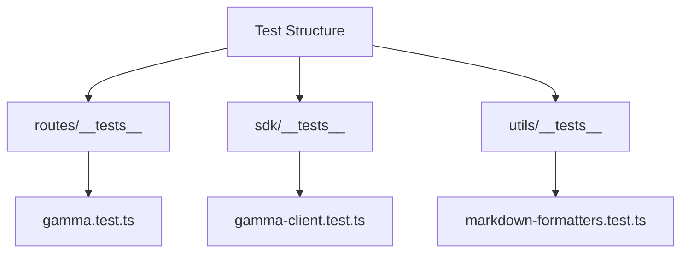
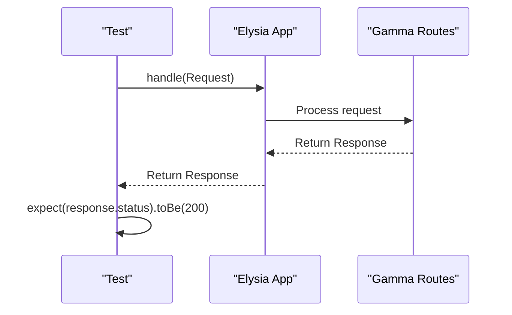
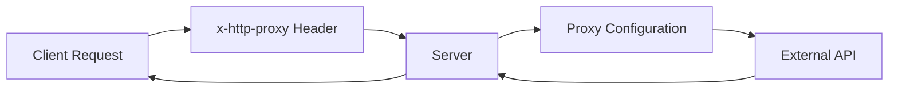
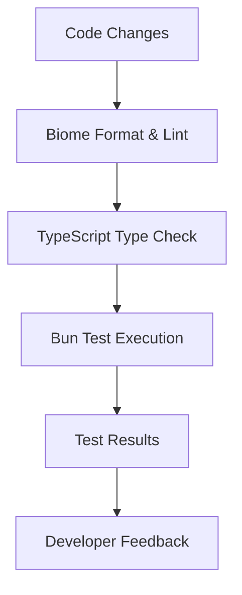

# Testing and Quality Assurance

<cite>
**Referenced Files in This Document**   
- [package.json](file://package.json)
- [biome.json](file://biome.json)
- [test-proxy.js](file://test-proxy.js)
- [gamma.test.ts](file://src/routes/__tests__/gamma.test.ts)
- [gamma-client.test.ts](file://src/sdk/__tests__/gamma-client.test.ts)
- [markdown-formatters.test.ts](file://src/utils/__tests__/markdown-formatters.test.ts)
</cite>

## Table of Contents
1. [Testing Strategy](#testing-strategy)
2. [Test File Structure](#test-file-structure)
3. [Unit Testing Practices](#unit-testing-practices)
4. [Test Proxy Usage](#test-proxy-usage)
5. [Quality Assurance Pipeline](#quality-assurance-pipeline)
6. [Writing New Tests](#writing-new-tests)
7. [Troubleshooting Common Issues](#troubleshooting-common-issues)

## Testing Strategy

The polymarket-kit project utilizes Bun's built-in test runner as specified in the `package.json` scripts. The testing strategy is comprehensive, covering route handlers, SDK methods, and utility functions across the codebase. Tests are organized in `__tests__` directories adjacent to their corresponding implementation files, following a clear and maintainable structure.

The primary test commands are defined in `package.json`:
- `"test": "bun test"` - Runs all tests once
- `"test:watch": "bun test --watch"` - Runs tests in watch mode for continuous feedback during development

These commands leverage Bun's fast test runner, which provides native TypeScript support and efficient test execution without the need for additional transpilation steps.

**Section sources**
- [package.json](file://package.json#L25-L26)

## Test File Structure

Test files are organized in `__tests__` directories within the `routes`, `sdk`, and `utils` modules. This colocated structure ensures tests are easily discoverable and maintainable alongside their corresponding implementation files.

Key test files include:
- `src/routes/__tests__/gamma.test.ts` - Tests for Gamma API routes using Elysia framework
- `src/sdk/__tests__/gamma-client.test.ts` - Tests for GammaSDK client methods
- `src/utils/__tests__/markdown-formatters.test.ts` - Unit tests for markdown formatting utilities

Each test file follows a consistent pattern using `describe`, `test`, `expect`, and `beforeAll` from `bun:test`. Test suites are grouped by functionality (e.g., "Tags Routes", "Events API") with individual tests covering both successful and error cases.

**Diagram sources**
- [gamma.test.ts](file://src/routes/__tests__/gamma.test.ts#L1-L319)
- [gamma-client.test.ts](file://src/sdk/__tests__/gamma-client.test.ts#L1-L487)
- [markdown-formatters.test.ts](file://src/utils/__tests__/markdown-formatters.test.ts#L1-L373)

**Section sources**
- [gamma.test.ts](file://src/routes/__tests__/gamma.test.ts#L1-L319)
- [gamma-client.test.ts](file://src/sdk/__tests__/gamma-client.test.ts#L1-L487)
- [markdown-formatters.test.ts](file://src/utils/__tests__/markdown-formatters.test.ts#L1-L373)

## Unit Testing Practices

The project emphasizes thorough unit testing with a focus on type safety and edge case coverage. Tests are designed to validate both functionality and error handling across different components.

### Route Handler Testing
Route tests in `gamma.test.ts` verify that Elysia routes properly handle requests and responses. They test:
- Successful responses with status 200
- Proper error handling with appropriate status codes (404, 400, etc.)
- Response format and content-type headers
- Query parameter handling and validation
- CORS preflight requests

**Diagram sources**
- [gamma.test.ts](file://src/routes/__tests__/gamma.test.ts#L1-L319)

### SDK Method Testing
SDK tests in `gamma-client.test.ts` cover all Gamma API endpoints with both successful and error cases. Key practices include:
- Testing with valid and invalid IDs/slugs
- Verifying proper handling of query parameters
- Testing error scenarios (network errors, invalid parameters)
- Validating proxy configuration functionality
- Ensuring type safety through TypeScript

### Utility Function Testing
Utility tests in `markdown-formatters.test.ts` ensure formatting functions work correctly with various input data. Tests cover:
- Different verbosity levels (0, 1, 2)
- Edge cases with minimal data
- Batch processing scenarios
- Real-world usage examples

**Section sources**
- [gamma.test.ts](file://src/routes/__tests__/gamma.test.ts#L1-L319)
- [gamma-client.test.ts](file://src/sdk/__tests__/gamma-client.test.ts#L1-L487)
- [markdown-formatters.test.ts](file://src/utils/__tests__/markdown-formatters.test.ts#L1-L373)

## Test Proxy Usage

The `test-proxy.js` file provides functionality for testing proxy header functionality in the application. It allows developers to verify that the server properly handles proxy configurations for outgoing requests.

The test script defines several test proxy URLs with different configurations:
- HTTP and HTTPS proxies
- Proxies with authentication credentials
- Invalid proxy URLs for error handling testing

The test script can be executed with `bun test-proxy.js --run` when the server is running. It tests both valid and invalid proxy configurations, verifying that the server handles them appropriately. The tests check for proper status codes and error handling when proxy configurations are invalid or unreachable.

**Section sources**
- [test-proxy.js](file://test-proxy.js#L1-L55)

## Quality Assurance Pipeline

The project implements a comprehensive quality assurance pipeline combining formatting, linting, type checking, and automated testing.

### Biome for Formatting and Linting
Biome is configured in `biome.json` to handle code formatting and linting. Key settings include:
- Tab indentation style
- Double quotes for JavaScript strings
- Enabled formatter and linter
- Organize imports disabled
- Specific rules disabled for certain files (e.g., noExplicitAny for SDK client)

The pipeline runs `biome format --write` for formatting and `biome check` for type checking and linting, ensuring consistent code style and catching potential issues early.

### TypeScript Type Checking
TypeScript provides strong type safety throughout the codebase. The configuration in `tsconfig.json` (not shown) works with Biome to enforce type checking, catching type-related errors during development.

### Automated Testing
The testing pipeline uses `bun test` for automated testing, with support for watch mode via `bun test --watch`. Tests run quickly due to Bun's native TypeScript support and efficient test runner.

**Diagram sources**
- [package.json](file://package.json#L25-L26)
- [biome.json](file://biome.json#L1-L56)

**Section sources**
- [package.json](file://package.json#L25-L26)
- [biome.json](file://biome.json#L1-L56)

## Writing New Tests

When writing new tests for the polymarket-kit project, follow these guidelines to maintain consistency and effectiveness.

### Mocking External Dependencies
For testing components that make external API calls, use appropriate mocking strategies:
- For route tests, the Elysia app is instantiated directly without requiring external mocks
- For SDK tests, consider using Bun's built-in mocking capabilities or creating test instances with modified configurations
- For utility functions, provide sample data that represents real-world inputs

### Asserting Expected Responses
Ensure tests include comprehensive assertions that verify:
- HTTP status codes
- Response headers (especially Content-Type)
- Response structure and data types
- Error handling with appropriate error messages and types

### Test Organization
Follow the existing pattern of organizing tests:
- Use `describe` blocks to group related functionality
- Use `test` blocks for individual test cases
- Use `beforeAll` for setup that can be shared across tests
- Skip tests that require specific test data with `test.skip` and appropriate comments

### Coverage Considerations
Aim for comprehensive coverage including:
- Happy path scenarios
- Error cases and edge cases
- Invalid input handling
- Boundary conditions
- Type safety verification

**Section sources**
- [gamma.test.ts](file://src/routes/__tests__/gamma.test.ts#L1-L319)
- [gamma-client.test.ts](file://src/sdk/__tests__/gamma-client.test.ts#L1-L487)
- [markdown-formatters.test.ts](file://src/utils/__tests__/markdown-formatters.test.ts#L1-L373)

## Troubleshooting Common Issues

### Test Failures
Common causes of test failures and their solutions:

**404 Errors in Route Tests**
- Ensure the route path matches exactly
- Verify that required parameters are provided
- Check that the Elysia app is properly instantiated with the routes

**Type Errors in SDK Tests**
- Verify that test data matches the expected types
- Ensure optional parameters are handled correctly
- Check that null/undefined values are properly handled

**Formatting Issues**
- Run `biome format --write` to fix formatting issues
- Check `biome.json` for project-specific formatting rules
- Ensure consistent quote usage (double quotes for JavaScript)

### Performance Issues
**Slow Test Execution**
- Use `bun test --watch` for faster feedback during development
- Focus on testing critical paths rather than every possible combination
- Consider mocking slow external dependencies

**Memory Issues**
- Ensure tests clean up any created resources
- Avoid loading large datasets in tests unless necessary
- Use sample data that is representative but not excessively large

### Proxy Testing Issues
**Proxy Configuration Failures**
- Verify the proxy URL format is correct
- Check that authentication credentials are properly encoded
- Ensure the proxy server is reachable from the test environment

**Unexpected Proxy Behavior**
- Test with both valid and invalid proxy configurations
- Verify that the application handles proxy failures gracefully
- Check that proxy headers are properly propagated

**Section sources**
- [test-proxy.js](file://test-proxy.js#L1-L55)
- [gamma.test.ts](file://src/routes/__tests__/gamma.test.ts#L1-L319)
- [gamma-client.test.ts](file://src/sdk/__tests__/gamma-client.test.ts#L1-L487)