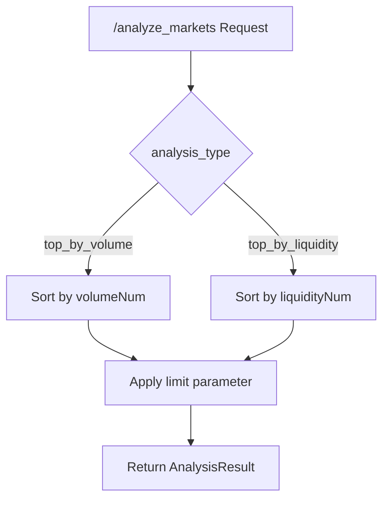
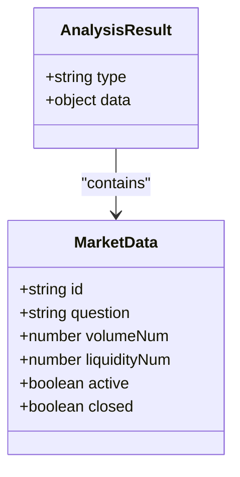
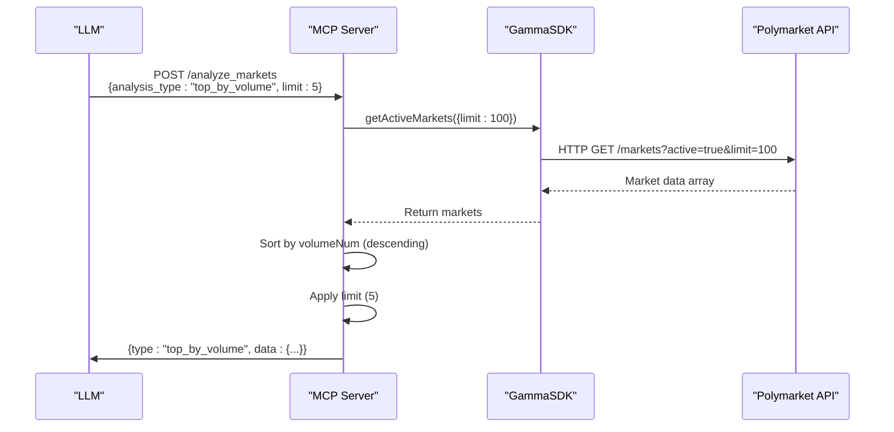
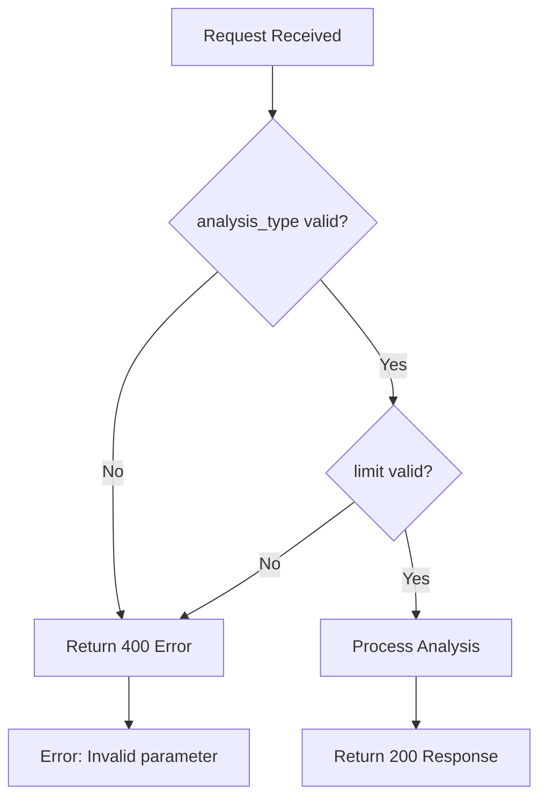

# Analyze Markets Tool

<cite>
**Referenced Files in This Document**   
- [polymarket-mcp.yml](file://specs/001-write-a-mcp/contracts/polymarket-mcp.yml)
- [polymarket.ts](file://src/mcp/polymarket.ts)
- [elysia-schemas.ts](file://src/types/elysia-schemas.ts)
</cite>

## Table of Contents
1. [Introduction](#introduction)
2. [Tool Parameters](#tool-parameters)
3. [Response Structure](#response-structure)
4. [Implementation Details](#implementation-details)
5. [Usage Examples](#usage-examples)
6. [Validation Rules](#validation-rules)
7. [Error Handling](#error-handling)
8. [LLM Integration Benefits](#llm-integration-benefits)

## Introduction
The `/analyze_markets` tool is a Model Context Protocol (MCP) endpoint designed to enable large language models (LLMs) to perform comparative analysis of prediction markets on Polymarket. This tool abstracts complex market data retrieval and sorting logic into a simple, high-level interface that returns actionable insights about market performance based on volume or liquidity metrics.

The tool is defined in the `polymarket-mcp.yml` contract and implemented in the `polymarket.ts` server file. It leverages the GammaSDK to fetch real-time market data and applies sorting algorithms based on the specified analysis type. This enables LLMs to answer questions about market trends, identify top-performing markets, and provide data-driven insights without requiring direct access to low-level API endpoints.

**Section sources**
- [polymarket-mcp.yml](file://specs/001-write-a-mcp/contracts/polymarket-mcp.yml#L45-L63)
- [polymarket.ts](file://src/mcp/polymarket.ts#L1-L657)

## Tool Parameters
The `/analyze_markets` tool accepts two parameters that control the analysis behavior:

### analysis_type
This required parameter specifies the metric used to rank markets. It is an enum with two possible values:
- `top_by_volume`: Ranks markets by trading volume in descending order
- `top_by_liquidity`: Ranks markets by available liquidity in descending order

The parameter is validated using strict type checking to ensure only these two values are accepted. This allows LLMs to request specific types of market analysis based on their analytical needs.

### limit
This optional parameter controls the number of markets returned in the analysis result. It accepts an integer value with the following characteristics:
- **Default value**: 5
- **Minimum value**: 1
- **Maximum value**: 100

When not specified, the tool returns the top 5 markets according to the selected analysis type. The limit parameter provides flexibility for LLMs to request more comprehensive analyses when needed.



**Diagram sources**
- [polymarket-mcp.yml](file://specs/001-write-a-mcp/contracts/polymarket-mcp.yml#L45-L63)
- [polymarket.ts](file://src/mcp/polymarket.ts#L1-L657)

**Section sources**
- [polymarket-mcp.yml](file://specs/001-write-a-mcp/contracts/polymarket-mcp.yml#L45-L63)

## Response Structure
The tool returns data in the `AnalysisResult` object format, which contains two primary fields:

### type
A string field that echoes the `analysis_type` parameter from the request. This indicates which metric was used for the analysis (e.g., "top_by_volume" or "top_by_liquidity"). This field helps consuming systems understand the basis of the ranking.

### data
An object containing the analysis results. The structure includes:
- **markets**: An array of market objects ranked according to the analysis type
- **timestamp**: ISO string indicating when the analysis was performed
- **total_markets_considered**: Integer representing the total number of markets evaluated before applying the limit

Each market object in the results includes essential information such as ID, question, volume, liquidity, and status. The data field provides a comprehensive view of the top-performing markets based on the requested analysis criteria.



**Diagram sources**
- [polymarket-mcp.yml](file://specs/001-write-a-mcp/contracts/polymarket-mcp.yml#L94-L104)
- [elysia-schemas.ts](file://src/types/elysia-schemas.ts#L100-L199)

**Section sources**
- [polymarket-mcp.yml](file://specs/001-write-a-mcp/contracts/polymarket-mcp.yml#L94-L104)

## Implementation Details
The `/analyze_markets` tool implementation in `polymarket.ts` follows a structured approach to market analysis:

1. The tool uses the GammaSDK instance to retrieve market data from Polymarket's API
2. It applies sorting logic based on the `analysis_type` parameter:
   - For `top_by_volume`: Markets are sorted by the `volumeNum` property in descending order
   - For `top_by_liquidity`: Markets are sorted by the `liquidityNum` property in descending order
3. The sorted results are limited by the `limit` parameter (defaulting to 5 if not specified)
4. Results are formatted into the `AnalysisResult` structure and returned to the caller

The implementation leverages the `getActiveMarkets` method from GammaSDK to ensure only currently active markets are considered in the analysis. This provides relevant, actionable insights about markets that are currently tradable.

The sorting algorithm handles edge cases such as null or undefined values for volume and liquidity by treating them as zero, ensuring consistent ranking behavior. The implementation also includes error handling to manage API failures gracefully.



**Diagram sources**
- [polymarket.ts](file://src/mcp/polymarket.ts#L1-L657)
- [elysia-schemas.ts](file://src/types/elysia-schemas.ts#L100-L199)

**Section sources**
- [polymarket.ts](file://src/mcp/polymarket.ts#L1-L657)

## Usage Examples
The following examples demonstrate typical requests and responses for the `/analyze_markets` tool:

### Top Markets by Volume
**Request:**
```json
{
  "analysis_type": "top_by_volume",
  "limit": 3
}
```

**Expected Response:**
```json
{
  "type": "top_by_volume",
  "data": {
    "markets": [
      {
        "id": "12345",
        "question": "Will Bitcoin reach $100K by December 2024?",
        "volumeNum": 2500000,
        "liquidityNum": 150000,
        "active": true,
        "closed": false
      },
      {
        "id": "67890",
        "question": "Who will win the 2024 US Presidential Election?",
        "volumeNum": 1800000,
        "liquidityNum": 200000,
        "active": true,
        "closed": false
      },
      {
        "id": "54321",
        "question": "Will NVIDIA stock surpass $600 by Q3 2024?",
        "volumeNum": 1200000,
        "liquidityNum": 80000,
        "active": true,
        "closed": false
      }
    ],
    "timestamp": "2025-09-15T10:30:00Z",
    "total_markets_considered": 47
  }
}
```

### Top Markets by Liquidity
**Request:**
```json
{
  "analysis_type": "top_by_liquidity",
  "limit": 4
}
```

**Expected Response:**
```json
{
  "type": "top_by_liquidity",
  "data": {
    "markets": [
      {
        "id": "67890",
        "question": "Who will win the 2024 US Presidential Election?",
        "volumeNum": 1800000,
        "liquidityNum": 200000,
        "active": true,
        "closed": false
      },
      {
        "id": "11111",
        "question": "Will the Fed cut rates before September 2024?",
        "volumeNum": 950000,
        "liquidityNum": 175000,
        "active": true,
        "closed": false
      },
      {
        "id": "22222",
        "question": "Will Ethereum surpass $5000 by November 2024?",
        "volumeNum": 1100000,
        "liquidityNum": 160000,
        "active": true,
        "closed": false
      },
      {
        "id": "12345",
        "question": "Will Bitcoin reach $100K by December 2024?",
        "volumeNum": 2500000,
        "liquidityNum": 150000,
        "active": true,
        "closed": false
      }
    ],
    "timestamp": "2025-09-15T10:30:00Z",
    "total_markets_considered": 47
  }
}
```

**Section sources**
- [polymarket.ts](file://src/mcp/polymarket.ts#L1-L657)

## Validation Rules
The `/analyze_markets` tool implements strict validation rules to ensure data integrity and prevent invalid requests:

### analysis_type Validation
- Must be one of the enum values: `top_by_volume` or `top_by_liquidity`
- Case-sensitive comparison
- Required field (cannot be null or undefined)
- Must be a string type

### limit Validation
- Must be a positive integer
- Minimum value: 1
- Maximum value: 100
- Default value: 5 (when not provided)
- Must be numeric (rejects strings, booleans, objects)

The validation occurs at both the contract level (OpenAPI specification) and implementation level (TypeScript with Zod validation). This dual-layer validation ensures that invalid requests are caught early and appropriate error responses are generated.



**Diagram sources**
- [polymarket-mcp.yml](file://specs/001-write-a-mcp/contracts/polymarket-mcp.yml#L45-L63)
- [polymarket.ts](file://src/mcp/polymarket.ts#L1-L657)

**Section sources**
- [polymarket-mcp.yml](file://specs/001-write-a-mcp/contracts/polymarket-mcp.yml#L45-L63)

## Error Handling
The tool implements comprehensive error handling to manage various failure scenarios:

### Invalid analysis_type
When an invalid value is provided for `analysis_type`, the tool returns a 400 Bad Request response with a descriptive error message indicating the valid enum values.

### Non-numeric limit
If the `limit` parameter is provided but is not a valid number (e.g., string, boolean, null), the tool returns a 400 Bad Request response explaining that the limit must be a positive integer.

### API Failure
If the GammaSDK fails to retrieve market data from the Polymarket API, the tool catches the error and returns a 500 Internal Server Error response with a generic message to avoid exposing implementation details.

### Empty Results
In the unlikely event that no markets are available for analysis, the tool returns a valid 200 response with an empty markets array rather than an error, as this represents a valid state rather than a failure.

All errors are logged with context for debugging purposes, but only essential information is exposed to the client to maintain security and simplicity.

**Section sources**
- [polymarket.ts](file://src/mcp/polymarket.ts#L1-L657)

## LLM Integration Benefits
The `/analyze_markets` tool significantly enhances LLM capabilities by providing a high-level interface for market analysis:

### Abstraction of Complexity
The tool abstracts away the complexities of API authentication, data retrieval, pagination, and sorting algorithms. LLMs can request market analysis without understanding the underlying implementation details.

### Standardized Interface
By providing a consistent request/response format, the tool enables LLMs to generate reliable queries and parse responses predictably, improving the accuracy of natural language interactions.

### Actionable Insights
The tool transforms raw market data into ranked lists of top-performing markets, making it easier for LLMs to provide actionable recommendations and comparative analysis.

### Performance Optimization
The implementation retrieves a reasonable number of markets (e.g., 100) and applies sorting/limiting locally, reducing API load while still providing comprehensive analysis capabilities.

### Extensibility
The design pattern allows for easy addition of new analysis types (e.g., `top_by_volatility`, `top_by_newness`) without changing the fundamental interface, enabling future enhancements.

This tool exemplifies how MCP servers can bridge the gap between LLMs and complex data sources, enabling natural language access to sophisticated market analytics.

**Section sources**
- [polymarket.ts](file://src/mcp/polymarket.ts#L1-L657)
- [polymarket-mcp.yml](file://specs/001-write-a-mcp/contracts/polymarket-mcp.yml#L45-L63)