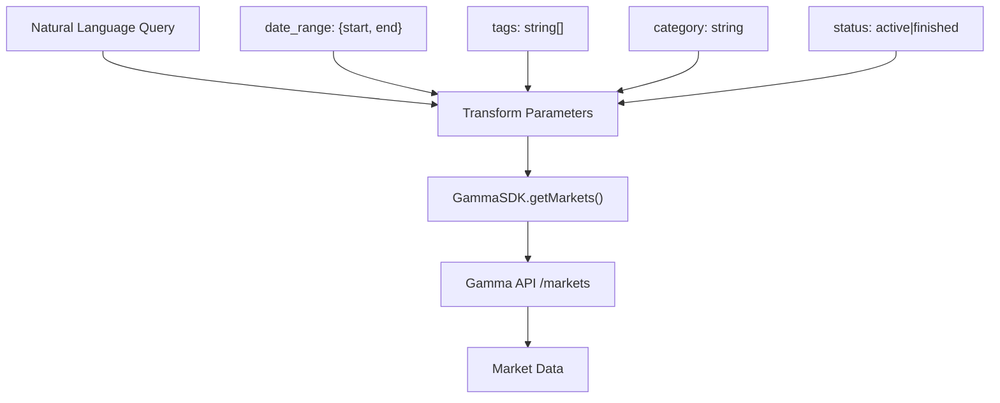
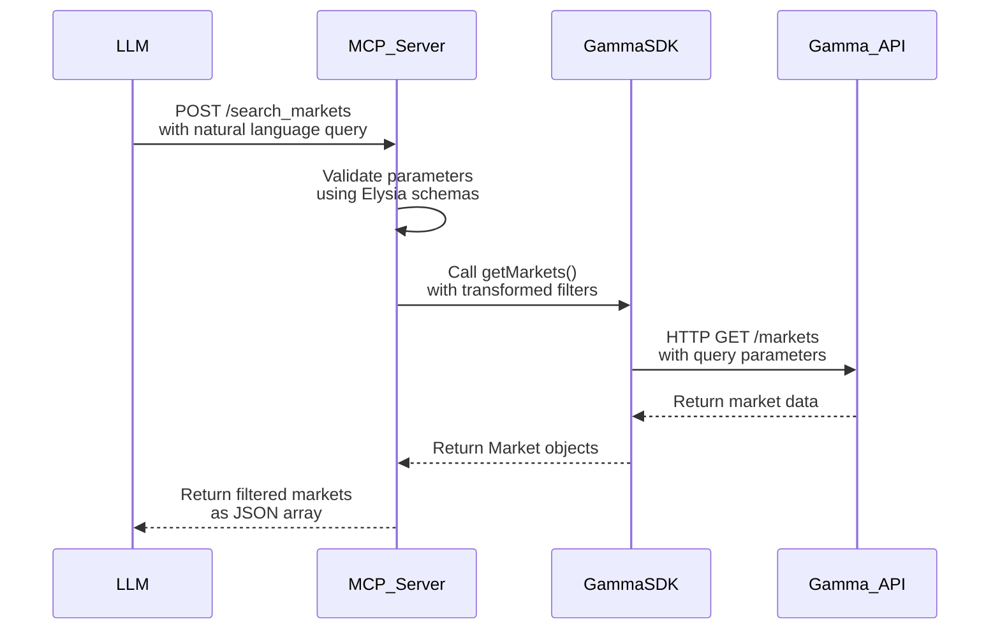

# Search Markets Tool

<cite>
**Referenced Files in This Document**   
- [polymarket-mcp.yml](file://specs/001-write-a-mcp/contracts/polymarket-mcp.yml)
- [gamma-client.ts](file://src/sdk/gamma-client.ts)
- [gamma.ts](file://src/routes/gamma.ts)
- [elysia-schemas.ts](file://src/types/elysia-schemas.ts)
</cite>

## Table of Contents
1. [Introduction](#introduction)
2. [Parameter Specification](#parameter-specification)
3. [Response Structure](#response-structure)
4. [Implementation Mapping](#implementation-mapping)
5. [Usage Examples](#usage-examples)
6. [Validation and Error Handling](#validation-and-error-handling)
7. [Architecture Flow](#architecture-flow)

## Introduction
The `/search_markets` tool enables Large Language Models (LLMs) to retrieve targeted prediction market data from Polymarket's Gamma API using natural language queries and structured filters. This tool translates high-level user queries into precise API calls, allowing LLMs to access real-time market information for analysis, decision-making, or user response generation. The implementation leverages the GammaSDK to interface with the Gamma API, transforming input parameters into appropriate filter criteria for market retrieval.

**Section sources**
- [polymarket-mcp.yml](file://specs/001-write-a-mcp/contracts/polymarket-mcp.yml#L1-L105)

## Parameter Specification
The `/search_markets` endpoint accepts a JSON POST request with the following parameters:

- **query**: A natural language string used to search market questions and descriptions
- **date_range**: An object containing start and end dates (in ISO 8601 date format) to filter markets by their start_date field
- **tags**: An array of strings representing tag slugs to filter markets by associated tags
- **category**: A string representing the market category to filter by
- **status**: An enum with values "active" or "finished" to filter markets by their active status

These parameters allow for flexible and targeted market discovery, combining semantic search with precise filtering capabilities.

**Section sources**
- [polymarket-mcp.yml](file://specs/001-write-a-mcp/contracts/polymarket-mcp.yml#L10-L40)

## Response Structure
The tool returns an array of Market objects, each containing the following fields:

- **id**: Unique identifier for the market
- **question**: The market's question text
- **slug**: URL-friendly version of the market name
- **category**: The category to which the market belongs
- **active**: Boolean indicating if the market is currently active
- **volume**: Trading volume for the market
- **start_date**: ISO 8601 datetime when the market started
- **end_date**: ISO 8601 datetime when the market ends
- **tags**: Array of tag strings associated with the market

This standardized response format provides comprehensive market information in a structured format suitable for LLM processing and analysis.

**Section sources**
- [polymarket-mcp.yml](file://specs/001-write-a-mcp/contracts/polymarket-mcp.yml#L80-L104)

## Implementation Mapping
The `/search_markets` tool maps directly to the GammaSDK's `getMarkets` method in gamma-client.ts. When a request is received, the system transforms the high-level parameters into Gamma API-compatible query parameters:



The transformation process converts the `date_range` object into `start_date_min` and `start_date_max` parameters, maps `tags` to tag-based filtering, uses `category` for category filtering, and translates `status` to the `active` boolean parameter (where "active" = true, "finished" = false).

**Diagram sources**
- [gamma-client.ts](file://src/sdk/gamma-client.ts#L400-L420)
- [gamma.ts](file://src/routes/gamma.ts#L380-L395)

**Section sources**
- [gamma-client.ts](file://src/sdk/gamma-client.ts#L400-L420)
- [gamma.ts](file://src/routes/gamma.ts#L380-L395)

## Usage Examples
### Example 1: Basic Query with Date Range
Request:
```json
{
  "query": "presidential election",
  "date_range": {
    "start": "2024-01-01",
    "end": "2024-12-31"
  }
}
```

### Example 2: Tag and Category Filtering
Request:
```json
{
  "tags": ["politics", "election"],
  "category": "Politics"
}
```

### Example 3: Status Filtering with Natural Language
Request:
```json
{
  "query": "will the stock market rise",
  "status": "active"
}
```

Expected Response (sample):
```json
[
  {
    "id": "12345",
    "question": "Will the S&P 500 close above 5000 in 2024?",
    "slug": "sp500-above-5000-2024",
    "category": "Finance",
    "active": true,
    "volume": 250000,
    "start_date": "2024-01-01T00:00:00Z",
    "end_date": "2024-12-31T23:59:59Z",
    "tags": ["finance", "stocks", "S&P 500"]
  }
]
```

**Section sources**
- [polymarket-mcp.yml](file://specs/001-write-a-mcp/contracts/polymarket-mcp.yml#L10-L40)
- [gamma-client.ts](file://src/sdk/gamma-client.ts#L400-L420)

## Validation and Error Handling
The system implements strict validation for all parameters:

- **query**: Must be a non-empty string (optional parameter)
- **date_range**: If provided, start and end must be valid ISO 8601 dates in YYYY-MM-DD format, with start ≤ end
- **tags**: Must be an array of non-empty strings
- **category**: Must be a non-empty string
- **status**: Must be either "active" or "finished" (case-sensitive)

Error cases include:
- 400 Bad Request for invalid date formats or unsupported status values
- 400 Bad Request for malformed JSON or invalid parameter types
- 500 Internal Server Error for API connectivity issues

The validation is enforced through Elysia's schema validation using the UpdatedMarketQuerySchema and SearchQuerySchema definitions.

**Section sources**
- [elysia-schemas.ts](file://src/types/elysia-schemas.ts#L500-L550)
- [gamma-client.ts](file://src/sdk/gamma-client.ts#L400-L420)

## Architecture Flow
The tool enables LLMs to retrieve targeted market data by serving as a translation layer between natural language queries and structured API calls:



This architecture allows LLMs to leverage natural language while accessing precise, filtered market data through a well-defined API contract, enabling sophisticated market analysis and insight generation.

**Diagram sources**
- [gamma-client.ts](file://src/sdk/gamma-client.ts#L400-L420)
- [gamma.ts](file://src/routes/gamma.ts#L380-L395)
- [elysia-schemas.ts](file://src/types/elysia-schemas.ts#L500-L550)

**Section sources**
- [gamma-client.ts](file://src/sdk/gamma-client.ts#L400-L420)
- [gamma.ts](file://src/routes/gamma.ts#L380-L395)