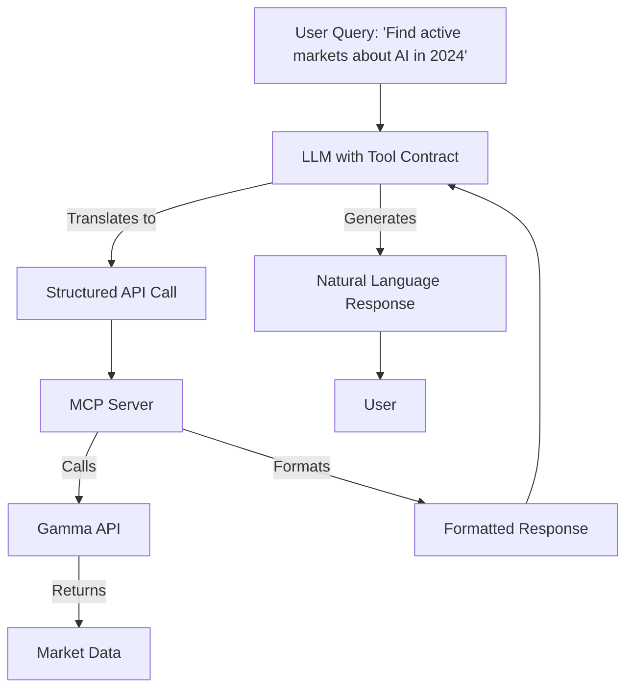
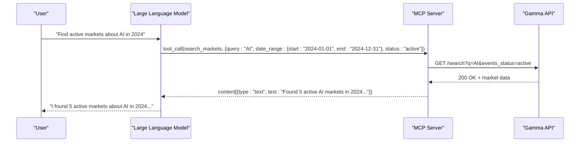
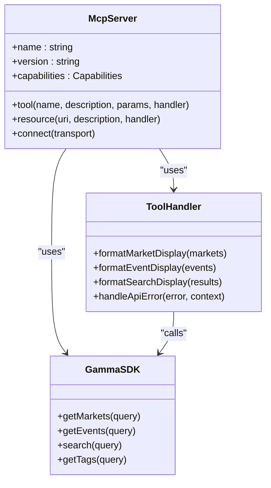

# LLM Integration Guide

<cite>
**Referenced Files in This Document**   
- [polymarket-mcp.yml](file://specs/001-write-a-mcp/contracts/polymarket-mcp.yml)
- [polymarket.ts](file://src/mcp/polymarket.ts)
- [gamma.ts](file://src/routes/gamma.ts)
- [clob.ts](file://src/routes/clob.ts)
- [gamma-client.ts](file://src/sdk/gamma-client.ts)
- [elysia-schemas.ts](file://src/types/elysia-schemas.ts)
</cite>

## Table of Contents
1. [Introduction](#introduction)
2. [Tool Contract and Natural Language Translation](#tool-contract-and-natural-language-translation)
3. [Request/Response Flow Between LLM and MCP Server](#requestresponse-flow-between-llm-and-mcp-server)
4. [Authentication Considerations](#authentication-considerations)
5. [Client-Side Integration Patterns](#client-side-integration-patterns)
6. [Common Challenges](#common-challenges)
7. [Best Practices for Prompt Engineering](#best-practices-for-prompt-engineering)
8. [Conclusion](#conclusion)

## Introduction
This guide provides comprehensive documentation for integrating Large Language Models (LLMs) with the Polymarket MCP server. The integration enables natural language queries to be translated into structured API calls, allowing users to interact with prediction market data through conversational interfaces. The system leverages the Model Context Protocol (MCP) to expose Polymarket's Gamma API functionality as standardized tools and resources for AI models.

The MCP server acts as an intermediary between LLMs and the underlying market data APIs, translating natural language queries into precise API requests and returning structured responses in a format suitable for LLM consumption. This enables powerful use cases such as market research, trend analysis, and investment decision support through natural language interaction.

## Tool Contract and Natural Language Translation

The MCP server exposes a well-defined tool contract that enables LLMs to translate natural language queries into structured API calls. This contract is defined in the OpenAPI specification and implemented through the MCP server's tool registration system.

For example, a user query like "Find active markets about AI in 2024" is translated into a structured API call to the `/search_markets` endpoint with appropriate parameters. The tool contract specifies the required parameters and their types, ensuring that the LLM generates correctly formatted requests.

**Diagram sources**
- [polymarket-mcp.yml](file://specs/001-write-a-mcp/contracts/polymarket-mcp.yml)
- [polymarket.ts](file://src/mcp/polymarket.ts)

**Section sources**
- [polymarket-mcp.yml](file://specs/001-write-a-mcp/contracts/polymarket-mcp.yml)
- [polymarket.ts](file://src/mcp/polymarket.ts)

## Request/Response Flow Between LLM and MCP Server

The request/response flow between the LLM and MCP server follows a standardized pattern that ensures reliable communication and proper error handling. When an LLM receives a user query, it determines which tool to call based on the tool contract and formats the appropriate request.

The MCP server receives the tool call request, validates the parameters against the defined schema, and executes the corresponding function. The response is then formatted according to the MCP protocol and returned to the LLM for presentation to the user.

The tool call formatting follows the MCP specification, with each tool call containing the tool name, parameters, and any required metadata. The result parsing is handled by the MCP server, which formats the API response into a standardized structure that the LLM can easily interpret.

**Diagram sources**
- [polymarket.ts](file://src/mcp/polymarket.ts)
- [gamma.ts](file://src/routes/gamma.ts)

**Section sources**
- [polymarket.ts](file://src/mcp/polymarket.ts)
- [gamma.ts](file://src/routes/gamma.ts)

## Authentication Considerations

When deploying the MCP server with LLM platforms, authentication considerations vary depending on the specific API being accessed. The Gamma API, which provides market data, does not require authentication, making it ideal for public-facing LLM integrations.

However, for endpoints that require authentication, such as the CLOB API for trading operations, the system implements header-based authentication. In production environments, requests must include the `x-polymarket-key` and `x-polymarket-funder` headers with valid credentials. In development mode, the system falls back to environment variables for convenience.

The MCP server itself does not handle authentication directly but relies on the underlying SDK to manage credentials. This separation of concerns ensures that authentication logic is consistent across different integration points while keeping the MCP server focused on its core function of tool orchestration.

**Section sources**
- [clob.ts](file://src/routes/clob.ts)
- [gamma-client.ts](file://src/sdk/gamma-client.ts)

## Client-Side Integration Patterns

Client-side integration with the MCP server follows established patterns that leverage the standardized tool contract. The primary integration point is through the MCP server's tool registration system, which exposes API functionality as callable tools.

The integration pattern involves initializing the MCP server with the appropriate SDK instance and registering tools with clearly defined parameters and execution functions. Each tool corresponds to a specific API endpoint or functionality, with parameter validation handled through Zod schemas.

The client integration also includes error handling patterns that ensure graceful degradation when API calls fail. Error responses are formatted consistently to provide meaningful feedback to the LLM, which can then communicate the issue to the user in natural language.

**Diagram sources**
- [polymarket.ts](file://src/mcp/polymarket.ts)
- [gamma-client.ts](file://src/sdk/gamma-client.ts)

**Section sources**
- [polymarket.ts](file://src/mcp/polymarket.ts)
- [gamma-client.ts](file://src/sdk/gamma-client.ts)

## Common Challenges

Integrating LLMs with the MCP server presents several common challenges that must be addressed to ensure reliable and accurate interactions.

### Ambiguous Queries
Ambiguous user queries can lead to incorrect tool selection or parameter interpretation. For example, a query like "Find markets about technology" could refer to multiple categories or tags. The system addresses this through careful prompt engineering and parameter validation, ensuring that ambiguous queries are either clarified through follow-up questions or interpreted with reasonable defaults.

### Result Interpretation
Interpreting API results correctly is crucial for generating accurate responses. The MCP server includes formatting functions that transform raw API data into human-readable text, making it easier for the LLM to understand and present the information. This includes handling edge cases like empty results or partial data.

### Rate Limiting
Rate limiting is an important consideration when integrating with external APIs. The MCP server implements caching mechanisms to reduce the number of API calls and prevent rate limit violations. The Gamma SDK includes an LRU cache for SDK instances, and the server caches responses where appropriate to improve performance and reduce load on the underlying APIs.

**Section sources**
- [polymarket.ts](file://src/mcp/polymarket.ts)
- [gamma-client.ts](file://src/sdk/gamma-client.ts)
- [clob.ts](file://src/routes/clob.ts)

## Best Practices for Prompt Engineering

Effective prompt engineering is essential for optimizing tool usage and response accuracy when integrating LLMs with the MCP server. The following best practices help ensure reliable and accurate interactions.

### Clear Tool Descriptions
Each tool should have a clear and concise description that accurately reflects its functionality. This helps the LLM understand when to use each tool and how to format the parameters correctly.

### Parameter Validation
Using strong parameter validation through Zod schemas ensures that the LLM generates correctly formatted requests. This reduces errors and improves the reliability of the integration.

### Error Handling
Including clear error handling patterns in the prompts helps the LLM respond appropriately when API calls fail. This includes providing meaningful error messages and suggesting alternative approaches when possible.

### Context Management
Managing context effectively is crucial for maintaining coherent conversations. The MCP server's resource system allows for the subscription to live data feeds, enabling the LLM to access up-to-date information without requiring repeated API calls.

**Section sources**
- [polymarket.ts](file://src/mcp/polymarket.ts)
- [elysia-schemas.ts](file://src/types/elysia-schemas.ts)

## Conclusion
The integration of LLMs with the Polymarket MCP server enables powerful natural language interactions with prediction market data. By leveraging the standardized tool contract, LLMs can translate user queries into structured API calls, retrieve relevant information, and present it in a conversational format. The system's robust error handling, authentication mechanisms, and client-side integration patterns make it well-suited for deployment with various LLM platforms. Following best practices for prompt engineering ensures optimal tool usage and response accuracy, providing users with a seamless and intuitive experience when exploring market data.