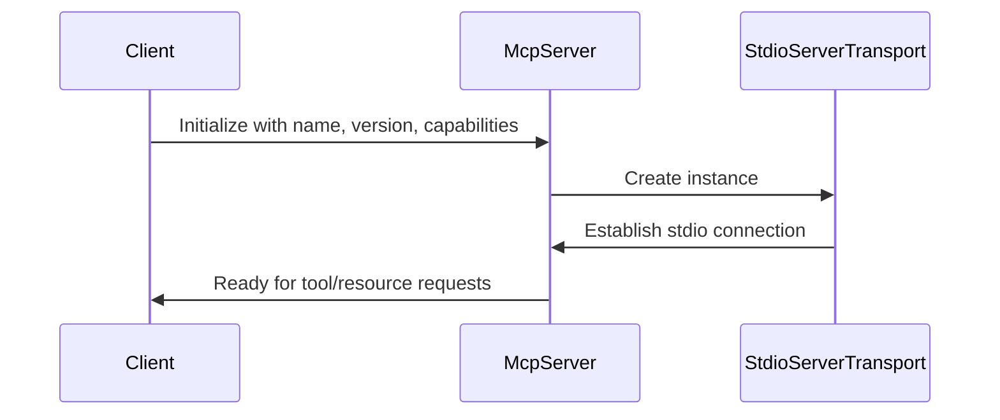
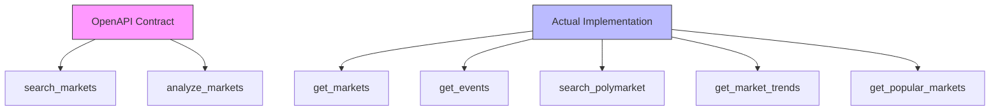

# MCP Protocol Implementation

<cite>
**Referenced Files in This Document**   
- [polymarket.ts](file://src/mcp/polymarket.ts)
- [gamma-client.ts](file://src/sdk/gamma-client.ts)
- [polymarket-mcp.yml](file://specs/001-write-a-mcp/contracts/polymarket-mcp.yml)
</cite>

## Table of Contents
1. [Introduction](#introduction)
2. [Server Initialization and Configuration](#server-initialization-and-configuration)
3. [Communication and Transport](#communication-and-transport)
4. [Tool Registration and OpenAPI Contract Mapping](#tool-registration-and-openapi-contract-mapping)
5. [Resource Implementation](#resource-implementation)
6. [GammaSDK Integration](#gammasdk-integration)
7. [Error Handling and Process Management](#error-handling-and-process-management)
8. [Extensibility and Integration Patterns](#extensibility-and-integration-patterns)

## Introduction
The Polymarket MCP Server implements the Model Context Protocol (MCP) to expose prediction market data from Polymarket's Gamma API as standardized tools and resources for AI models. This implementation enables natural language interactions with market data through a structured server architecture that follows MCP specifications. The server provides a comprehensive interface for market analysis, event management, search functionality, and analytics through well-defined tools and resources.

## Server Initialization and Configuration
The MCP server is initialized using the `McpServer` class from the `@modelcontextprotocol/sdk` package. The server instance is configured with essential metadata including name, version, and capabilities. The initialization process creates a server instance with the name "polymarket" and version "1.0.0", establishing the foundation for the MCP protocol implementation.

The server configuration includes empty capabilities objects for resources and tools, which are populated during the tool and resource registration process. This initialization pattern follows the MCP SDK's constructor pattern, where server metadata is provided upfront while capabilities are built incrementally through registration methods.

**Section sources**
- [polymarket.ts](file://src/mcp/polymarket.ts#L15-L25)

## Communication and Transport
The server uses `StdioServerTransport` from the MCP SDK to handle communication between the server and client. This transport mechanism leverages standard input and output streams for message passing, enabling integration with various client environments that support stdio communication.

The transport lifecycle is managed within the main function, where a new `StdioServerTransport` instance is created and connected to the server. This connection establishes the communication channel necessary for the MCP protocol operations. The use of stdio transport provides a simple, reliable communication mechanism that works across different execution environments.



**Diagram sources**
- [polymarket.ts](file://src/mcp/polymarket.ts#L580-L595)
- [polymarket.ts](file://src/mcp/polymarket.ts#L15-L25)

## Tool Registration and OpenAPI Contract Mapping
The implementation maps MCP tools to the OpenAPI contract defined in `polymarket-mcp.yml`, though there are discrepancies between the contract and actual implementation. The server registers multiple tools for market analysis, event management, search, and analytics, each with specific parameters and callback functions.

The tool registration process uses the `server.tool()` method to define each tool with a name, description, input schema (using Zod), and asynchronous callback function. The input schemas validate parameters before execution, ensuring type safety and proper data handling. Each tool corresponds to a specific data retrieval or analysis operation on Polymarket's Gamma API.

Notably, the actual implementation includes tools like `get_markets`, `get_events`, and `search_polymarket` that provide more comprehensive functionality than the OpenAPI contract's `search_markets` and `analyze_markets` endpoints. The tools are designed with user-friendly parameter options that align with the Gamma API's filtering capabilities.



**Diagram sources**
- [polymarket-mcp.yml](file://specs/001-write-a-mcp/contracts/polymarket-mcp.yml#L1-L105)
- [polymarket.ts](file://src/mcp/polymarket.ts#L185-L577)

## Resource Implementation
The server implements MCP resources to provide live data feeds that can be accessed by clients. Two resources are registered: `markets://active` for active prediction markets and `events://featured` for curated featured events.

These resources are implemented as asynchronous functions that fetch data from the Gamma API and return structured responses. The resource callbacks handle API errors gracefully and format the response data as JSON with appropriate metadata. The resources provide real-time data access without requiring explicit tool calls, supporting use cases where clients need continuous access to specific data streams.

The resource implementation follows the MCP specification for resource handling, returning content with URI, MIME type, and serialized data. This enables clients to request and receive resource data in a standardized format.

**Section sources**
- [polymarket.ts](file://src/mcp/polymarket.ts#L528-L577)

## GammaSDK Integration
The `GammaSDK` is instantiated at the module level and made available for all tool executions. This singleton instance provides access to Polymarket's Gamma API through a fully typed wrapper SDK. The integration enables all MCP tools to leverage the SDK's methods for data retrieval and processing.

The `GammaSDK` class, defined in `gamma-client.ts`, encapsulates the HTTP communication with the Gamma API, handling request construction, error handling, and response parsing. It provides type-safe methods for all available API operations including markets, events, tags, and search functionality.

The SDK's implementation includes data transformation methods to normalize API responses, such as parsing JSON string fields into proper arrays. This ensures consistent data types across all tool responses. The SDK also supports optional proxy configuration for enhanced network flexibility.

```mermaid
classDiagram
class McpServer {
+name : string
+version : string
+capabilities : object
+tool(name, desc, schema, callback)
+resource(name, desc, callback)
+connect(transport)
}
class GammaSDK {
+getMarkets(query)
+getMarketById(id, query)
+getMarketBySlug(slug, query)
+getEvents(query)
+getEventById(id, query)
+getTags(query)
+search(query)
-makeRequest(endpoint, query)
-transformMarketData(item)
-transformEventData(item)
}
class StdioServerTransport {
+start()
+send(message)
+close()
-processReadBuffer()
}
McpServer --> GammaSDK : "uses"
McpServer --> StdioServerTransport : "uses"
GammaSDK ..> "gamma-api.polymarket.com" : "HTTP requests"
```

**Diagram sources**
- [polymarket.ts](file://src/mcp/polymarket.ts#L15-L25)
- [gamma-client.ts](file://src/sdk/gamma-client.ts#L50-L889)

## Error Handling and Process Management
The implementation includes comprehensive error handling at multiple levels. A dedicated `handleApiError` helper function processes API errors gracefully, logging error details and returning user-friendly error messages. This function standardizes error responses across all tool implementations, ensuring consistent error reporting.

The main function implements a robust process management strategy with proper error handling. The `main()` function is wrapped in a try-catch block that logs fatal errors and exits the process with a non-zero status code. This ensures that unhandled exceptions do not leave the server in an inconsistent state.

During server startup, console error messages provide operational feedback, including confirmation of server startup and lists of available tools and resources. This logging strategy aids in debugging and monitoring server operations.

**Section sources**
- [polymarket.ts](file://src/mcp/polymarket.ts#L58-L100)
- [polymarket.ts](file://src/mcp/polymarket.ts#580-L600)

## Extensibility and Integration Patterns
The implementation demonstrates several extensibility patterns that facilitate adding new tools and services to the server instance. The modular tool registration system allows new tools to be added by calling `server.tool()` with appropriate parameters, following the established pattern.

The code structure separates concerns effectively, with helper functions for data formatting and error handling that can be reused across multiple tools. This promotes code reuse and consistency when implementing new functionality. The use of Zod for input validation provides a type-safe approach that can be easily extended for new parameters.

Integration patterns include the use of the Gamma SDK for data access, standardized error handling, and consistent response formatting. New tools can be added by defining appropriate Zod schemas for input validation, implementing callback functions that leverage the Gamma SDK, and registering the tool with the server instance.

The implementation also supports the addition of new resources using the `server.resource()` method, enabling the exposure of additional data streams beyond the current active markets and featured events.

**Section sources**
- [polymarket.ts](file://src/mcp/polymarket.ts#L185-L577)